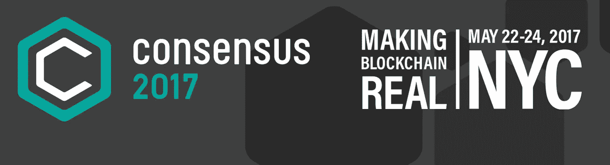
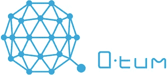
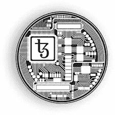
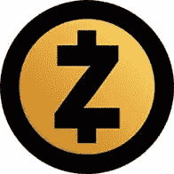

# 共识 2017 的好、坏、丑

> 原文：<https://medium.com/hackernoon/the-good-the-bad-and-the-ugly-of-consensus-2017-8776056f97a3>

CoinDesk 的 [Consensus](http://www.coindesk.com/events/consensus-2017/) 2017，即年度区块链和去中心化应用大会，已经正式在册。

这是羽翼未丰的区块链行业迄今为止规模最大的会议，但按照科技行业的标准来看，规模仍然很小。相比之下，像 Salesforce [Dreamforce](https://www.salesforce.com/blog/2016/10/dreamforce-16-by-the-numbers.html) 峰会这样的大型会议就相形见绌了，它吸引了 171，000 名与会者和另外 1，500 万名在线与会者。

但是共识的亲密本质带来了很多好处。

这意味着你很可能会遇到任何一家公司的首席执行官或首席程序员，而不是他们派去在大型行业活动中分发 t 恤的低级奴才。径直走向一位主要投资者或区块链思想领袖，并与之攀谈起来，是一件非常容易的事情。

和任何科技会议一样，这里有很多噪音。

华而不实的项目占主导地位，就像那些复制已经很好理解的想法一样。

如果人们已经有了一个概念的心理框架，那么向他们推销一个想法就简单多了。新的想法更难推销，因为你有很多解释要做。

交付真正技术创新的项目很容易被遗漏。

好消息是，如果你知道去哪里找，你会发现很多创新。

# 好的和坏的

面对现实吧，区块链还处于基础设施发展阶段。

共识被兜售基础设施的人挤得水泄不通。就好像他们在网景公司之前就在卖互联网。“嘿，买一些 TCP/IP 和一些 HTTPS。在这里获得您的 DNS！”在现实世界中，没人在乎基础设施。对他们来说很重要。这个世界需要的是一款杀手级应用，但我们还没有做到。

我们还没有达到我们的网景时刻。有些人会告诉你比特币就是那个时刻，但事实并非如此。[街区。一位首席财务官真正道出了原因:](http://block.one/)

“我们希望能够实现分散的应用程序，这些应用程序与集中的应用程序无法区分。”

换句话说，在应用程序看起来像应用程序商店中的任何其他应用程序之前，现实世界中没有人会在意。

似乎很少有人明白这一点。街区。一群创始人来自 BitShares 和 Steemit 平台的人明白了这一点。这也是我们在[蝉项目](http://iamcicada.com/)和[费马的物联网](http://www.fermat.org/)的重点关注点。就像普锐斯之前的混合动力车一样。在那之前，混合动力汽车看起来丑得要命。他们有奇怪的框架和后轮罩。没人想要它们。但是一旦他们开始制造看起来像普通汽车的汽车，销售就开始上升。一般人不关心病因。他们不关心隐私或安全，正如[约翰·奥利弗对斯诺登的臭名昭著的“迪克照片”采访](http://www.rollingstone.com/tv/videos/watch-john-oliver-interview-edward-snowden-about-nsas-dick-pic-sheriffs-20150406)所证明的。这很可悲，但却是事实。但如果我们推出杀手级应用，他们会成群结队地采用它们，行业就会腾飞。

[块。一个 EOS 团队](https://www.ethnews.com/company-announces-development-of-open-source-software-for-blockchain-operating-system)还发现了扼杀早期项目的另一点:

现实世界中没有人会为所有东西支付微交易。太疯狂了。他们在谈话中说得很好:“想象一下，如果你去亚马逊，加载页面只需 3 美分。没有人会这么做。”

没错。

在未来的网络中，我们需要一个自由的交易层。微交易对于有实际价值的东西来说是很棒的。我已经[写过，也广泛的谈过](https://hackernoon.com/how-we-build-an-unstoppable-peer-to-peer-tor-with-a-billion-exit-nodes-4b232dac162d) [这个概念](https://artplusmarketing.com/how-we-can-deliver-a-universal-basic-income-right-now-and-save-ourselves-from-the-robots-without-e1972e22e8eb)，所以听到最后得到它的其他人真是太牛逼了！

说到“去中心化互联网”，这是一个正式的主流术语，现在它是这一季硅谷的主题， [BlockStack 带着他们已经工作了三年的超级秘密去中心化互联网项目](https://blockstack.org/)走出了秘密模式。这个术语将会被过度使用，以至于在未来几年里它会让人们翻白眼，这真是一个耻辱，因为它可能是正确的术语。

我津津有味地读着[的《积木纸](https://blockstack.org/whitepaper.pdf)。如果你想在早期有所作为，广泛阅读这个领域的书籍是很重要的。

事实上，没有一个项目会提出所有的想法来构建未来的互联网，所以我会阅读所有出现的东西。

毫无疑问，DecNet 最终将成为多个项目想法的混搭，每个项目最终都会交付这个复杂难题的独特部分。没有人能想到所有的事情。

BlockStack 系统最好的部分是存储。它使用任何云或分布式存储作为哑后端。它只是对一堆文件进行加密，然后作为云公司无法解密的巨大 blob 转储到 EC2 或 Google Compute。这是一个绝妙且非常必要的想法。它将数据控制权交还给用户和公司，隐藏数据，不让间谍和黑客窥探，并利用已经到位的强大基础设施。

在基础设施方面引起我注意的其他项目有 Tezos、QTUM 和 EOS。EOS 运动超高的性能，在水平的签证规模交易，一个拉涟漪，自由交易，它背后有行业重量级人物。

QTUM 展示了梦幻般的品牌，一个时尚的公司网站，他们设法在他们的 ICO 中积累了 11，000 个比特币。这是一大笔钱，当时是 1500 万美元，随着比特币的持续飙升，超过 3000 万美元(在撰写本文时徘徊在 2300 美元以上，此前一个庞大的比特币超级玩家财团承诺在六个月内支持 SegWit 和 2MB 硬分叉)。

QTUM 专注于在区块链最大的两个社区以太坊和比特币之间搭建桥梁，这并没有什么坏处。他们的说辞是“我们支持比特币区块链上的以太坊虚拟机。”这条标语让比特币涌入他们火热的钱包，打破了之前的 ICO 记录。事实上，如果你想为你的项目筹集一笔令人瞠目结舌的资金，分支任何一个主要项目并用一堆胶水代码将它们连接在一起也无妨。

但他们的项目并不全是炒作。

在会议上，他们宣布了一份新的白皮书(我提前偷偷看了一下，应该很快就会发布)以及一个治理系统的代码，以解决最初导致需要比特币规模协议的问题。该系统使用利害关系证明，并允许人们投票表决它通过智能合同和一种分散的业务规则系统在代码中强制执行的更改。它甚至能够自动生成投票，以便当他们开始使用的 2MB 块达到饱和时，它会要求投票选择 3mb 或 4MB。太棒了。

Tezos 是大家都知道的项目之一，因为它背后有大笔资金。实际上，有一个与会者告诉我“每个人都讨厌 Tezos，因为它是由一个傲慢的法国数学家创立的。”我个人是受不了那种思维的。我根据每个项目的优点对其进行原子式的判断。对我来说，它的生死取决于它的想法。

另一方面，由于法律纠纷，他们未能在 5 月 22 日进行 ICO。这对我来说很有效，因为我陷入了共识，无论如何都会错过它。被推回到六月。

Tezos and the new wave blockchainers

这篇关于[他们的代码和想法的当前状态的文章](/tezos/a-quick-tour-of-the-tezos-code-base-and-the-state-of-its-development-c4e5fcb34b8a)是一篇非常棒的必读文章。他们正在思考人们现在所缺少的东西，比如为了证明利害关系的严肃的安全措施。当我在 2015 年初与团队合作设计[蝉去中心化应用平台](https://github.com/the-laughing-monkey/cicada-platform/blob/master/README.md)概念时，我偶然发现了许多已经通过现代[Stake 3.0](https://pivx.org/features/)系统的想法，这些系统为 PIVX 和[等硬币以及无数其他替代硬币提供动力。我没有合适的词来形容它们，比如 signer 和 witness，但是这些想法非常接近我们今天在真实代码中看到的。我最终忽略了 PoS，因为*串通的高概率*和*过于复杂*。我现在觉得这些威胁是可以减轻的，但我担心太多的人在了解这些威胁后就急于行动。](http://cryptomining-blog.com/tag/proof-of-stake-coins-list/)

泰佐斯明白了。

这就是为什么他们建立了一个“攻击者节点”，其行为就像网飞的“[混沌猴](https://github.com/Netflix/SimianArmy/wiki/Chaos-Monkey)”一样，不断试图欺骗网络，使其变得更强大。这也是一个在人工智能中产生的想法，叫做[生成对抗网络](http://blog.aylien.com/introduction-generative-adversarial-networks-code-tensorflow/)。其他项目将迅速采用这些概念，这是一件好事。

# 没有权威的身份

这次会议还有一些关于身份的重大新闻。身份是未来网络的基础。

我们需要一个能唯一识别每个人的 ID，但矛盾的是在必要的时候提供绝对的隐私。

我已经写了很多关于这个话题的文章，所以这是我最关心的话题。这是蝉计划的基础。它允许一种新颖的工作证明，将每个人限制为一个矿工，并将他们纳入随机池以保护网络。

许多其他人现在正在研究这个想法，他们已经团结在[去中心化身份基金会](https://decentralized-identity.github.io/)之下。看到这一切成真，我欣喜若狂。它带来了一些严肃的玩家，我们正在探索加入该基金会。

当然，一个人的“分散”是另一个人的“集中”。我研究了 DIF 成员背后的一些想法，其中一些想法让我非常担心，他们并没有真正提供一个强大的分散生态系统，只是一个披着羊皮的集中系统。

稍后会详细介绍。

但是现在还为时过早，所以在这一点上，他们还是被假定为无辜的，我们将会看到事情的发展。

我认为这个基金会可以在世界上做很多好事，因为至少有 15 亿人无法获得身份证。这是一个第二十二条军规。你需要一个身份证才能得到一个身份证。换句话说，你需要一张写着你存在的纸来得到另一张写着你存在的纸。这简直是疯了。

DIF 有机会改变这一切，但他们需要非常非常小心，不要建立一个数字跟踪系统，让极权主义政权有能力追捕和发现他们的许多“人民的敌人”正在做的每一件事。对于当权者来说，想要在所有事情上增加集中的后门和瓶颈是很有诱惑力的，但当涉及到 ID [时，这是一场等待发生的人道主义灾难](https://hackernoon.com/how-the-decentralized-web-will-rewrite-the-rules-of-security-and-save-the-net-from-the-barbarian-23db16af34a1)。

这样做是错误的，我们只是建立了一个系统来奴役人类。

# 硬币，硬币，到处都是

说到大家都关心的一点:

什么硬币会让我成为最穆拉！？！？

我不知道。祝你好运选出获胜者。我在那里没有特别的洞察力。

我所知道的是，现在似乎每个项目都需要一枚硬币。这是荒谬的，需要停止。

就连构建未来互联网利基部分的项目也在推出自己的硬币。这些硬币毫无用处，不会产生一分钱的价值。该行业需要一种更好的方式来资助这些较小的项目，如分散式 Kickstarter。

不过现在，硬币才是王道。随着比特币继续将黄金挤出水面，ICO 热席卷了整个会议。其他一些硬币产生了巨大的爆炸，特别是 ZCash，在[摩根大通宣布他们将 ZCash 隐私功能纳入他们的企业区块链](https://www.forbes.com/sites/laurashin/2017/05/22/jpmorgan-chase-to-integrate-zcash-technology-to-its-enterprise-blockchain-platform/#4398196e7a33)后，一夜之间从 100 美元翻了一番，达到 200 美元。

我喜欢 Zcash，但看看这份公告的内幕，我知道这并不像它所说的那样。我非常怀疑摩根大通的动机。在我看来，他们和其他银行已经在秘密制造他们自己的硬币了。

那与我们所需要的正好相反。

加密硬币行业代表了一个脱离银行的机会，或者说[创造分散化的银行](https://hackernoon.com/the-decentralized-bank-project-907d727b241c)，但是如果银行开发了这项技术，并击败了其他分散化的硬币，以围绕它们建立一个健全的经济，那么我们就回到了我们开始的地方，银行作为集中的瓶颈控制着一切。

更糟糕的是，Zcash 协议可以上调或下调安全性。它就像一个滑块。这意味着 Zcash 本身没问题，但银行开发的任何东西都可能包含间谍和监管者的后门。有些人会说这很好，因为我们需要监管者，但我认为这是一个特洛伊木马，允许世界各地的间谍机构跟踪所有交易的网络挂钩。

我们不需要软件版本的[削波芯片](https://epic.org/crypto/clipper/)来兑换现金。

总的来说，虽然我预计硬币会继续激增，但我不确定我们是否需要更多硬币，除非它们能带来真正的价值。

我认为硬币是一种烘焙技术。

我们有模拟世界上每一种真实货币的硬币，从像比特币这样的黄金模拟器，到像 [PIVX](https://pivx.org/) 、 [ZCash](https://z.cash/) 和 [DASH](https://www.dash.org/) 这样的快速移动的匿名现金模拟器货币，以及介于两者之间的所有货币。

我们现在需要的是数字经济来消费它们。

# 丑陋的

会上有一件事让我怒火中烧:

专利。

各公司正试图抢购将支撑下一代互联网基本功能的想法的专利。想象一下，如果互联网的创始人在网络起飞之前就申请了 TCP/IP 和 DNS 的专利，那该有多好？

这就是现在正在发生的事情。

特别是，[分散身份基金会](https://decentralized-identity.github.io/)中的一家公司似乎已经采取了专利万能的方法。那家公司是[思域](https://www.civic.com/)。最初，当我拿起他们的传单时，我非常兴奋能见到他们。我花了大约 15 分钟和他们的团队交谈，离开时我有点害怕。

他们希望为我在 2016 年 11 月写下并发布的一个非常明显的想法申请专利，即将区块链上的一个泄露的 ID 标记为死亡。我写道，该系统可以重新注册一个 ID 被盗、泄露或丢失的人，并“ [*标记任何将以前的生物特征数据标记为过时/失效的*](https://github.com/the-laughing-monkey/cicada-platform/blob/master/README.md) 。”还有，还有这个:

“我们必须防范身份盗窃。最简单的方法是通过一个法律系统，允许一个人出现在法庭上，扫描他们的虹膜，并在发生争议的情况下验证他们对 HUID(人类唯一标识符)的所有权。如果不是，所有权*通过一个标志转移回正确的所有者..*。”

对我来说，申请专利相当于申请 SSL 专利。

作为去中心化身份的一个基本概念，它显然是必要的，任何人都不应该试图获得它的专有权，否则他们就有可能破坏创建任何实际工作的系统的能力，而无需向他们支付版税，这意味着 DecNet 完蛋了。

说清楚一点，我不知道他们的意图。他们可能是绝对无私的。他们可能只是想获得防御性专利，然后捐赠给 DIF 的 GPL 许可信托，但我不认为这是他们的目标。我会跟进与他们澄清。

但是毫无疑问，专利是下一代网络的敌人。基础设施必须是开源的、无专利的和不可知的。就这么简单。遗憾的是，我不确定我们是否还生活在那个世界里。互联网是在一个更简单的时间里创建的。

总的来说，我不反对专利。它们对于创造重要想法的人来说是绝对必要的，但在这种情况下，我认为它们是一股极具破坏性的旋风，聚集在海上，可以摧毁任何数量的在建项目。

最糟糕的是，我和一些堆积专利的人谈过。

这让我很伤心，因为它可能会在这个行业起步之前就彻底毁掉它。

想象一下，如果每次有人在区块链上进行交易或连接点对点电话时，每个开源项目都开始有人敲门要钱，那该有多好？

同样，这不是我们任何人希望看到的世界。

# 结论

共识 2017 带来了很多创新和很多噪音。筛选这两者需要耐心和开放的心态。我毫不怀疑我在大会上错过了无数的金块技术。对任何一个人来说，要看的东西和要做的事情都太多了。

如果你在人群中发现了一项杀手级技术，请在评论中发表。请尽量保持文明。你永远不知道哪个项目会爆发，并交付我们迫切需要的系统，即使它现在处于不完美的状态。

现在还为时尚早。硬币是烘焙出来的，但消费硬币的经济仍在发展，这需要数年时间才能开花结果。

一位专门研究区块链法律的澳洲律师说得好:

“我希望看到的是已经完成并正在工作的东西，而不是原型。”

我明白了。

我们只是还没到那一步。

这是因为没有人完全开发出一个可工作的、生产就绪的分散式互联网版本。有很多竞争者，但没有人准备好接受这个头衔，并让他们的名字作为互联网 2 的创始人永远铭刻在维基百科的神圣页面上。

但是那一天很快就要到了。

也许，只是也许在那个会议上有人已经在研究它了。

############################################

如果你喜欢这篇文章，我希望你能打起小心脏把它推荐给别人。之后，请随时将文章通过电子邮件发送给朋友！非常感谢。

###########################################

*简单介绍一下我:我是一名作家、工程师和连续创业者。在过去的二十年中，我涉及了从 Linux 到虚拟化和容器的广泛技术。*

*你可以看看我的最新小说，* [***一部史诗般的中国科幻内战传奇***](http://amzn.to/2gAg249) *在这部小说中，中国摆脱了共产主义的枷锁，成为世界上第一个直接民主国家，运行着一个高度先进的、人工智能的去中心化应用平台，没有领导人。*

## 加入我的读者群，你可以免费得到一本我的第一部小说《蝎子游戏》。读者称之为“神经癌的第一次严重竞争”和“黑色侦探会见约翰尼记忆术。”

## 你也可以根据书中的想法查看一下[蝉开源项目](http://iamcicada.com/)，这本书概述了如何立即将该技术变为现实，你可以参与其中。

## 最后，你可以[加入我的私人脸书小组，Nanopunk Posthuman 刺客](https://www.facebook.com/groups/1736763229929363/)，在这里我们讨论所有的科技、科幻、幻想等等。

> 黑客中午是黑客如何开始他们的下午。我们是这个家庭的一员。我们现在[接受投稿](http://bit.ly/hackernoonsubmission)并乐意[讨论广告&赞助](mailto:partners@amipublications.com)机会。
> 
> 如果你喜欢这个故事，我们推荐你阅读我们的[最新科技故事](http://bit.ly/hackernoonlatestt)和[趋势科技故事](https://hackernoon.com/trending)。直到下一次，不要把世界的现实想当然！

