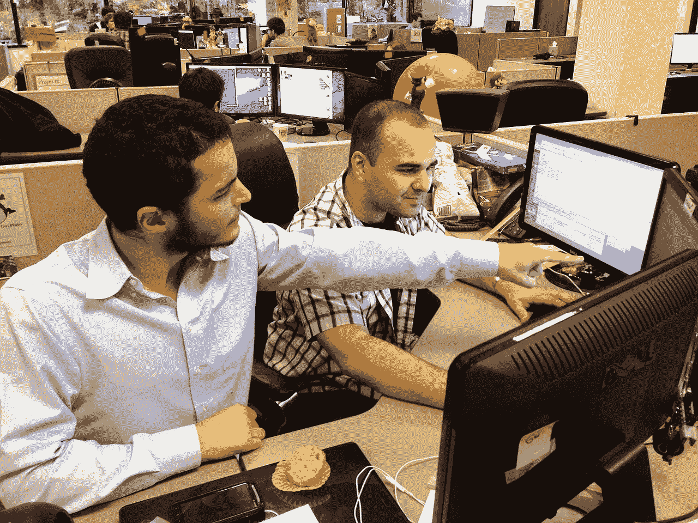
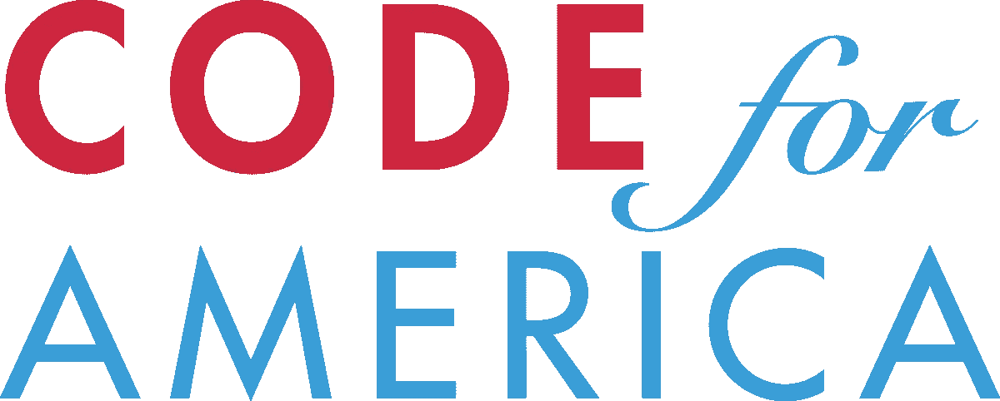

# 政府不会编码

> 原文：<https://medium.com/hackernoon/the-government-cant-code-dd0a7250f46c>

## 为什么公民黑客是最好的社区服务形式

Source: [Can’t Code Won’t Code](https://twitter.com/cantcodewontcod)

当我们想到[政府的](https://hackernoon.com/tagged/governments)技术能力时，通常会想到一些合同黑客在键盘上快速打字，或者一个包含我们所有电话记录、电子邮件和 YouTube 猫视频搜索的大规模数据中心。虽然对于依靠技术能力监视我们所有人的[部门来说这可能是真的](https://nsa.gov/)，但是在编写[代码](https://hackernoon.com/tagged/code)时，美国政府的其他方面也需要一些帮助。

Source: mytlcteam.com

这是一个众所周知的问题，但在科技行业却鲜有人关注。公共部门不像私营部门那样有进取心的企业家精神；他们不能采用科技行业所遵循的“快速行动，打破常规”的原则。正因如此，它们的发展速度不如私营企业或快速成长的初创公司。政府依靠协议(物理协议)来完成事情，可悲的是，当它开始建设新的东西时，它的动作非常缓慢。因此，为了跟上 21 世纪快节奏的技术，政府需要我们这些公民来帮助它跟上时代的步伐。

这就是公民黑客的用武之地。公民黑客是指人们利用他们的技术技能来改善政府的行为。这是一个很棒的概念，而且正在上升。全国各地的许多工程师和程序员正聚集在一起为他们的城市编写软件。程序员们聚集在一起，构建有用的应用程序供他们周围的人日常使用。这是一个相当独特的现象，你可以想象这是 21 世纪的社区服务，因为这就是它。

Source: blog.jxee.me

公民黑客的想法因美国的代码而变得流行。由 Jennifer Pahlka 创立的 Code for America 是一个真正希望通过缩小公共和私营部门技术基础设施之间的差距来做出改变的组织。是的，硅谷的粉丝们,《美国代码》确实让这个世界变得更加美好。Code for America 为黑客提供了构建应用程序和服务的机会，供整个国家通过网站提交来使用，或者通过让黑客与他们的地方分会联系来为他们的地方政府构建应用程序和服务。

Source: Silicon Valley (HBO)

到目前为止，Code for America 分会已经做出了令人难以置信的事情，每天都在影响着社区。从[绘制当地 911 电话位置图](https://www.codeforamerica.org/stories/long-beach-uses-addressiq-to-focus-emergency-medical-resources)到[让领取食品券变得更容易](https://www.codeforamerica.org/stories/california-counties-focus-on-customer-experience-to-make-it-easier-to-apply-for-calfresh)，这一运动与单独为政府编码的个人一起，进一步将公民与他们的市政当局联系起来，以加强社区和政府的现代化。

Source: codeforamerica.org

在一个技术正在颠覆每个行业的世界里，是时候让你用你的技能来帮助它颠覆政府了。找到您当地的“美国代码”分会并参与其中。给一些成员发一封电子邮件或者查看他们的 Github 库。甚至可能来参加一两次会议，你可能会喜欢！最后，所有的分会都在做一些对他们的社区有影响的事情。毕竟这是社区服务的未来。

As always, you’re awesome!

非常感谢您的阅读！如果你喜欢这个帖子，请推荐或分享！

> [黑客中午](http://bit.ly/Hackernoon)是黑客如何开始他们的下午。我们是 [@AMI](http://bit.ly/atAMIatAMI) 家庭的一员。我们现在[接受投稿](http://bit.ly/hackernoonsubmission)并乐意[讨论广告&赞助](mailto:partners@amipublications.com)机会。
> 
> 如果你喜欢这个故事，我们推荐你阅读我们的[最新科技故事](http://bit.ly/hackernoonlatestt)和[趋势科技故事](https://hackernoon.com/trending)。直到下一次，不要把世界的现实想当然！

