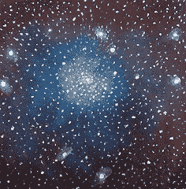
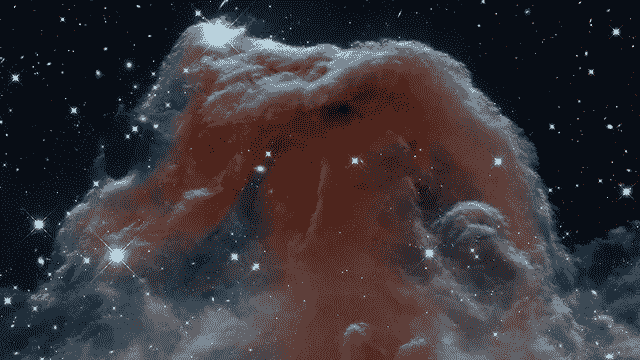

# 人类最宏伟的愿景

> 原文：<https://medium.com/hackernoon/the-grandest-vision-for-humanity-7e54eb3a4369>

在鲁比·布鲁姆和米兰达·迪克森·路易恩伯格婚礼上的致辞

# ***“宇宙是复杂而美好的。”***

**当我们听关于人性、生命和死亡的故事时，我们无法理解所有在我们之前生活过的人、所有将在我们之后生活的人的叙述的复杂性，以及我们自己在永恒的万物序列中的巨大的无足轻重。宇宙没有也永远不会真正知道我们是谁，仅仅是这个庞大的时空光谱中的一个点。我们应该保护的广阔时空范围。但是保护的目的是什么？我们中有多少人真的会幻想人类在宇宙中的目标？它看起来像什么？**

有时候，我会像看待乔治·修拉的一幅画一样思考人性。他对点彩的运用，这是一种在画布上绘制成千上万个微点的艺术技巧，这些微点在多种颜色中形成对比并相互补充。从近处看，这些点似乎是无意义的，甚至是完全错误的——一个蓝点紧挨着一个黄点，从远处看是白色的。从远处看，这些独立的点组合在一起构成了一个复杂的场景。宇宙中所有事物的类比。每一个生命、想法、爱都只是一个小小的彩色点，与周围的事物形成互补和对比，但从更远的地方看，它们融合在一起，为一个更大的画面、更大的目标做出贡献。

**这个整体画面有多大？嗯，很大。已知宇宙的距离直径为 9000 亿光年，其中每个光年为 5.87 万亿英里。全尺度对我们来说是深不可测的。而且也很旧了。137.5 亿岁。我们的类人祖先只在这个宇宙，这个我们站立的星球上居住了大约 600 万年，与真实的环境相比，这是一个可笑的短暂时期。我们是多么幸运，就在此时此地，拥有这样一个机会，拥有这个机构来塑造这个星球，让它成为一个代表人类的存在。**

我们已经走了很长的路，我们也可以走很长的路。我们完全可以继承宇宙，把它变成我们的，不是为了占有，而是为了保护。为了普度盛世。迄今为止，每一个人都为进化而殉难。所有这些创造和损失的最终目标是什么？我们必须抗争，人类的目的不仅仅是为了生存。

**——————————**

想象一个未来的世界。想象一个未来的世界，在那里我们摆脱了目前的局限。不受生物时间的限制。免于衰老和死亡。没有疾病。从这种生物脆弱性中解脱出来。不受空间限制。从被限制在一个美丽的星球上。我们在宇宙中传播，以我们祖先对待地球国家的方式居住和稳定行星。但是，我们将超越我们的不安全感，而不是像以前那样应用边界。想象一个每个个体的智慧都受到尊重的时代。想象一个普遍繁荣与普遍相互联系相结合的时代。想象对所有生命、所有物质的深切关怀和同情，根植于每一个人、每一个行动。想象一下，尊重每一个智慧的代表，作为整个宇宙的代表。很像那些尖点。对于每一份爱，每一个想法，每一个实例，每一个浪漫的结合和每一个孩子，也许我们可以理解，我们已经在为普遍的繁荣做出贡献。

**想象一下全部历史的全尺度，宇宙的全部 137.5 亿年。想象一下这些真理在任何时候都是可以得到的。想象一下，有一天我们可以理解一切——所有的细胞，所有的 DNA，所有的恒星，所有的框架。想象一下能够*操纵*它们。所有定义我们的系统，所有我们居住的环境——我们的身体，我们的思想，我们的星球，我们的宇宙。想象所有的东西都是联网的，所有的东西都是相连的。宇宙中所有 10 的 82 次方估计原子都开启了，超越成了*可编程物质*。不是为了统治，而是为了确保他们是自己最好的形式，不管他们在这个更大的图景中的目的是什么。也许这就是爱情的终极目标。**

**想象一个时间*不再能想象的时间*。当舞蹈永远不需要结束，当爱人永远不需要死去，当熵不再占主导地位。想象一个世界，在那里我们可以全方位探索，只要我们想，每一个想法，每一个概念，每一个地点。与明星共舞，与彼此共舞，仅仅为了跳舞而跳舞，没有时间限制。想象一个激进生命*扩张*的世界，伴随着激进生命的延伸。想象所有可能的事情。所有潜在的艺术，所有潜在的美，所有潜在的创造和构思。摆脱了时间的束缚，生活会是什么样子？我怀疑我们甚至无法用正确的正义来想象它。**

我们生活在一个基于这样一种假设的世界里，即我们能够理解什么是可能的，什么是不可能的。然而，历史告诉我们，不可能的事情往往会变成可能，看似遥不可及的梦想会变得非常现实。地球上的每一件事物，人类的每一项成就都只是我们之前目标有多高的表现。人类能够向往的最宏伟的愿景是什么？

**嗯，这取决于你有多大的梦想。**

> [黑客中午](http://bit.ly/Hackernoon)是黑客如何开始他们的下午。我们是 [@AMI](http://bit.ly/atAMIatAMI) 家庭的一员。我们现在[接受投稿](http://bit.ly/hackernoonsubmission)并乐意[讨论广告&赞助](mailto:partners@amipublications.com)机会。
> 
> 如果你喜欢这个故事，我们推荐你阅读我们的[最新科技故事](http://bit.ly/hackernoonlatestt)和[趋势科技故事](https://hackernoon.com/trending)。直到下一次，不要把世界的现实想当然！

