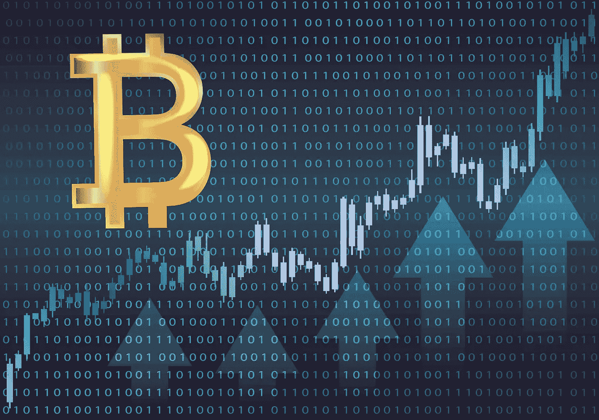
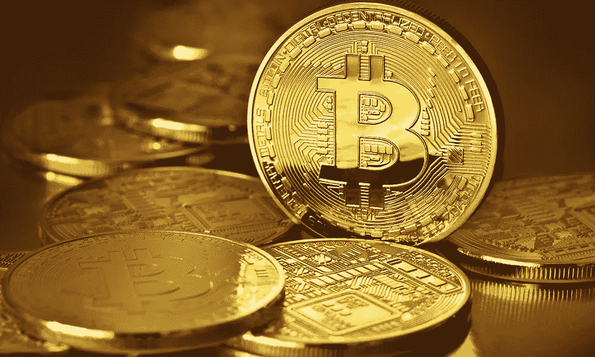

# 比特币存在泡沫吗？你现在不觉得自己很傻吗？

> 原文：<https://medium.com/hackernoon/the-great-bitcoin-bubble-of-2017-dont-you-feel-silly-now-723ac8b8156a>

*快速更新:现在每枚比特币的价格已经超过了 15000 美元——这篇文章中的所有内容仍然适用！*

随着比特币达到 11000 美元，我收到了一封来自我的一位财务顾问的电子邮件，发送了一篇预测比特币是一个即将破裂的泡沫的文章，并呼应了她和金融业其他人以前告诉我的建议:是时候离开了。

有一次，我甚至听了，但几乎马上就后悔了。

事实是，如果你像我一样，在比特币领域待了几年，你就会知道传统金融界的人很久以来就一直在预测比特币的崩溃。

了解历史很重要，因为这些善意的人往往同时是对的和错的(尽管通常他们自己没有任何比特币，所以要小心你听谁的建议！).

当我在 2013 年第一次开始购买比特币时，这样做并不容易。大多数交易所和网站都在美国境外。我曾经在山景城市中心遇到比特币买家，给他们 120 美元现金，他们会转 1 个比特币给我。

那一年，比特币的价格开始上涨，最终超过了 200 美元！我认为这是一个巨大的飞跃，比特币终于“到来”了。传统金融人士开始称之为泡沫，而技术人士则称之为“革命性的新技术”。

然后有趣的事情发生了。比特币崩盘，价值缩水近一半！不要相信我，这里有一篇 2013 年 4 月的文章:

[***比特币崩盘，6 小时损失近一半价值！***](https://arstechnica.com/information-technology/2013/04/bitcoin-crashes-losing-nearly-half-of-its-value-in-six-hours/)

我决定不听，继续买。另一件有趣的事情发生了。比特币再次开始上涨，达到了每比特币 1000 多美元。

传统金融人士开始称之为泡沫，而技术人员则说这是一项革命性的新技术。我记得至少有一位硅谷的知名风投告诉我，我在浪费时间。

当然，正如反对者预测的那样，比特币出现了大崩盘，部分原因是中国禁止交易所和比特币交易的消息。Bitcion 在达到 1200 美元后跌至 600 美元以下，洛杉矶时报问道:

[***2013 年比特币大崩盘:你现在不觉得自己很傻吗？***](http://www.latimes.com/business/hiltzik/la-fi-mh-the-bitcoin-crash-20131207-story.html)

这是个好问题。在加密货币的世界里，人们应该更经常地问自己一个问题:*你现在不觉得自己很傻吗？(当然，应该有人问写那篇文章的《洛杉矶时报》记者这个问题，但不知何故，我怀疑没人会问)。*

现实中，我一点也不觉得自己傻，而是决定以更低的价格多买几个比特币，然后等待。

但是后来…没发生什么。慢慢地，对加密很认真的人继续前进，似乎金融和技术世界的其他人忘记了比特币。

当然，比特币今年带着 ICOs 回来了，现在不仅仅是 Bitcion，以太也有了戏剧性的增长。比特币重回 1000 美元。像往常一样，“建议”开始从朋友和风投行业的“顾问”那里涌入——“我希望你卖掉了你的比特币，这是另一个泡沫！”。

后来涨到了 2900 美元，福布斯写道:

[***比特币处于历史高点，但它即将自毁吗？***](https://www.forbes.com/sites/laurashin/2017/06/07/bitcoin-is-at-an-all-time-high-but-is-it-about-to-self-destruct/#b7e2846cb31b)

然后，随着比特币突破 3000 美元，并短暂触及 4000 美元，朋友和金融人士抛售的呼声越来越高，包括摩根大通的首席执行官称比特币是一种欺诈！

[***杰米·戴蒙抨击比特币是骗局！***](https://www.bloomberg.com/news/articles/2017-09-12/jpmorgan-s-ceo-says-he-d-fire-traders-who-bet-on-fraud-bitcoin)

中国又一次开始禁止比特币交易所，比特币价值暴跌！也许戴蒙是对的。比特币从 4000 多美元的高点跌至 3000 美元——又一次大跌！

一直以来，人们都在告诉我卖出；但在经历了几次比特币崩盘后，我决定继续持有，并在 3300 美元左右再多买一点。在我下单之前，价格已经涨到了 3800 美元！

随着日本和其他国家填补了中国的空白，随着富有创造力的中国人找到了规避政府各种限制的方法，比特币的价格开始再次上涨。

然后就打到 6000 美元了！我的财务顾问建议我卖掉一些比特币。尽管我一直忽视这个建议，但我还是让步了，卖了一点，告诉自己我只是“谨慎”和“保护自己的劣势”。

几乎就在我卖掉它的时候，我的直觉告诉我这是一个错误的决定。然后有趣的事情发生了。比特币飙升至 7500 美元。比特币再次跌破 7k 美元，我决定重新购买我的比特币，但在我这样做之前，它又反弹到 8k 美元！该死的。这就是我听取理财建议的收获。

突然，我的一些朋友告诉我卖掉比特币，因为它在 2000 美元和 3000 美元是一个泡沫，他们试图为自己购买一些比特币！是的，当他们告诉我应该以 2000 美元卖出时，他们以每比特币 8000 美元的价格买入，因为太贵了！

今天，预测又回来了。这是今天早上市场观察上的一篇文章，告诉我们比特币有 80%的可能性崩溃，这是肯定的！

[**观点:比特币崩盘几率大于 80%**](https://www.marketwatch.com/story/the-chance-of-a-bitcoin-crash-is-greater-than-80-2017-11-27)

这篇文章的副标题是:*加密货币价格暴跌 40%*

问题是你应该听专家的吗？是时候卖掉你的比特币了吗？

我的观点是，他们可能是对的，比特币的价格将会崩溃——它一直如此，而且很可能会再次崩溃！

现在，也许我们需要问一下金融业的问题，在下一次垃圾事件之后，谁还会再问我们这个问题呢？

***你现在不觉得自己很傻吗？***

下次我被问到这个问题时，我可能会再次开始购买比特币，因为这意味着这是比特币不可避免的暂时崩溃之一！

> 注意:我不是财务顾问，这篇文章纯粹是我自己的观点。我个人拥有比特币和其他加密货币以及区块链初创公司。我的个人网站在 www.zenentrepreneur.com