# 关于比特币规模的大辩论——时间表

> 原文：<https://medium.com/hackernoon/the-great-bitcoin-scaling-debate-a-timeline-6108081dbada>

**为什么这么多尝试衡量比特币区块链的努力都失败了？**

这个时间表记录了对比特币区块链的多次尝试，并详细说明了每次尝试——到目前为止——是如何失败的。它涵盖了缩放辩论中的所有重要日期，重点关注比特币的替代实现如何以及为什么涌现，以努力将区块链缩放到更大的块大小。

**简述为什么 1 MB 的块大小从未增加:**

早在 2011 年，加文·安德森(Gavin Andresen)、杰夫·加齐克(Jeff Garzik)和迈克·赫恩(Mike Hearn)等开发人员就开始呼吁增加比特币的块大小。他们预计有一天事务的速率会超过块中的可用空间，并试图增加块大小限制—这一变化看起来似乎很简单。块的大小被放置在适当的位置，以限制有人可以廉价的垃圾邮件网络的可能性。发送大量交易很便宜，而且有可能为了一笔小投资而挤掉其他交易[。](http://gavinandresen.ninja/One-Dollar-Lulz)

垃圾邮件控制机制以 1 MB 的块大小限制的形式存在，这又将网络上每秒的事务限制在大约三个。尽管由于各种原因，迄今为止扩大比特币规模的所有努力都失败了，但他们试图实现的目标仍然是一个需要解决的问题。从事比特币主要 Github 存储库工作的开发人员一致认为，需要增加区块大小，但他们尚未建立一种获得广泛共识的方式来做到这一点。他们似乎已经放弃努力增加硬分叉块的大小，转而寻求不需要建立全网共识的链外解决方案。

最近增加比特币基础块大小的尝试采取了 Segwit2x 的形式，这是继引入隔离见证(Segwit)之后的又一次尝试，块大小限制增加了一倍。Segwit2x 和之前的其他块大小尝试都失败了，因为文化、技术和治理开发团队抵制被认为是“有争议的”“有争议的”提议是指尚未得到比特币社区完全支持的提议。比特币经典、比特币 XT、比特币无限和 Segwit2x 都是寻求在更大的块大小中建立共识的替代客户的例子。

我希望这个时间表能让我们深入了解这场旷日持久的争论。我从块大小的辩论中总结的时刻提供了一个关于块大小提案如何诞生的实地观点，以及比特币社区中不同的参与者如何对这些提案做出回应。虽然一些团体欢迎简单的块大小增加，但其他人认为这些尝试有风险、危险，甚至是“对比特币本身的攻击”。当你阅读这个时间表时，请记住，它并不打算全面，我也不打算完全不带偏见。如果我忽略了我个人对缩放辩论的理解，以及我当时是如何理解这些争论的*，*，我将忽略比特币对我来说最有趣的部分:数学之上的社交层。这就是比特币吸引我的地方。一方面，有一组由算法和原始 hashpower 定义的规则；另一方面，社会和经济价值观决定了个人如何应对威胁和感知到的攻击。

为了创建这个时间表，我从开发者的邮件列表、开发者的博客帖子、中国比特币社区以及网上其他经过审查的来源中提取了信息。我试图只突出关键时刻，并且只在适合讲述完整故事的时候才加入小情节。

我认为从 Paul Sztorc 的博客文章“[挽救数据块大小的争论](http://www.truthcoin.info/blog/blocksize-conversation/)”开始也很重要

> 我来这里的唯一目的，就是安慰那些沮丧的人。我希望解释*为什么*块大小的对话如此可怕，并帮助它向前发展。如果你对此不感兴趣，现在是时候去别的地方了。

我们开始吧。

**2009 年 4 月**

在 [Bitcointalk](https://bitcointalk.org/index.php?topic=149668.msg1596879#msg1596879) 上关于块大小的讨论中，迈克·赫恩分享了他收到的一封来自中本聪的电子邮件，这封邮件是对他关于块大小限制的问题的回复:

[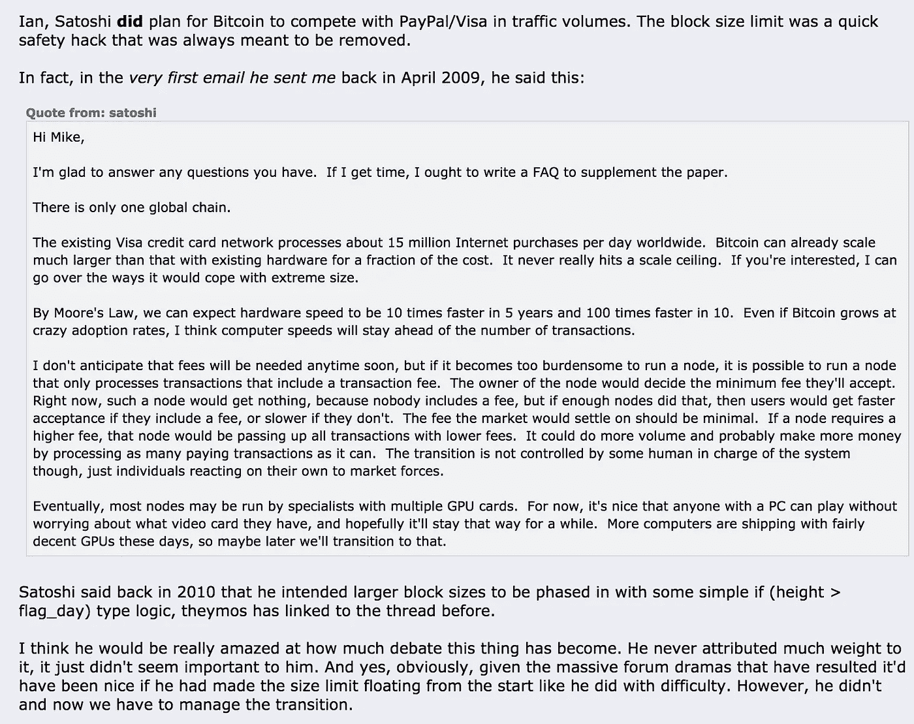](https://bitcointalk.org/index.php?topic=149668.msg1596879#msg1596879)

[https://bitcointalk.org/index.php?topic=149668.msg1596879#msg1596879](https://bitcointalk.org/index.php?topic=149668.msg1596879#msg1596879)

重要的是要明白，自中本聪放弃比特币以来，情况已经发生了很大变化，但声称 Satoshi 意味着不管计算机速度如何提高，1 MB 的块大小(或任何大小)限制都将继续存在是不正确的。

**2010 年 7 月 14 日**

在客户端上设置 1MB [的“max_block_size”值。(](https://github.com/bitcoin/bitcoin/commit/a30b56ebe76ffff9f9cc8a6667186179413c6349#diff-118fcbaaba162ba17933c7893247df3aR2614)[查看 Sourceforge 上的快照](https://sourceforge.net/p/bitcoin/code/103/log/?path=))。

**2010 年 10 月 24 日**

**经过一番讨论，** [哈尔·芬尼(Hal Finney)，Satoshi(比特币的创造者)，以及 Bitcointalk 上的用户“Cryddit”](https://bitcointalk.org/index.php?topic=946236.msg10388435#msg10388435)施加了 1MB 的默认块大小，以减少垃圾交易劫持块空间的机会，或者廉价 DoS 攻击的可能性。下面的 Cryddit 解释了为什么要设置这个限制:


via [https://bitcointalk.org/index.php?topic=946236.msg10388435#msg10388435](https://bitcointalk.org/index.php?topic=946236.msg10388435#msg10388435)

由于可以免费包含事务，事务(也可以表示在微小事务中捎带的数据)可能会导致网络目标之外的永久且昂贵的数据存储。最近，以太坊的创造者 Vitalik Buterin 声称，这一限制是鼓励他开发替代系统的原因，而不是搭载比特币或主币。

当被问及未来如何取消这一限制时，Satoshi 写道:

> 它可以分阶段实施，例如:

```
*if (blocknumber > 115000)**maxblocksize = largerlimit*
```

> 它可以在更早的版本中出现，所以当它达到那个块号并生效时，没有它的旧版本已经过时了。
> 
> 当我们接近截止块号时，我可以向旧版本发出警报，以确保他们知道他们必须升级。

如果你研究实际限制块大小的技术机制，你很可能会遇到[上面的对话](https://bitcointalk.org/index.php?topic=1347.msg15366#msg15366)，其中 Satoshi 推荐了一个未来的日期来设置块大小的增加。需要注意的是，它比那一行要复杂一些。Garzik 是一名开发人员，当时曾密切参与比特币代码的开发，他提议(也许是以一种挑衅的方式)提高区块限制，以允许每秒钟大量的额外交易与 Paypal / Visa 交易量相匹配，但 Satoshi 建议在未来进行升级。

许多人忘记的是，这段对话夹在 Garzik 的帖子之间，他是 [BTC1](https://github.com/btc1/bitcoin) / [Segwit2x](/@DCGco/bitcoin-scaling-agreement-at-consensus-2017-133521fe9a77) 实现的开发者。如果 Garzik 坚持己见，努力在 2010 年实现渐进、合理的增长，我们就不会有比特币现金、比特币经典、比特币无限或他致力于实现的 Segwit2x。沿着这条时间线，您将会遇到这些实现。

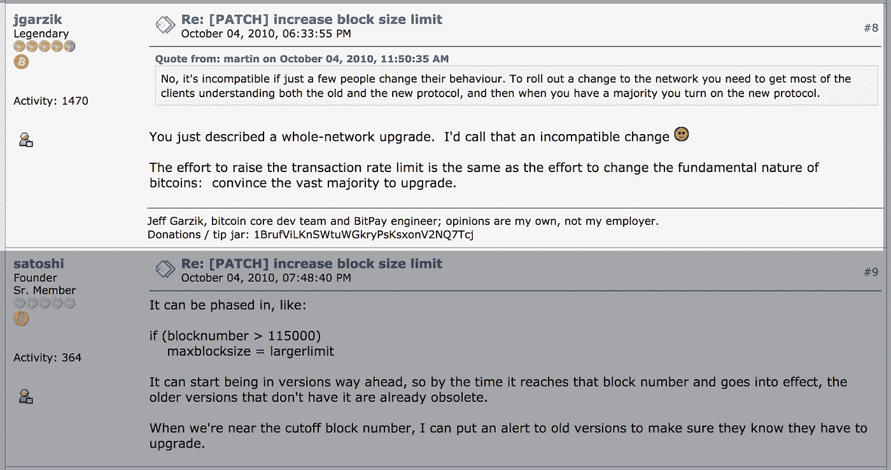

Greg had his own problems with whole-network upgrades.

**2011 年 6 月 14 日**

加文·安德森(Gavin Andresen)向美国中央情报局(CIA)赠送了比特币，这可能导致比特币的创始人中本聪陷入黑暗。可以想象，比特币社区是一群可疑的人。没有 Satoshi，块大小限制就没有权威的决策者。当时矿工、用户和开发者的网络非常小。

**2012 年 7 月 12 日**

安德森[设置了 250](https://github.com/bitcoin/bitcoin/commit/c555400ca134991e39d5e3a565fcd2215abe56f6#diff-c865a8939105e6350a50af02766291b7R284) KB 的块大小限制。

**2013 年 11 月 7 日**

安德森第一次提交到知识库是在 2010 年 7 月，在早期与中本聪密切合作改进比特币之后，他拥有了比特币官方知识库的管理员权限。他在这一天将块大小设置为 750 KB。请注意，当时只有一个小组在比特币储存库工作，没有“核心开发人员”的概念，因为没有其他实现，或者需要指定一个在网络上工作的“团队”。核心开发人员的想法在一定程度上是对比特币经典版(一种替代和受欢迎的客户端，你稍后会读到)的回应，安德森在离开核心开发人员后推出了比特币经典版。

**2014–4–7**

安德森辞去了比特币主要开发者和发行经理的职务。

**2014 年 6 月 10 日**

迈克·赫恩(Mike Hearn)发表了一份*比特币改进提案* (BIP 64)，开始了他的另类客户端比特币 XT 的基础。这是为了更容易与他的众筹项目“灯塔”联系起来。今年 12 月，赫恩发布了比特币 XT 版本。[下面是 Mike 关于为什么创建比特币 XT 的介绍](https://www.youtube.com/watch?v=8JmvkyQyD8w&t=47m58s)。

比特币 XT 后来将包括安德森的 [BIP 101](https://github.com/bitcoin/bips/blob/master/bip-0101.mediawiki) 提案，该提案将区块大小提高到 8MB。比特币 XT 在比特币 Classic 之前出现，但为硬分叉发起的块大小限制奠定了基础。不幸的是，核心开发团队认为块大小的增加风险太大。

**2014–9–25**

数据块更接近“满状态”，平均数据块大小约为 800k。

**2014–10–14**

Ittay Eyal、Adem Efe Gencer、Emin Gun Sirer 和 Robbert van Reness 介绍了比特币-NG，这是一种在相同安全模型下通过卸载交易来扩展比特币容量的方法:

[http://hackingdistributed.com/2015/10/14/bitcoin-ng/](http://hackingdistributed.com/2015/10/14/bitcoin-ng/)

[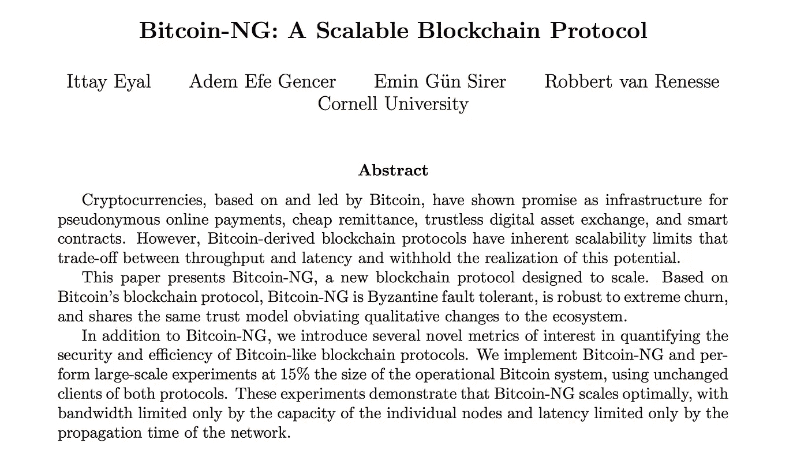](https://arxiv.org/pdf/1510.02037.pdf)

via: [https://arxiv.org/pdf/1510.02037.pdf](https://arxiv.org/pdf/1510.02037.pdf)

**2015 年 3 月 28 日**

迈克·赫恩(Mike Hearn)编写了比特币(Bitcoinj)的第一个替代客户端实现，并写了一篇名为 [Replace by Fee](/@octskyward/replace-by-fee-43edd9a1dd6d) 的帖子，专门讨论比特币内置的拐杖，使钱包软件更容易导航“费用市场”，同时避免核心块空间问题:

> 我认为 RBF 是一个经过深思熟虑的想法，不会起作用，不会做它声称要做的事情，如果被采用，对比特币将是有害的。

被费用取代(RBF)，又名“费用碰撞”或“交易取代”被添加到比特币中，试图使不可预测的交易费用(和越来越满的区块)成为钱包可以编程的东西。它消除了低费用交易被卡住的可能性，但打开了双倍消费的网络:

> “焦土”背后的想法是，如果有人购买了未经确认的交易，当他们走出商店并按下撤销时，他们会以更高的费用将原来的产出加倍支付给自己，但商家看到了这一点，然后以略高的费用在他们的原始付款上添加一笔“消费给自己”的交易，然后欺诈者的钱包会以同样的方式提高他的*交易链的费用，如此等等，直到全部付款都被费用消耗掉。欺诈者得到了货物，现在支付给了矿工而不是商人，而商人一无所有。*

几个月后，Emin Gün Sirer 在 2015 年 12 月 23 日发表的这篇文章中提到了允许收费市场发展的疯狂:

> 一个不好的论点是“我们不知道当收费市场发展时会发生什么，它最终将不得不发展，所以让我们加快这一天。”我没有老年生活的经历。我不会去人为诱发骨质疏松症来为我的老年生活做准备——相反，当我有幸拥有一副正常工作的骨骼时，我会充分利用我的工作日。

点击查看[RBF 的用法。](https://p2sh.info/dashboard/db/replace-by-fee?orgId=1)

**2015–05–04**

Andresen 认为应该尽快解决块大小限制的问题。当时，数据块的使用率为 30%到 40%。

如果等待的事务数量变得足够大，最终的结果将是网络过度饱和，忙于无所事事。我不认为这是可能的——更有可能的是，人们只是停止使用比特币，因为交易确认变得越来越不可靠。

[**为什么增加最大块大小是迫切的**](http://gavinandresen.ninja/why-increasing-the-max-block-size-is-urgent)

**2015 年 5 月 30 日**

审查是比特币创造者的一个重要话题。关于市场、开发团队和整个数字货币世界的信息流首先流经少数数字平台，如 [BitcoinTalk](https://bitcointalk.org) (这是第一个)和 [Reddit](http://reddit.com/r/bitcoin) 。以下是 2015 年的一个帖子，它会在 2017 年禁止一个用户:Reddit 用户 *usemein* 问“[*block stream 公司是 4 个核心开发者不增加 blocksize*](https://www.reddit.com/r/Bitcoin/comments/37vg8y/istheblockstreamcompanythereasonwhy4core/) 的原因吗？”

如果你继续阅读下面的内容，你会看到更多关于这家公司的内容，以及一篇关于审查制度的文章。如果你已经接触过未经审查的比特币信息流，你应该已经听说过 Blockstream 的遗产。许多针对 Blockstream 的指控都是疯狂的阴谋性指控，通常在审查下站不住脚，但知道他们的商业模式取决于受限制的块大小后，他们对从事比特币开发的员工产生了很大的怀疑。

**2015–06–4**

Andresen 拒绝了开发人员应该对块大小设置明确且不可更改的限制的想法，称这是一个“政策决定”，开发人员应该允许节点和矿工自己决定:

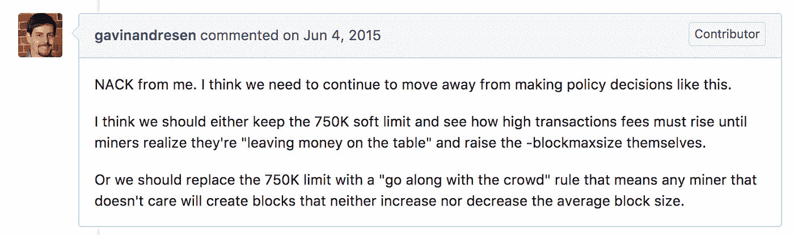

via: [https://github.com/bitcoin/bitcoin/pull/6231#issuecomment-108892765](https://github.com/bitcoin/bitcoin/pull/6231#issuecomment-108892765)

一些评论者对这一拉请求的目标，特别是卢克·达什 Jr，是让比特币进入一个收费市场状态，在这种状态下，交易需要相互竞争块空间的包容性。经济决策(如引入和支持收费市场)与容量规划决策(工程决策)不相容的观点仍然是一个有争议的话题。

**2015 年 6 月 8 日**

47 米 58 英寸，迈克·赫恩在采访中谈到了比特币 XT 的诞生，并阐述了他对开发团队仁慈独裁者的概念:

**2015–06–12**


中国矿商签署了一份声明，表示他们想要 8MB 的区块。签署者包括大型矿业公司 F2pool、BTCChina、Antpool、Huobi 和 BW。

via[https://medium . com/@ Zhang sanbtc/why-we-must-oppose-cores-seg wit-soft-fork-bit coin-miner-Jiang-Zhuo-er-tell-you-why-28f 820d 51 f 98](/@zhangsanbtc/why-we-must-oppose-cores-segwit-soft-fork-bitcoin-miner-jiang-zhuo-er-tells-you-why-28f820d51f98)

**2015 年 6 月 22 日**

Bittorent 的创始人布拉姆·科恩曾几次参与区块大小的辩论，他发布了“[比特币的讽刺危机](/@bramcohen/bitcoin-s-ironic-crisis-32226a85e39f)”，其中他取笑任何准备进入区块满是交易的状态的人。他称提高街区规模限制是家长式和极权主义的。

> *针对达到交易速率限制的“问题”提出的“解决方案”是将限制从 1 兆字节提高到 20 兆字节。这种变化与比特币的精神气质背道而驰。让事情顺其自然，让交易费用由市场利率决定，这直接符合比特币赖以建立的分布式自由主义原则。提前提高上限以避免触及上限是家长式和极权主义的。*

在 2017 年 3 月安德森和马特·科拉洛(比特币核心贡献者)之间的一次讨论中，自上而下的限制(或取消限制)方法是“家长式”的观点再次出现:

[](http://gavinandresen.ninja/ask-a-simple-question) [## 问一个简单的问题...*加文·安德森

### 这是我与 Matt Corallo(比特币核心贡献者)的一次对话，对话始于 twitter，后来转移到了电子邮件中…

忍者](http://gavinandresen.ninja/ask-a-simple-question) 

**2015–06–24**

BTCChina 的工程总监 Mikael Wang [告诉 CoinTelegraph](https://cointelegraph.com/news/chinese-mining-pools-call-for-consensus-refuse-switch-to-bitcoin-xt) :

“我们认为加文的提议是一个平衡的解决方案，我们都可以支持。最初的 8 兆字节区块大小增加也是中国所有矿业运营商之间商定的数字。不幸的是，由于比特币 XT 的实验性质，BTCChina Pool 将不会运行比特币 XT，但我们期待看到这个补丁合并到比特币核心中。”

来自具有更高块大小限制的替代客户端的代码从未被合并到比特币核心中，无论社区是否支持。尽管正如 Mikael Wang 所建议的那样，在合并这些代码后，块大小的争论可能会有效地结束，但这是比特币核心永远不会做的事情。

**2015 年 6 月 30 日**

为了解决拒绝服务攻击，赫恩在他的比特币 XT 实现中阻塞了 Tor 出口节点:[https://github . com/bitcoinxt/bitcoinxt/commit/73c 9 EFE 74 C5 cc 8 faea 9 C2 c 785 a2 F5 b 68 aa 4c 23](https://github.com/bitcoinxt/bitcoinxt/commit/73c9efe74c5cc8faea9c2b2c785a2f5b68aa4c23)

因为审查任何人与比特币网络的联系等同于叛国，这并没有得到很好的认可，可能已经决定了 XT 项目的命运。它很快开始失去社区的支持。

**2015 年 8 月 2 日**

LiteCoinGuy 在 BitcoinTalk 上发布了“ [**为什么我会支持更大的块，你也应该支持更大的块。帖子包括一张详细说明核心开发人员支持的图表，Blockstream 员工正好在 1MB 阵营中:**](https://bitcointalk.org/index.php?topic=1141086.0)

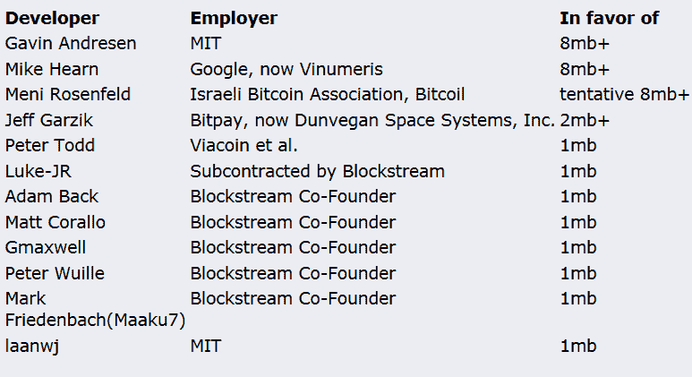

**2015 年 8 月 12 日**

这里有一段节选自赫恩关于软叉和硬叉的讨论:

*值得注意的是，Satoshi 没有使用“硬叉”这个短语；他大概没有想到可能存在任何其他种类的叉子。当时还没有软分叉的想法，这是正确的，因为这个概念本身存在严重缺陷:在一个正常运行的比特币网络中，不应该出现软分叉。*

硬分叉标志着网络范围的升级，类似于典型的软件开发周期。软分叉是规则的收紧，不需要网络范围的协作或完全的共识。

[](/@octskyward/on-consensus-and-forks-c6a050c792e7) [## 论共识与分歧

### 硬叉和软叉有什么区别？

medium.com](/@octskyward/on-consensus-and-forks-c6a050c792e7) 

一个重要的区别是:软分叉使比特币的规则更加严格，但不会产生不兼容、未升级的客户。由于规则松动，硬分叉要求所有客户端升级。

**2015 年 8 月 15 日**

赫恩发表了《比特币为什么分叉》

[**比特币为什么会分叉？**](/faith-and-future/why-is-bitcoin-forking-d647312d22c1)

[medium.com](/faith-and-future/why-is-bitcoin-forking-d647312d22c1)T21 异想天开的故事

在这篇文章中，他解释了他的 XT 项目和他对比特币的愿景(扩大到每秒交易量的 Visa 水平)，并呼吁闪电网络与比特币分道扬镳。闪电网络是一种协议，通常被吹捧为比特币规模问题的解决方案:

*作为 Satoshi 设计的替代方案正在被推的所谓“闪电网”并不存在。描述它的* [*论文*](https://lightning.network/lightning-network-paper-DRAFT-0.5.pdf) *今年年初才发表。如果实施的话，它将代表着与我们所熟知和喜爱的比特币的巨大背离。仅从众多差异中挑选一个，比特币地址是行不通的。他们将被什么取代还没有被研究出来(因为没人知道)。还有很多其他令人惊讶的陷阱，其中我* [*发表了一篇关于*](/@octskyward/the-capacity-cliff-586d1bf7715e) *的文章。目前还不清楚最终产生的东西会不会比我们现在拥有的比特币更好。*

也是在这一天，摩根·e·佩克(Morgan E. Peck)在 IEEE Spectrum 上以耸人听闻的标题“亚当·贝克说比特币分叉是一次政变”对亚当·贝克进行了一次精彩的采访。在关于比特币 XT 的合法性的一些争论后，贝克声称 XT 以错误的方式寻求共识，佩克问道 *:*

> 不过在某种程度上，BitcoinXT 也是达成共识的一条途径。赫恩声称比特币的核心开发团队已经陷入僵局，并表示他正在强迫进行投票，否则投票将永远不会发生。那么，这有什么错呢？

……回了一句:

> 时机非常奇怪。在过去，他们可能会说进展缓慢，但他们在两个月的积极进展后这样说了。在这种情况下，我们更希望他们能够合作，在这个过程中与其他人一起工作。他们似乎对自己的提议没有自动胜出感到恼火。
> 
> 在某种程度上，这不是提案的细节，而是试图绕过科学审查过程，通过游说、博客和民粹主义运动强加一种设计。我是说，这传达了什么样的信息。其他人应该写一个网页去游说公司吗？这不是一个有建设性的前进方向，并放大了叉子失败的风险。如果它以不受控制的方式失败，那将和退出欧元区一样有趣。

**2015 年 8 月 16 日**

Andresen 的 BIP101 提案合并到了 XT 代码库中。如果大多数矿工已经升级到这个客户端，这将导致一个硬分叉。

[https://github . com/bitcoinxt/bitcoinxt/commit/946 E3 ba 8 c 7806 a 66 C2 b 834d 3817 ff 0 c 986 c 0811 b](https://github.com/bitcoinxt/bitcoinxt/commit/946e3ba8c7806a66c2b834d3817ff0c986c0811b)

**2015 年 8 月 17 日**

根据上面显示的 8 月 16 日的新闻，r/bitcoin 的主持人 Theymos 解释了一项新政策，根据这项政策，讨论改变比特币规则的硬分叉提议(甚至提高区块大小限制)将被视为讨论“替代币”，也就是“题外话”。因此，通过提高块大小限制的唯一机制:硬分叉，开始对任何关于/r/bitcoin 的讨论进行严格审查，以提高块大小限制。因接受数十万美元开发新论坛软件而闻名的 Theymos 解释了他的决定:

****为什么 XT 虽然还没有脱离比特币，却被认为是 altcoin？****

*因为 XT 是有意从比特币中分离出来的，所以我认为 XT 与比特币没有明显区别并不重要。如果有人创造了一个比特币核心的分叉，允许矿工永远继续开采每块 25 BTC，即使它还没有从比特币货币/网络中分离出来，那它会是“比特币”吗？(我会说不)。”*

*[全贴](https://www.reddit.com/r/bitcoin/comments/3h9cq4/itstimeforabreakabouttherecentmess/)。*

*“因为它被有意编程为偏离比特币”这句话解释了硬分叉激活的确切机制:如果矿工遵循该规则集开采区块，则分叉发生的未来区块日期将被设定。另一种说法是“中本聪共识”，即每个人都从自己的最大利益出发，为网络创造他们认为最好的规则。如果没有信息的透明度，没有把硬分叉提议贴上替代硬币的标签，这个系统就会崩溃。*

*一个*备选方案*直到那时都没有描述一个建立共识的计划，以实现一个需要矿工支持的硬分叉。对于那些主张小块的人来说，这种措辞已经变得很方便了。努力建立共识的硬分叉尝试也在此时被贴上了“51%攻击”的标签，这扭曲了升级比特币所需的相同共识建立框架。*

*这一天，比特币用户之间拉开了巨大的帷幕。一方面是那些坚持现状的人，另一方面是越来越多的人努力让比特币适应每个人都知道即将到来的未来:由于区块空间有限，费用不断上涨，服务质量下降。这加速了向新的比特币子货币 r/btc 的转移。*

*平均交易费用:50 美分。*

***2015 年 8 月 20 日***

*Blockstream 的首席执行官亚当·巴克(Adam Back)开发了比特币背后的一个关键算法，目前仍在与核心开发者合作，他在接受美国消费者新闻与商业频道的埃弗雷特·罗森菲尔德(Everett Rosenfeld)的采访时声称，比特币 XT 一点都不好，有风险，激活率太低(75%)。*

> **但开发了比特币背后的关键算法之一、目前仍与核心开发者合作的亚当·巴克(Adam Back)表示，对 XT 的抱怨是多方面的，包括担心 75%的激活投票率太低，以及该程序的其他一些变化不够安全。**
> 
> **Back 表示，社区正在积极寻找块大小问题的解决方案(计划召开开发者研讨会)，超越正常的审核系统“有点令人困惑”和“有点令人失望”**

*候恩回应道:*

> **XT，* [*背后的开发者之一 Mike Hearn 在一篇冗长的帖子*](/@octskyward/why-is-bitcoin-forking-d647312d22c1) *中写道，解释分叉的是，原始软件目前的局限性正在阻碍比特币及其区块链货币的增长。他对 Bitcoin.org 对最坏情况的评估提出质疑，并表示分叉可能是拯救货币变得无关紧要的最佳方式。**

***2015 年 8 月 25 日***

*[](https://www.newyorker.com/business/currency/inside-the-fight-over-bitcoins-future) [## 比特币未来之争的内幕

### 上周，比特币世界爆发了一场可怕的骚动，资深开发者加文·安德森和迈克·赫恩…

www.newyorker.com](https://www.newyorker.com/business/currency/inside-the-fight-over-bitcoins-future) 

为了回应最近被阻止的由 Hearn 和 Andresen 提出的关于 hard forks 争论的新方向的提议，Maria Bustillos 在 *New Yorker* 中写道，在这个关键时刻，核心开发者可以决定前进的道路。

在缺乏能够执行明确标准的机构的情况下，很明显，安德森和赫恩决定自己动手。XT 首先是一条建立新领导的道路。我问安德森，如果 XT 被完全接受，他是否会将所有早期的比特币核心开发者纳入新的 XT 团队。他回答说，“[XT]会有一套不同的开发者。分叉的部分原因是为了软件开发有一个清晰的决策过程。”

上周，当资深开发者加文·安德森和迈克·赫恩…www.newyorker.com 时，比特币世界爆发了一场可怕的骚动

所有的硬分叉尝试都源于这样一个事实，即比特币核心选择不致力于为增加区块大小的硬分叉建立共识。(事实上，2017 年 11 月 8 日取消的‘seg wit 2x’硬分叉，就是出于对 Core 不作为的挫败感。)

就在上述文章发表日期的前一天，宣布各大比特币公司已签署支持比特币 XT:[https://blog . Block chain . com/WP-content/uploads/2015/08/Industry-Block-Size-letter-All-signed . pdf](https://blog.blockchain.com/wp-content/uploads/2015/08/Industry-Block-Size-letter-All-Signed.pdf)

更多对比特币 XT / [Bip 109](https://github.com/bitcoin/bips/blob/master/bip-0109.mediawiki) 提案的支持可以在这里找到:【https://bitcoinxt.software/onboard.html】T4[存档](http://archive.is/DKKTC)

**2015 年 8 月 29 日**

核心开发者加强 DDoS 攻击:

[比特币 XT 节点持续受到分布式拒绝服务(DDoS)攻击](https://www.reddit.com/r/bitcoinxt/comments/3iumsr/udp_flood_ddos_attacks_against_xt_nodes/)。

**2015–9–3**

事情开始升温，针对比特币 XT 的攻击达到了白热化:[比特币 XT 节点再次受到攻击](https://www.reddit.com/r/Bitcoin/comments/3jj2hf/bitcoin_xt_nodes_being_ddosed/)。下面查看更多 XT 节点被攻击的案例。

*   [https://www . Reddit . com/r/bitcoinxt/comments/3 iumsr/UDP _ flood _ DDOS _ attacks _ against _ XT _ nodes/](https://www.reddit.com/r/bitcoinxt/comments/3iumsr/udp_flood_ddos_attacks_against_xt_nodes/)
*   [https://www . Reddit . com/r/bitcoinxt/comments/3j 28 mo/UDP _ flood _ DDOS _ attacks _ part _ ii/](https://www.reddit.com/r/bitcoinxt/comments/3j28mo/udp_flood_ddos_attacks_part_ii/)
*   [https://www . Reddit . com/r/bitcoinxt/comments/3j 84 LZ/help _ to _ keep _ bit coin _ XT _ nodes _ up _ and _ protected/](https://www.reddit.com/r/bitcoinxt/comments/3j84lz/help_to_keep_bitcoin_xt_nodes_up_and_protected/)
*   [https://www . Reddit . com/r/bitcoinxt/comments/3jg2r t/the _ ddoses _ are _ still _ real/](https://www.reddit.com/r/bitcoinxt/comments/3jg2rt/the_ddoses_are_still_real/)
*   [https://www . Reddit . com/r/bitcoinxt/comments/3je mi9/my _ node _ is _ constantly _ dosed/](https://www.reddit.com/r/bitcoinxt/comments/3jemi9/my_node_is_constantly_dosed/)
*   (关于已知的针对试图扩展比特币的节点的 DDoS 攻击列表，[请访问德里克·马克吉尔的页面](https://wakgill.github.io/deryk/bitcoin-cyber-attacks)

在这个时候，候恩也被无情地攻击和性格暗杀。一个令人关注的关键话题是他的声明，即如果他和安德森之间出现分歧，他将成为“仁慈的独裁者”。[这次采访](https://www.youtube.com/watch?v=8JmvkyQyD8w)很好地解释了“仁慈的独裁者”这句话的含义，他的对手用这句话来反对他。

**2015–09–06**

比特币采矿设备的领先供应商 Bitfury(当时)发布了一份白皮书:“区块大小增加。”在对各种扩展建议进行详尽分析后，结论指出:

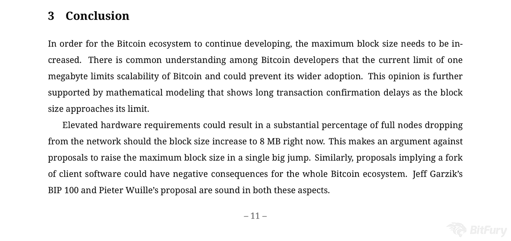

[点击此处阅读整篇文章](http://bitfury.com/content/5-white-papers-research/block-size-1.1.1.pdf)。

**2015–11–02**

赫恩发表了对矿工投票的评论:

[**关于块尺寸**](/block-chain/on-block-sizes-e047bc9f830)

赫恩帖子的一个关键部分:

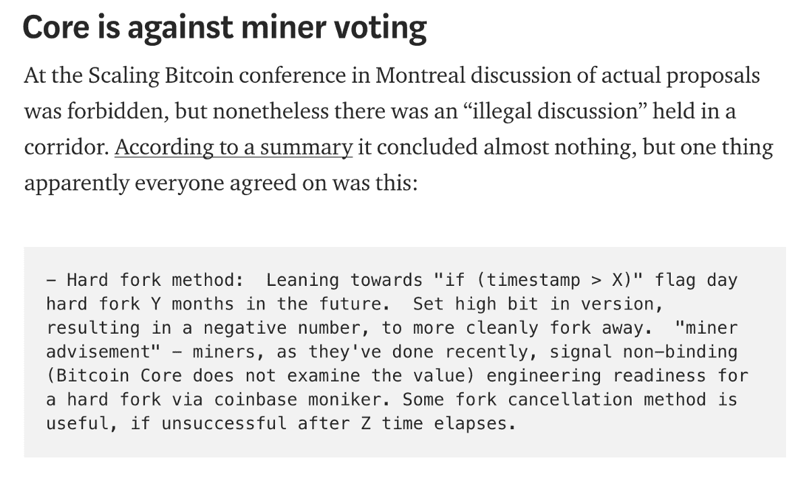

赫恩 2015 年 11 月 2 日文章的另一段摘录总结道:

*去中心化并不来自于一些模糊的开发者过程，这种过程在违背 Blockstream 的需求时会被忽略。它来自于人们被告知，然后选择与他们的信念相匹配的软件的能力。一如既往。*

**2015–12–07**

随着围绕区块大小增长的压力越来越大，比特币核心开发者发布了一系列关于缩放问题的答案:

[http://archive . is/https://bit coin . org/en/bit coin-core/capacity-increases-FAQ](http://archive.is/https://bitcoin.org/en/bitcoin-core/capacity-increases-faq)

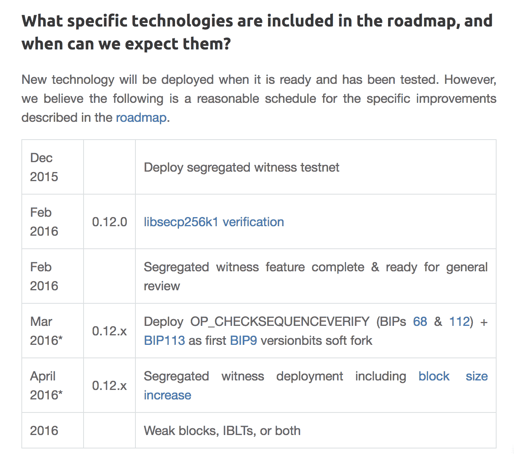

他们的路线图(如上所示)不包括任何块大小的增加，但它允许(通过 Segwit)增加“块重量”限制。在估计这对块大小意味着什么时，他们写道:

> *根据 Anthony Towns 执行的一些* [*计算*](http://lists.linuxfoundation.org/pipermail/bitcoin-dev/2015-December/011869.html) *，填充标准单签名 P2PKH 交易的块大约为 1.6MB，填充 2/2 多签名交易的块大约为 2.0MB"*

这种“块重量”的变化导致(并在 2017 年 11 月真正增加)对更多 Segwit 钱包支持的呼吁，以利用这种块重量值。Segwit 交易的费用(有时)略低，但采用速度缓慢。

也是在同一天，Gregory Maxwell 的一篇文章点击了比特币开发者用于讨论的 Linux 基金会邮件列表:

"[[比特币开发]比特币系统的容量增加](https://lists.linuxfoundation.org/pipermail/bitcoin-dev/2015-December/011865.html)。"

> *最后，从某种意义上来说，从上面增加的容量可能还不够。中继改进的交付、segwit 欺诈证据、动态块大小控制和其他技术进步将降低风险，并因此减少围绕适度块大小增加提案的争议(例如 2/4/8 重新调整以尊重 Segwit 的增加)。当改进和理解使比特币的风险相对于不部署比特币的风险被广泛接受时，比特币将能够随着这些增长而前进。*

比特币核心表示，他们正在考虑围绕其他优化增加 2MB、4MB 或 8MB 的块大小。他们在 Segwit 上的工作改变了这种讨论，seg wit 在技术上是块大小的增加(因为它隔离了见证数据并将块大小更改为“块权重”,上限为 4MB)。Segwit 在 2017 年激活后，现在用‘seg wit 是 blocksize 的增加’来回答关于 Blocksize 的调用。[阅读本更新](https://lists.linuxfoundation.org/pipermail/bitcoin-dev/2015-December/011865.html)。

**2015 年 12 月 23 日**

在每个人都不停地向比特币核心抱怨块大小增加后，他们[发布了一个大规模的解释](http://archive.is/vPFCQ)关于他们如何在不直接增加块大小的情况下解决接近扩展的问题。

2015–12–26

非常高调的支持比特币 XT:

这导致了 Bitcoin.org“选择你的钱包”页面将比特币基地除名的建议。

[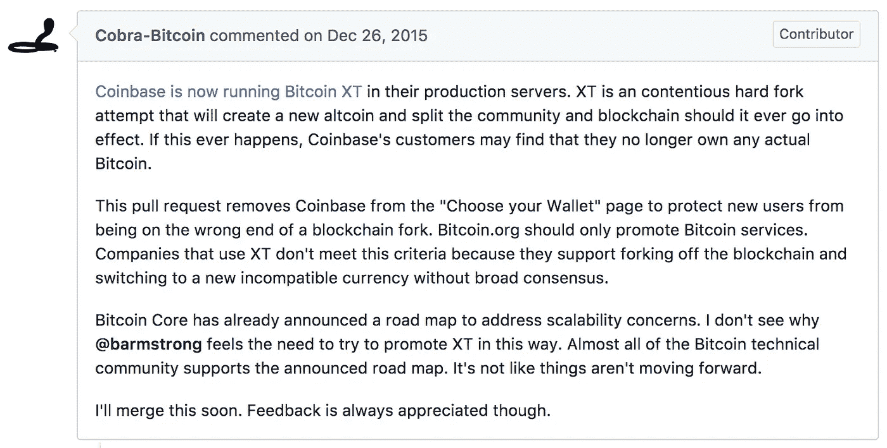](https://github.com/bitcoin-dot-org/bitcoin.org/pull/1178#issue-123957573)

Litecoin [的创造者查理·李插嘴道](https://github.com/bitcoin-dot-org/bitcoin.org/pull/1178#issuecomment-167389049)。这一天，比特币基地只支持比特币，不允许以太币或莱特币交易。

[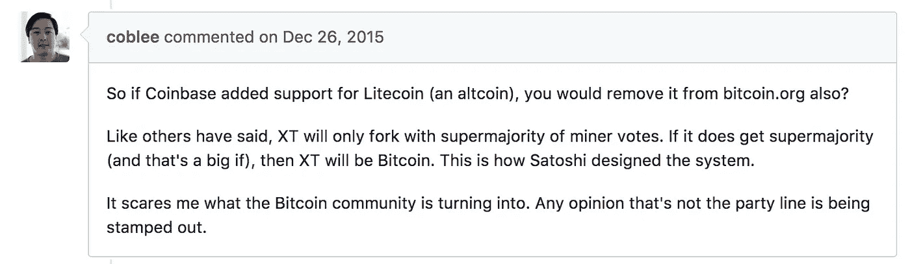](https://github.com/bitcoin-dot-org/bitcoin.org/pull/1178#issuecomment-167389049)

“党的路线”不允许讨论替代实施方案。Bitcoin.org 仓库是新用户了解比特币的一个重要地方，因此这是一件大事。

**2015 年 12 月 28 日**

一个问题“你们对比特币 XT 和 BIP101 有什么看法？”被从 r/比特币中移除，这是审查更加严厉的信号:


[via](https://archive.is/35ojq)

**2015–30–2015**

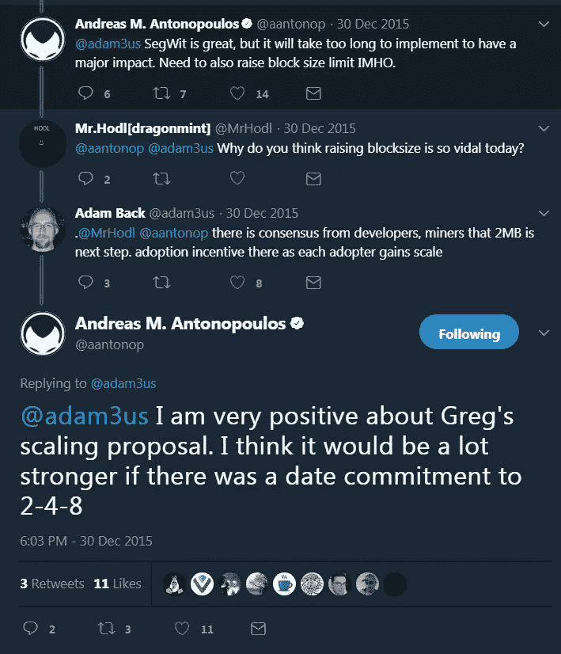

Andreas Antonopoulos 巧妙地反驳了 Segwit 将导致吞吐量显著增加的说法。Back 回复 2MB 是下一步。这相当于 Segwit2X，Back 不支持。2–4–8 参考了 Greg Maxwell 23 天前在开发者邮件列表上的[笔记，即 2MB、4MB、然后 8MB 的增加是有意义的。](https://lists.linuxfoundation.org/pipermail/bitcoin-dev/2015-December/011865.html)

**2016–01–13**

/r/比特币版主 Theymos 被抓到使用 CSS 规则隐藏帖子。

【http://archive.is/BMM9P 

同样在这一天，r/比特币版主[审查了关于比特币经典](https://www.reddit.com/r/Bitcoin/comments/40ppt9/censored_front_page_thread_about_bitcoin_classic/cyw404f/)的讨论。

**2016–01–14**

[赫恩退出比特币](https://blog.plan99.net/the-resolution-of-the-bitcoin-experiment-dabb30201f7)并特别提到比特币核心对区块大小限制的束缚:

***为什么容量限制没有提高？*** *因为区块链被中国矿工控制，仅仅其中两人就控制了哈什 50%以上的权力。在最近的一次会议上，超过 95%的哈希功能被坐在一个舞台上的少数几个人所控制*[](https://pbs.twimg.com/media/CVhkEhtUAAAl0LH.jpg)**。矿工们不允许区块链增长。**

*为什么他们不让它生长？ *几个原因。一是他们运行的“比特币核心”软件的开发者拒绝实施必要的改变。另一个原因是，矿商拒绝转向任何竞争产品，因为他们认为这样做是“不忠诚”——他们害怕做任何可能让新闻成为“分裂”并引起投资者恐慌的事情。相反，他们选择忽视这个问题，希望它消失。**

*他继续说道:*

**由此引发的内战见证了比特币基地——美国最大、最知名的比特币初创公司——*[*因选择“错误”一方而被从比特币官方网站上删除*](https://github.com/bitcoin-dot-org/bitcoin.org/pull/1178) *和* [*被禁止进入社区论坛*](https://www.reddit.com/r/Bitcoin/comments/3rejl9/coinbase_ceo_brian_armstrong_bip_101_is_the_best/cwpglh6) *。当社区中的一些人恶毒地攻击那些把数百万用户引入这种货币的人时，你知道事情已经变得非常疯狂了。**

*[**比特币实验的解析**](https://blog.plan99.net/the-resolution-of-the-bitcoin-experiment-dabb30201f7)*

*我花了 5 年多的时间成为一名比特币开发者。我写的软件已经被数百万用户使用……blog.plan99.net*

***2016–2–4***

*当雇用了几名比特币核心开发人员的 Blockstream 试图推销自己时，他们将自己的比特币协议治理作为一项资产摆在桌面上:*

****比特币核心*** *的治理，像许多其他开源项目一样，* ***是技术官僚式的，少数“核心开发者”(包括几个区块流团队成员的动态组)仔细考虑对协议*** *进行各种更改的优点，并决定如何向前推进，希望说服彼此和更广泛的行业达成共识。**

*以上引文来自:*

*[**我们在区块流的投资**](http://www.mosaicventures.com/mosaicblog/2016/2/4/our-investment-in-blockstream)*

*[*当怀疑论者在猜测比特币这种货币的消亡，并对…【www.mosaicventures.com】T42*](http://www.mosaicventures.com/mosaicblog/2016/2/4/our-investment-in-blockstream)的可行性产生怀疑的时候*

***2016–01–16***

*比特币经典支持达到 49%。*

*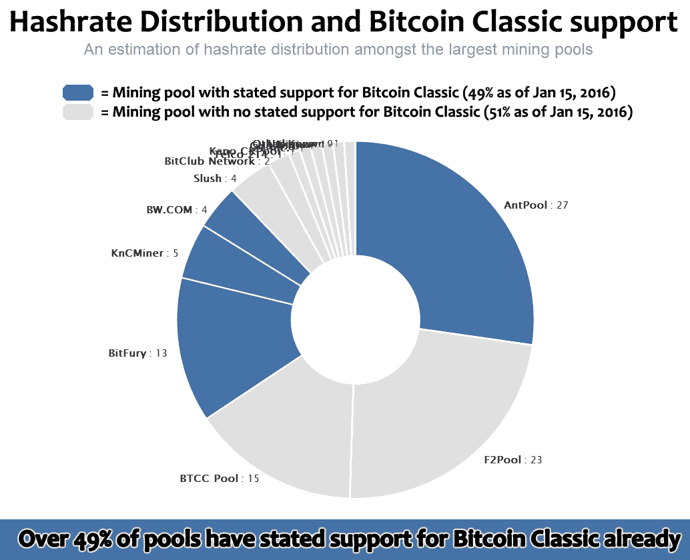*

*[通过](https://www.reddit.com/r/btc/comments/414qxh/49_of_bitcoin_mining_pools_support_bitcoin/cz0ceao/)*

***2016–01–17***

*Blockstream 首席执行官奥斯汀·希尔[声称硬分叉导致资金损失](https://www.reddit.com/r/btc/comments/41c8n5/as_core_blockstream_collapses_and_classic_gains/)。*

***2016–1–31***

*[比特币 XT](https://en.wikipedia.org/wiki/Bitcoin_XT#cite_ref-cdns_13-0) 节点陡然崩溃:*

*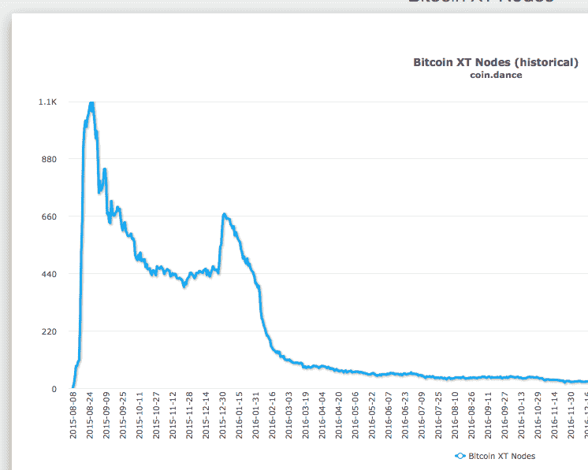*

***2016–1–16***

*Blockstream 的首席技术官兼比特币核心开发者[的撰稿人格雷格·麦克斯韦尔(Greg Maxwell)发布了以下](https://botbot.me/freenode/bitcoin-wizards/2016-01-17/?msg=58099943&page=1)，以回应#比特币巫师 IRC 频道中关于费用压力的问题:*

> *格雷格:*满矿块没什么问题，而且相对于 _ 年来矿工们的产量来说，这些矿块已经“满”了。满块是系统的自然状态:对零价格的外部成本高度复制的外部存储的需求实际上是无限的。* bsm117532: *你是否在论证“费用压力好”因而小块和零增长是可取的？* Greg: *费用压力是系统设计的一个有意组成部分，就目前的理解而言，对系统的长期生存至关重要。所以，呃，是的。挺好的。**

***2016–01–17***

*Paul Vigna 在*华尔街日报*讨论了 XT 的消亡和比特币经典的崛起:*

*“ [*比特币正在分手*](http://archive.is/lK24o) ？”*

> *XT 的支持者和原版(现在叫做 Core)之间的斗争已经很难看了。它在 Reddit 和社交媒体上肆虐，用户被从留言板上扔下来，还有对用户和公司的匿名网络攻击。XT 开始时表现强劲，但还没有达成改变的共识。*

**…**

> **然而另一个提议，这个被称为* ***的比特币经典，已经从 XT/Core 争论的灰烬中浮出水面。这是比特币的一个版本，允许两兆字节的限制，随着时间的推移，规则将提高这一限制。它似乎正在迅速赢得支持。****
> 
> *投资比特币的风险投资公司 Union Square Ventures 的弗雷德·威尔森(Fred Wilson)*在一篇哲学博客中写道:“有时需要一场危机才能让所有人都聚在一起。”“街区规模的争论可能就是这样解决的。”**

***2016 年 2 月***

*康乃尔的 IC3 集团，加密货币和合同的倡议者，发布了“关于扩展分散的区块链”[pdf](http://www.initc3.org/files/Scaling2016.pdf)，这是一份基于传播时间和带宽速度建议块大小限制为 4MB 的立场文件:*

*[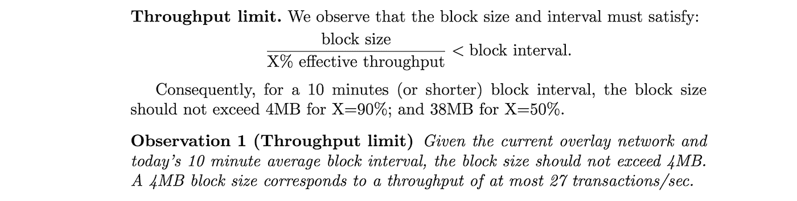](http://www.initc3.org/files/Scaling2016.pdf)

Paper by Kyle Croman, Christian Decker, Ittay Eyal, Adem Efe Gencer, Ari Juels, Ahmed Kosba, Andrew, Prateek Saxena, Elaine Shi, Emin Gün Sirer, Dawn, and Roger Wattenhofer Published in **Financial Cryptography and Data Security*** 

*4MB 的限制听起来可能很熟悉。这也是在 Segwit 激活的情况下，今天(截至 2017 年 11 月)比特币的块重量限制。以今天比特币块中实际可用的数据来看，不包括 coinbase 交易，这个数字是 3999280 字节[ [ref](https://bitcoin.stackexchange.com/questions/54948/after-segwit-activation-what-is-the-largest-block-size-possible/54949#54949) ]。*

***2017 年 11 月 16 日:**下图违背了时间线，但对上下文很重要。大约 10%的 Segwit 事务的实际平均块大小不会超过 1.1 MB。seg wit 作为扩展解决方案的支持者声称，随着高采用率，平均块大小将接近 2MB。*

*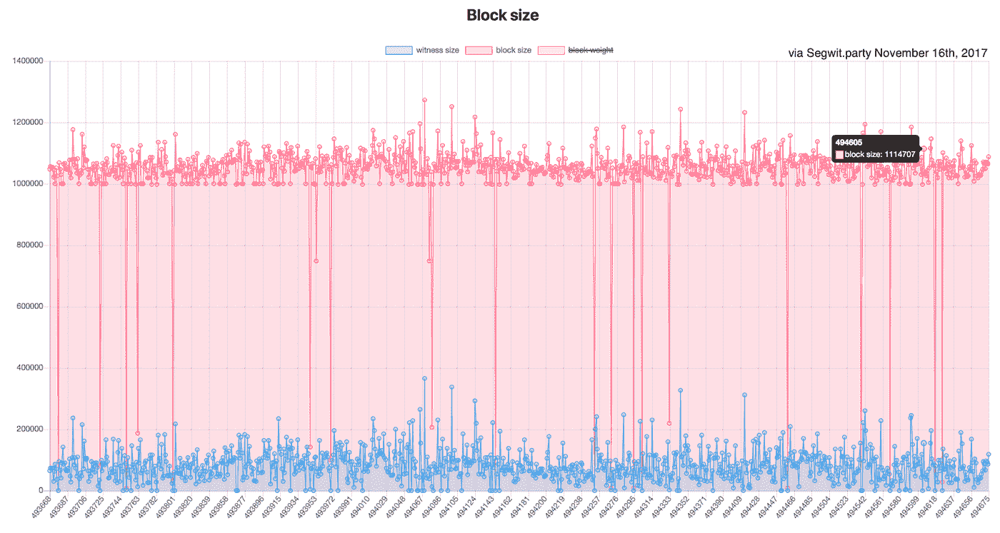*

*via Segwit.party*

***2016–02–10***

*比特币经典版发布，在 75%的矿工支持下，将上限从 1MB 提高到 2MB。*

*Vigna 再次为《华尔街日报》撰写了关于 Classic / XT 的文章:*

> **比特币经典已经从* [*XT*](https://en.wikipedia.org/wiki/Bitcoin_XT) *与核心争论的灰烬中浮出水面。这是比特币的一个版本，允许两兆字节的限制。它似乎正在迅速赢得支持。**

**大约在这个时候，*我跑了比特币经典版，感觉像是一个全新的开始。在漫长的隧道尽头看到这短暂的亮光是令人难过的。*

***2016–02–11***

*比特币圆桌会议发布了一篇题为“[呼吁共识](/@bitcoinroundtable/a-call-for-consensus-d96d5560d8d6)”的 pr-block 大小增加文章。*

*[*在过去的几个月里，比特币生态系统内外都在关注什么是……*medium.com](/@bitcoinroundtable/a-call-for-consensus-d96d5560d8d6)*

*比特币圆桌会议代表了比特币企业、交易所、钱包、矿工和矿池的大规模集合。他们特别提到了五个职位。提出三个要求，要求核心开发人员创建一个增加块大小的路线图:*

**3。在接下来的 3 周内，我们需要比特币核心开发者与我们合作，阐明未来硬分叉的路线图，包括增加区块大小。目前，我们正在讨论确定下一步的最佳步骤。作为一个原则问题，我们反对不适当的仓促或有争议的硬分叉，不管团队提议，我们不会在生产系统上运行这样的代码，也不会从硬分叉中挖掘任何块。我们敦促每个人理性行事，推迟做出运行有争议的硬分叉(Classic/XT 或任何其他)的任何决定。**

*在这一天，矿工对比特币经典版的支持达到了 75%。上述信件的签名者代表了比特币 90%的哈希能力，这基本上意味着，如果 Core 能够提出一个争议较小的硬分叉选项，他们准备放弃比特币 Classic。*

*[那个帖子](/@flix1/so-90-of-hashpower-has-signed-this-and-bitcoinclassic-com-2ebc1545e2e5)上的评论值得一读，感受一下当下。*

*回想起来，这是辩论中的一个挫折时刻:比特币核心开发者看到了一个机会，通过向中国矿商承诺增加区块大小，来维持他们对参考客户的控制。为了不扰乱比特币核心，不冒出现硬分叉的风险，矿工们投降了，坚持使用核心，尽管 Classic 每天都在赢得越来越多的支持，矿工们也很喜欢它。*

***2016–02–20***

*“比特币圆桌会议”发布了引入 Segwit 和 2MB 硬分叉的计划，该计划是在香港的一次会议上达成的:*

*[*2016 年 2 月 21 日，香港数码港，比特币行业代表和……*medium.com](/@bitcoinroundtable/bitcoin-roundtable-consensus-266d475a61ff)成员*

*该计划甚至包括一个时间表:*

**SegWit 预计于 2016 年 4 月发布。**

**因此，hard-fork 的代码将于 2016 年 7 月发布。**

**如果有强大的社区支持，hard-fork 激活可能会在 2017 年 7 月左右发生。**

*签署者之一是:*

> **亚当回来了**
> 
> **总裁**
> 
> ***T21 封锁消息***

*2016 年 7 月没有出现硬分叉。Back 曾经是 Segwit2x 硬分叉最强烈的反对者之一，然而上面的文档本质上是完全相同的硬分叉提议。在 2017 年 8 月 2 日比特币现金发布的第二天，情况才变得明朗起来，Back 认为“市场”同意 2MB 的硬分叉不值得做，因为块大小的增加已经“分叉”了:*

*[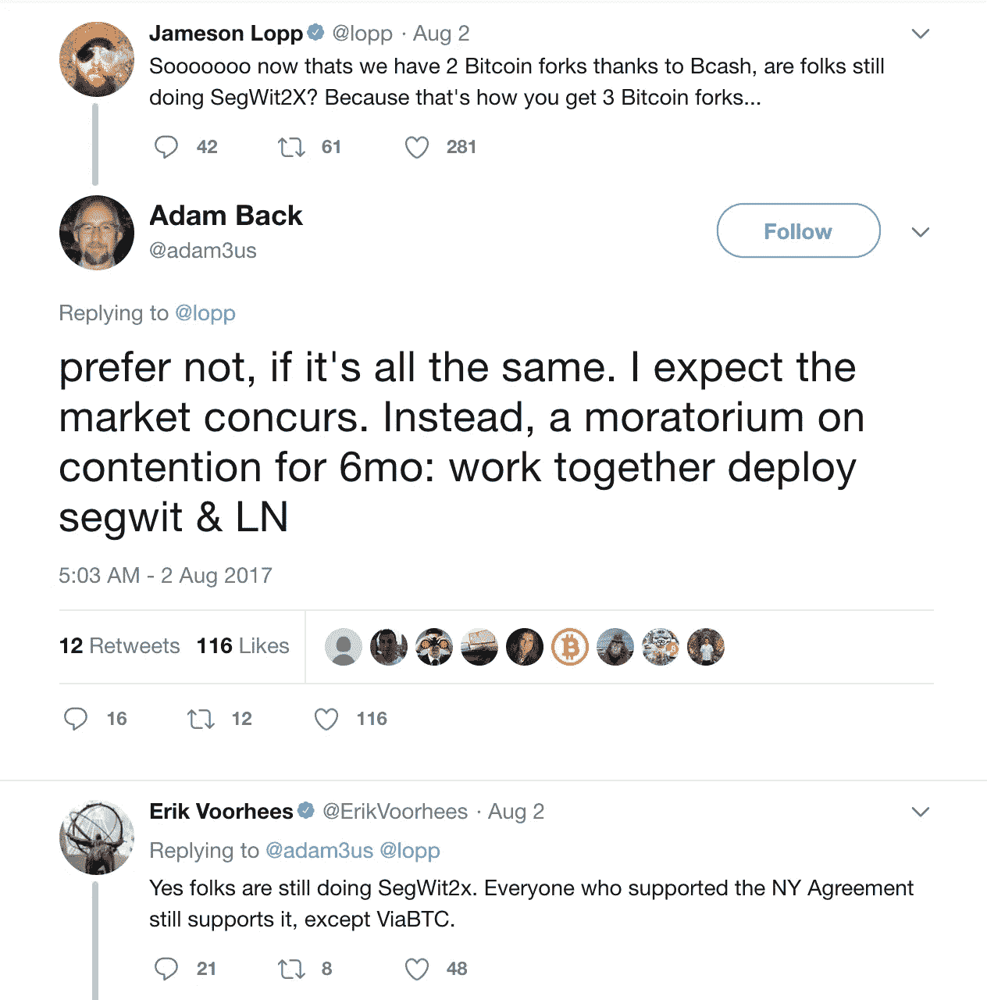](https://twitter.com/adam3us/status/892717561275666434)*

*via:[https://twitter.com/adam3us/status/892717561275666434](https://twitter.com/adam3us/status/892717561275666434)*

*更多关于 Back 倒戈反对他签署的协议的信息，请看下面这篇文章: [**亚当·Back 强烈主张反对他自己签署的协议**](http://www.trustnodes.com/2017/09/28/adam-back-strongly-advocates-agreement-signed)*

*它包括这张泄露的图片:*

*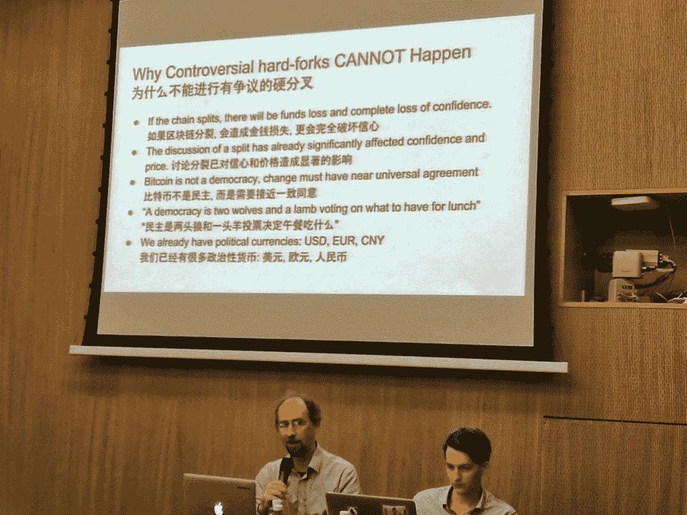*

*这张图片显示，反对 Back 的观众硬叉子的一个关键点是:“民主是两只狼和一只羊投票决定午餐吃什么。”*

*仅供参考，你已经过了时间线的一半了。谢谢你坚持下去。需要的话休息一下。*

***2016 年 2 月 23 日***

*Slush Pool(当时占比特币散列能力的 5%)标志着对比特币经典的支持。实际激活阈值是最后 1000 个块中的 750 个，如果在 2018 年 1 月 1 日之前没有达到该数字，将被取消。*

*[**Slush Pool 确认支持比特币经典**](https://themerkle.com/slush-pool-confirms-support-for-bitcoin-classic/)*

*[*越来越多的矿池开始支持比特币经典解决方案，因为每个人都想得出解决方案……*themerkle.com](https://themerkle.com/slush-pool-confirms-support-for-bitcoin-classic/)*

***2016–03–04***

*在“报道”比特币经典的一个例子中，比特币核心贡献者彼得·托德(Peter Todd)被问及比特币经典，但比特币经典的创造者却杳无音信:*

*[**比特币经典与比特币核心的四大关键分歧——比特币杂志**](https://bitcoinmagazine.com/articles/four-key-disagreements-between-bitcoin-classic-and-bitcoin-core-four-key-disagreements-between-bitcoin-classic-and-bitcoin-core-four-key-disagreements-between-bitcoin-classic-and-bitcoin-core-1457106744/)*

*[bitcoinmagazine.comT21](https://bitcoinmagazine.com/articles/four-key-disagreements-between-bitcoin-classic-and-bitcoin-core-four-key-disagreements-between-bitcoin-classic-and-bitcoin-core-four-key-disagreements-between-bitcoin-classic-and-bitcoin-core-1457106744/)比特币核心撰稿人彼得·托德近日在《比特币游戏》第 34 集接受采访*

*托德说:*

*我认为真正的区别在于比特币的核心开发者——他们明白这些权衡将会发生，至少在目前的技术下——愿意将这些权衡放在不同的地方。我更希望比特币区块链层——最底层——保持高度去中心化。直接使用可能会变得更加昂贵，但是您可以通过将不可避免的集中化放在更高的级别来平衡这一点。*

***2016–03–05***

*比特币基地首席执行官 Brian Armstrong 发表了博文“ [**在 Satoshi 圆桌会议上发生了什么”。**](https://blog.coinbase.com/what-happened-at-the-satoshi-roundtable-6c11a10d8cdf)*

*上周末，我和 blog.coinbase.com 的查理·李以及大约 70 名其他成员一起参加了“聪智圆桌会议”*

*在香港的 Satoshi 圆桌会议上，阿姆斯特朗对缺乏链上扩展的承诺感到沮丧，他对社区的头号建议是在比特币经典下硬分叉到 2MB。他对比特币核心开发者有一种悲伤但贴切的理解:*

**尽管 core 说他们可以硬分支到 2MB(他们在自己的路线图上有，只是在很远的将来)，他们拒绝优先考虑它。他们宁愿保留一些现在可以帮助网络的东西，因为他们不相信社区在未来会做出明智的决定。他们认为自己是网络的中心策划者和人民的保护者。他们似乎可以看着比特币失败，只要他们不在原则上妥协。**

*他的建议是:*

**第一步是我们需要立即升级到 2MB 块。这是最现实的短期扩展解决方案，可以为我们赢得时间。我认为，我们要么现在就进行升级(当每个人都有足够的准备时间时)，要么在将来遇到紧急情况时进行升级。这不是是否的问题，而是何时的问题。* [*已有代码，今天*](https://github.com/bitcoinclassic/bitcoinclassic/releases/tag/v0.11.2.cl1) *完成。代码质量很高，由前核心开发人员编写，已经在许多比特币公司(包括比特币基地)的生产中运行。升级到比特币经典版并不意味着我们需要永远留在经典版团队，这只是目前减轻风险的最佳选择。未来我们可以使用任何团队的代码。**

*他还解释了他是如何看待中国矿工被操纵的:*

*我们需要就这一升级途径与中国矿商沟通。他们被误导，认为世界上只有 4-5 个人可以安全地使用比特币协议，而事实上正是这个群体给他们的业务带来了最大的风险。*

***2016–3–19***

*比特币经典节点的峰值为 2.3K，在 2016 年 5 月 26 日左右出现了最后一次欢呼。*

*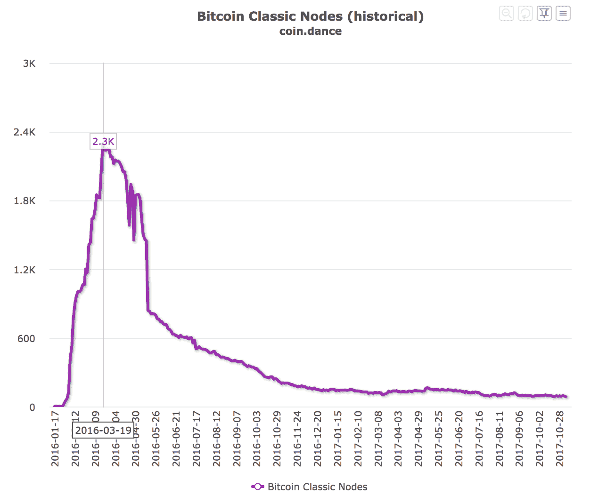*

***2016–6–8***

*[猎鹰网络](http://www.falcon-net.org)私下内测软启动，以更快地中继街区。矿工直接连接到网络以更快地接收数据块:*

> *Falcon 是一种新型的快速中继网络，用于传播比特币区块。它使用一种新颖的技术来连接矿工和完整节点并运送区块，以减少孤儿，这反过来帮助矿工获得最大的努力，并帮助网络有效地将消耗的能量转化为安全性。最终，猎鹰帮助比特币扩大规模。*

*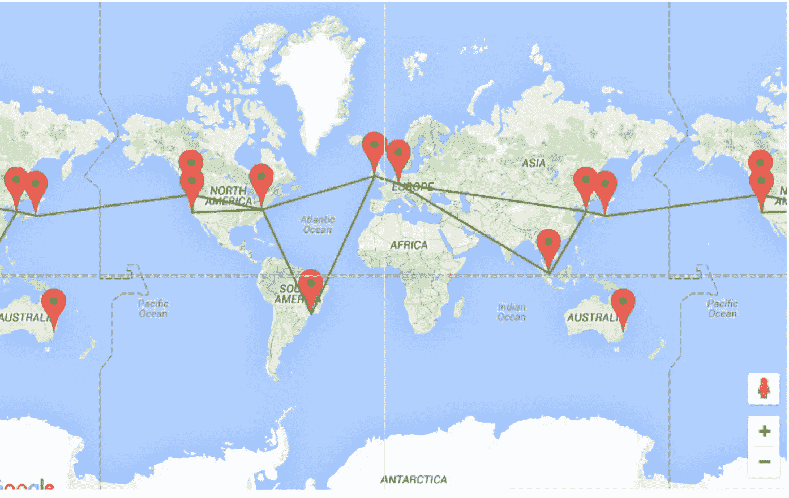*

***2016–06–15***

*Coinapult 的创始人埃里克·沃尔赫斯(Erik Voorhees)在推特上发布了关于块大小和平均交易费用的消息:*

***2016–7–7***

*Matt Corallo 发布了光纤网络，这是一种在解决数据块时更快接收数据块的方法:*

***2016–07–28***

*用户 GhostOfPermabullPast 在 r/btc 上发帖讲述“区块流阴谋”，求证背后:[有没有一个来源详细地 exolains(原文如此)了整个区块流阴谋假说？](https://www.reddit.com/r/btc/comments/4v26v9/is_there_a_source_that_explains_the_whole/d5uxi5r/)*

*现在，我不想过多谈论关于 Blockstream 的“阴谋”帖子。有好几百个。我对 Blockstream 是否是一个邪恶的大公司没有特别的看法——我实际上发现对 Blockstream 及其员工的痴迷非常有趣。一个没有中央核心的社群，对任何一个中央集权的团体，公司，或者封闭的社群都是以怀疑的眼光看待的。*

*用户 higgletypiggletypop(是的，我知道这些用户名很棒)提供了以下内容:*

> *我不确定这是否真的是一个应用常识的“阴谋论”，但推理是这样的:*
> 
> *Blockstream 是一家盈利性公司。(事实)*
> 
> *Blockstream 的一个主要目标 Blockstream 的目标，像所有盈利性公司一样，就是赚钱。(几乎可以肯定是事实)*
> 
> *Blockstream 雇佣了许多核心开发人员。(事实)*
> 
> *Blockstream 的一切都是关于侧链的(来源:[https://blockstream.com/fact-sheet/](https://blockstream.com/fact-sheet/))，因此 Blockstream 的赚钱计划很可能围绕着侧链。*
> 
> *当主链不能满足交易需求时，就需要侧链。*
> 
> *因此，Blockstream 的兴趣在于进入一个需要侧链的世界。*
> 
> *Blockstream 雇佣了许多核心开发人员，根据其兴趣指导比特币的发展——这使得块大小保持较低，以便许多交易被推送到侧链上。*
> 
> *Blockstream 的小块利益可能与比特币生态系统中最希望看到比特币健康发展的许多成员不一致。*
> 
> *现在，我是否认为 Blockstream 的成员对自己说“我们必须坚持使用小块，比特币的未来该死，因为否则我们永远不会赚钱？”我不知道，但我确实认为他们已经彻底说服自己，小街区是正义的唯一道路，而这恰好符合他们的企业利益。换句话说，当问及为什么 Blockstream/core 的成员似乎不能诚实地参与增加块大小的争论时，这句话适用于:“很难让一个人理解某些事情，当他的工资取决于他不理解它时！”(厄普顿·辛克莱)。*
> 
> *这些都不是疯狂的阴谋论。真正的阴谋论是 Blockstream 正积极试图扼杀比特币。我不相信。*

*2016–10–31*

*约翰·布洛克(John Blocke)发表了文章“ [**不会有比特币分裂”**](/@johnblocke/there-will-be-no-bitcoin-split-564f1d60a657) ，他们在其中讨论了硬分叉的影响。*

*[*两篇文章中的第一篇。第二部分可以在这里找到。*medium.com](/@johnblocke/there-will-be-no-bitcoin-split-564f1d60a657)*

*2016–11–13*

*约翰·布洛克(John Blocke)发表了“ [**”一篇关于/r/比特币**](/@johnblocke/a-brief-and-incomplete-history-of-censorship-in-r-bitcoin-c85a290fe43) 审查的(简短且不完整的)历史，来解释/r/比特币 subreddit 上的审查实际上是如何发生的。这个帖子实际上是对审查和块大小辩论之间关系的一个很好的介绍，以及如何基于可疑的规则禁止硬叉子的讨论。*

*2016–11–23*

*中国姜敏儿卓尔发表文章“ [**为什么一定要反对 Core 的 Segwit 软叉，比特币姜敏儿卓尔告诉你为什么！”**](/@zhangsanbtc/why-we-must-oppose-cores-segwit-soft-fork-bitcoin-miner-jiang-zhuo-er-tells-you-why-28f820d51f98) 反驳比特币核心实现 Segwit。*

*[*蒋卓尔译自原著。*medium.com](/@zhangsanbtc/why-we-must-oppose-cores-segwit-soft-fork-bitcoin-miner-jiang-zhuo-er-tells-you-why-28f820d51f98)*

*2016 年 11 月从*

*“我不是 pro classic，也不是 pro core。在接下来的一年半时间里，我们将做隔离证人*

*2016–12–03*

*Tobes 发表了文章“ [**核心/区块流的动机”**](/@tobesdoe/the-motivation-of-core-blockstream-8ddc44bf8ca3) 讨论了，你猜对了，比特币核心和区块流的可能动机以及它们的交集在哪里。*

*[*我关注区块大小的争论已经很久了。和许多其他人一样，我觉得这个问题已经争论太久了……*medium.com](/@tobesdoe/the-motivation-of-core-blockstream-8ddc44bf8ca3)*

*2016–12–21*

*Jaqen Hash'ghar 发表了文章《 [**隔离见证:一把太远的叉子**](/the-publius-letters/segregated-witness-a-fork-too-far-87d6e57a4179) 》分析了隔离见证作为软叉子的潜在影响。*

*[https://medium . com/the-pub lius-letters/segregated-witness-a-fork-too-far-87 d6e 57 a 4179](/the-publius-letters/gregated-w,tness-a-fork-too-far-87d6e57a4179)*

*2017–01–28*

*Luke Dashjr(核心开发者)发表了一份[比特币改进建议](https://github.com/luke-jr/bips/blob/bip-blksize/bip-blksize.mediawiki#Rationale)将区块大小降低到 300KB，并慢慢提高，在 2024 年达到目前的 1MB 大小。在香港协议之后，他的任务是实施硬分叉代码，将限制提高到 2MB，但相反，他后退了几步，提出了一个从低开始，到 2024 年达到 1MB 限制的建议。他[把这个通知](https://lists.linuxfoundation.org/pipermail/bitcoin-dev/2017-January/013496.html)贴在了开发者邮件列表上。*

*他的通知建议实施一系列块大小步骤，大约每 97 天一次，到 2045 年 4 月结束时略低于 31MB。每一步都会使最大数据块大小增加 4.4%，从而允许每年 17.7%的总体增长率。激活时的初始大小限制将取决于它何时被激活:例如，如果在 2018 年 1 月，它将从大约 356K 开始；如果在 2024 年 6 月，它将从 1MB 多一点开始。*

*这让邮件列表中的许多人感到困惑，他的提议没有引起太多的兴趣或讨论。这是香港会议产生的唯一扩展提议吗？很明显，比特币核心想要 Segwit，他们只有在矿工的支持下才能得到它。*

*回来后，Blockstream 的首席执行官去中国与矿工会面，他告诉他们，他代表比特币核心。他们同意在 Segwit 旁边实现一个 2MB 的硬 fork。他(或某人)决定处理的人是 LukeJR。两个人不会同时做同一件事。众所周知，他“负责”为其编写代码。这根本不是虚假的陈述，这是对已经发生的事实的客观观察。*

*下面的 Reddit 线程[有关于这个事件的细节](https://np.reddit.com/r/Bitcoin/comments/5qo9ie/miners_please_state_your_positions_regarding/)。下面摘录一段:*

*[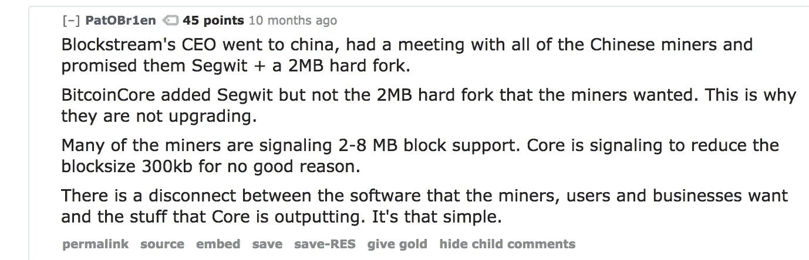](https://np.reddit.com/r/Bitcoin/comments/5qo9ie/miners_please_state_your_positions_regarding/dd0w2cq/)

[https://np.reddit.com/r/Bitcoin/comments/5qo9ie/miners_please_state_your_positions_regarding/dd0w2cq/](https://np.reddit.com/r/Bitcoin/comments/5qo9ie/miners_please_state_your_positions_regarding/dd0w2cq/)* 

*8btc 上的一个问答有一些[有趣的](http://8btc.com/forum.php?mod=redirect&goto=findpost&ptid=29594&pid=377391)(翻译)问题:*

*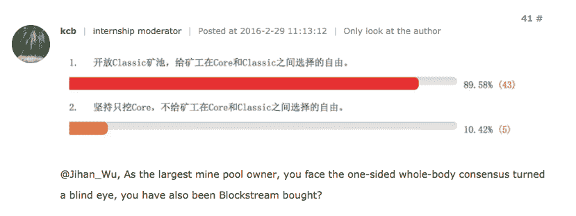*

*“块流购买”确实。在上面的投票中，你可以看到“经典”版本获得了 42 票，而“核心”获得了 5 票。*

***2017–02–10***

*#dragonsden 在布拉姆·科恩的一次演讲中公之于众(在 [14m:26s](https://youtu.be/aYG0NxoG7yw?t=14m25s) )，为阴谋之火提供了更多的燃料:*

*一篇名为“[龙穴内部:比特币核心的巨魔军](http://telegra.ph/Inside-the-Dragons-Den-Bitcoin-Cores-Troll-Army-04-07)”的帖子试图解释这一点。其中一个关键部分是渠道成员:*

> *…根据上面惊鸿一瞥频道的信息有:bash co(/r/比特币版主)、mrhodl(推特巨魔)、alp(推特巨魔)、moli(未知)、belcher (JoinMarket 开发者)、BtcDrak(比特币核心开发者/活跃分子)和布拉姆·科恩。这七名成员占渠道成员总数的三分之一。*

*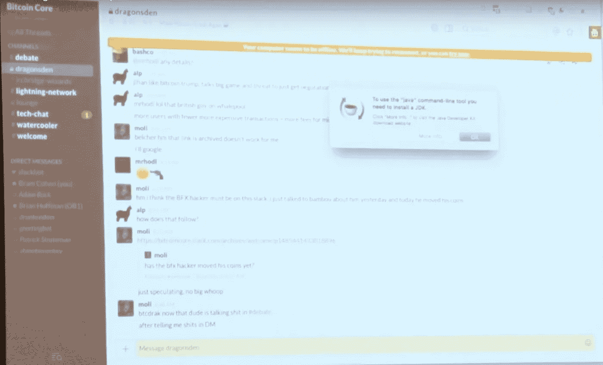*

***2017–02–12***

*steemit.com 的用户“adambalm”发布了 Blockstream 和投资者对比特币的目标之间的一些金融联系:*

*[](https://steemit.com/bitcoin/@adambalm/the-truth-about-who-is-behind-blockstream-and-segwit-as-the-saying-goes-follow-the-money) [## Blockstream 和 Segwit 幕后黑手的真相。俗话说跟着钱走。…

### 大到不能倒的保险巨头安盛是 Blockstream 的主要所有者之一，他们正在四处抛掷...由…

steemit.com](https://steemit.com/bitcoin/@adambalm/the-truth-about-who-is-behind-blockstream-and-segwit-as-the-saying-goes-follow-the-money) 

开发人员[在受雇于 Blockstream 后不再支持 block size scaling](https://np.reddit.com/r/btc/comments/4mlo0z/greg_maxwell_used_to_have_intelligent_nuanced/d3whpu9/),这种想法已经重复了多年。

**2017–2–15**

Adem Efe Gencer 和 Emin Gün Sirer 通过他们在康奈尔大学设计的一项研究，研究了比特币节点的带宽、延迟和陈旧性。通过测量节点，该团队发现一年内带宽增加了 1.7 倍:

> 节点的供应带宽在确定系统参数(如最大块大小)方面起着关键作用。供应带宽的增加表明，对于那些对比特币去年表现出的去中心化水平感到满意的人来说，现在可以将数据块扩大 1.7 倍，而不会影响他们对集中化的担忧，前提是这些测量可以捕捉到网络的状态。

反对较大数据块大小的一个常见论点是，由于带宽限制，大数据块会减少网络中的节点。

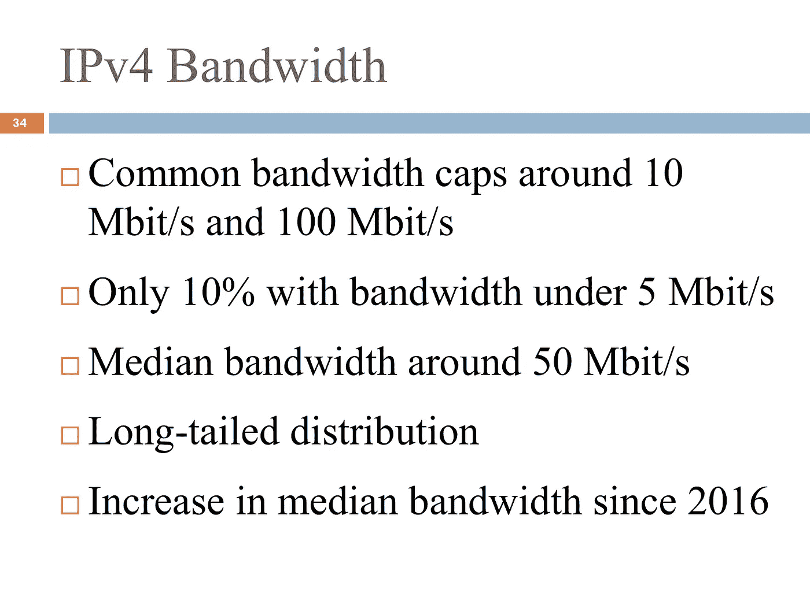

via [https://cyber.stanford.edu/sites/default/files/efegencer.pdf](https://cyber.stanford.edu/sites/default/files/efegencer.pdf)

**2017–02–26**

在一个新手提问的“文字墙”回复中，一个关于比特币在社会、政治、经济和信息流方面所处位置的最史诗般的解释以 reddit 评论的形式出现。这是理解这场辩论的必读书。这里有一个片段:

*Blockstream 及其员工开始通过支付关于比特币规模的会议来游说社区，但有一个非常非常奇怪的规则，即不能做出任何决定，也不能提出任何完整的解决方案。这些会议很可能是战略性地(并且成功地)创建的，目的是通过迫使社区采取“让我们等着看会议会带来什么”的方式来宣传对 Gavin 和 Mike 发布的扩展软件的支持。由于在这些会议上没有达成最终解决办法，它们只会阻碍和分裂社区寻求解决办法的努力。随着加文和迈克发布的名为 BitcoinXT 的软件获得支持，它开始受到攻击。该软件的用户受到了 DDOS 攻击。Blockstream 的员工建议攻击该软件，例如假装支持它，然后在最后一刻放弃支持，使网络陷入混乱。Blockstream 的员工也公开谈论从各种不同的角度起诉 Gavin 和 Mike，只是因为他们发布了这个没有人被迫运行的开源软件。由于比特币社区的许多成员对待他的方式，迈克·赫恩最终决定离开。*

**2017–02–27**

约翰·布洛克(John Blocke)发表文章**[**/r/比特币审查制度，重访**](/@johnblocke/r-bitcoin-censorship-revisited-58d5b1bdcd64) 再次强调了 r/比特币 subreddit 内部的审查制度。**

**[*注意:这篇文章是我原文章的后续，是关于/r…*medium.com](/@johnblocke/r-bitcoin-censorship-revisited-58d5b1bdcd64)的审查历史(简短且不完整)**

****2017–03–28****

**当被问及他对 2MB plus Segwit 的提议时， [Luke DashJR 回复](https://archive.is/2voL3)说，在与“社区”讨论后，这个提议被否决了**

**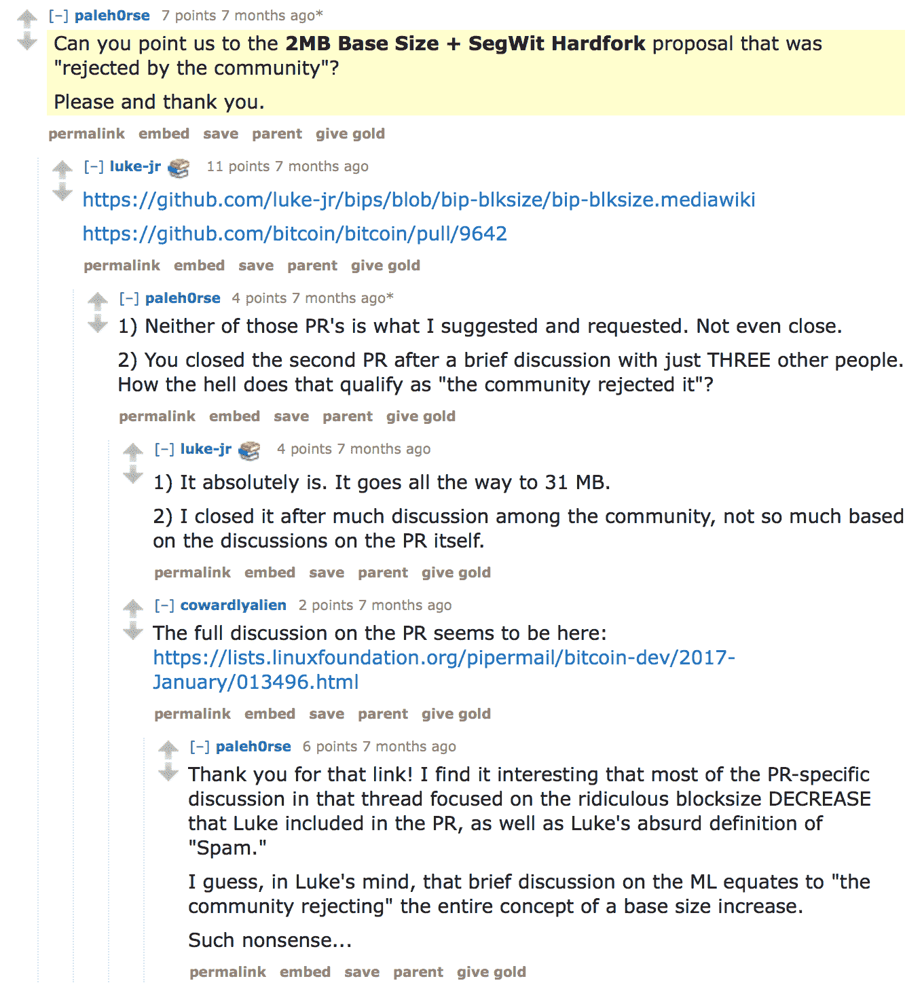**

**此拉取请求设置失败了吗？或者建立共识真的不是 Core 的强项？阅读下面关于此拉取请求的评论:**

**[【比特币开发】三个与 hardfork 相关的 bip](https://lists.linuxfoundation.org/pipermail/bitcoin-dev/2017-January/013496.html)作者*卢克·达什 jr***

**请注意，这是“硬分叉研究”页面中列出的唯一一个涉及块大小增加的硬分叉提案:[https://bitcoinhardforkresearch . github . io](https://bitcoinhardforkresearch.github.io)**

****2017–3–31****

**Segwit 2MB 提案诞生于香港协议(2017 年 2 月)的灰烬中，该提案包括 Segwit 软分叉和通过硬分叉增加 2MB 的承诺:**

**[**【比特币-dev】segwit 2mb—软硬结合叉—征求意见**](https://lists.linuxfoundation.org/pipermail/bitcoin-dev/2017-March/013921.html)**

**[*大家好，Segwit2Mb 是将比特币合并的项目，是旨在解决当前冲突的最小补丁…*lists.linuxfoundation.org](https://lists.linuxfoundation.org/pipermail/bitcoin-dev/2017-March/013921.html)**

****2017–04–06****

**ASICBoost 争议由此诞生。比特币工作证明算法的潜在漏洞(Segwit 无法实现)，通过软分叉实现:**

**[**ASICBoost，比特大陆封杀 Segwit 的原因。**](/@WhalePanda/asicboost-the-reason-why-bitmain-blocked-segwit-901fd346ee9f)**

**2017–04–08**

**尼克·萨博在推特上谈论了这场辩论背后的政治:**

**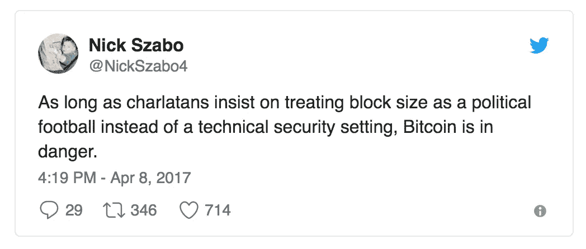**

****2017–04–18****

**ViaBTC(比特币矿工)发表了文章“ [**为什么我们不支持 SegWit**](/@ViaBTC/why-we-dont-support-segwit-91d44475cc18) ”，并详细介绍了 SegWit 的技术债务，以及开发团队多样性的需求:**

**[*赛格威特没有解决最紧迫的产能问题*medium.com](/@ViaBTC/why-we-dont-support-segwit-91d44475cc18)**

> **作为比特币的实现参考，比特币核心在社区中具有重大影响。然而，他们的影响力早已被他们的行为高估了。通过滥用他们以前的影响力，他们已经阻止了比特币块大小的增加，违背了社区的意愿。Core team 在某些情况下明确支持审查比特币的主流论坛，同时禁止许多与 Core 当前路线图有不同意见的知名开发者、企业和社区成员。如今，比特币急需多元化的 dev 团队和实现，实现比特币开发的去中心化。**

**2017–4–23/25**

**数字货币集团在 Consensus 2017 发表文章《 [**比特币缩放协议》。**](/@DCGco/bitcoin-scaling-agreement-at-consensus-2017-133521fe9a77)**

**这被称为“纽约协议”,并催生了 Segwit2x 实施计划，以跟进比特币网络的升级:**

> **在 80%阈值时激活隔离见证，在第 4 位发出信号**
> 
> **在六个月内激活 2 MB 硬分叉**

**该提案的签署者包括:**

> **这组签约公司代表了比特币生态系统的一个临界质量。截至 5 月 25 日，该团体代表:**
> 
> **分布在 22 个国家的 58 家公司**
> 
> **散列能力的 83.28%**
> 
> **连锁交易量每月 51 亿美元**
> 
> **2050 万个比特币钱包**

**这一提议的反对者称之为由少数个人决定的对比特币的“企业收购”。**

****2017–05–01****

**瑞典海盗党创始人 Rick Falkvinge 发表了博客文章“ [**Blockstream 在 Segwit 中拥有专利，使得过去三年的所有怪异片段都完美地融入了**](https://falkvinge.net/2017/05/01/blockstream-patents-segwit-makes-pieces-fall-place/) ”。**

****2017–05–14****

**Jonald Fyookball 发表文章《 [**致比特币矿工的公开信**](https://keepingstock.net/an-open-letter-to-bitcoin-miners-c260467e1f0) 》。**

****2017–5–2****

**回来，Blockstream 的首席执行官[在 Twitter DM 中建议](https://twitter.com/Satoshi_N_/status/859406615912615937?ref_src=twsrc%5Etfw&ref_url=https%3A%2F%2Fmedium.com%2Fmedia%2Ff18fc4a12313d52de98747e8c6b401c5%3FpostId%3D8874363de28d)冻结比特币的“基础层”:**

**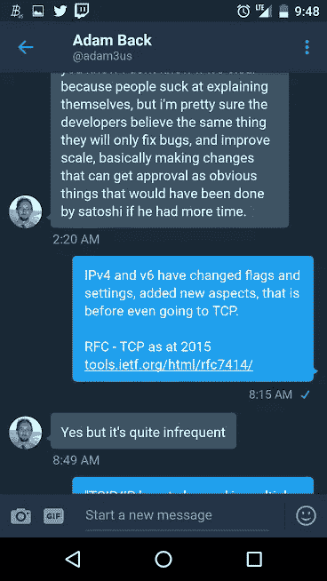****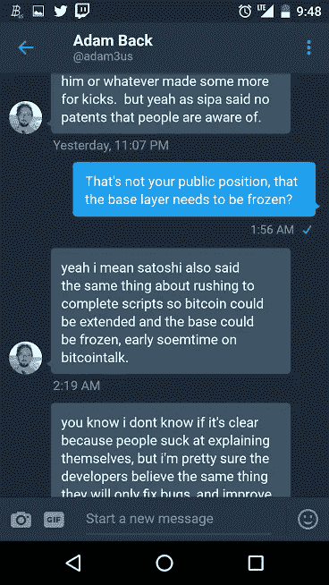****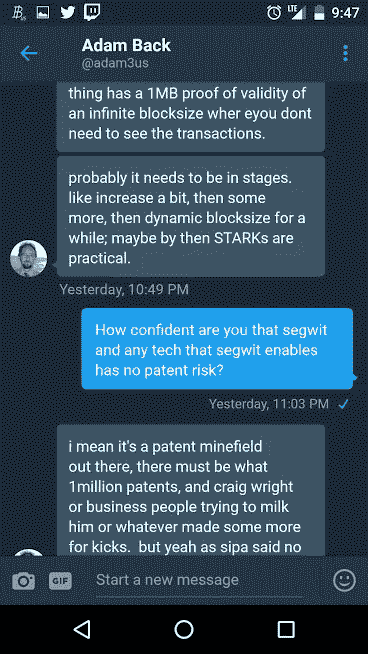**

****2017–05–09****

**Woobull.com[发布了](http://woobull.com/bitcoins-scaling-debate-deadlock-fueling-an-alt-coin-bubble-infographic/)一张关于交易能力、区块大小以及在拥挤的比特币市场中比特币市值优势下降的信息图:**

**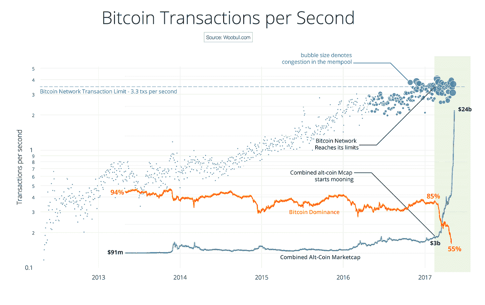**

**[**比特币的缩放争论僵局助长了山寨币泡沫【资料图】**](http://woobull.com/bitcoins-scaling-debate-deadlock-fueling-an-alt-coin-bubble-infographic/)**

**我整理了这张信息图，以帮助解释 altcoins 在过去两个月中看到的 8 倍泡沫。两个…woobull.com**

**2017–5–10**

**Jameson Lopp 深入探讨了估算费用的困难:**

**[](https://blog.bitgo.com/the-challenges-of-bitcoin-transaction-fee-estimation-e47a64a61c72) [## 比特币交易费用估算的挑战

### 比特币交易费用的历史

blog.bitgo.com](https://blog.bitgo.com/the-challenges-of-bitcoin-transaction-fee-estimation-e47a64a61c72) 

您可以在这里的图表中查看平均支付费用。

**2017–06–04**

Reddit 用户 BitAlien 向 r/btc 发布了关于 Blockstream 对比特币的影响及其与传统银行的联系:

**2017–06–05**

Reddit 用户 zsaleeba 向 r/btc 发布了关于 Blockstream 可能使用 Segwit 接管比特币的想法:

**2017–06–10**

Reddit 用户 BeijingBitcoins 向 r/btc 发帖抱怨比特币交易费用高:

[平均比特币交易费用:5 美元](https://www.reddit.com/r/btc/comments/6gek0z/averagebitcointransactionfeeisnowabove_five/)。

**2017–06–26**

Jimmy Song 发表文章:“ [**Segwit2x:关于 2x 硬分叉(又名 2MB 非 Segwit 事务容量 per…**](/@jimmysong/segwit2x-what-you-need-to-know-about-the-2mb-hard-fork-27749e1544ce) )你需要知道的事情”。

[*当我写我上一篇关于 Segwit2x 的文章时，我以关于…*medium.com](/@jimmysong/segwit2x-what-you-need-to-know-about-the-2mb-hard-fork-27749e1544ce)的 2x 部分缺乏清晰度的问题作为结束

**2017–06–26**

**马修·海伍德发表文章《**[**Segwit 激活之路——UASF、Segwit2x 与 seg wit 信令详解**](/@wintercooled/the-road-to-segwit-activation-uasf-segwit2x-and-segwit-signalling-explained-2ff00488b7cb) **》。**

**2017–07–02**

用户 lexiconical 发表文章《 [**Seg-Wit 是特洛伊木马——比特币缩放争论解释**](https://steemit.com/bitcoin/@lexiconical/seg-wit-is-a-trojan-horse-bitcoin-scaling-debate-explained) 》给 steemit.com。

[https://stee MIT . com/bit coin/@ lexico nical/seg-wit-is-a-trojan-horse-bit coin-scaling-debate-explained](https://steemit.com/bitcoin/@lexiconical/g-wit-is-a,trojan-horse-bitcoin-scaling-debate-explained)

**2017–07–11**

约翰·斯图亚特·米利比特发表了文章“[](/@john.s.millibit/cryptocurrency-for-rent-ebf8b92ba2ab)**”出租加密货币。**

**[*寻租。有一个你日常不用的词。*medium.com](/@john.s.millibit/cryptocurrency-for-rent-ebf8b92ba2ab)**

**这篇文章包括了这张图片:**

**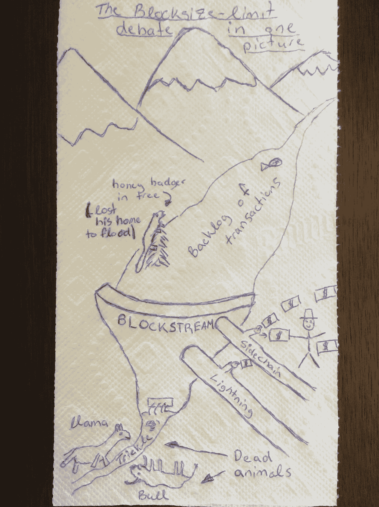**

****2017–07–15****

**[由](https://np.reddit.com/r/Buttcoin/comments/6ndfut/buttcoinisdecentralizedin5_nodes/dk9c27f/) [jstolf](https://np.reddit.com/user/jstolfi) 撰写的关于 Segwit 修复了什么，为什么它被部署为软分叉，以及如何使用软分叉来修复事务可伸缩性的精彩概述。Greg Maxwell 在 Blockstream 的努力也是一个很好的讨论，他试图证明费用市场的效率:**

> **在积压期间，费用和延迟是完全不可预测的，并且大部分交易不可避免地延迟几天或几周。在展会期间，没有“费用市场”,因为任何支付最低费用(几美分)的交易都会在下一个街区得到确认。**
> 
> **这是 Mike 通过理论和模拟预测的，并且自 2016 年 1 月以来一直在持续，当时传入的非垃圾邮件流量首次达到 1 MB 的限制。然而，Greg 固执地坚持认为这只是一个暂时的情况，并且，一旦好的费用估算器被开发并广泛使用，“费用市场”将会稳定下来。他只是忽略了为什么费用估算是一个可证明无法解决的问题，以及为什么稳定的积压不能存在的所有论点。他迫切需要他稳定的“费用市场”出现——因为，如果它不出现，那么他的整个双层重新设计就会崩溃。**

**Jstolf 提到的两层重新设计是 Blockstream 的 Greg Maxwell 正在开发的侧链工作。**

****2017 年 7 月 17 日****

**Eric Wall 发表了文章《 [**比特币 UASF/Segwit2x/BitcoinABC 流程图 201 7 — BIP91 假信号版**](/@ercwl/bitcoin-uasf-segwit2x-bitcoinabc-flowchart-of-2017-aead83d92a49) 》并附上了下图。**

**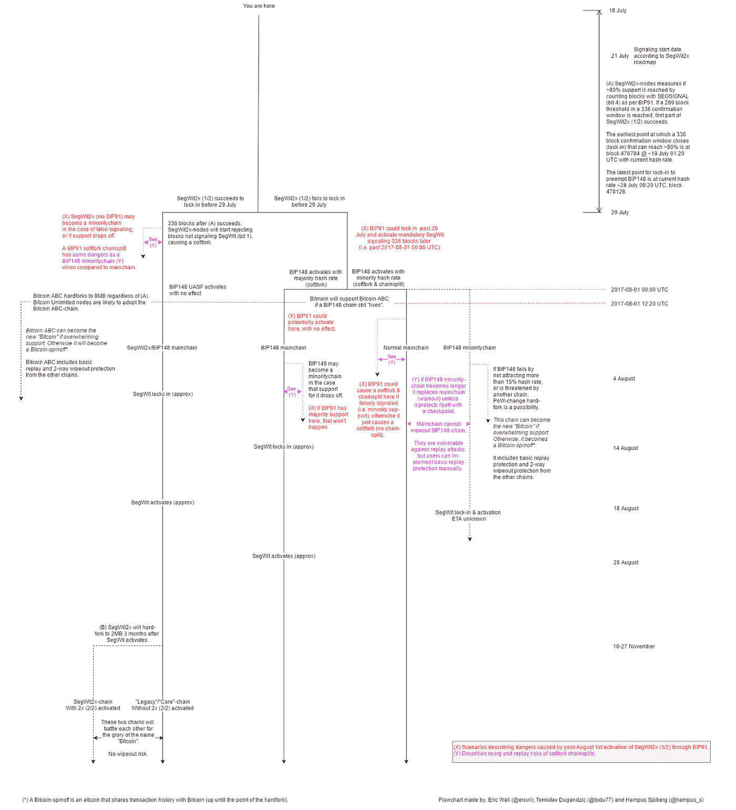**

**[看到了吗？比特币很容易。图片由埃里克·沃尔](https://image.ibb.co/ndiGVF/Bitcoin_flowchart_2017_revised.png)拍摄。**

****2017–07–20****

**Jonald Fyookball 发表文章“ [**即将到来的比特币现金硬堡垒对几乎所有人来说都是重大消息**](/@jonaldfyookball/the-upcoming-bitcoin-cash-hard-fork-is-great-news-for-almost-everyone-354525ecc539) ”。**

 **[## 即将到来的比特币现金硬分叉对几乎所有人来说都是一个好消息

### 你可能不知道，比特币将于 8 月 1 日与 UAHF“比特币现金”分支。

medium.com](/@jonaldfyookball/the-upcoming-bitcoin-cash-hard-fork-is-great-news-for-almost-everyone-354525ecc539)** 

****2017–07–24****

**吉米·宋(Jimmy Song)撰写[比特币技术对话](https://bitcointechtalk.us16.list-manage.com/subscribe?u=055ecd726a069b736a0053297&id=f94fc485ec)时事通讯，并在硬分叉上保持技术和不偏不倚的观点。虽然他在世界加密网和 Youtube 频道上加入的其他人对比特币现金只有厌恶，但宋一直保持冷静。他发表了《 [**比特币现金:你需要知道的事情**](/@jimmysong/bitcoin-cash-what-you-need-to-know-c25df28995cf) **一文。**”**

****2017–07–25****

**[*基于 Blockstream 在比特币社区的行为，我已经完全确定 Segwit 包含专利……*falkvinge.net](https://falkvinge.net/2017/05/01/blockstream-patents-segwit-makes-pieces-fall-place/)**

****2017–08–1****

**[比特币现金](https://www.bitcoincash.org/)用 8MB 块从比特币中分叉出来。坚硬的叉子顺利地拔出来了。**

****2017–8–07****

**预计到 Segwit2X 项目的成功，BlueMatt (Matt Corallo)创建了一个 pull 请求来断开与节点的连接，这些节点在未来*发出信号表示它们支持 Segwit2x。 [**通过 BlueMatt Pull 请求#10982 …**](https://github.com/bitcoin/bitcoin/pull/10982) 断开网络服务位 6 和 8，直到 2018 年 8 月 1 日***

****

**这是一个过早地将网络划分为 1 MB 支持节点和 2 MB / Segwit2X 支持节点的补丁。运行 0.15 版比特币核心的比特币客户端包含了这一变化。Segwit2x 存储库中也讨论了这一点:**

**[](https://github.com/btc1/bitcoin/issues/99#issuecomment-320450248) [## 新的网络魔法问题# 99 Bt C1/比特币

### btc1 确实应该添加一些代码来更清楚地防止节点连接到其他网络，确保…

github.com](https://github.com/btc1/bitcoin/issues/99#issuecomment-320450248) 

**2017–08–08**

通过软叉激活 Segwit。

[**“正式:隔离证人将在比特币上激活——coin desk**](https://www.coindesk.com/its-official-segregated-witness-will-activate-on-bitcoin/)**”**

**2017–08–13**

一个由以太坊创始人 Vitalik Buterin 主演的关于/r/比特币审查的快速剪辑被发布在 YouTube 上:

转录:

> 我的意思是，我绝对认为对比特币 subreddit 的审查是非常不幸的，我确实认为这与我们希望在加密货币和区块链生态系统中拥有和支持的价值观背道而驰，所以如果你看看最近的比特币现金硬分叉， 基本上所有关于它的讨论都被禁止了，它被放在一个他们称之为 Bcash 的单条线程中——对，你知道这是一个故意的策略，试图让它听起来像你知道这只是一个替代硬币，与比特币没有太大联系。 你知道，你会看到很多这类事情的小例子，所以我的意思是，我确实相信，在比特币生态系统和许多其他加密生态系统中，有很多人可能肯定不喜欢这种事情。

**2017–08–16**

皮特·里佐(Pete Rizzo)发表文章《[**Block 494784:segwit 2x 开发者为比特币硬分叉设定日期——coin desk**》。](https://www.coindesk.com/block-494784-segwit2x-developers-set-date-bitcoin-hard-fork/)

[*segwit 2x 背后的开发者，一个有争议的增加比特币区块链交易能力的计划……*www.coindesk.com](https://www.coindesk.com/block-494784-segwit2x-developers-set-date-bitcoin-hard-fork/)

**2017–08–19**

Reddit 用户 X-88 发帖到 r/BTC:[block stream/比特币核心想强迫所有人使用他们的专利侧链](https://www.reddit.com/r/btc/comments/6uoq7b/blockstreambitcoin_core_wants_to_force_everyone/)。

**2017–08–19**

Roger Ver 在 YouTube 上发布了一段关于比特币和比特币现金的经济代码的视频。

**2017–08–20**

Reddit 用户 MobTwo 向 r/btc 发布了一封致 Greg 和其他核心开发者的公开信:

[https://www.reddit.com/r/btc/comments/6uxwts/dear*格瑞*和*其他*核心 _ 开发者/](https://www.reddit.com/r/btc/comments/6uxwts/ar_greg_an,_other_core_developers/)

**2017–08–22**

[奥利维耶·扬森斯](https://medium.com/u/fb16a7233e8e)发表文章《 [**为什么“非挖掘全节点”是个可怕的想法**](/@olivierjanss/why-non-mining-full-nodes-are-a-terrible-idea-ad3c49f7a7b6) 》来解释运行全节点的弊端。他详细讲述了为什么人们可能会觉得他们在经济上参与，甚至在运行完整节点时“投票”，而他们实际上什么都没有做。

[*在比特币的早期，还没有——所谓的“非挖矿全节点”。每个矿工都是一个节点，每个 medium.com 都是一个节点*](/@olivierjanss/why-non-mining-full-nodes-are-a-terrible-idea-ad3c49f7a7b6)

以下是为本文提供背景的一些附加信息。比特币中节点的作用是非常被误解的。虽然运行一个完整的节点来验证交易可能会让人感觉更强大，但也可以通过运行一个轻型客户端或运行简单支付验证模式(SPV)的钱包来完成验证。这需要很少的资源来监控传入的交易，并提供相同的安全性，因为 SPV 客户端通常连接到许多服务器。 [Electrum](https://electrum.org/#home) ，最流行的 SPV 客户端，默认连接 10 个节点。由于扬森斯的文章涵盖了一个对缩放辩论非常重要的主题，因此也值得阅读 Olivier [针对一些评论](/@olivierjanss/first-of-all-i-want-to-applaud-you-for-writing-a-proper-response-10f5df614e0f)的详细观点。

也是在同一天，核心开发者 Eric Lombrozo [称 Segwit2x 的硬分叉提议是对比特币](https://lists.linuxfoundation.org/pipermail/bitcoin-segwit2x/2017-August/000259.html)的**攻击**:

*只要还有很多人想要遗产链，破坏它的企图就会被视为对所有这些人财产的攻击。这是一次严重的网络攻击，已经准备采取决定性的行动，从技术和法律两方面打击这种攻击。*

这是比特币核心开发者开始大规模挥舞双手和 FUD 生产的地方，因为他们开始意识到失去对参考客户端的控制可能意味着什么。

[**【比特币-Segwit2x】比特币现金的强制重放保护——以 B2X**](https://lists.linuxfoundation.org/pipermail/bitcoin-segwit2x/2017-August/000259.html) 为例

[*说清楚一点，这不是我们任何人能决定的。社区中很大一部分人希望保留遗产链。lists.linuxfoundation.org 的 NYA 签名者是…*](https://lists.linuxfoundation.org/pipermail/bitcoin-segwit2x/2017-August/000259.html)

**2017 年 8 月 24 日**

Luke Dashjr 在推特上说，Segwit 应该避免用于正常交易，而只用于闪电:

**2017–8–28**

Reddit 用户 PretenseOfKnowldge 发帖 ["](https://archive.is/6DkOY) [8 倍 Core 告诉 people Segwit 是 Blocksize 的增加](https://archive.is/9I6PY)"，值得分享作为这场争论的关键参考(尽管他分享的帖子的作者很多都不是‘核心’开发者)。

这些索赔列举如下:

“SegWit 是块大小的增加。证明它不是。”

[https://twitter.com/excellion/status/847273464461352960](https://twitter.com/excellion/status/847273464461352960)

" Segwit 是 2MB 块大小增加，句号."

[https://www . Reddit . com/r/BTC/comments/6 tcrr 2/why _ transaction _ mall ability _ cant _ be _ solved/dlju 9dx/](https://archive.is/o/6DkOY/https://www.reddit.com/r/btc/comments/6tcrr2/why_transaction_malleability_cant_be_solved/dlju9dx/)

“SegWit 是块大小的增加。句号。”

[https://www . Reddit . com/r/bit coin/comments/5e0ls 7/seg wit _ vs _ block _ size _ increase _ in _ a _ null/da 8 sk 1 p/](https://archive.is/o/6DkOY/https://www.reddit.com/r/Bitcoin/comments/5e0ls7/segwit_vs_block_size_increase_in_a_nutshell/da8sk1p/)

“真的吗？还不明白 segwit 是块大小的增加吗？要么是你在有意误导读者，要么是你完全不称职。到底是哪个？”

[https://medium . com/@ comprica dev/really-still-haven-catch-on-that-segwit-is-a-block size-increase-ba 111 c2f 2130](https://archive.is/o/6DkOY/https://medium.com/@compricadev/really-still-havent-caught-on-that-segwit-is-a-blocksize-increase-ba111c2f2130)

“segwit 是块大小的增加。Poll 应该是，blocksize w/ segwit 翻倍后，我们要不要在 90 天内再翻倍？”

[https://twitter.com/petertoddbtc/status/887656660801605633](https://twitter.com/petertoddbtc/status/887656660801605633)

“SegWit 是块大小增加吗？是啊！”

[https://seg wit . org/is-seg wit-a-block-size-increase-705 df6a 8731d](https://archive.is/o/6DkOY/https://segwit.org/is-segwit-a-block-size-increase-705df6a8731d)

" Segwit *是*实际的块大小增加"

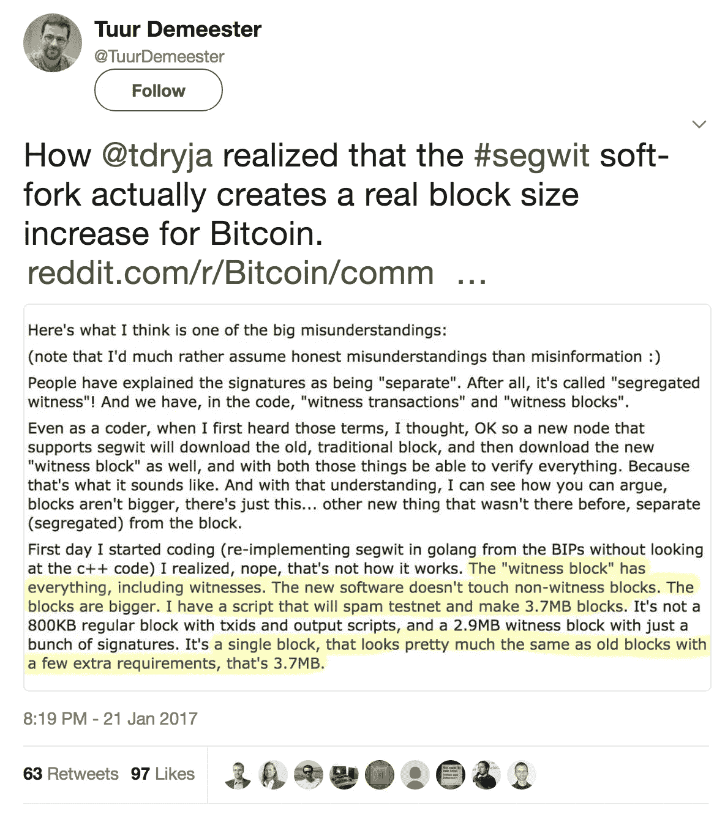

“Segwit 的块大小增加了 2MB。”

[https://twitter.com/adam3us/status/848319001491120129](https://archive.is/o/6DkOY/https://twitter.com/adam3us/status/848319001491120129)

" #SegWit 是一个*实际*块大小增加"

【https://twitter.com/eric_lombrozo/status/855156121593495552 

“这个由@sysmannet 提供的表格实际上显示了#segwit 将把#比特币块大小增加到几乎 2 MB。”

**2017–08–30**

Jonald Fyookball 发表文章“ [**为什么比特币会有高得离谱的费用和缓慢的确认？**](/@jonaldfyookball/why-does-bitcoin-have-ridiculously-high-fees-and-slow-confirmations-e3fd58258a6d) ”。

 [## 为什么比特币收费高得离谱，确认慢？

### 如果你最近尝试过使用比特币，你可能已经注意到它变得越来越贵了。平均费用飙升至…

medium.com](/@jonaldfyookball/why-does-bitcoin-have-ridiculously-high-fees-and-slow-confirmations-e3fd58258a6d) 

**2017–10–11**

Bitcoin.org 对支持 Segwit2x 的服务发出警告:

[***谨防比特币可能与一些主要服务不兼容***](https://bitcoin.org/en/alert/2017-10-09-segwit2x-safety)

[当心比特币可能与一些主要 servicesbitcoin.org](https://bitcoin.org/en/alert/2017-10-09-segwit2x-safety)不兼容

**2017–10–23**

CoinBase 的传播总监大卫·法默(David Farmer)发表了文章“ [**时间线和支持——比特币 Segwit2x 和比特币黄金**”。](https://blog.coinbase.com/timeline-and-support-bitcoin-segwit2x-and-bitcoin-gold-eda72525efd)

[*我们希望向客户提供两个即将推出的比特币分支——比特币 Segwit2x 和比特币黄金的另一个更新。你可以……*blog.coinbase.com](https://blog.coinbase.com/timeline-and-support-bitcoin-segwit2x-and-bitcoin-gold-eda72525efd)

**2017–10–24**

交易所和钱包就如何处理叉子发布公告。一个共同的主题是，市场将利用累积的困难:

[双子座](https://gemini.com/blog/upcoming-bitcoin-hard-fork-modified-exchange-operations/):“累积计算难度是一个客观的、可观察的指标，不可能伪造或“游戏。“它可能不是所有未来链分裂情况下的可用框架，但它适用于这一种情况。”—10 月 24 日

[比特币基地/GDAX](https://blog.coinbase.com/clarification-on-the-upcoming-segwit2x-fork-d3c0f545c3e0)::**我们准备把累计难度最大的链条叫做比特币。”—10 月 24 日**

[在 Bitfinex 的公告](https://www.bitfinex.com/posts/223)中，他们选择忽略哈希能力，并将坚持一个名称:“现有的实现(基于现有的比特币共识协议)将继续作为 BTC 交易，即使 B2X 链有更多的哈希能力。”

因此，这实质上意味着，在一段时间后，交易所将需要声明“这条链，区块高度为 X，挖掘难度为 X，是我们在使用名称*比特币时所谈论的内容。*“如果 Segwit2x 在哈希能力方面成为主导链，其他交易所可能会将同一链称为 *B2X* 。

[参见 Coinigy](https://blog.coinigy.com/2017/10/comprehensive-list-of-exchange-segwit2x-stances/) 的这篇文章，了解更多立场和观点。

[**这场比特币的灵魂之战会摧毁它吗？**](https://www.forbes.com/sites/laurashin/2017/10/23/will-this-battle-for-the-soul-of-bitcoin-destroy-it/#1ab4ffef3d3c)

[*不到两周前，随着比特币创下新高，长期以来的“霍德勒”(一个基于错别字的内部笑话……*www.forbes.com](https://www.forbes.com/sites/laurashin/2017/10/23/will-this-battle-for-the-soul-of-bitcoin-destroy-it/#1ab4ffef3d3c)

**2017–10–25**

Marc Bevand 发表了博客文章“ [**增加比特币块重限制的理由**”。](http://blog.zorinaq.com/block-increase-needed/)

[](http://blog.zorinaq.com/block-increase-needed/) [## 提高比特币交易限额的理由

### 2017 年 3 月对比特币来说是一个重要的时刻:平均块大小触及 1MB 的限制，阻碍了增长…

blog.zorinaq.com](http://blog.zorinaq.com/block-increase-needed/) 

它包括以下图表:


也是在这一天，Slushcz 在比特币基地发推文直接驳斥了哈希力量定义比特币的观点:

2017–10–29

ThePiachu 的比特币博客发表了一篇文章，展示了这一切。在讨论块流、矿工和用户时，它指出:

这场争论的双方都从同一个来源获得资金——交易费。Blockstream 希望更多的交易通过他们的专有服务流动，以便从机构和个人那里收取更多费用。另一方面，采矿者从区块链发生的更多交易中受益——他们只从区块内的交易中赚取交易费，从链外交易中一无所获，直到他们回到链上。在网络中流动的资金数量有限的情况下，这是一个经典的零和游戏——通过您首选的渠道流动的交易越多，您的资金就越多，而您的对手的资金就越少。

[**Blockstream vs 矿工——看 Segwit2x 分叉**T5 周围的激励](https://tpbit.blogspot.de/2017/10/blockstream-vs-miners-looking-at.html)

过去几个月，比特币社区中充满了对即将到来的 hard fork-seg wit 2x 的讨论。There… tpbit.blogspot.de

2017–11–01

一名匿名发帖者发布了“ [**另一名矿工**](https://theflippening.github.io/open-letter-to-bitcoin-miners-from-another-miner/) ”致比特币矿工的公开信，要求矿工们增加比特币的难度，并立即转向开采比特币现金，以努力坦克原始比特币的价值并冻结其区块。它鼓励一个全新的开始，区块链具有 8MB 的巨大容量，未来可能会有巨大的块，并且没有隔离见证的技术债务:

[*比特币要想成功并获得完全的市场主导地位，应该只有一种比特币。对于商家来说太……*the flippening . github . io](https://theflippening.github.io/open-letter-to-bitcoin-miners-from-another-miner/)

(*回想起来，这种情况并没有发生，*[*2017 年 11 月的硬叉*](https://www.bitcoinabc.org/november) *减少了不断变换的比特币变现难度带来的混乱。)*

**2017–10–31**

这个日期被标记为[自中本聪发布比特币白皮书以来九年](https://news.bitcoin.com/satoshi-nakamotos-brilliant-white-paper-turns-9-years-old/)。

(仅供参考——如果 Satoshi 可以使用他所有的 100 万比特币和比特币现金，他的价值为 87 亿美元。)

假设:(100 万 BTC * 7500 美元)+(100 万比特币现金* 1209 美元)

**2017–11–1**

布莱恩·霍夫曼(Brian Hoffman)发表了文章**[**segwit 2x:如果你做了，你就完蛋了，如果你不做，你就完蛋了**。](https://techburst.io/segwit2x-youre-fucked-if-you-do-you-re-fucked-if-you-don-t-6655a853d8e7)**

**[*在过去的几个月里，没有哪个项目或公司因为 Segwit2x 和…* techburst.io](https://techburst.io/segwit2x-youre-fucked-if-you-do-you-re-fucked-if-you-don-t-6655a853d8e7) 而遭受了更大的损失**

****2017–11–3****

**Blockstream 的首席执行官 Back 开始在 Reddit 和 Twitter 上为他所谓的“B2X”硬币征集赌注:**

**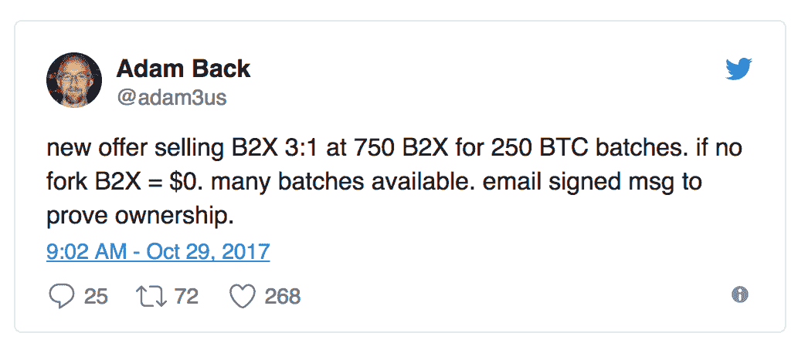**

**Back 把这个提议分享给了他能接触到的每一个交流平台，(除了/r/bitcoin，它已经审查了他的帖子)。他还将他的提议[发布到开发者邮件列表](https://lists.linuxfoundation.org/pipermail/bitcoin-segwit2x/2017-October/000616.html)。**

**他因为这种奇怪的行为被叫了出来:**

****2017–11–8****

**在钱包、交易所和任何希望与 Segwit2x 网络互动的人升级或正在升级他们的钱包以支持两个链(在许多情况下[处理](https://blog.bitgo.com/bitgos-segwit2x-plan-bb8f17e972d3)重放保护)之后，Segwit2x 被六个人取消了:**

**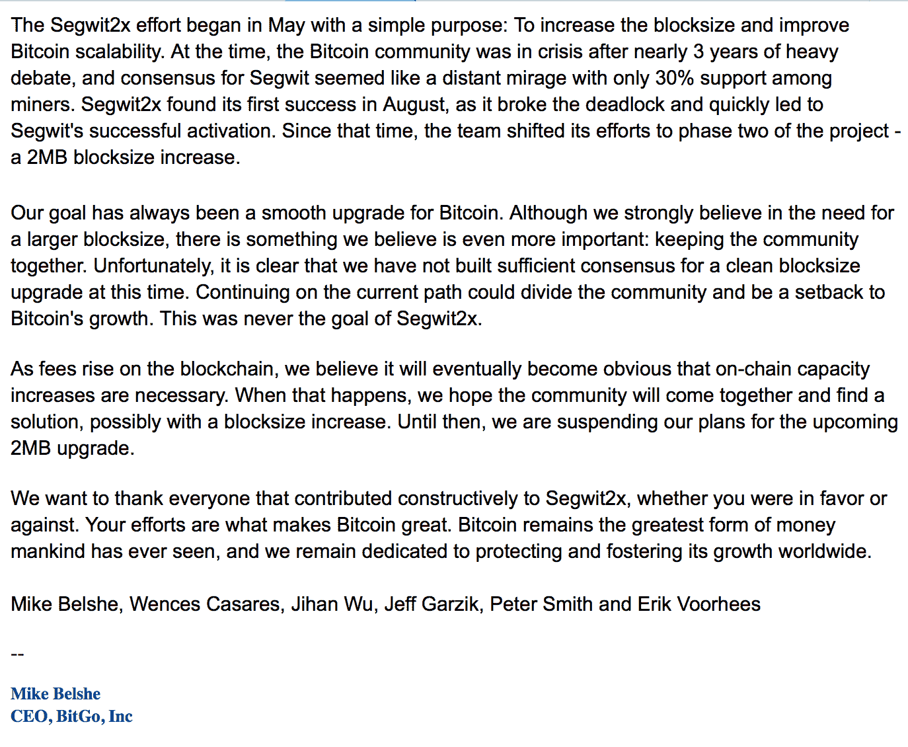**

**(这是 Mike Belshe 发给[比特币 Segwit2x](https://lists.linuxfoundation.org/pipermail/bitcoin-segwit2x/2017-November/000685.html) 邮件列表的邮件的原始格式。)**

**看这里:[https://lists . Linux foundation . org/piper mail/bit coin-seg wit 2x/2017-11 月/000685.html](https://lists.linuxfoundation.org/pipermail/bitcoin-segwit2x/2017-November/000685.html)**

**(还要注意那些承诺继续使用叉子的回复。)**

**签名人是否知道 btc1 中的错误([由 Jimmy Song 在此解释](https://bitcointechtalk.com/segwit2x-bugs-explained-8e0c286124bc) 12 天后)，如果 Segwit2x 继续，这些错误会导致整个链故障？我们还不知道。**

****2017–11–10****

**按照某些标准，韩吉吴控制着比特币网络的大部分控制权，他在推特上发布了以下内容:**

**卢克·达什 jr 在接下来的两天里建议改变比特币背后的工作证明算法，如这条推文所示:**

****2017–11–11****

**安德烈亚斯·安东诺普洛斯(@aantonop)在推特上讲述了比特币和比特币现金共存并服务于不同目的，而安德烈森则在推特上讲述了比特币现金对他的意义:**

**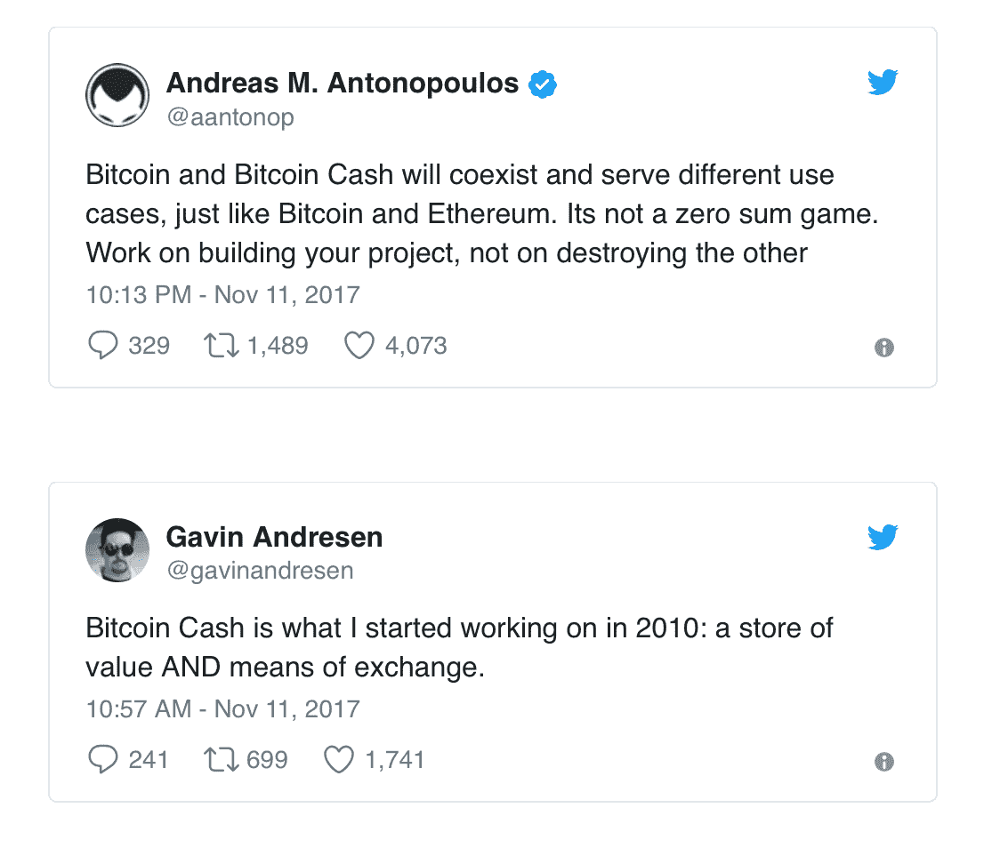**

****2017–11–12****

**比特币的 Hashrate 急剧下跌，mempool 有 16.7 万笔待处理交易，矿工们显然已经转向专注于比特币现金。下图来自 [fork.lol](https://fork.lol/pow/hashrate) :**

**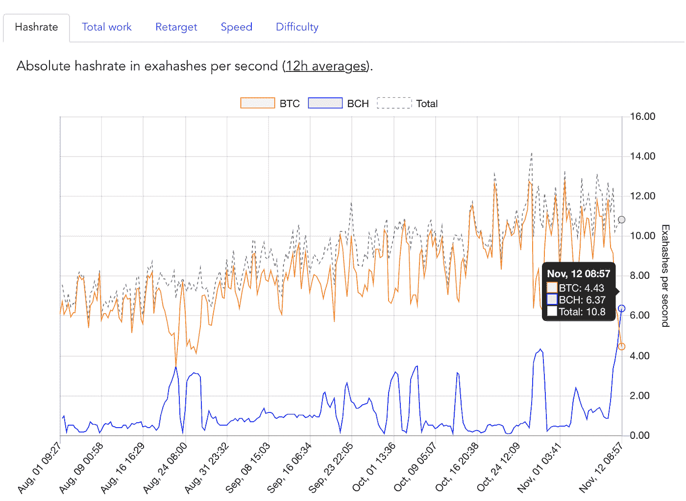**

**[这里有更多关于这种现象的信息](https://jaredschlar.blogspot.com/2017/11/todays-bitcoin-highlights.html)。**

****2017–11–12****

**我们发现自己处于一种哲学和经济学的对立局面，一方认为受到了对区块大小的严格控制的保护，另一方认为比特币现金可以随心所欲。Falkvinge 就比特币现金的 *un* 治理发布了一份声明，作为对比特币核心社区治理模式失败的直接回应:**

**在这里阅读声明的 PDF:[https://www.bitcoincash.org/letter-from-the-ceo.pdf](https://www.bitcoincash.org/letter-from-the-ceo.pdf)**

**Falkvinge 呼吁按费用替换，证人数据隔离(比特币现金没有 Segwit)，等等。为了理解这场辩论，值得一读。**

****2017–11–14****

**突然，Back 声明他支持增加块大小的想法:**

**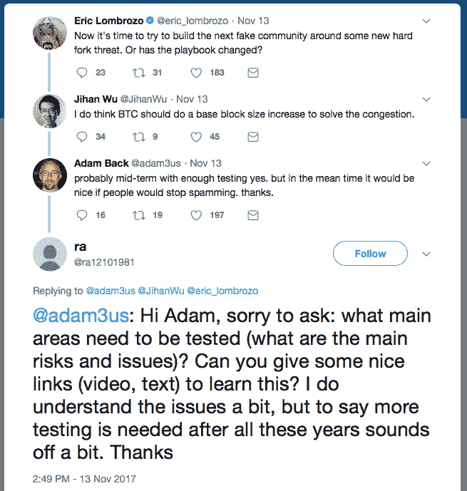**

**[https://twitter.com/adam3us/status/930102757540765697](https://twitter.com/adam3us/status/930102757540765697)**

****2017–11–20****

**在关于数据块大小的对话中，限制仍然是讨论的焦点:**

****2017–11–30****

**Rusty Russell 的精彩阅读描述了比特币的不同阶段，特别关注费用市场的兴起和低价值交易的衰落。时代:**

## **第一时代:Satoshi 的免费提供(2009–2014)**

> **在比特币的早年，它默默无闻，毫无价值。需求如此之小，你可以免费发送任何数量的邮件。**

## **第二时代:Satoshi 的补贴(我们在这里)**

> **批量生产的突发统计性质，加上比特币市场的波动，开始产生间歇性的容量问题。这些问题之前已经由矿工通过代码优化和调整设置解决了；现在，它们变得更有规律和更重要，导致人们越来越意识到第一个纪元正处于危险之中。**

## **第三时代:自给自足(2028？以后)**

> **第一个时代建立的面向用户的企业蓬勃发展到第二个时代时，会发现第三个时代极其困难。**

 **[## 比特币的三个经济时代

### 比特币生态系统的发展方式写在共识规则的数学公式中；我们都应该知道…

medium.com](/@rusty_lightning/the-three-economic-eras-of-bitcoin-d43bf0cf058a)** 

****2017–12–2****

**[在一个问答环节](https://www.youtube.com/watch?v=DHc81OL_hk4&feature=youtu.be&t=21136)，亚当·贝克被问及餐馆可以做些什么来解决高收费问题。他首先建议成为闪电网络(当时没有钱包或频道)的早期采用者，然后建议人们记下花费的“账单”，人们可以根据需要结算账单:**

> **“所以我的意思是，今天，你可以有，一些比特币业务有一个标签，所以你支付他们，你在那里工作，如果你不使用它，大概你可以兑现你的标签。如果你有回头客…或者当地的商店可以制作一个共享标签或其他东西…你知道当地的一些人…技术专家可以制作一个本地比特币标签，可以在商店和某种应用程序之间进行互操作。”**

****2017–12–22****

**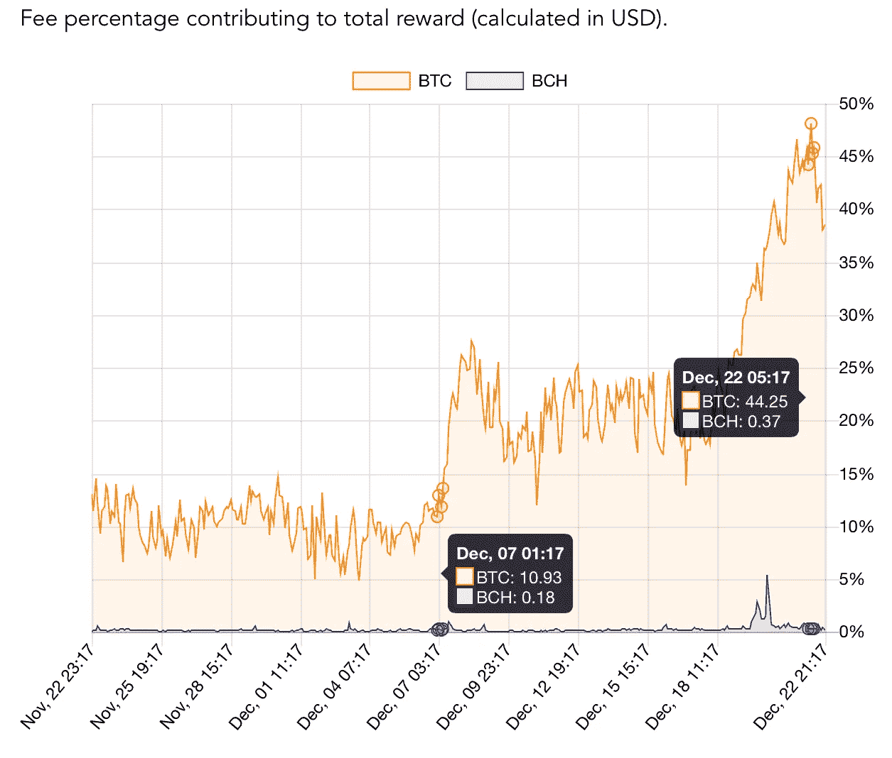**

**随着比特币每笔交易的平均费用接近 55 美元，梅尔文·卡瓦略[在比特币开发者邮件列表上写道](https://lists.linuxfoundation.org/pipermail/bitcoin-dev/2017-December/015455.html)比特币已经达到了一个问题点，即每块的累计费用几乎超过了块奖励。此时，费用约占奖励的 50%。就在几周前，这一比例仅为 10%。卡瓦略写道:**

> ***虽然这对硬币的长期安全性来说是个好兆头，但我认为在采用曲线的这一点上，每个 tx 的费用对于一些用例来说是令人望而却步的，这是一些合理的担忧。***

**对此，格雷格·麦克斯韦写道:**

> **就我个人而言，我认为市场行为确实产生了可以在没有通胀的情况下支付安全性的活动水平，并且随着补贴的下降，还产生了稳定共识进展所需的费用支付积压。**

**这确实是一种特殊的逻辑体操，最好总结如下:**

****2018–12–26****

**在 Vlad Zamfir 对 [a post](/cryptolawreview/against-szabos-law-for-a-new-crypto-legal-system-d00d0f3d3827) 的评论中，Vitalik Buterin 重申了他的观点，即未能提高区块大小对比特币造成了巨大损害:**

> **现在我个人可以看到，什么都不做是最安全的，这不是公理，特别是在不断变化的环境中(例如，我仍然认为比特币在 2016-17 年*未能*大幅提高其块大小是一种嘲弄，严重违反了许多人对该协议的期望，这导致了因超额 txfees 造成的[总损失超过了 MtGox 黑客攻击中的损失)，但这是你需要反驳的论点。](https://www.blockchain.com/charts/transaction-fees-usd?timespan=2years)**

**2020–1–4**

 **[## 【密码学】比特币是一场灾难。

### 2020-12-29 星期二 16:36 +0000，德里克·马克吉尔写道:> 2020 年 12 月 28 日星期一下午 7:07，雷·迪林杰> > >…

www.metzdowd.com](https://www.metzdowd.com/pipermail/cryptography/2020-December/036530.html)** 

**雷·迪林杰回顾了中本聪的代码，并在 2017 年[写道](https://www.linkedin.com/pulse/id-known-what-we-were-starting-ray-dillinger/)他对比特币文化和失败的现状的主要担忧:*“我甚至不愿想象迄今为止有多少亿美元的骗局、失败和盗窃是通过滥用人们对该技术的信仰和热情来实施的。”*在上面的帖子中，他[回答了](https://www.metzdowd.com/pipermail/cryptography/2020-December/036530.html)一个关于块大小争论的问题。这有点长，但我认为细节很重要，因为它总结了上述时间表中的前几年:**

```
>> *You said on BitcoinTalk several years ago that the plan was always to* > *raise the blocksize. Is it still your opinion that it should have* > *been done? Or do you think that even Satoshi's original plans were* > *flawed too?* 
Yes, the plan was to raise the size of the blocks.  And yes, I think it should have been done.  The 1MB limit was considered temporary. We got the current limit just to prevent people from filling space with dumb stuff but thought, of course they'll make it bigger when people actually need the space for legit transactions.  But now they can't make it bigger, because that was a classic case of nerds making a design mistake by failing to note that we were leaving a decision in the hands of people with perverse incentives.  The reason that issue became the screaming sewer knife fight it became is because of toll trolls. Miners have a financial stake in the blocks continuing to be small, because bidding goes higher for a smaller amount of block space.  So they hired a bunch of trolls to sabotage all discussion about raising the limit. All they have to do to kill a raised limit is refuse to mine on larger- size blocks.  But that would mean abandoning all pretense of not being a cartel.  The trolls and screaming you've seen are just symptoms of their need to keep the user base conflicted and uncertain.  That way they don't have to alienate the community by being tremendously obvious in a highly visible 51% attack when they participate with each other in refusing a protocol with bigger blocks. The current 1MB limit was added to the code at the last minute, because Hal was concerned about the size of the block chain (and time/cost of downloading it to set up a new node) growing faster than the Internet communications bandwidth.  Satoshi was confident that it wouldn't grow beyond the power of a $mumble-priced hard drive to contain as hard drives got bigger/cheaper, but that's a different thing. Hal saw a scalability problem w/r/t internet bandwidth because while drive space was on an exponential curve, internet bandwidth wasn't.  And isn't. My input to the bandwidth discussion didn't go much beyond "well, of course the bandwidth would be a crippling issue at scale, but you don't need to worry about this for a small experiment .... wait, are you serious?" 
```

# **得出结论**

**我不能声称知道比特币是否会通过硬分叉获得更大的块大小，但不采取行动将导致以下问题:**

1.  **无法使用的钱包:余额低于最低费用的用户将基本上失去他们的比特币，因为金额无法使用。许多用户日常使用的钱包金额较小，而较大金额的钱包则存放在冷库里。**
2.  **商家和平台会越来越多地采用和接受收费更低的货币。比特币现金、Monero、Zcash、Dash 和 Litecoin 都在扮演比特币在未达到块大小限制时擅长的角色。像 [Raiblocks](https://raiblocks.net/) 、 [Hashgraph](http://hashgraph.com) 和 [MaidSafe](/@danielmorgan/why-the-safe-network-matters-76ada175d26) 这样的项目正在使整个限制的概念，以及 hashpower 的影响的[生态变得荒谬。对于商家来说，比特币现金尤其容易取代比特币，因为实施起来很容易，而且随着交易空间仍然有限，采用速度将会加快。](http://grist.org/article/bitcoin-could-cost-us-our-clean-energy-future/)**
3.  **交易量高或价格下跌的时期会加剧每日交易率限制。价格下跌加上不断增长的交易积压将减少采矿回报，并鼓励矿工转向另一个 SHA256 兼容链，如比特币现金。在这种情况下，有人称之为“连锁死亡螺旋”。TrippySalmon 运营着一个很棒的网站来监控矿工们必须进行的自利计算，这个网站叫做 [Fork.lol](https://fork.lol/) 。**
4.  **针对低价或免费交易的[当前解决方案](https://blog.lightning.engineering/posts/2018/05/02/lightning-ux.html)是闪电网络，其本身依赖于链上交易来“进入通道”。如果每个人都立即采用那个网络，并且系统像宣传的那样工作，人们将会发送闪电交易，很少接触比特币网络，只是偶尔“结算”。这会是比特币吗？接受比特币的商家数量每天都在减少，而其他通过正常挖掘来验证网络状态的加密货币更便宜，正常人也可以使用。除非比特币获得块大小的增加，否则这种 onramp 的费用将太高，比特币基地等处理器将通过鼓励用户钱包之间的免费交易，在比特币网络的微交易中引领潮流。**

**就我个人而言，反对增加块大小的论点已经让我筋疲力尽了。让我兴奋的是比特币实验以比特币现金的形式重新焕发活力，以及数百个其他区块链项目，其开发团队能够将区块链技术推向新的领域。**

**我开始相信:认为较大的块大小是一种“去中心化压力”的想法是错误的。挖掘节点和非挖掘节点在 8MB 块大小的情况下表现良好(即使它们远未满)。2018 年 5 月 15 日，该限制将进一步提高至 32MB。[这份关于衡量分权的原创研究](http://hackingdistributed.com/2018/01/15/decentralization-bitcoin-ethereum/)值得一读(2018 年 1 月)。**

**下面是[比特币现金节点](https://cash.coin.dance/nodes/all)在做他们的事情:**

**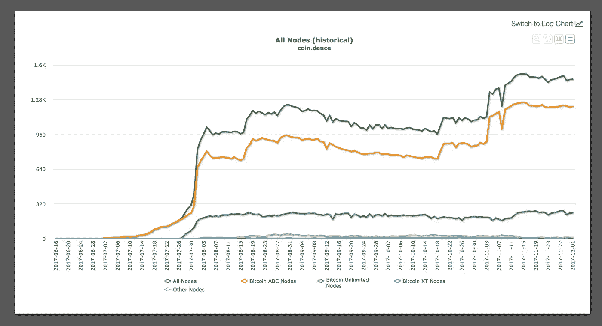**

**2017 年 12 月，学校已经开始教授比特币 101 课程。几年后，真正想深入研究现已成为第八大货币的学生可能会报名参加“比特币内部政治 101”，在那里他们无疑会遇到关于区块大小的辩论以及时间表中包含的日期、数字和时刻。每个人(我在这里包括我自己)对比特币都有一个不完整的画面，任何声称理解比特币变化的正确经济、政治或技术解决方案的人都应该立即被视为一个疯子。花时间了解治理、历史和围绕技术实现形成的准凝聚力团体将**我希望**向明天的比特币开发者和实现支持者展示如何行为和建立共识。**

**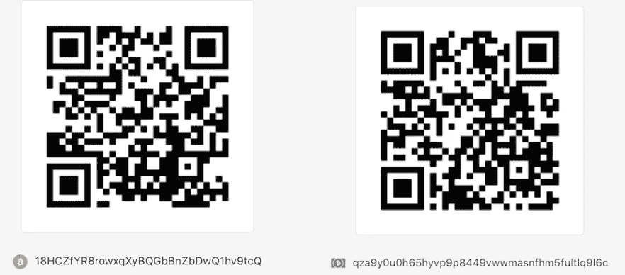**

**One of these digital currencies is great for sending digital cash over the Internet to writers.**

*   **[丹尼尔·摩根](https://medium.com/u/81e281bbc40e?source=post_page-----6108081dbada--------------------------------) ( [推特](https://twitter.com/danielmorgan))********