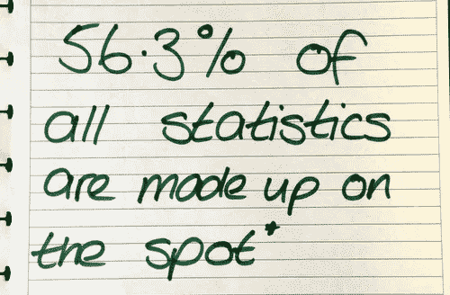

# 统计与收集的巨大能力:2017 年 8 月版

> 原文：<https://medium.com/hackernoon/the-great-capacity-of-statistics-collections-august-edition-of-2017-4b06a7972d30>

> (很抱歉我的帖子发晚了——到目前为止，这是一个相当疯狂的月份！)

*   [W3Techs —万维网技术调查](https://w3techs.com)
*   [W3Techs —服务器端编程语言的使用](https://w3techs.com/technologies/overview/programming_language/all)
*   [W3Techs—PHP 的所有版本](https://w3techs.com/technologies/details/pl-php/all/all)
*   [W3Techs — PHP 版本 5](https://w3techs.com/technologies/details/pl-php/5/all)
*   [W3Techs — PHP 版本 7](https://w3techs.com/technologies/details/pl-php/7/all)
*   [BuiltWith — PHP 7 使用统计](https://trends.builtwith.com/framework/PHP-7)
*   [CMS 市场份额](https://w3techs.com/technologies/history_overview/content_management)
*   [W3Techs—WordPress 的使用统计和市场份额](https://w3techs.com/technologies/details/cm-wordpress/all/all)
*   [WordPress 版本](https://codex.wordpress.org/WordPress_Versions)
*   [WordPress 版本(PHP、MySQL、&地区)](https://wordpress.org/about/stats/)
*   [八月 WordPress 攻击报告](https://www.wordfence.com/blog/2017/09/august-2017-wordpress-attack-report)
*   [Composer 的 PHP 版本](https://seld.be/notes/php-versions-stats-2017-1-edition)
*   [2017 年 8 月最值得信赖的托管公司网站](https://news.netcraft.com/archives/2017/09/04/most-reliable-hosting-company-sites-in-august-2017.html)
*   [PYPL 编程语言流行指数](http://pypl.github.io/PYPL.html)
*   [2017 年 7 月/8 月 TIOBE 索引(编程语言)](https://www.tiobe.com/tiobe-index)
*   [TOPDB 顶级数据库索引](http://pypl.github.io/DB.html)
*   [DB-引擎排名](https://db-engines.com/en/ranking)
*   [关系数据库管理系统的数据库引擎排序表](https://db-engines.com/en/ranking/relational+dbms)
*   [DB-引擎在流行趋势中的排名](https://db-engines.com/en/ranking_trend)
*   [Netcraft 网络服务器调查](https://news.netcraft.com/archives/2017/08/29/august-2017-web-server-survey.html)
*   [互联网顶级网站](http://toolbar.netcraft.com/stats/topsites)
*   [W3Schools——Chrome 浏览器统计数据](https://www.w3schools.com/browsers/browsers_chrome.asp)
*   [W3Schools—Internet Explorer(IE)浏览器统计数据](https://www.w3schools.com/browsers/browsers_explorer.asp)
*   [W3Schools——火狐浏览器统计数据](https://www.w3schools.com/browsers/browsers_firefox.asp)
*   [W3Counter —浏览器&平台市场份额](https://www.w3counter.com/globalstats.php)

## 奖金

*   [CodinGame——2017 年最值得学习的编程语言](https://www.codingame.com/blog/top-programming-languages-to-learn-in-2017)
*   [TechRepublic——学习哪些编程语言最重要？投票结果](http://www.techrepublic.com/article/which-are-the-most-important-programming-languages-to-learn-developers-reveal-their-top-five)