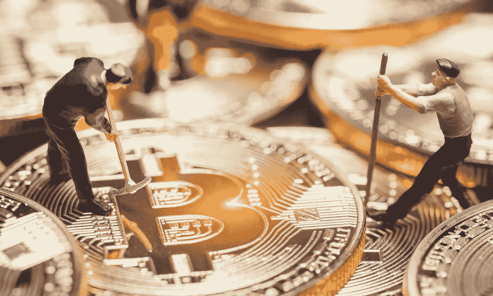

# 巨大的加密货币狂潮才刚刚开始——这对 2018 年意味着什么？

> 原文：<https://medium.com/hackernoon/the-great-cryptocurrency-frenzy-has-just-began-what-does-this-mean-for-2018-9d8ab45b8f8f>

## 我的朋友是一名电工，昨晚他问我他应该买比特币还是以太坊

# 我的朋友是一名电工，昨晚他问我他应该买比特币还是以太坊

## 我开玩笑地问他要不要投资区块链。他的回答是他不知道那是什么

在我看来，目前所有加密货币的估值上升是由于不成熟的资本涌入市场。通常，对于这些人中的绝大多数来说，他们并不了解他们所支持的潜在创新。

## 更广泛的采用对于它获得普遍接受是至关重要的

就拿上周末来说吧。比特币基地升至 AppStore 排行榜首位。我知道相关性不等于因果关系，但我敢打赌莱特币的上涨取决于它是可购买的最低硬币，人们不知道他们可以购买 BTC/ETH 的分数。

## 你可以将上述内容作为加密货币是泡沫的证据

你可能是对的，但你也不可能远离事实，这将导致你错过我们目前正在经历的价值爆炸。现实情况是，以目前的价格——与它的当前用途相比——这是一个泡沫。

# 那么参与有什么问题呢？

大多数人认为比特币的当前价值表明它不可能被篡夺。它没有认识到的是，硬币的估价并不是由一枚硬币的成本决定的。你需要考虑硬币的数量和协议的市值。我听人们建议投资硬币，因为它的成本只有几分之一美元。他们不明白的是，所有的硬币加起来价值几十亿美元。

# 1 枚 Ripple 硬币目前的购买价格为 0.74 美元

从心理上讲，我们倾向于认为，与比特币相比，比特币有更大的发展空间。他们没有认识到的是，要让 Ripple 与比特币价值相同，一枚 Ripple 币只需相当于 7.40 美元。Ripple 的大小已经是比特币的 1/10，因此至少在短期内，你对该协议的投资可能会受到限制。

# 那么哪个硬币会赢呢？

我是从社交网络或者搜索的角度来看的。在 FB 之前有 Friendster，Myspace 等。在谷歌之前有雅虎。如果这些初始密码只是创新的前兆呢？我个人认为这是最有可能的情况。我认为加密货币在未来将会是巨大的。

## 它们将扩散到我们做的每一件事情中，并且很可能通过为目前人与人之间有太多摩擦的事情提供小额支付来缓解技术对工作的干扰

最终，我认为更广泛地采用这项技术对未来大有裨益。不幸的是，将会发生的是，不老练的投资者将会在这个过程中遭受损失。这就是进步的代价。

## 当你不知道支撑你投资的基础技术时，你就有麻烦了

## 但是那些被烧伤的人会让未来的经济

微支付将抵消技术带来的就业损失，因为它使服务的微支付没有了支付的摩擦。这将通过智能合约来实现，智能合约可以瞬间从使用你的产品或服务的消费者的钱包中扣除密码。

这就是这个泡沫至关重要的原因。大规模接触加密货币为新范式的出现提供了机会。这种新形式的无摩擦交换(资本交易和周转的频率要高得多)是以 Cryto 作为支付方式，还是一种新形式的法定货币，目前尚不清楚。显而易见的是，就在线效用而言，加密目前远远领先于法定货币，因此几乎不可能被抓住。

# 这将最终让位于电子税收

你甚至不需要允许从钱包里付款，你只是丧失了平台用来挖掘 cryto 并重新分配给创作者的 CPU 能力。

对于出版商和艺术家、开发商和银行家来说，整个互联网也是如此。支付系统很可能成为第一种支付手段，根据人们所提供的物品的效用、价值或享受程度来支付他们的价值。

## Web 1.0 催生了互联网

## Web 2.0 催生了主宰它的巨头

## Web 3.0 将会产生分布式网络，把它带回来

要加入这个世界，你需要密码

那些现在购买的人是投机者，类似于淘金热时期的个人，他们购买采矿镐，奔向前沿。但是这些企业家为一个勇敢的新世界铺平了道路。他们中的许多人在追求财富的过程中失去了财富，但他们在寻找控制自己命运的方法时获得了梦想的希望。

# 对我来说，这是加密目的的精髓

这是关于在政府实施经济控制，使我们的货币贬值的情况下收回控制权。2008 年金融崩溃后的量化宽松是这方面最惊人的例子。政府真的印钱，让我们努力挣来的每一分钱贬值，而银行家却因为他们造成的伤害而逃脱了任何惩罚性的惩罚。

Crypto 提供了一个避免这种情况的选择，同时也避免了像委内瑞拉这样的国家的通货膨胀。现在，加密可能是寻求快速赚钱的赌徒的同义词，但如果你仔细观察，你会发现真正的革命是在支撑革命的技术中。

**巨大的加密货币狂潮才刚刚开始**

## 你是要成为一个伤亡者还是幸存者？

# 答案在于你是否自学