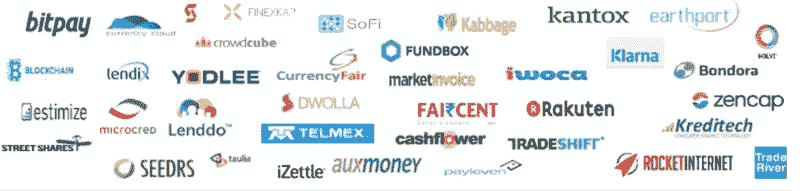
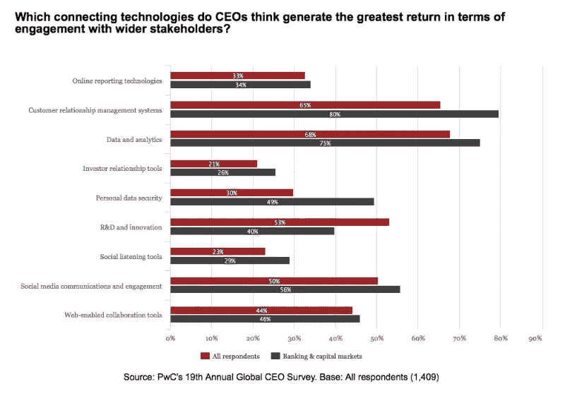
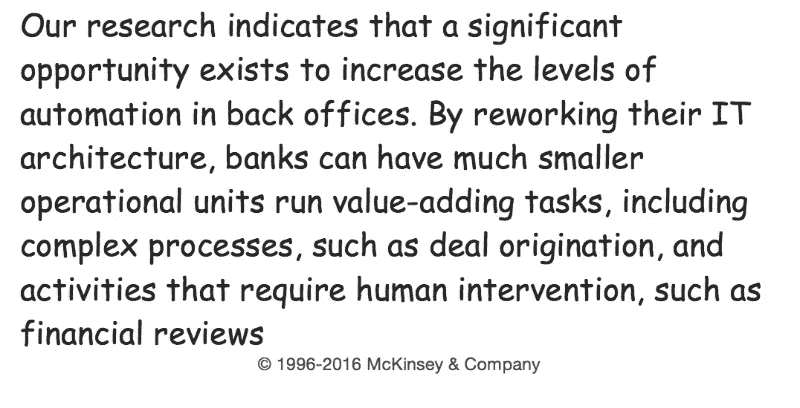

# 银行技术，革命还是进化？

> 原文：<https://medium.com/hackernoon/the-greatest-banking-high-tech-evolution-or-revolution-9d2c8089543f>

*银行业的新进入者让银行首席执行官踌躇不前，也让他们的首席信息官面临压力，要想出相关的数字战略来保护他们的业务免受新兴公司* [*FinTech*](https://en.wikipedia.org/wiki/Financial_technology) *【提供的新产品和服务的客户流失。*

> **这些金融科技公司是谁？**

大多数金融科技公司分为以下几类

*   放款
*   个人理财[管理](https://hackernoon.com/tagged/management)
*   支付[技术](https://hackernoon.com/tagged/technology)
*   比特币

诸如 [Lending Club](https://www.lendingclub.com/?lc_referrer=Google_Brand&gclid=CJe5_u7P9rkCFcd_QgodcRgAtg&param2=GzB001zA002z2zDz&gclid=Cj0KEQiAisy1BRD7_YSgpduD2cEBEiQAPR3UuNp2Cg-mHZGiymXW6EmgxT6fWcYK89aCxLhop2G9GekaAmCt8P8HAQ) 、 [Prosper](https://www.prosper.com/) 、 [SoFi](https://www.sofi.com/?campaign=MRKT_SEM_Brand-Brand-Generic-Exact-Search-US-English-Google_e_g_c_93934362426_sofi&utm_source=MRKT_ADWORDS&utm_medium=SEM&utm_campaign=MRKT_SEM_Brand-Brand-Generic-Exact-Search-US-English-Google_e_g_c_93934362426_sofi&gclid=Cj0KEQiAisy1BRD7_YSgpduD2cEBEiQAPR3UuFjNOZxuzwE24Qf6hoi_4jet2ZtZhDxRXcpp9028bTsaAjtl8P8HAQ) 、 [Zopa](http://www.zopa.com/) 、 [Square、](https://squareup.com/)、 [Stripe](https://stripe.com/) 、 [Betterment](https://www.betterment.com/?utm_content=14544782&gclid=Cj0KEQiAisy1BRD7_YSgpduD2cEBEiQAPR3UuE5IBIC7Fl-Cplr9dGsnGwWVWjsJXPbdfXEeeMXXMh0aAsrB8P8HAQ) 、 [Wealthfront](https://www.wealthfront.com/?gclid=Cj0KEQiAisy1BRD7_YSgpduD2cEBEiQAPR3UuKS1bCCsbytiB-itG9dRCG-jFH7ABQh440d-4rk91iMaAtMq8P8HAQ) 、 [Personal Capital、](https://www.personalcapital.com/land/registration/dr/?utm_source=google&utm_medium=cpc&utm_campaign=Brand&utm_content=%7Bkeyword%7D&gclid=Cj0KEQiAisy1BRD7_YSgpduD2cEBEiQAPR3UuK6A81__vO3WmJP9elPiQ8he0rYGhVaB0IBSZmtJtFAaAloZ8P8HAQ)、 [eToro](https://www.etoro.com/) 、 [Faircent](https://www.faircent.com/) 等公司就是利用银行数字化战略薄弱领域的很好的例子

虽然从长期来看，失去客户的威胁是真实的，但从短期来看，消费者会保持与银行的核心关系，并使用金融科技新参与者的服务来获得增值产品和服务。

> **为什么大型零售银行保留其核心银行系统，为什么新的金融科技公司没有取代它们？**

答案很复杂，围绕着成本、监管和声誉。更新遗留核心银行系统是一项艰巨的挑战，在某些情况下，如果[管理不善](http://www.reuters.com/article/us-hsbc-it-idUSKBN0UJ0ZB20160105)，可能会带来系统性风险。多年来，银行一直拒绝升级其核心的[银行系统](http://www.celent.com/reports/core-banking-replacement-strategies-time-has-come)，尽管业内专家一直在预测即将到来的升级。

*   *成本:*创建一个拥有所有相关功能的新核心存款账户系统非常昂贵。从零开始更换一个核心银行系统，标准功能的成本将超过 1 亿美元。
*   监管:由于核心银行业务是零售经济的命脉，政府制定了数十年的监管条例，对流经核心银行系统的活动的各个方面进行监管。这些遗留系统内置了这些复杂的监管解决方案。
*   *声誉:*虽然银行不受欢迎，但人们仍然对金融危机怀有敌意，大多数人仍然相信现有的银行会处理他们的交易，并对将他们的关系转移到未经测试的新进入者非常谨慎。

> **银行的数字化战略会足够快吗？**

普华永道全球金融服务调查的一些发现表明，首席执行官们越来越依赖于数据、分析和技术来为要求更高的客户群提供价值。除非银行加大对技术和创新的投资，否则它们会将业务拱手让给不受传统系统和方法约束的金融科技公司。

银行业的未来仍在辩论中，尽管许多人认为传统银行业最终将被新的金融科技解决方案淘汰，但目前尚不清楚情况是否会如此。与此同时，银行正在使用工作流管理工具和新技术来自动化更多的手动流程，以加快贷款的决策和审批。

银行不得不改变他们的想法，比如使用社交媒体和 T2 手机来获得新客户，并抵御像 T4 苹果支付这样的新进入者。他们也在关注每一个有竞争力的新进入者，以期与他们整合或成为合作伙伴。

金融科技公司在建立客户群方面势头强劲，尤其是在年轻人中，但如果传统银行愿意将客户的优先事项置于其科技战略的中心，它们就能有效地竞争。一些银行正在从分行和呼叫中心消除错误和手动流程，并推动客户转向更有意义的自助服务渠道。但他们仍然需要评估“我的客户在线想要什么”与“我在线为客户提供什么”，以击败他们的金融科技挑战者。银行与金融科技公司竞争的真正考验是，它们如何通过创新和新产品服务于现有客户。

最糟糕的情况是，银行将沦为这些新金融科技公司的“处理器”或“后端系统”。

> **进化还是革命？**

银行别无选择，只能迅速将技术预算集中在最有效的客户参与技术上。客户对[随时随地银行服务](http://www.aba.com/Press/Pages/081115MobileBankingSurvey.aspx)的期望不断上升，这引发了金融科技和传统银行之间争夺消费者关系的竞争。当[技术融合](https://www.accenture.com/us-en/insight-banking-tech-vision-2015.aspx)时，这些关系将是真正的交叉产品，比现有的银行关系更深。

美国银行一直在慢慢接受数字解决方案，欧洲银行引领着更多的创新，亚洲银行远远落后于第三名。每个市场以不同的速度发展有许多原因，遗留系统的复杂性、管理层的不妥协、成本和监管是主要的影响因素。文化在每个市场采用新技术的过程中也发挥着重要作用，随着新服务变得越来越普遍，如非洲的 M-pesa 系统。

> ***任何制度都会发生革命，无论是金融制度还是政治制度，当它赖以生存的环境变化的速度超过它能够进化的速度*** 。

最终，我认为银行业不会发生“革命”，因为监管和成本的结合将给予银行所需的时间，通过创新“进化”，并通过购买有针对性的金融科技公司来吸收他们所需的新技术，以服务他们不断变化的客户需求。

***感谢阅读***

最诚挚的问候:诺曼·金

如果你喜欢这篇文章，请点击“喜欢”按钮；发表评论或与您的网络分享。另外，请查看我在 LinkedIn 上的其他帖子 [**在这里，**](https://www.linkedin.com/in/normanmking) *也在 Medium 上[在这里。](/@normanking) *可供咨询、顾问和演讲之用。电子邮件:normanking@brook-port.com**

*参考:图片来自 Pixabay.com，*

> [黑客中午](http://bit.ly/Hackernoon)是黑客如何开始他们的下午。我们是 [@AMI](http://bit.ly/atAMIatAMI) 家庭的一员。我们现在[接受投稿](http://bit.ly/hackernoonsubmission)，并乐意[讨论广告&赞助](mailto:partners@amipublications.com)机会。
> 
> 如果你喜欢这个故事，我们推荐你阅读我们的[最新科技故事](http://bit.ly/hackernoonlatestt)和[趋势科技故事](https://hackernoon.com/trending)。直到下一次，不要把世界的现实想当然！

