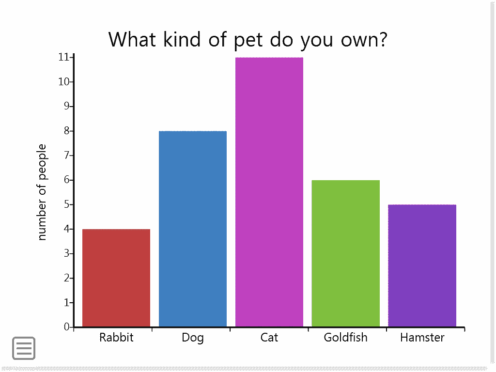
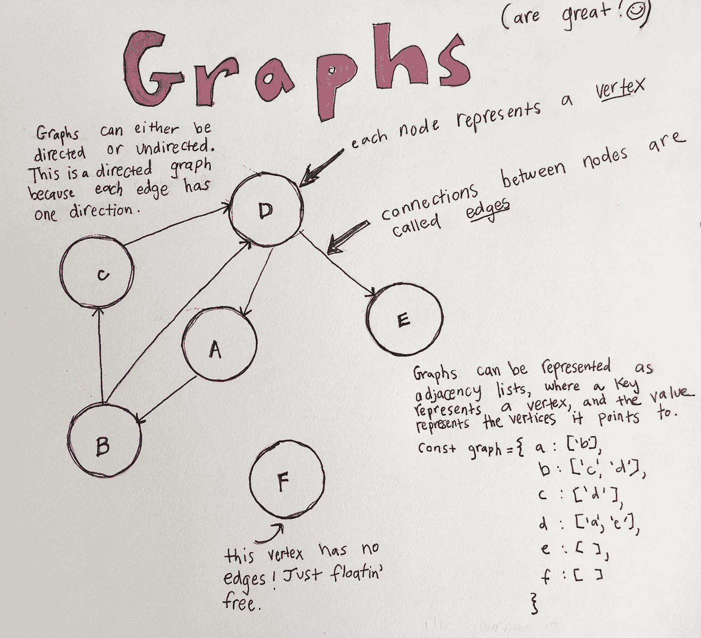
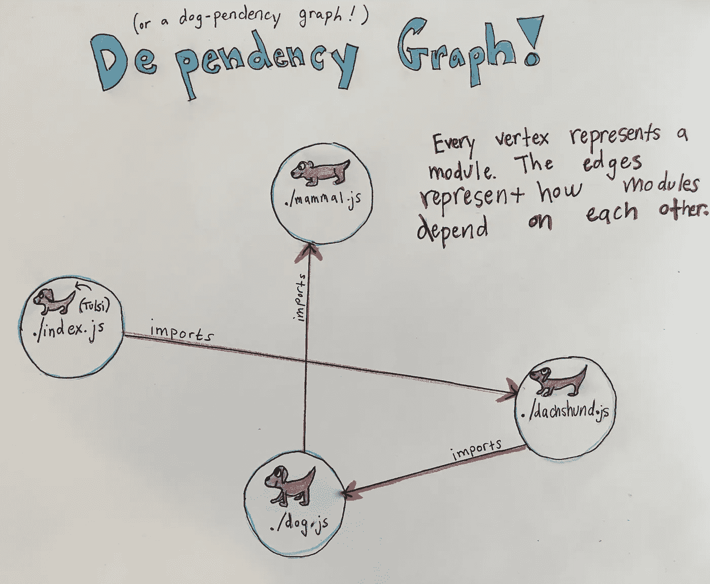
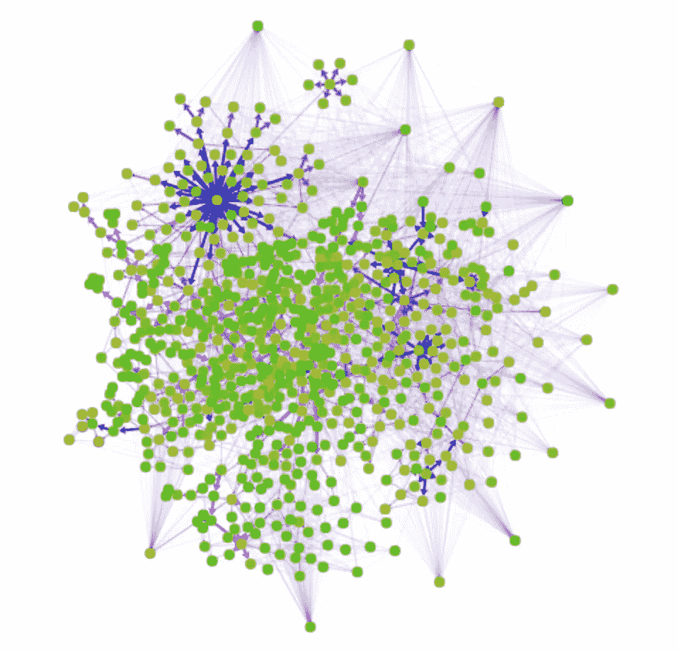

# 图形的伟大之处

> 原文：<https://medium.com/hackernoon/the-greatness-of-graphs-3b04a973d0eb>

当我第一次学习图形数据结构时，我很困惑它是这样的:

Image from [Virgina Tech](https://courses.cs.vt.edu/csonline/DataStructures/Lessons/Graphs/index.html)

当我习惯了这样的图表时:

Thank you for the image [Ms. Parker](https://sites.google.com/a/hdsb.ca/ms-parker-s-class-website/data-management/bargraphsanddoublebargraphs)!

根据 dictionary.com 的说法，****图是用许多不同的点、线、条等来表示两个或更多事物之间的联系或相互关系的系统的图。****

**在计算机科学中，图只是由**边连接的**节点**(也称为顶点)的集合。**这听起来是不是类似于我们已经知道的一种数据结构？如果你想到了一棵树，你就对了！树是一种图形，但是有更严格的规则！[图](https://hackernoon.com/tagged/graphs)不需要根节点，而不是通过父子关系连接的节点，图中连接的节点被称为**兄弟节点**。**

****

**那么，在我们日常的开发者生活中，我们能在哪里找到图表呢？ [Webpack](https://hackernoon.com/tagged/webpack) 对于想要使用 require 和 module.exports(或者 ES2015 中的 import 和 export！)将文件连接在一起。Webpack 创建一个图，它的边将依赖关系链接在一起，以便创建一个文件 bundle.js，您可以将它插入到 index.html 文件中。很简单！**

**下面举个例子！假设我想创建一个哺乳动物对象，并使用原型继承将其链接到一个狗对象。我将导出我的哺乳动物并将其导入到我的狗文件中。**

**注意，我正在导出我 Dog 组件，这样我就可以导入它并创建一个新的 Dachshund 对象，它有一个到 Dog 的原型链接！**

**最后，我的狗 Tulsi 是一只腊肠，它肯定与腊肠有联系。所以我将把腊肠犬导入到 Tulsi 文件中。**

**Webpack 现在将创建一个图表，从 index.js 开始，表示这些文件如何相互连接。**

****

**A dog-pendency graph**

**现在你知道图形的伟大了！**

**这里有一个来自 Webpack 的 Github 页面的[酷工具](http://webpack.github.io/analyse/#modules)，它允许你创建 Webpack 项目的依赖图！对于更大的项目来说，结果是相当不确定的。这是我最近一个项目的图表，你可以去 bkstreetview.com 参观。**

****

**A dependency graph of one of my recent projects!**

**快乐制图！**

************

> **[黑客中午](http://bit.ly/Hackernoon)是黑客如何开始他们的下午。我们是 [@AMI](http://bit.ly/atAMIatAMI) 家庭的一员。我们现在[接受投稿](http://bit.ly/hackernoonsubmission)，并乐意[讨论广告&赞助](mailto:partners@amipublications.com)机会。**
> 
> **如果你喜欢这个故事，我们推荐你阅读我们的[最新科技故事](http://bit.ly/hackernoonlatestt)和[趋势科技故事](https://hackernoon.com/trending)。直到下一次，不要把世界的现实想当然！**

****