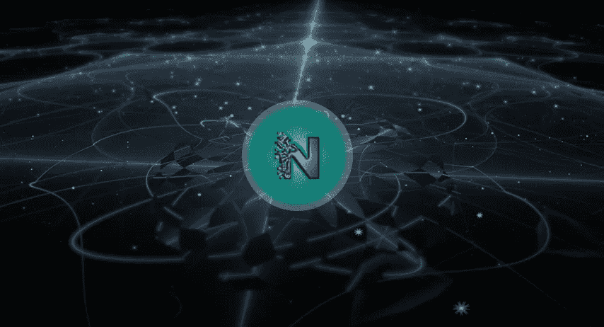

# 网格愿景:网络之后的互联网

> 原文：<https://medium.com/hackernoon/the-grid-vision-book-the-internet-after-the-web-d675fbbdc809>

到目前为止，我们一直在分享我们在[Nanosai.com](http://www.nanosai.com)所做的关于分布式系统的事情，以黑客午间贴的形式[[1](https://hackernoon.com/our-ambitious-quest-to-democratize-distributed-systems-act-1-protocols-b6bec5297213#.xolsyg8eg)[[2](https://hackernoon.com/our-ambitious-quest-to-democratise-distributed-systems-act-2-ion-vs-json-ce69f4e5c4a9#.joniy57kh)[[3](https://hackernoon.com/versatile-and-intelligent-distributed-systems-with-grid-ops-part-1-8228bdfcb044#.d4iikr4tp)][[4](https://hackernoon.com/build-versatile-and-intelligent-distributed-systems-with-grid-ops-part-2-202fad4ff58f#.v9javkcyo)]。还有另一个渠道，我们将以电子书的形式分享我们更广阔的视野。我们的联合创始人兼首席技术官 Jakob Jenkov 将撰写一本名为“[网格愿景](https://leanpub.com/the-grid-vision)的免费下载电子书，它将逐渐为更广泛的网络爱好者社区提供更全面、更易于理解的信息。

网格本质上是我们回到未来的雄心勃勃的网络替代品。对网格的总体设想是一个更快、更智能、更通用的互联网。特别是，我们认为网格必须提供以开发者为中心的基础设施服务和开放的标准工具，以便开发者能够在其上构建高级的智能实时分布式系统。因此，我们探索的最初阶段是为开发者提供:

1.  一套网格标准
2.  网格标准的一组开源实现

3.一组托管网格服务

网格标准是一组开放的标准，在实现时将满足网格愿景中提出的目标和要求。网格标准主要与网络协议相关(见[ [1](https://hackernoon.com/our-ambitious-quest-to-democratise-distributed-systems-act-2-ion-vs-json-ce69f4e5c4a9#.iqckpeegw) ])。

网格标准的开源实现将使得开发基于网格标准的高级智能分布式系统变得容易。我们从 GitHub 上可用的 Java 实现开始(参见[ [3](https://hackernoon.com/versatile-and-intelligent-distributed-systems-with-grid-ops-part-1-8228bdfcb044#.2bt9wihzg) 和[ [4](https://hackernoon.com/build-versatile-and-intelligent-distributed-systems-with-grid-ops-part-2-202fad4ff58f#.83a4l9ved) )。后来，我们希望能够在其他语言中实现，如 C#，D 等。

这本书可以在 Leanpub 免费下载[。另外，如果你想玩我们的开源 Java 工具包 Grid Ops，请随时访问我们的](https://leanpub.com/the-grid-vision) [Github 页面](https://github.com/nanosai/grid-ops-java)。

最后，我们正在为一些基础设施服务的推出做准备，如果你想收到测试邀请，请`[**Subscribe here.**](https://goo.gl/forms/zXQe9k2es9iombdD2)`

> [黑客中午](http://bit.ly/Hackernoon)是黑客如何开始他们的下午。我们是这个家庭的一员。我们现在[接受投稿](http://bit.ly/hackernoonsubmission)并乐意[讨论广告&赞助](mailto:partners@amipublications.com)机会。
> 
> 如果你喜欢这个故事，我们推荐你阅读我们的[最新科技故事](http://bit.ly/hackernoonlatestt)和[趋势科技故事](https://hackernoon.com/trending)。直到下一次，不要把世界的现实想当然！

