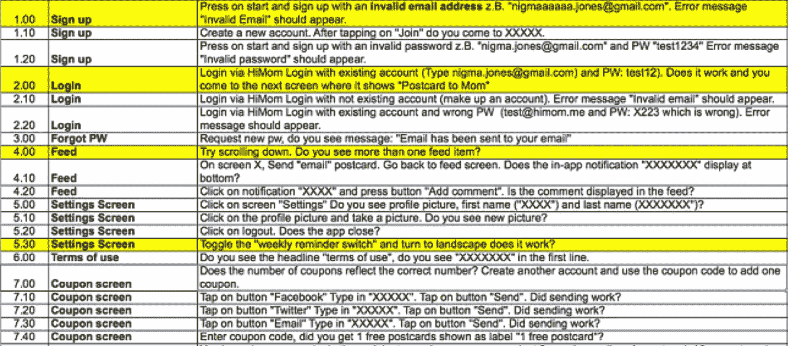

# 没有测试一切的愧疚

> 原文：<https://medium.com/hackernoon/the-guilt-of-not-testing-everything-ed2042da63ea>

我的首席技术官:“我们对您的测试解决方案印象深刻，您已经做到了这一点！”

(负疚感瞬间涌上心头)

这发生在几个月前，当时我的 [CTO](https://hackernoon.com/tagged/cto) 听说了一个我为我们的网络应用程序组装的测试解决方案。我的解决方案是自动生成 QA Selenium 代码，而不是通过记录/配置测试来手动对其进行编码。(无耻之徒:可在 [snaptest.io](https://www.snaptest.io) 上免费下载。这个工具极大地提高了覆盖率——但为什么我仍然会因为接受了这样的赞美而感到愧疚呢？

因为我不合理地认为测试应该是彻底的。

## **穷举测试:**指对**动作**ns/数据的每个可能组合进行测试。

当我说“我已经测试了新特性”或者“测试正在通过”时，就会产生负疚感。在我的脑海深处，我知道有成千上万的组合我没有测试。

我们必须给自己一个喘息的机会，并且记住**详尽的测试**通常是不可能的。你必须调整测试的成本/回报平衡表……尤其是当你开始考虑**阴性测试的时候。**

**负向测试/破坏性测试/错误路径测试—** 指检查系统处理错误或意外情况的优雅程度。这是当详尽的测试变得令人筋疲力尽的时候……不要期望得到所有的。

**以下是我对处理负面测试用例的建议:**

1.  挑出那些简单的负面测试，比如表单验证。
2.  推迟需要大量工作才能创建和维护的负面测试。例如移动应用上的缓慢网络连接。偶尔手动测试一下可能更经济。
3.  花时间对最常遇到的错误进行负面测试。问问自己，用户最可能看到哪些错误？掩护那些人。
4.  **如果没有覆盖应用的所有状态，也不用担心。记住，任何测试都是有用的！**

> [黑客中午](http://bit.ly/Hackernoon)是黑客如何开始他们的下午。我们是 [@AMI](http://bit.ly/atAMIatAMI) 家庭的一员。我们现在[接受投稿](http://bit.ly/hackernoonsubmission)，并乐意[讨论广告&赞助](mailto:partners@amipublications.com)机会。
> 
> 如果你喜欢这个故事，我们推荐你阅读我们的[最新科技故事](http://bit.ly/hackernoonlatestt)和[趋势科技故事](https://hackernoon.com/trending)。直到下一次，不要把世界的现实想当然！

