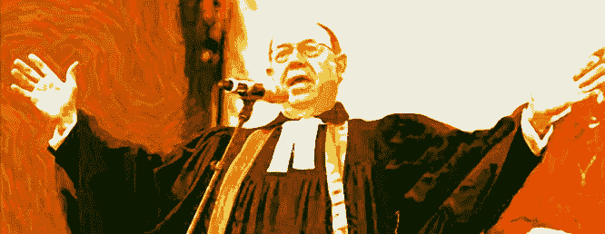

# 高科技传教士:用虚拟现实给大众带来启示。

> 原文：<https://medium.com/hackernoon/the-high-tech-preacher-using-vr-to-bring-the-apocalypse-to-the-masses-53dfcaf08ce8>

*Oculus Rift 和 Magic Leap 时代的宗教*

五年后，或者在此期间的某个时候，增强现实和虚拟现实将成为主流，订购虚拟现实世界将是 Fiverr gig 无法做到的事情。

福音传道者将转向这个未知的领域，因为他们转向探索狂野的西部，并试图拯救他们认为迷失的灵魂。

随着 2012 年的过去，像往常一样，没有灾难发生，除了我们文化的缓慢白痴化，未来的世界末日事件似乎已经过时，直到一些考古学家重新解释了伊拉克的一些古代废墟，并找到了一个新的朗朗上口的数字。或者直到互联网上的一个创意巨魔设计了一个新的阴谋，一个更近的日期，使它变得如此紧迫，以至于成群结队的轻信者会跑进他的亚马逊联盟博客，购买 prepper 设备。

由于一个世纪又一个世纪的宗教粪便学从未取得成果，如果他们想继续出售他们的圣油并资助他们的豪华喷气式飞机，他们就必须实现它，或者重新创造体验。

所以，想象一下这个概念和商业模式:

*   随着每天都有新的发现关闭了神秘解释的大门，人们对科学的过度发现的信心正在减弱。
*   怎么办？他们必须表明，罪导致毁灭和非常糟糕的预言的到来。因此，他们将创建增强现实体验，参与者的行为将被跟踪，而[未来](https://hackernoon.com/tagged/future)地狱中的惩罚将被显示在这个世界上发生，带有这些传教士享受的适当程度的虐待。
*   见鬼，你可以为 Oculus Rift 制作一个版本，在那里你所有的社交媒体互动和 WhatsApp 消息都被跟踪，以寻找被禁止的内容(你可以根据每个宗教标准调整参数)。睡觉前，你会经历你的“未来”炼狱经历，所以你晚上睡得不太好会加强你对上帝的恐惧。
*   看在上帝的份上，甚至更好！使用脑电图技术来跟踪你的思想和情绪，以及一个知道你何时在看邻居的妻子的摄像头，你可能会被适当地判为精神通奸罪。信仰守护者的天堂！
*   现在，你可以建立一个分数跟踪系统，看看谁是你朋友之间的每月坏男孩，或者谁是小天使。
*   然后添加一个支付系统来宽恕你的罪过，在那里你可以要求其他基督徒为你祈祷(他们为演出获得报酬，平台收取佣金)。神圣的新币$%!我们说的是几十亿，几十亿。
*   在 2.0 版本中，增加了个性化广告 a la AdSense，根据用户犯下的罪的类型、频率、一天中的时间进行调整…这样他们就可以直接联系到传教士或专门从事他们最喜欢的陷阱的“信仰促进者”。
*   在 2.0 版本发布后，您将拥有足够大的数据集来实现机器学习算法。现在你甚至可以在你最有可能犯罪之前，让一个传教士给你打电话！或者就朝鲜而言，在犯下另类思维罪之前被拘留。

等一下，上次更新可能有问题。想想看，预防犯罪就没有罪，没有罪疚感，没有生意。一些传教士可以创建一个“诱惑代理人”网络，通过测试信徒的信仰来净化信徒，这些代理人可以从这些传教士那里获得佣金。你得让钱滚滚而来。

想象一下这种可能性，与这种破坏性的模式相比，美国的天主教会和电视传教士对金钱一无所知。它可以被称为虚拟王国:“来享受仁慈的基督独裁吧，就在地球上，仅此一次。”

至于我自己，我更喜欢在这种情况下唱反调，我会说这该死的生意注定要失败。

> [黑客中午](http://bit.ly/Hackernoon)是黑客如何开始他们的下午。我们是 [@AMI](http://bit.ly/atAMIatAMI) 家庭的一员。我们现在[接受投稿](http://bit.ly/hackernoonsubmission)并乐意[讨论广告&赞助](mailto:partners@amipublications.com)机会。
> 
> 如果你喜欢这个故事，我们推荐你阅读我们的[最新科技故事](http://bit.ly/hackernoonlatestt)和[趋势科技故事](https://hackernoon.com/trending)。直到下一次，不要把世界的现实想当然！

