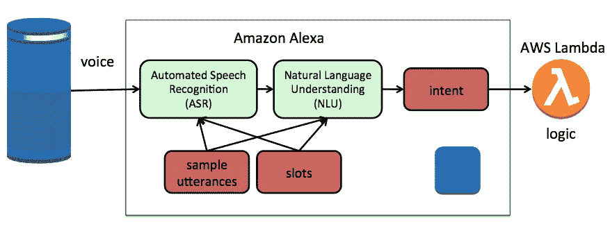
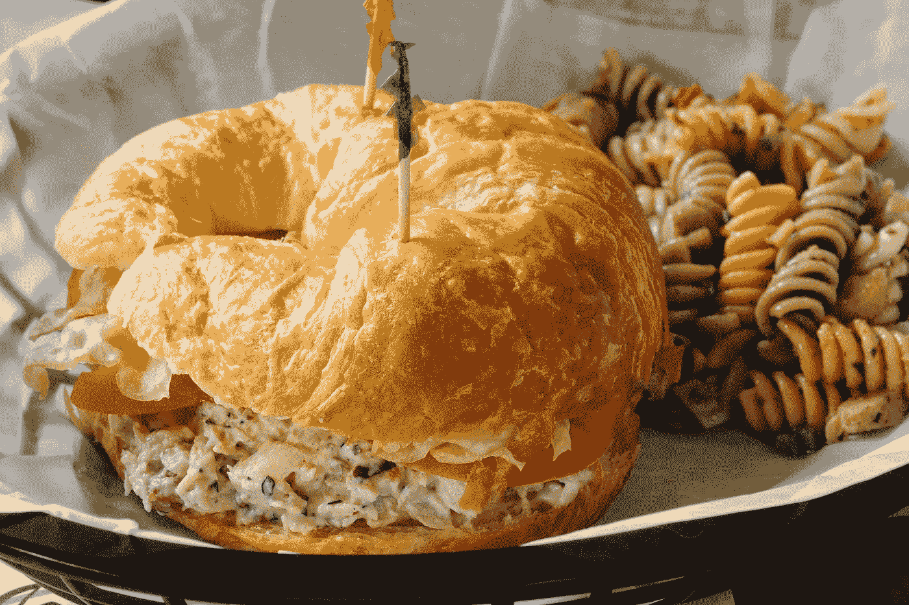
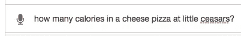
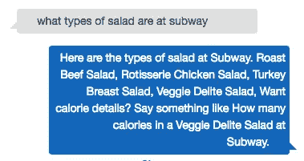
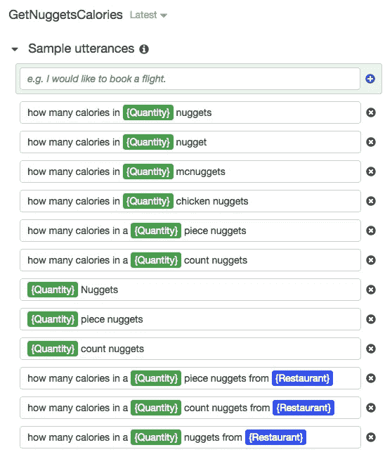
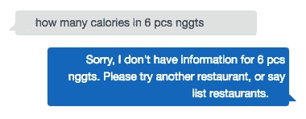

# 训练和构建聊天机器人时拼写的恐怖

> 原文：<https://medium.com/hackernoon/the-horrors-of-spelling-when-training-and-building-chatbots-d67d1b32ce27>

Photo courtesy of [bogitw](https://pixabay.com/en/users/bogitw-851103/) on Pixabay

我已经在 Alexa 平台上发布了二十种不同的语音激活聊天机器人。在过去的几个月里，我已经把我的注意力转移到了使用亚马逊 Lex 为脸书信使开发聊天机器人上。同机[学](https://hackernoon.com/tagged/learning)型号=易港对吧？现在我知道得更多了，我很谦卑，也愿意分享我的错误，这样其他人就能理解其中的不同。隐藏的挑战是解读文本中的拼写。以下是我所学到的。

# 架构比较— Alexa 与 Lex

作为背景，在幕后，这里是两个平台如何使用机器学习模型。

Basic Alexa Architecture w/ ML models

Basic Lex Architecture w/ ML models

主要区别在于入站媒体—文本与声音文件。自然语言理解(NLU)模型是相同的。我可以重复使用示例话语和自定义插槽。围绕触发 lambda 函数的意图的模式是相同的。不同的是，Alexa 使用自动语音识别(ASR)模型将声音翻译成文本，而不是接收用户在 Facebook Messenger 中输入的内容。我发现这超越了语音到文本的转换。围绕拼写检查和语言解释提供了额外的服务。我举个例子进一步解释一下。

# 我的测试对象，查克，快餐聊天机器人

我一直在开发一个聊天机器人，它已经在 [Facebook Messenger](https://www.facebook.com/fastfoodcaloriecounter) 平台上发布了几个月。回购包括源代码和文档可以在[这里](https://github.com/terrenjpeterson/caloriecounter)找到。

Chuck 的目的是回答关于在快餐店的一顿基本餐中有多少卡路里的问题。我搜集了十几个受欢迎的餐馆网站，建立了数据模型，然后把所有数据输入 Lex。

所以你应该可以问恰克，沙拉里有多少卡路里。

Photo courtesy of [Wikipedia Commons](https://commons.wikimedia.org/wiki/File:Caesar_salad_(2).jpg).

现在想一分钟，你如何用语音和文本来表达这个查询。这张照片是一张凯撒沙拉，这是一个很容易发音的单词，所以语音命令可以直接识别和翻译。通过 FB Messenger 这样的客户端发短信是一个挑战，因为 *caesar* 不是一个容易拼写的单词。我希望这个机器人是用户友好的，所以我一直在训练它所有不同的方式，有人可能会拼写*凯撒*。这需要驱动 NLU 模型的自定义插槽中的额外条目，以及 Lambda 函数中的代码。语音聊天机器人不需要这些。

让我们试试另一个。

Photo courtesy of [Wikipedia Commons](https://commons.wikimedia.org/wiki/File:Chicken_salad_croissant_at_Collage_Catering_(4670091146).jpg)

有人知道单词*羊角面包*有多少种不同的写法吗？同样的挑战——考虑到拼写方面的挑战，语音驱动的机器人将比文本驱动的机器人更容易导航。

不服气？再来做一个例子。

My photo from [flickr](https://flic.kr/p/5TPEp5)

再说一次，在语音查询中说出比拼写容易得多。对于那些想要答案的高成就者来说，它的拼写是*油炸玉米饼*。

因此，这里的关键要点是，在语音驱动的聊天机器人(即 Alexa 技能)中，进入 NLU 模型的文本来自语音识别服务——因此无论术语的难度如何，都不会包含拼写错误。对于基于文本的聊天机器人，同样的输入直接来自用户——因此包含拼写错误，尤其是对难词。

## 那些是离群值，每个人都会拼写 burger！

以上这些例子可能有些极端，但很容易解释语音识别模型不仅仅是将 wave 文件转换成文本。它本质上是基于训练数据进行拼写检查，这些数据用于构建拼写正确的模型。

## 可能是因为手机上的小键盘吗？

甚至对于基本词汇(鸡肉、牛排、汉堡等。)，有拼错的。其中大部分是正在使用的接口。在台式机上，键盘上的按键距离更远，因此不太可能错过按键。一个移动设备，很容易错过，差一个字母。

## 设备没有拼写检查吗？

是的，客户端应用程序可以构建弯曲的线条来提醒用户他们可能会拼错一个单词，但通常需要在按下发送按钮之前进行一些干预。

此外，当人类接收文本时，我们接受较低的拼写标准，因为我们知道媒体容易出现这类错误。不幸的是，在源代码中编写匹配和查找是不宽容的！

## 建立一个更好的对话流程，并为他们拼写出来！

随着时间的推移，我已经改进了对话流程，以便沿途给出提示。例如，当一个错误发生在一个没有找到的食物项目上时，用户会被重定向到询问更一般的问题。

这有助于提供正确的拼写，以及正在使用的官方术语。鉴于用户不太可能在响应中进行复制+粘贴，换位错误将继续发生。

## 缩写也不会被捡起来！

我们再来看另一个例子，你会向查克要这个做什么？

六块鸡块——就像菜单上的一样，对吗？

以下是模型中用于训练机器人的这种意图的示例话语。

这似乎很全面，但是我们如何发短信并不是我们如何说话。我经常调整的一个缺口是缩写词，因为用户会问这样的问题。

问题不仅仅在于拼写，因为用户在发短信时经常使用缩写。这不是拼写问题，而是密切相关的——然而这在语音驱动的应用程序中并没有表现出来。Lex 中的 NLU 模型实际上很擅长破译，但不是 100%。

# 有什么含义？

这类似于我们在过去十几年的移动应用开发中所学到的。在构建聊天机器人时，每一个都需要针对界面进行定制。最初从语音开发的具有正确拼写术语的 NLU 模型将需要发展，提供在文本驱动模式中使用的附加服务。从用户体验来看，将语音驱动聊天机器人“叉车式”转换为文本将是一场斗争，因此要警惕工具声称的“一次编写，随处发布”。