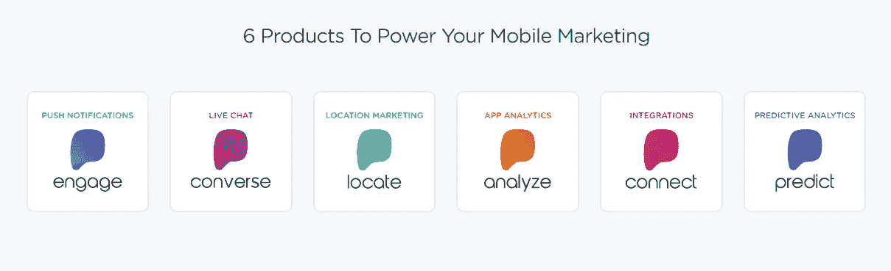

# 移动营销的枢纽

> 原文：<https://medium.com/hackernoon/the-hubspot-of-mobile-marketing-1b548b5a64ac>

## 我们投资脉动的原因

正如 Hubspot 让成千上万家公司的数字和网络营销变得高效和简单，将内容、电子邮件、分析和现场参与捆绑到一个有凝聚力的包中，我们现在看到同样的动态正在移动领域形成。应用程序开发人员需要新的方法来更好地了解用户行为和参与度，并且迫切需要能够在竞争激烈的市场中给他们带来优势的工具。

移动营销是营销的下一个大趋势，我们相信[脉动](https://www.pulsatehq.com/)将会胜出。我很少见过一个团队如此专注于客户的核心需求，超越市场上现有的产品。

他们不仅开发了一个杀手级的移动营销产品，还在移动营销领域的最佳实践方面做了大量的工作。该领域有许多人专门关注推送通知、邻近营销、应用分析或应用信息。脉动在一个有凝聚力的工具套件中处理所有这些，就像 Hubspot 能够为网络营销所做的那样。

当我第一次见到帕特里克·莱迪(CEO)本人时，我们正在纽约的发布会上。脉动是非常早期的时候，帕特里克已经穷追组织者的邀请，并最终被接受参加圆桌会议讨论接近营销。Patrick 主宰了会议，并展示了他对这项技术的理解和远见，这是很少有人掌握的。

自从第一次见面以来，他一直表现出同样的动力和远见，我们很高兴能一起搭顺风车。

这项投资对我们公司来说也很有价值，是我们继续投资的动力。学习和观察像脉动这样的创新公司有助于定义一个新的市场，为我们公司以及最终为我们服务的客户提供难以置信的洞察力。通过了解零售技术的未来，我们可以帮助我们的客户取得成功，并最终为他们服务的客户创造更好的体验。

> [黑客中午](http://bit.ly/Hackernoon)是黑客如何开始他们的下午。我们是 [@AMI](http://bit.ly/atAMIatAMI) 家庭的一员。我们现在[接受投稿](http://bit.ly/hackernoonsubmission)并乐意[讨论广告&赞助](mailto:partners@amipublications.com)机会。
> 
> 如果你喜欢这个故事，我们推荐你阅读我们的[最新科技故事](http://bit.ly/hackernoonlatestt)和[趋势科技故事](https://hackernoon.com/trending)。直到下一次，不要把世界的现实想当然！

