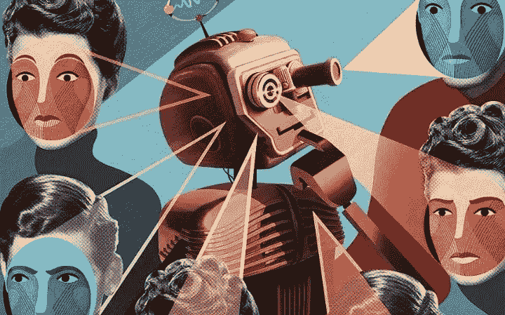
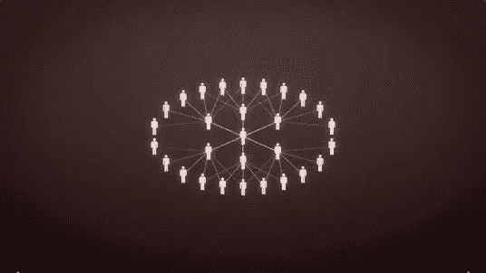
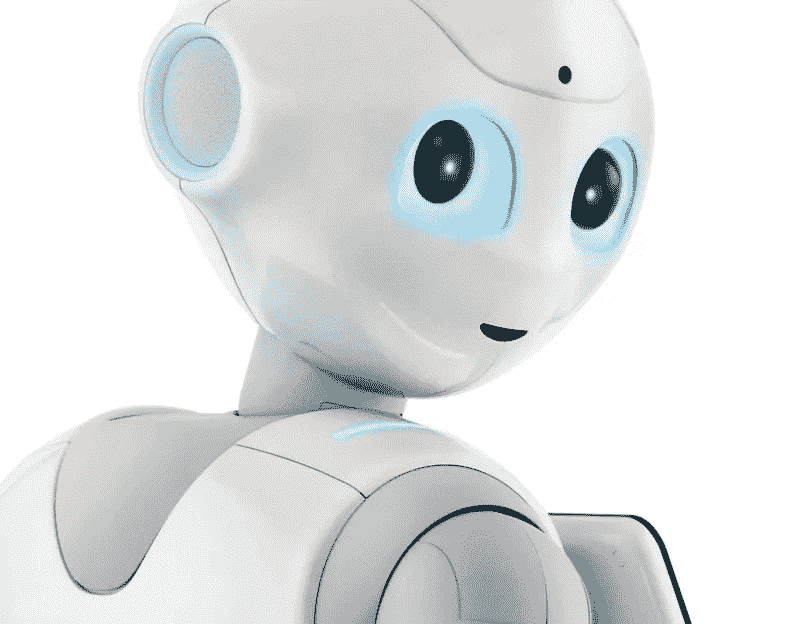
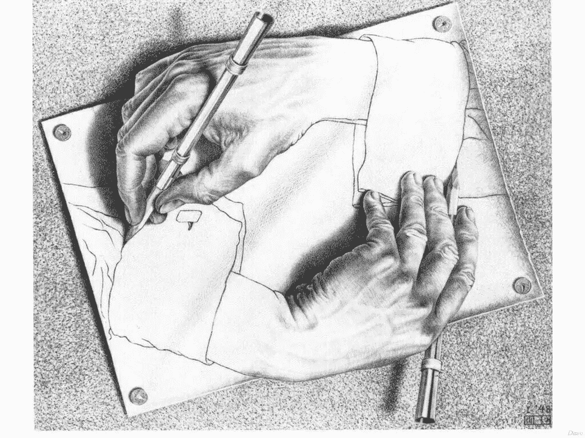

# 人类对情感机器的使用

> 原文：<https://medium.com/hackernoon/the-human-use-of-emotional-machines-202b312de4eb>

机器人不再只是大规模生产的工具，而是正在迅速融入我们的生活。日本经济部(METI)预测将出现一个新机电社会，机器人将参与娱乐活动和老年人护理。此外，美国预计机器人将在以下领域与人类合作执行任务:农业、能源、国防和太空探索(Royakkers，M & Est，2016 年)。

Rosalind Picard (1997)在*情感计算*中提到，当赋予计算机情感理解、反应和表达时，会出现一些问题。然而，作者认为情感计算的发展是计算机与人类自然交互所必需的。

人类居住在人工环境中，我们不再生活在自然中，而是在一个*创造的*超自然中，在一个新的创世纪的日子里:*科技*(加塞特，1992)。理解技术创新的含义是一个政治、哲学和伦理问题，为此有必要问一问它的后果。21 世纪我们面临着与计算机交互的新形式，因此预测情感计算和人工智能的伦理意义非常重要。

本文的目标是发起一场关于情感计算伦理问题的讨论，情感计算由 Picard (1997)定义为一个专注于提供计算机情感技能的研究和开发框架。为此，我们将对人工情感主体的两个潜在问题进行伦理和哲学分析:社会失格和计算拟人化。

> “我们的经验总是主体间的，这意味着当我们在这个世界上时，我们必然与他人在一起。思考孤立的人类是不可能的。”(García 和 Traslosheros，2012 年)。

此外，为了与他人交流，我们需要情感技能。在儿童的情况下，这一点更加突出，因为他们在完全掌握语言之前主要通过情感性的非语言手段(即尖叫、哭泣)进行交流(Picard，1997)。这就向我们提出了关于情感计算对儿童情感发展的影响的问题，因为人工情感代理在与他们互动时会增加社会失格。

社交失格指的是维持人际关系的关键技能受到侵蚀。根据 Sparrow (2002)的说法，机器人模仿情感可能会导致一个伦理问题，因为我们可能会混淆我们的创造物。关于这个问题，心理学家 Sherry Turkle (2002)预测如下:儿童将习惯于机器人近乎完美的友谊(积极编程以满足用户)，因此将不会学习如何与人相处，以及如何处理自己的情绪。

上述问题在很大程度上是由于人们赋予机器人或程序心理和道德地位，而以前它们只归于人类(Melson 等人，2009)。Royyakkers 等人(2016)展示了这如何影响儿童的社交和情感发展，因为他们越来越多地接触这种类型的 T2 技术。

儿童的社交失格是情感机器人的一个潜在问题，例如 NAO(“问问 NAO 儿童自闭症解决方案”，2017 年)和佩珀(“佩珀是谁？”, 2017).两者都有不同的传感器和可配置的程序，能够响应和识别情绪。即使这些工具的目的之一是帮助儿童的情感发展，但在学校实施解决方案之前，必须仔细考虑他们的心理影响。

Pepper, the emotional robot

Pearson 等人(2014)提到，为儿童设计教育机器人需要密切关注设计的特定特征影响短期和长期发展的方式。这是因为人机互动不仅有可能改变儿童的智力发展，也有可能改变他们与他人的互动。设计决策应该以促进他们身体、心理和情感健康的方式做出。因此，创造情感技术的整个过程必须从跨学科的角度来分析，包括人文和科学。

另一方面，将人工情感代理拟人化会影响我们对计算机提供的信息的判断质量。Rosalind Picard (1997)提到，我们相信来自计算机的结果是非常普遍的，因为它们是可预测的，并且不会产生偏差(这本身并不是其设计的一部分)。然而，没有足够的理由让情感计算机无法模仿情感特征，并利用这一点来欺骗和提取私人信息。因此，为了维护人类的完整性，设计者必须了解情感计算机的局限性和潜在行为。

Installing Samantha

计算拟人化的一个特例是苹果的个人助理 Siri。它的设计者赋予了她自然语言的能力，但有时她并不像预期的那样工作。何塞·门迪奥拉强调，Siri 面临的可靠性问题不仅在于理解其用户，还在于提供中肯的答案(门迪奥拉，2016)。这只是个人辅助系统尚未完全实现情感计算可能性的一个例子，就像科幻电影 *Her* (2013)中的萨曼莎一样。然而，使用人工对话代理的公司必须对其操作进行伦理审查；对于 Twitter 的暴力聊天机器人，我们有足够的潜在风险背景(Wakefield，2016)。

此外，人工智能每天都在接近通过图灵测试(“计算机人工智能在‘世界第一’中通过图灵测试”，2014)。随着我们接近这一行为极限，对人工智能系统进行伦理反思的需求变得更加明显。因此，有必要对技术和科学进行伦理审视。

总之，我们不能忽视我们的情绪对他人的影响，更不用说技术对情绪发展的影响了；因为这些人工制品越来越多地调解人类的情感关系。说来也怪，一般认为情绪与智力无关，而是认知科学领域的研究(Simon，1967；霍夫施塔特和丹尼特，1981 年；Gelernter，1994 年；)说明情绪对学习、记忆、解决问题、幽默、感知都有很大的影响。当人类比我们想象的更情绪化的时候，我们太关注情绪的消极面，只把它们当作非理性的副作用。

我们应该记住技术不是一个中立的实体。这种信念让我们将技术理想化，认为它是一种可以解决任何问题的工具，而无需充分考虑其性质和社会影响。这种一厢情愿的想法让我们远离了对嵌入技术的价值和目的(话语)的分析(贝特曼，2015)。这意味着一件物品并不仅仅因为它是技术性的就好，因为我们设计的每一件物品都扩展了我们的能力，影响了个人和社会领域。

康德的思想把客体和主体完全分开，这种思想已经到了极端的程度，在某种程度上，主体获得了一种特殊的道德地位，除了他们的客体、产品(手段)之外，主体为了达到特定的目的而创造出来。换句话说，我们忽略了人类的意图是如何在他们的对象中实现的，将他们视为道德中立的手段，而好坏的方式随着技术的发展而增加。

> 每一台计算机器都被认为是一个物质集合体，结合了一个独特的话语来解释和证明机器的操作和目的。(约翰斯顿，2010 年)

Drawing Hands (M. C. Escher)

最后，关键问题不是计算机获得主体地位并接管世界(通过获得情感或进行思维活动来取代人类)，而是自动化系统对其能力的控制程度，以确保人类福祉。我们应该开始为技术开发和使用的每个方面和元素分配责任。即使面对最先进的人工智能的不当行为，我们也没有借口，因为如果计算机获得了自主权，变得不确定，我们如何避免灾难并控制我们自己的创造？如果这些技术对象继承(学习)了主体的伦理和偏见，并自动在新的对象中实现(比如冯·诺依曼的自我复制机器，1966)，谁来负责？如果所有这些问题不能通过将主体的责任转移到技术过程中来及时解决，结果将是致命的，可能会像人类情感障碍造成的灾难一样。

参考资料:

1.  询问 NAO 儿童自闭症解决方案。(2017).检索自:[http://www . robot lab . com/store/ask-nao-autism-solution-for-kids](http://www.robotlab.com/store/ask-nao-autism-solution-for-kids)
2.  贝特曼，C. (2015)。我们可以制造任何东西。在无处不在的技术时代重新思考机器伦理技术在人类和社会方面的进步，15–29。doi:10.4018/978–1–4666–8592–5 . ch 002
3.  计算机人工智能在《世界第一》(2014)中通过图灵测试。检索自:【http://www.bbc.com/news/technology-27762088 
4.  García & Traslosheros (2012 年)。政治、个人和社会:生活的政治。墨西哥联邦区:Porrúa
5.  加塞特，J. O. (1992 年)。《科学技术和其他方法医学》,马德里:Alianza。
6.  D.杰伦特。(1994).机器中的缪斯。安大略:麦克米伦自由出版社。
7.  霍夫施塔特博士和丹尼特博士(1981 年)。伦敦:企鹅图书公司。
8.  j .约翰斯顿(2010 年)。*机械生命的诱惑:控制论、人工生命和新的人工智能*。马萨诸塞州剑桥。:麻省理工学院出版社。
9.  琼斯(导演)。(2013).她的【视频】。华纳兄弟电影公司。
10.  Melson，G. F .，Kahn，Jr .，P. H .，Beck，a .和 Friedman，B. (2009 年)，《人类生活中的机器人宠物:对人与动物的纽带以及拟人化技术对人类关系的影响》。社会问题杂志，65:545–567。doi:10.1111/j . 1540–4560.2009.01613 . x
11.  j .门迪奥拉(2016 年 10 月 16 日)。先生，你能理解我吗？检索自:[https://www . apples fera . com/analisis/Siri-por-que-no-me-comprendes](https://www.applesfera.com/analisis/siri-por-que-no-me-comprendes)
12.  皮尔逊、y .和博伦斯坦、J. AI 和 Soc (2014 年)29: 23。doi:10.1007/s 00146–012–0431–1
13.  皮卡尔(1997 年)。情感计算。麻省理工出版社。
14.  Royakkers，L. M .，& Est，Q. C. (2016)。只是普通机器人从恋爱到战争的自动化。博卡拉顿:CRC 出版社，泰勒&弗朗西斯集团。
15.  西蒙，H. A. (1967)。人的模型:社会的和理性的；社会环境中理性人类行为的数学论文。纽约:威利。
16.  斯派洛河(2002 年)。机器狗的进军。道德与信息技术，4(4)，305–318 页。doi:10.1023
17.  Turkle，S. (2013 年)。为什么我们对技术期望更多，而对彼此期望更少。马萨诸塞州剑桥:珀尔修斯图书公司。
18.  冯·诺依曼(1966)。艾德·伯克斯。自我复制自动机理论。伊利诺伊大学出版社。
19.  j .韦克菲尔德(2016 年)。微软聊天机器人被教会在推特上骂人。检索自:[http://www.bbc.com/news/technology-35890188](http://www.bbc.com/news/technology-35890188)
20.  Pepper 是谁？(2017).检索自:【https://www.ald.softbankrobotics.com/en/cool-robots/pepper 