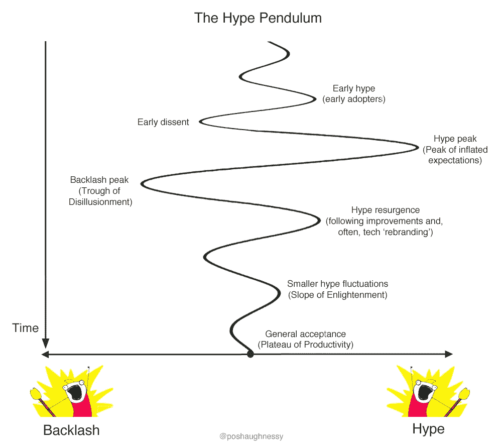
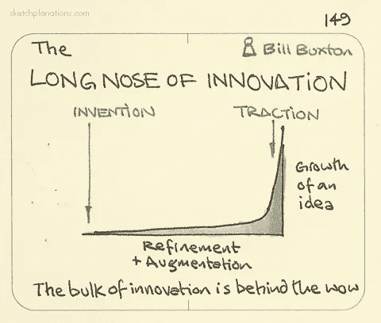
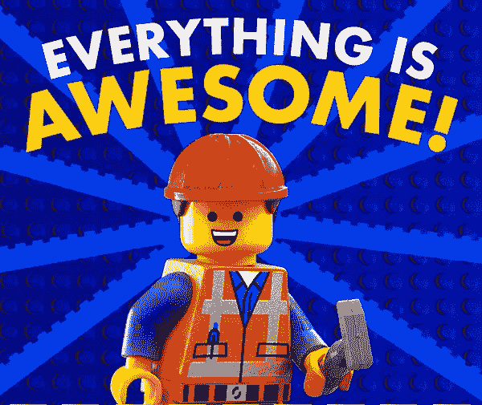

# Web 开发的“炒作钟摆”

> 原文：<https://medium.com/hackernoon/the-hype-pendulum-of-web-development-33f500723f31>

我认为新技术的采用遵循一种特定的模式。不过，我说的不是大家熟悉的“炒作周期”。虽然这种观点很有帮助，但也有一定的误导性:

Gartner Hype Cycle

图表显示了一个简单的高峰和低谷，但现实更像是在*炒作*和*反弹*之间持续的来回拉锯战。我称之为“炒作钟摆”:

让我用 web 开发领域的几个例子来解释一下。

# HTML5 和 PWAs

iPhone 应用商店于 2008 年开业，是在手机发布 18 个月后。就功能而言，网络突然落后了；土著是个很酷的孩子。几年后,《连线》杂志宣称网络已经“死亡”。

尽管 Web 标准社区正忙于 HTML5 的工作。2010 年，当史蒂夫·乔布斯发布了他的“关于 Flash 的想法”时，它成为了主流意识。到 2011 年，随着 HTML5 规范达到“最后一次通话”，我们经历了一次炒作高峰:

> “HTML5 的承诺所创造的炒作几乎达到了狂热的程度”
> - [移动预见，2011 年](http://www.mobileforesight.com/2011/03/html5-hype-time-for-a-reality-check/)

然而仅仅一年后，脸书在其原生应用程序中“抛弃”了 HTML5。网络又一次被淘汰了。这一时刻可能标志着“幻灭的低谷”。

> “当钟摆在 2012 年远离 HTML5 时，它摆得很远，吓跑了许多潜在的创新者。”
> - [读写网，2013](http://readwrite.com/2013/11/18/assessing-the-aftermath-of-the-html5-hype-cycle/)

但在接下来的几年里，人们对 web 应用技术的兴趣又开始悄然兴起。2015 年，一个新术语“渐进式网络应用”被创造出来，用来描述一系列现在都有可能实现的方法和功能。现在我们进入了 2016 年，我们可能会再次看到炒作高峰:

> “到目前为止，你可能已经听说了渐进式网络应用是全人类的未来。他们将带来世界和平，结束饥饿，拯救彩虹和独角兽，给原力带来平衡，等等。”
> - [爱奥尼亚，2016](http://blog.ionic.io/what-is-a-progressive-web-app/)

尽管如此，我确实相信艾滋病人有一个远大的未来。也许在我们完全适应网络应用的生产力平台之前，钟摆还会有进一步的摆动——但是我确信我们会到达那里的！

# 响应式设计

早些时候，人们就已经在制作响应式网站，但当伊桑·马科特(Ethan Marcotte)在 2010 年 5 月的一篇文章中创造了这个著名的术语时，这个概念开始流行起来。它受到了大量关注，但没过多久，反对者就进行了反击，主要理由是移动性能与独立移动网站的对比，对印刷媒体“像素完美”设计的依赖，或者只是所涉及的感知努力:

> “响应式网页设计不适合你的网站”
> - [博主，2013](https://www.inboundnow.com/why-responsive-web-design-is-not-right-for-your-website/)
> 
> “响应式设计是浪费时间”
> - [博主，2013](https://simpleprogrammer.com/2013/09/03/responsive-design-waste-time/)
> 
> 《响应式设计真烂》
> - [博主，2014](https://www.linkedin.com/pulse/20140724084717-160471327-why-responsive-design-really-sucks)

炒作的钟摆需要一段时间才能稳定下来，响应式设计也需要一段时间才能被普遍接受为设计网页的默认方式。我想说，它在 2015 年左右到达那里，这得益于谷歌的 SEO 政策，推动了响应性网站的发展。

# 到处炒作钟摆

每一项新的网络技术都经历了炒作的钟摆吗？在我看来是这样。例如，想想对任何流行的 [JavaScript](https://hackernoon.com/tagged/javascript) 框架的反应。

实际上启发了这篇文章的例子是 NPM——感谢[阿什莉·威廉姆斯](https://twitter.com/ag_dubs)’[ff conf](https://2016.ffconf.org/)的演讲。作为世界上最大的代码模块库，NPM 成为了模块化代码设计的象征。NPM——反过来，模块化代码——在 2016 年因左键盘争议而成为反弹的对象，据媒体报道，[“打破了互联网”](http://qz.com/646467/how-one-programmer-broke-the-internet-by-deleting-a-tiny-piece-of-code/)！

Node.js 是另一个例子。最初由 Ryan Dahl 在 2009 年编写，我记得自己在 2010 年第一次尝试它，那一年 Express 和 Socket.io 诞生了。没过多久，炒作就如火如荼地展开了:

> “为什么 nodeJS 很棒，为什么你甚至不应该考虑使用它”
> - [博主，2013 年](http://www.giantbomb.com/profile/rick/blog/why-nodejs-is-awesome-and-why-you-shouldn-t-even-t/102475/)

不可避免的反弹包括臭名昭著的[“node . js 是癌症”](https://www.reddit.com/r/programming/comments/2jdnsb/nodejs_is_cancer/)帖子。

# 为什么会这样？

炒作钟摆在一定程度上是我们人类注意力工作方式的副产品。平衡的、细致入微的争论不会成为好的头条——咆哮者会得到更多的点击。二元论证和零和游戏因其令人放心的简单性而吸引人。反弹也是我们在快速发展的世界中缺乏耐心的表现；当我们听到闪亮的新技术或方法时，我们想马上使用它。

记住炒作和反弹的极端是创新时间线上的暂时波动，通常比我们希望的要长，这是很有用的。有时候，一种早期的技术形式无法完全起飞，直到它以一种更适合黄金时间的新形式回归。性能是反斜杠的常见主题；幸运的是，随着硬件的进步和软件的优化，性能限制会逐渐减少。有时，我们的开发工具和理解需要一段时间才能跟上。正如*创新的长鼻子*所显示的，创新需要时间来沉淀:

Long Nose of Innovation by Bill Buxton — image by sketchplanations.com

这也是我们动机的一个因素。作为网络传播者，推广最新技术和最佳实践是我们的职责(和热情)。作为 web 开发人员，如果我们发现现实世界中需要解决的问题，这是我们的职责。

# 怎么处理呢

人们可能很容易立即倾向于最新的时尚，或者立即反对它。更安全的做法是让炒作的钟摆摆动，同时我们吸收双方的信息，自己尝试，做出明智的决定。

随着新的库和框架的不断涌现，最近很多人都在谈论这会导致的“疲劳”。正如 [Ada Rose Edwards](https://medium.com/u/c2890cdd7a64?source=post_page-----33f500723f31--------------------------------) [所说](https://twitter.com/i/moments/800993605800329218)，*“彻底了解 HTML、CSS 和 Vanilla JS 将比任何 flash in pan 库或工具包更有长期价值”*。

作为一名开发人员倡导者，如果我曾经过度宣传一种新技术或方法，而没有适当考虑潜在的负面影响，请告诉我。我倾向于说事情很棒；-)

The Lego Movie

尽管有时过于草率和极端，但反弹可能是重要的。它们有助于确保我们不会急于发布技术，以免错过潜在的安全或隐私问题。我们不想成为 Maciej Ceglowski 的 [*中的 Chad 和 Brad，“谁来指挥机器人军队？”*](http://idlewords.com/talks/robot_armies.htm)——*“那些只想在截止日期前挤出一些代码，而不考虑他们行为的更广泛后果的开发人员”*。

虽然有时炒作钟摆可能令人厌倦，但它通常是富有成效的。正如巴拉克·奥巴马最近所说,“进步的道路从来就不是一条直线。我们曲折前进…”。围绕最新网络技术的炒作可能会前后摇摆，但这是所有创新的情况。只要我们总体上保持进步，我们就会让网络保持良好的状态:为每个人提供一个更好、更强大的平台。而且那真的*会*牛逼*！*

*注意:这篇文章是在我作为开发者倡导者的角色之外写的，但是我在三星的移动网络浏览器* [*三星互联网*](http://developer.samsung.com/internet) *工作。您可能有兴趣到* [*阅读更多我们的博文*](http://medium.com/samsung-internet-dev) *和* [*在 Twitter 上关注我们*](https://twitter.com/samsunginternet) *！*

> [黑客中午](http://bit.ly/Hackernoon)是黑客如何开始他们的下午。我们是 [@AMI](http://bit.ly/atAMIatAMI) 家庭的一员。我们现在[接受投稿](http://bit.ly/hackernoonsubmission)并乐意[讨论广告&赞助](mailto:partners@amipublications.com)机会。
> 
> 如果你喜欢这个故事，我们推荐你阅读我们的[最新科技故事](http://bit.ly/hackernoonlatestt)和[趋势科技故事](https://hackernoon.com/trending)。直到下一次，不要把世界的现实想当然！

