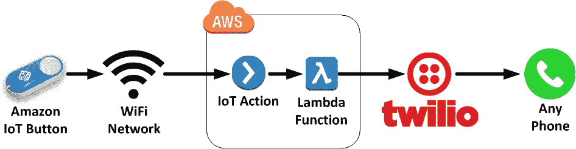
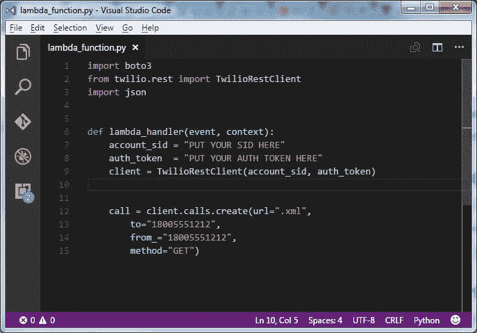
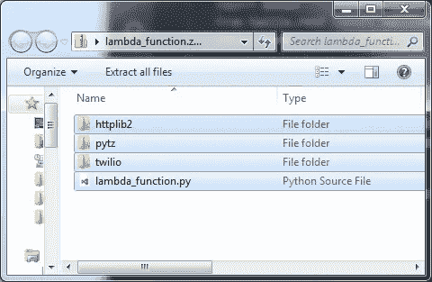
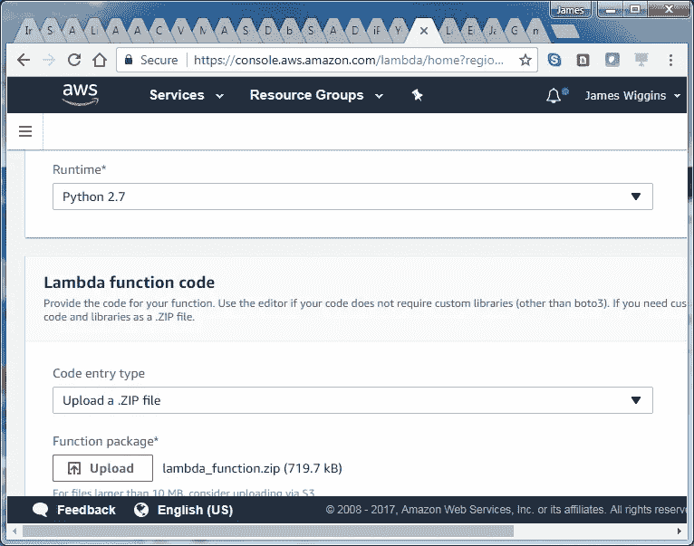
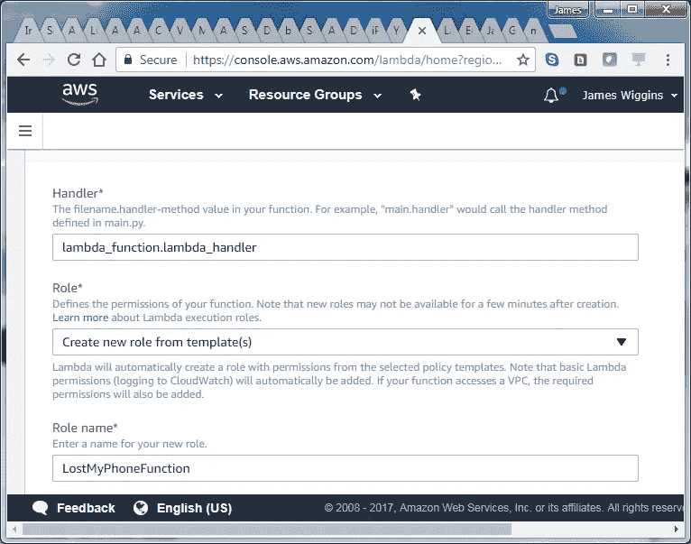

# “我丢了手机”无服务器物联网按钮

> 原文：<https://medium.com/hackernoon/the-i-lost-my-phone-serverless-iot-button-d3550b89ec79>

这是一个关于技术的教程，但它是从我的妻子和三个年幼的孩子开始的。由于忙碌的生活方式和女性衣服通常缺少实用的口袋，我们经常会把妻子的手机丢在家里的某个地方。

这种场景的通常结果是“詹姆斯！你能打我的电话吗？!"经过几次尝试和一些徘徊，我们通常可以在一个只有 1 至 5 岁的孩子才会选择放电话的地方找到它。如果我不在家，这就出现了一个全新的问题。我们有相当一段时间没有座机了，下一步就是登录 I cloud…
不方便。

因此，当我最近深入研究无服务器计算时，我真的想找到另一个实际的用例来实现。进入“我的手机丢了”无服务器物联网按钮。你只要按下按钮，几秒钟后你的电话就响了！所以现在，我的妻子可以在家里随身携带这个按钮，并根据需要多次按下它，直到她的手机清楚地显示出它的位置。

它非常实用，但也是在 [AWS](https://hackernoon.com/tagged/aws) 上体验物联网和 Lambda 功能的好方法。最重要的是，除了按钮本身，AWS 和 Twilio 的所有功能都在它们的“免费层”中！

## **第一步:获得一个物联网按钮**

你需要做的第一件事是买一个[物联网按钮](https://aws.amazon.com/iotbutton/)，你可以从(惊喜！)[亚马逊](https://aws.amazon.com/iotbutton/)。它值 20 美元，但是当你考虑到它实际上是做什么的时候，你会觉得它非常神奇。

## 第二步:注册 Twilio

这里的许多繁重工作实际上是由 [Twilio](https://www.twilio.com/) 完成的，这是一个了不起的服务，它可以做几乎任何你可以想象的电话服务(查看他们在 AWS re:Invent 2016 上的[演示)。我们需要一个开发者 API 密匙来打电话，但是不用担心，我们所做的一切都在他们的免费层。继续注册一个帐户，并复制你的帐户 SID 和认证令牌。](https://www.youtube.com/watch?v=r0ejZ_rFoGg)

## 步骤 3:编辑你的 Lambda 函数代码

为了将按钮按压连接到 Twilio，我们将使用一个实现 Twilio API 的小 Python 函数。继续从我的 GitHub Repo 中克隆代码。

您需要编辑 lambda_function.py 中的 main 函数，并提供您的 Twilio 凭证以及您想要拨打的电话号码(您妻子或其他人的)。这很简单。

Just fill in the blanks with your configuration

乍一看，AWS Lambda 似乎只能执行存在于单个文件中的函数，但事实并非如此。你可以有一个包含很多文件 Lambda 函数，但是你需要先把它们全部压缩。一旦你在 lambda_function.py 文件中编辑了我们的主函数，接着把它和 repo 中的所有子目录一起压缩。

You can call the zip file whatever you want. ‘lambda_function.zip’ works just fine.

## 步骤 4:设置物联网配置

[按照入门配置向导](https://aws.amazon.com/iotbutton/getting-started/)在 AWS 上设置按钮，准备调用您的 Lambda 函数。请务必下载在此过程中创建的证书文件，并将其保存在安全的地方。你需要稍后将这些放在你的物联网按钮上进行身份验证。

当提示您配置 Lambda 函数时，选择 Python 2.7 作为运行时。最初，你会看到你可以在浏览器的什么地方写你的 Lambda 函数，但是我们想在一个 zip 文件中提供我们自己的函数和它的依赖项。从“代码输入类型”下拉框中选择“上传. ZIP 文件”,并提供我们之前压缩的代码。

请确保将“处理程序”字段设置为“lambda_function.lambda_handler”。这告诉 Lambda [在哪里寻找我们的主 Python 函数'*文件名*。*函数名* '](http://docs.aws.amazon.com/lambda/latest/dg/python-programming-model-handler-types.html) 。

[角色是 AWS 管理安全性和权限](http://docs.aws.amazon.com/IAM/latest/UserGuide/id_roles.html)的一种方式，是一个非常重要的概念。AWS 上的安全性是一个很深的主题，但绝对值得理解。一定要给你的 AWS 角色一个清晰的名字，这样你就能记住它在将来的用途。

## 第五步:连接你的物联网按钮并测试！

快到了！现在您可以[按照说明](http://docs.aws.amazon.com/iot/latest/developerguide/configure-iot.html)将您的物联网按钮连接到您的 WiFi [网络](https://hackernoon.com/tagged/network)并上传您的证书文件。一旦完成，给它一个压力！现在回想一下本文顶部的图表，惊叹于打电话时实际发生的所有技术奇迹。最重要的是，您不需要为服务器付费、安装补丁或进行故障排除就能实现这一点！