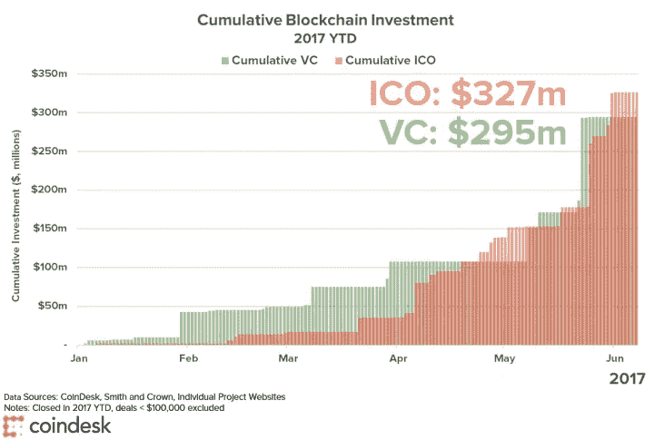
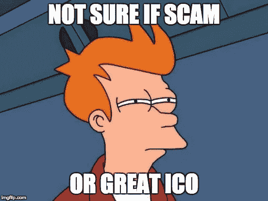

# ICO 困境:理解同一枚硬币的两面

> 原文：<https://medium.com/hackernoon/the-ico-dilemma-understanding-both-sides-of-the-same-coin-5efa257a7b01>

ico，也被称为首次公开募股，是科技和金融界的新名词。通过 ICOs，创业公司能够通过向投资者出售加密货币代币来筹集资金。

今年，通过 ico 已经筹集了超过 30 亿美元(来源: [**CoinSchedule**](https://www.coinschedule.com/stats.php) )。根据 CoinDesk 的数据，2017 年 1 月至 7 月，ico 的融资额超过了传统风险投资(VC)的融资额。

Filecoin 筹集了 2.5 亿美元。泰佐斯，2.32 亿美元。Bancor，1.53 亿美元。是的，这是一笔巨大的资金，特别是对于那些有时甚至没有一个可演示的解决方案的公司来说。

在这种环境下，分析师已经开始将这种狂热与 90 年代的互联网泡沫相提并论，当时纳斯达克一夜之间损失了近 80%的价值，使投资者损失了大量资金。

在这篇文章中，我回顾了对这种有争议的公司融资新方式的不同观点，对比了下一个可能破裂的泡沫的利弊。

# 好吧，但是什么是 ICO 呢？

ico 是秘密创业公司(基于区块链技术的公司，大多数使用以太坊平台)的一种融资形式。就像风险投资或者众筹一样。许多这样的秘密创业公司正在使用 ico 来筹集资金，而不是使用风险资本。

这是如何通过一个团队提出一个商业想法，写一份 [**ICO 白皮书**](https://hackernoon.com/what-to-look-for-in-an-ico-white-paper-successful-token-54eba3787139) 和/或开发一个最小可行产品(MVP)，并发行他们自己的硬币或令牌来实现的。代币面向公众销售，产品发布时将在平台中使用。

投资者使用以太坊或比特币购买这些代币，预计随着产品获得牵引力和采用率的增加，代币将会升值。换句话说，你买的是一种只能在不存在或者团队才开始搭建的平台上使用的货币。奇怪。

例如，有史以来最大的以太坊 ICO 从 2014 年 7 月 20 日持续到 2014 年 9 月 2 日，在此过程中筹集了 1840 万美元的代币。

# ICOs 是骗局吗？

全球各地的监管机构都警告过 ico 的危险，指出通过市场操纵和欺诈出现了类似于互联网泡沫的资产泡沫。 [**韩国和中国早已禁止一切形式的 ico**](https://techcrunch.com/2017/09/28/south-korea-has-banned-icos/)。

> ico 是获得种子级产品 C 轮融资的公司

由于其新颖性，ico 不受监管。因此，作为投资者，你受到的保护较少。尽管风投或天使投资支持的公司必须证明自己，并遵守严格的 IPO 规定，但 ico 并不需要向投资者提供任何形式的正式计划或合同。ico 分发的不是股票，而是代币，代币的价值通常与公司的任何财务指标完全无关。

虽然这并不意味着 ico 是一个骗局，但在投资其中一个之前，有一些事情需要考虑:

*   **ico 吸引了很多骗子**。由于缺乏文书工作，ico 吸引了骗子，他们可以简单地创建一个伪造的白皮书，用 PR 宣传，然后消失。参见 [**红颜知己的骗局**](https://www.cnbc.com/2017/11/21/confido-ico-exit-scam-founders-run-away-with-375k.html) 案例举例。关于这方面的更多信息，请阅读“ [**如何通过 5 个简单步骤**](https://steemit.com/scam/@moonjelly/how-to-create-an-ico-scam-in-5-simple-steps) ”来创建一个 ICO 骗局。
*   **有些是基于纯粹的推测**。人们应该以投资普通创业公司的心态投资 ICO。这是因为他们相信目标市场、理念和团队。最近的 ICO 估值看起来像是投资者更关注潜在回报，这是由于秘密炒作，而不是因为他们已经对机会进行了基本面分析。
*   **创始人即使公司破产也能赚钱**。Tezos 是迄今为止最大的 ico 之一，它首创了创始人从代币销售中获得 8.5%美元收益的想法。也就是说，即使公司失败了(即投资者损失了他们的钱)，创始人仍然会获利。废话。
*   **一些公司为一项毫无用处的业务创造硬币**。因为用区块链来实现他们的想法是没有意义的，所以生意会失败。参见 [**以 https://www.dnxtoken.com/**](https://www.dnxtoken.com/)为例。
*   **存放代币**。如果代币是基于以太坊的，它们可能很容易存储在钱包中。如果不是这样，投资者将很难保证它们的安全。

# 那 ICOs 还有什么意义呢？

ico 也没那么差。他们给有前途的项目机会。想想以太坊取得的成就:从成为世界第二大加密货币，到为创造 [**DAPP 项目**](https://blockgeeks.com/guides/dapps-the-decentralized-future/) 提供平台。 [**Tezos**](https://www.tezos.com/) ，迄今为止最相关的 ico 之一，有一个清晰的价值主张，专注于去中心化治理和投票系统。 [**Ripple**](https://ripple.com/) 似乎是 SWIFT 的天然替代，而且已经是美国运通 这样的大玩家在测试[。](https://uk.reuters.com/article/us-blockchain-amex-ripple/amex-launches-blockchain-based-business-payments-using-ripple-idUKKBN1DG1SX)

有充分的理由对其中的几个项目感到兴奋。ico 使这些公司能够建立 MVP，并调整所有利益相关者之间的激励机制，以便网络能够更快地发展。它们提供了积极的反馈循环，帮助团队有效地学习和解决客户问题。

ico 实际上很好的一些原因:

*   不需要不必要的文书工作。数百个项目没有得到执行，因为它们陷入了现有系统建立的官僚主义。类似于金融科技与传统银行的故事。
*   **社区建设**。ico 让创始人有机会围绕他们的项目建立一个互动社区。这不仅让创作者承担责任，也为开发他们的产品提供了有价值的反馈。
*   获得有潜在价值的代币。ico 提供了廉价投资代币的机会。例如，在以太坊预售期间，一个以太的价格约为 40 美分。今天，同样的乙醚价值约 450 美元。
*   **创新激励**。当前对 crypto 和 ico 的大肆宣传吸引了大量人才。这些新的企业家将推动这一领域的进一步创新，更多有趣的产品和平台将被创造出来。

# 关键要点

**1。ico 是有风险的投资，有些是骗局。如果 90%的创业公司都失败了，ico 充其量是一场赌博。缺乏监管为创新提供了巨大的可能性，但也为骗子提供了机会。**

**2。愚蠢的钱跟随聪明的钱。不知情的投资者的钱正在抬高 ico 的价值。垃圾 ico，以及支持它们的人，会继续稀释区块链的可信度。**

**3。惊人的秘密创业公司是存在的。**
我们已经看到一些这类成功的企业(以太坊、Tezos、Ripple 等)。)，我们还会继续看到更多。他们通常:有一个非常明确的用例，需要使用区块链去中心化，根据他们追求的机会大小有一个合理的估值，并有一个可信的团队支持这个想法。

**4。ico 有助于实现正反馈循环。**
真正有助于解决真实客户问题和发行代币筹集资金的项目必须将它们置于一个强大的正反馈循环的核心，激励所有利益相关者参与进来，以实现更大的利益。

# 接下来呢？

ico 将继续成为加密货币和区块链的重要组成部分。人们不能忽视他们所做的好事。从启用以太坊到促进 DAPPs 的创建，以及激励工程师提出更多更新的令人兴奋的用例。

相反，ico 是，而且将继续是，一种非常危险和高风险的投资方式。说到底，如果团队/产品真的那么棒，他们为什么不通过风投筹集资金呢？去掉风投和传统的尽职调查，会让骗子继续钻漏洞，谋取私利。当心。

—

# 出发前，请考虑:

*   *推荐*或者*分享*这个如果你觉得有用。它给了我🔋写作时要知道人们会从中发现价值
*   如果你想看更多文章，可以通过 RSS 订阅[，通过电子邮件](http://feeds.feedburner.com/enricduranyblog)订阅[，或者通过媒体](https://feedburner.google.com/fb/a/mailverify?uri=enricduranyblog)订阅

*本文原载:*[http://www . enric durany . com/strategy-trends/what-are-ico-und…of-the-same-coin/](http://www.enricdurany.com/?p=2168&preview=true)