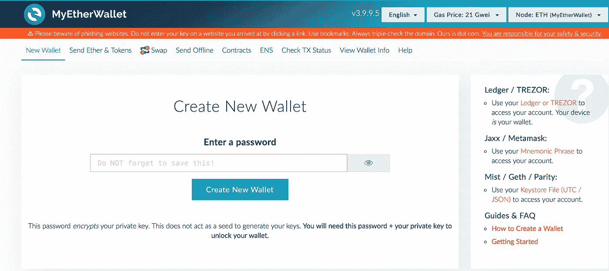
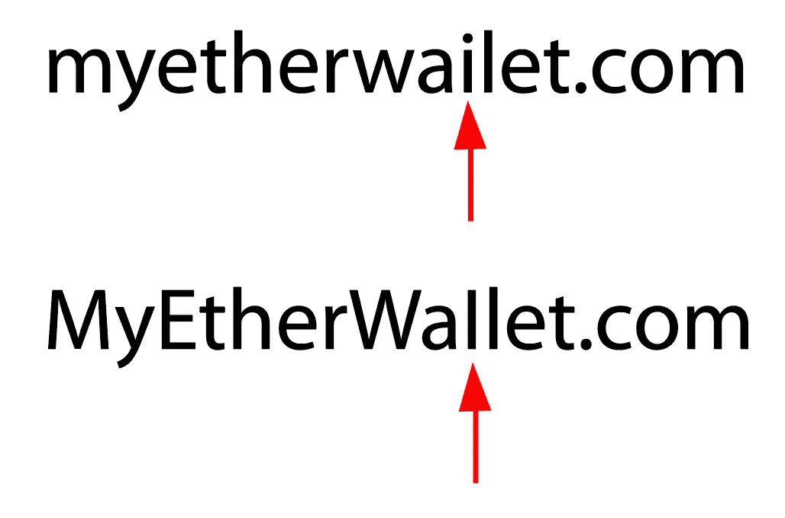
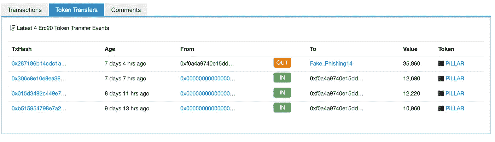
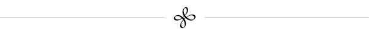

# ICO 手册

> 原文：<https://medium.com/hackernoon/the-ico-handbook-705a89fa8978>

该页面可通过[www.theicohandbook.com](http://www.theicohandbook.com)访问。这篇文章是《代币手册》 的一部分，这是一本关于代币、ico 和风险投资的书，写的是 Medium.com。

如果你正在计划一个 ICO，这是一本手册、指南和一些来自我们 2017 年 7 月 ICO 的颜色。ICO 世界里没有什么事情是按计划进行的。我们的没有。你的不会。成功的代币销售需要技巧、博弈论、快速反应和运气([主要是运气](/@pullnews/a-response-to-bill-gross-on-what-causes-startups-to-succeed-1476efbec3ec))。

这项工作分为五个部分:

*   [观念演变的故事](https://theascent.biz/the-story-of-the-pillar-project-bc7a653c8931)
*   [我们 ICO 的实时故事](https://hackernoon.com/twenty-years-and-three-months-to-create-an-overnight-sensation-cf7190df871b)
*   这本 ICO 手册(这篇文章)
*   ICO 资源列表(即将推出)
*   还有[一个录制的关于 ICO 原则和支柱 ICO 的网络研讨会](https://www.brighttalk.com/webcast/13689/260431)

# 目录

**第一部分规划**

提供条款
通信
社交媒体
广告
公共关系
黑客、网络钓鱼者、间谍软件和窃贼
智能合同和多签名钱包

**第二部分:ICO 流程**

**第三部分:售后服务**

**第四部分——运行项目**

**总结**

一句警告的话:对公众的象征性销售不可掉以轻心。这里大概列出了 200 件你必须做的事情；你可以完美地完成其中的 199 个，然后在一瞬间失去所有的钱和客户。你总是离灾难只差一小步，即使在筹款后很久。象征性销售是一个非常长期的承诺。

*免责声明:本文中的信息仅供参考，不构成法律建议或指示。加密货币和代币的风险由你自己承担。我尽力提供我所拥有的最好的信息，但是我不能保证当你按照我的建议行动时会成功。*

# 第一部分:规划

**令牌有什么作用？它始终归结为一个问题:令牌是做什么的？正如[威廉·穆加耶解释的那样](http://startupmanagement.org/2017/06/10/tokenomics-a-business-guide-to-token-usage-utility-and-value/)，把它分成三个部分是有帮助的:**

*   令牌的作用—它在您的系统中是如何工作的？
*   令牌的用途—它实现什么目标？为什么这个令牌是实现它的最佳方式？
*   功能—它有哪些功能使它成为适合这项工作的工具？

人们很容易被这些问题的快速答案所吸引，但是如果你只是象征性地出售来赚钱，人们在一英里之外就能闻到。绝大多数代币销售没有达到上限。超过 50%的人勉强超过他们的最低门槛，你根本不会在报纸上读到他们。继续问一些困难的问题:令牌是做什么的？它是怎么做到的？

人们正在撰写关于令牌模型的文章。Vitalik 最近发表了一篇关于代币模型和产品的文章。我有自己的框架，当它出来的时候我会链接到这里。

**挑战你的令牌**
如果你真的相信你的令牌，现在是时候把你能找到的最好的魔鬼拥护者带来了。让他们挑战你的假设，并迫使你为他们辩护。如果他们告诉你，听起来没有你想象的那么有用，那就要注意了。作为关于支柱令牌应该做什么的许多来回争论的结果，我们最终决定将支柱的百万分之一的单位称为坏脾气者，因为这两个家伙迫使我们确保令牌具有目的、明确的使用模型以及在系统中的价值。问:

*   谁想购买并持有这种代币？
*   为什么人们想要使用它？
*   在什么场景下人们会需要这个令牌？
*   同样的工作换一种方式能做得更好吗？

**代币是项目融资**
代币和股票完全不一样。任何想用代币代替通常的筹款文书工作的人都不知道代币是什么。代币对于风险投资或私募股权基金来说并不是一个好的选择。代币不是给初创企业的。大多数代币更像是可交易的 Kickstarter 项目承诺——你向早期买家出售未来产品，未来代币对买家有效用。就像 Kickstarter 一样，销售的平台或形式不会神奇地带来买家。你必须亲自找到每一个买家。

例如，尽管支柱项目筹集了 2000 多万美元，但母公司 Twenty Thirty 几乎没有资产。我们筹集的一分一毫都不能用于公司——一切都必须用于这个项目。事实上，一旦我们筹集到一些股权资金，我会取消该项目的工资，以减少阻力。关于花钱的问题我以后再说。

**代币收入是正常的营业收入**
就像 Kickstarter 一样，你将在年底根据你的总收入减去支出进行纳税。这就是为什么如此多的公司和组织位于瑞士楚格的原因之一——公司所得税约为 14%。7 月以后不筹钱也是一个很好的理由。你在日历年中筹集的越早，你在纳税前的第一个关键年中花费的时间就越长。政府通过减少你的纳税义务来增加你的支出。对于那些看不到商业模式或未来收入的开源项目来说尤其如此。如果你在接下来的几年里没有收入，你会想要加速支出。

考虑这样一个场景:你在以太高的时候卖出了你的代币，你要根据卖出时的平均价格来计算你的收入。后来，在年底，乙醚已经下降，所以你有一个未实现的损失。当你认为乙醚是“现金”时，税务机关却不这么认为。你需要卖出乙醚，再买回来，只是为了实现亏损，减少你当年的应税收入。

假设你筹集了 100 多万美元，并且你有一个开源项目，你想做的第一件事就是确保在年底前成立某种免税实体。如果您的令牌销售即将到来，并且您的项目是开源的，那么在 ICO 之前形成实体。太多的人事后会考虑这个问题，但是请注意我的建议:**如果你是开源的，在你的 ICO** 之前建立一个免税实体。

**观众是谁？**
代币买家主要有四种:

1.  保险业者
2.  投资者
3.  商人
4.  未来系统的自然购买者和用户

你可能会瞄准那些拍摄了许多早期 ico 的大鲸鱼，但不要指望这个。越来越少的人开始玩 ICO 掷币游戏。我的建议是，将你的整个活动瞄准你的自然买家，并对他们中的许多人感到满意。如果你是一天中的大人物，你的 ICO 会在几分钟内结束，但是把它当作一个奖励，不要指望它。

追逐你的自然买家意味着大约三个月的活动——两个月的宣传和一个月的销售。很难估计这需要多少工时，但肯定会有几千个。

**合法吗？**
取决于你跟谁说话，是或不是。对此有很多讨论。目前的最佳做法是不向美国公民提供任何代币，原因很简单，因为 SEC 不可能事后批评，而且以后可能会出现问题。最近[SEC 裁定道的代币是证券](https://venturebeat.com/2017/07/25/sec-to-blockchain-community-you-are-now-regulated/)，但是那些代币*是*证券！与大多数 ico 提供的系统令牌大相径庭。这是一个棘手且不断变化的局面。很多网上的观点见最后的链接。

标准做法是将美国 IP 地址列入黑名单，并将其发送到一个非销售网站，从你的简讯中排除，并说你没有向美国人提供代币。当然，如果你的令牌看起来或闻起来有点像证券，这是有意义的。

然而，在 Pillar token 销售期间，我认为这是一波完全没有道理的恐惧。正如我在我的事后分析中所写的那样，我不认为一个标准的 ERC20 系统或实用令牌是一种安全，我甚至不认为 SEC 对此有管辖权——那会去 CFTC。所以我站出来说，我愿意接受风险，向美国人开放我们的网站，我们做到了。我不喜欢共有的错觉。但如果你愿意承担责任，你应该咨询律师并做出自己的决定，这可能是很重要的。

**它是如何构成的？**
是 ERC20 令牌吗？有多少？它们是可分的吗？回答这些问题的最好方法是看看其他代币销售。总的来说，是的，比你想象的多，而且精确到小数点后 18 位。

你的资产是什么？
想想给所有这些东西打个分，把分数加起来…

**跑代码**是大事。如果你有什么工作，人们会想尝试或检查它。

顾客是一件大事。如果像勇敢的浏览器那样，你的免费产品拥有数百万快乐的顾客，你就有很大的机会发行代币并筹集大笔资金。

**开源。如果你的令牌将变得有价值，并且有网络效应，你将不得不捍卫不开源。大部分项目都是。我们知道我们想要开源代码，我们找了一个开源顾问来帮助我们确保我们做的事情是正确的。随着我们项目的发展，我们将继续与他合作。**

**承诺。**您的代币购买者希望您承诺实现项目目标。如果你许下诺言，他们希望你信守诺言。假设你白皮书中的每一个字都会在法庭上被宣读。我们承诺最低投入 800 万美元，我们的团队在各个方面都非常活跃。

**你的负债是什么？**
网上能说的，就一定会说。如果有任何负债，就会被发现。你可能无法避免人们做出快速的假设并得出错误的结论。但是试着列出任何负债，并提前解决它们。

**营销**
营销最重要的方面是确保代币有合法的用途并满足市场需求。然后你需要传达这一点，并增加社会认可。几乎所有的营销工作都发生在实际销售活动之前。以下是一些营销要素。我将向你们展示牛排和咝咝声，因为，嗯，这是营销，而营销主要是咝咝声…

**预售**既是向主要买家发出的信号，增加了社交认可，也是你向真正想要代币但可能没有能力在主售中购买代币的人发放代币的一种方式。你可以看看其他人是如何做到这一点的——这有助于销售一些合理但数量很少的产品。你可以阅读我们疯狂的预售故事[——它有许多可移动的部分。](https://hackernoon.com/twenty-years-and-three-months-to-create-an-overnight-sensation-cf7190df871b)

顾问是应该相信你的项目的人。你不应该为顾问支付太多(代币)——不管怎样，他们应该想帮助你。使用你的银弹和你已经建立起来的信誉来邀请人们加入，并以正确的理由加入。我听到一些人说顾问的电话簿闻起来像先令，但我不相信。你的团队成员越多越好，只要他们是合法的并且对项目感兴趣。

**合作伙伴**帮了大忙。作为完全合作伙伴的公司是一笔巨大的财富。愿意支持的公司是有帮助的。如果你能提到他们工作的公司的名字，即使是那些愿意加入你的客户委员会的人也会有所帮助。

**路演。如果你想进入中国市场，你应该去中国。我决定不买，这可能会影响我们的销售。很难知道，但现场事件可能是你沟通策略的重要组成部分。**

标识增加了有效性，经常欺骗人们认为销售比实际上更合法。我见过 ICOs 把 CoinBase 和北海巨妖的 logos 列在首页，不是因为他们是合作伙伴或者代币列在那里，而是因为你可以在那里换钱！每个人都知道你可以通过这些交易所换钱，但这些标识是公认的，并为这个项目提供了虚假的合法性。同样的道理也适用于提及你的项目的媒体标识，不管有多少——如果这些出版物中的任何一个(被付费)在项目上刊登了一篇文章，那么经常会看到 CoinDesk 和其他媒体标识。如果你能得到许可，最好的标志是真正的合作伙伴公司。

**外语翻译**需要投入。如果你想进入一个重要的外国市场，你会需要它们的。翻译你的白皮书和网站要几千美元，更不用说创建和维护网站了。你会不断地用那种语言做出改变和公告。你需要用那种语言在社交媒体上得到帮助——会有很多问答。

**赏金计划。**你可以为签名头像(Reddit 和 BitcoinTalk 中的人物“页脚”行)、推文、YouTube 视频、文章、论坛中的谈话等等运行一个赏金程序。你通常可以用代币或者货币和代币的混合来支付。有人帮助组织奖金计划——更好地了解你在做什么，并正确设定期望，因为你希望这些人在销售后感觉良好。看到 ICO 将 2-4%的代币用于支付奖金(在营销预算下)并不罕见。

然而，许多赏金计划付钱给那些不透露他们被付钱制作内容的人。一方面，赏金计划通常是“创造你想要的任何东西，诚实地表达你的观点”，那些付费的人不会设置任何限制或说不公开支付。但另一方面，我们都知道，如果你说项目的好话，你会得到更多的代币。美国有一部“博客中的真相”法律，它应该适用于所有的社交媒体，尤其是那些通过视频博客赚钱的 YouTubers。如果你付钱给人们，鼓励他们说出他们想要的，这没什么，但与其采取“放任”的方式，你应该要求他们提前披露任何报酬。

我们没有要求披露，我们应该这样做。媒体中的诚信是一个严肃的问题——如果我们不为自己做到这一点，它给了监管机构另一个理由来为我们做到这一点。

这不是非黑即白的情况。一些 YouTube 视频博客对我们的项目非常热情，他们制作了自己的视频，我们决定事后用代币奖励他们。

Vloggers、tweeters 和其他有影响力的人——保护你的声誉，并在你制作的任何内容中包含金钱激励信息。

**网上事件。**我参加了很多网络研讨会，并在代币销售期间安排了特定于代币的网络研讨会(包括[一次关于我们自己的 ICO 流程的研讨会](https://www.brighttalk.com/webcast/13689/260431))。关键是提供好的价值，而不是广告。我们最终使用 Zoom 制作了几个团队视频，观众可以看到我们作为一个小组在讨论这个项目。这些结果很受欢迎。你可以组织活动并做广告，这样你既有了提问的实时观众，又有了为你服务的在线资产。

**了解购买行为。**人们会看乙醚的价格，一般会在最后一刻买入。所以如果你有打折窗口，你会在每个窗口的最后卖掉大部分代币。你在周末会有不同于平时的观众。人们一般都是跟随者——他们在找别人先跳。

你必须决定发行多少代币。然后你需要决定发售期。因为人们在任何交易的最后一秒钟购买，也因为如此多的交易在几分钟内被抢购一空，我决定开展为期四周的活动和 60 小时的销售活动，让人们有机会在周末和工作日购买，而不是拖延。我认为这将是其他人将来的做法。我现在认为那是个错误。

我相信最好是去追求你的自然观众，给他们时间去学习和购买代币。我会用 2-4 周的销售期进行 6-8 周的活动。

你应该只有一个代币池，仅在以太中定价。人们会换其他加密货币来购买——你不必担心这一点。

**预售** 预售应该在主销前几天进行，因为你不希望乙醚的价格在两者之间移动太远。您可以对两者进行不同的定价，但如果以太网的价格相同，那么在预售中您可以获得额外的代币(例如，买 10 送 1)，这是最理想的。这使得所有代币在出售后都是一样的。

我们计划在预售中只销售约 2%的代币，但需求如此之大，以至于我们将这一比例提高到了 8%，并在 34 分钟内销售一空。我会说提供高达 10%的折扣是没问题的，如果你只卖 50 万美元，这是一个非常好的预售。我们的很特别。

我很惊讶某些大投资者寻求多大的折扣——在 50%的范围内。我们最终没有完成这些交易，也不需要完成，但认真的代币猎人正在 ICOs 之前寻找交易。然而，至少其中一些人会很快有兴趣出售。

无论你在计划什么，你都没有为沟通做好准备。以下是一些要素:

**一段讲解视频。**你需要至少一个半专业的 2-3 分钟的专业配音视频。这不是一个选项。

**一张白纸。**白纸是硬的。你不能把它们出租。我们 35 页的白皮书在很短的时间内轻松完成了 200 个小时的工作，我已经写了很多。如果你有一份白皮书，你必须拥有它，并与专业作家合作，以确保它的可读性。

**文章。**文章越多越好。许多出版物都是付费播放的，所以你可以随时在头版发表文章。除了在中国，我们没有这样做，但你可以假设几乎没有致力于加密的“纯新闻”网站。我不会指名道姓，但“秘密新闻”网站都渴望通过他们的平台赚钱。

**面试。我认为面试对你的交流平台至关重要。我提前几个月安排了对主要记者和视频采访者的采访。他们接受采访是因为这个项目很有趣。随着竞选活动的展开，视频博主们想采访我，我抓住了一切可能的机会。在我们的 ICO 之后，它们还会持续很久，你的也应该如此。**

社交媒体你必须认真对待社交媒体。这里有一个细目分类…

**推特**很关键。你不仅需要在 Twitter 上全天 24/7 的报道，你还需要提防类似的 Twitter 账号使用你的图片来吸引你的追随者。这发生在我们身上。

**懈怠**既是福也是祸。这里有令人惊叹的 coin fund slack，许多聪明的代币投资者在这里闲逛。另一方面，许多休闲裤现在充斥着骗子和网络钓鱼者。在你宣布代币拍卖之前，你必须把你的松弛部分锁起来。

脸书不是我的第一选择，但它可能对我们有所帮助。如果你想联系那些关心你的项目的人，花不多的钱给成千上万的人发信息可能是一种成功。另一方面，这些人可能正是想要在出售后立即出售代币的人。

如果你像我一样有成千上万的粉丝，LinkedIn 的文章就很棒。很多人在 LinkedIn 上联系我，说他们已经购买了我们的代币。

YouTube 对于草根运动来说是很棒的。如果你真的想和你的观众交流，想办法鼓励人们制作视频，你自己也要多做一些。以下是更多相关信息。

**Reddit 和 BitcoinTalk** 很关键。我们的项目在 Reddit 和 BitcoinTalk 上获得了 98%的支持率，这要归功于文达因集团的[的辛勤工作，他们创建频道，运行奖金计划，回答每一条评论，并全天候两班倒地防范麻烦。我们给了他们很高的报酬，他们非常正直，确保我们的信息清晰无误。他们甚至对我们的项目感兴趣。他们说我们诚实守信，让他们的工作变得容易。没有他们我不会竞选。](http://vindynegroup.com)

**广告**
一方面，当你看到 ico 的广告时，你会点击吗？我不知道。另一方面，如果你为广告支付 1000 美元，并获得 5000 美元的代币销售，这是一个胜利吗？这是个人的选择。我坚信大型代币购买者不会点击广告来寻找他们的下一个代币。另一方面，越多的人在那里看到你的名字，他们就越有可能最终决定检查它，你需要人们检查你的代币销售！

有直接回应广告和品牌建设广告。每个都有不同的目的和不同的度量标准。你可能希望在开始的时候做意识广告，当你看到它们起作用的时候，再转向回应广告。

我个人不喜欢广告。我认为这显示了绝望，吸引了象征性的猎人，而不是自然的买家。最后，我们做了一些横幅广告作为实验。我认为他们帮了点小忙。但我以前也错过。你应该考虑广告和实验从来没有伤害。

我认为公关远比广告重要。我们与著名的公共关系部门的令人惊叹的团队合作(他们有非常好的系统来管理和跟踪一切)，如果我们一开始就足够大胆地在美国做公关，我会与大卫·瓦克斯曼和文达因一起工作。在你的目标市场，你需要公关帮助。

我们发表了很多文章，这很有帮助。人们在 Medium.com、LinkedIn 和其他平台上尊重好的、诚实的写作。讲个故事。告诉他们他们的世界里有你的令牌。非常重要的是，不要谈论你的代币将如何升值，而是谈论你未来项目的价值及其对社会的贡献。你不是在卖代币，你是在卖系统。和 KickStarter 一样。

你可能认为你能处理好客户服务。十天内我们收到了一万封电子邮件。我们不得不手动回复数千封电子邮件。这花了几乎三个全职当量。我们熬夜到凌晨 3 点，回复一些人的邮件，他们被告知和承诺了一些我们从未说过或承诺过的事情。大部分是损害控制，因为人们对我们发出的各种信息、误解、速度过快以及成为黑客的猎物感到不安。

让他们进入时事通讯几乎是不可能的，因为人们注册了时事通讯后，他们会确认，而他们的第一期会进入他们的垃圾邮件或推广文件夹，在那里他们永远也找不到它。我们认为我们应该每天更新我们的 FAQ，但是我们从来没有时间。我们关注的是时事通讯，但我确信数百人，可能数千人从未看过它。对于已经注册的人，我们的开放率略高于 50%——我确信，通过从一开始就告诉人们如何正确地注册一份时事通讯，这个开放率还可以提高。

提前建立[客户服务系统](http://groovehq.com)将是明智之举，这样你可以确保你最常见的问题很容易得到回答。我们发现自己写的是“您的回答请看简讯，谢谢。”成百上千次。感谢上帝的[回形针](http://copyclip.com)！

你最终将为几个钱包提供技术支持。你一定很清楚你支持哪些钱包，不支持哪些钱包。我们只支持我的 therWallet，并这样说，但许多人希望得到其他各种钱包的帮助。

你不可能取悦所有人。无论你做什么，有些人都会发送讨厌的信息。你也会从那些真正被你的项目吸引的人那里得到感谢、赞扬和爱。像对待黄金一样对待他们。

**错误**
很多人在尝试进入任何 ICO 的时候都会犯错误。人们会将他们的以太网发送到几乎任何智能合同，这使他们很容易成为网络钓鱼者的猎物。然后，他们将把代币送到任何地方，实际上是为了把代币送到交易所或另一个钱包而赠送代币。他们将直接从交易所发送您的智能合约。尽管我们制作了视频，一步一步地向人们展示如何使用 MyEtherWallet 做任何事情，但许多人忽略了这些视频，大多数人也没有完全按照视频操作。

你在这里的沟通至关重要。你必须小心谨慎，清楚你是如何处理问题的，你的政策是什么。即使我们以书面和视频的形式陈述了我们的政策，许多人仍然认为我们在他们犯了错误后欠他们钱或代币。

**黑客、网络钓鱼者、间谍软件和窃贼**
黑客被集中的财富所吸引。黑客喜欢混乱，并且愿意帮助制造混乱。ICO 至少有以下漏洞:

**社交媒体网络钓鱼:**看起来像你的网站和 Twitter 账户。如果你有一个受欢迎的 ICO，他们会在之后“扩大你的销售”,并给人们发送地址。这个管用。我只想让你看看钓鱼网站是什么样的:

这个网站看起来就像 MyEtherWallet.com，甚至在顶部有一个钓鱼警告。这就是钓鱼网站的样子。它看起来和 MyEtherWallet.com 一样。我现在要给你这个网站的网址，但是不要想着去那个网站，因为你的浏览器会记住(我是在一个我不用的浏览器上做的)。以下是网址:

明白是怎么回事了吗？大写的 I 看起来像小写的 l。在网页上的文本链接或虚假的电子邮件简讯中，你不会知道其中的区别。这导致人们损失了价值数百万美元的代币和以太。

**看起来像你的网站和时事通讯。就在几个 ico 以为他们要改变网页的时候，他们被黑客攻击了，却发现自己被锁在了自己的网站之外，一个相似的网页被插入了另一个地址。告诉人们应该使用书签或键入网址。还有一个 Chrome 插件叫做 [EtherAddressLookup](https://chrome.google.com/webstore/detail/etheraddresslookup/pdknmigbbbhmllnmgdfalmedcmcefdfn?hl=en-GB) ，据说可以验证域名，现在 MyEtherWallet 有了一个 Chrome 插件[——如果人们愿意使用它的话。](https://chrome.google.com/webstore/detail/myetherwallet-cx/)**

你的网站是一个很大的漏洞。您需要 Cloudflare、双因素身份认证、硬密码，并且只有极少数人在操作。我们网站的域流量如此之大，以至于我们无法更改网站——更好的方法是准备好 ICO 网站，然后更改 Cloudflare 或域指针。我不知道其他人是如何做到这一点的，但这需要做得正确，因为在最初的几分钟里，可能会有成千上万的人访问你的网站。

**域名。**黑客会得到容易混淆的相似域名。一个新策略是使用**。TLD 和你的名字。对于一个大 ICO 来说，买几十个类似的域名，不让他们指向你的站点是有意义的，这样人们就知道他们必须正确拼写你的域名。**

**Slack** 好像全是钓鱼短信。在你宣布你的 ICO 之前锁定你的松弛。除去任何你不认识的人。我们很聪明地创建了我们自己的 ICO slack，只提供需要的人，这样主要的公司 slack 可以照常进行。我们小心翼翼地不在我们的 Slack 之外分享非公开信息。如果你使用 SlackArchive，禁用并删除。

**键盘记录程序和间谍软件。我们几个代币购买者的代币不见了。我猜他们有间谍软件监视他们制作钱包。**

**以太扫描。**您可以在 Etherscan 上搜索关键字。这是什么意思？人们可以在搜索窗口中键入您的项目名称，并通过关键字找到您的智能合同。这样，他们也能找到你钱包的地址。如果你没有想到这一点，你现在应该停止一切，寻求专业帮助。

**预售**。我们无法告诉买家我们的预售何时到来。我们有如此多的需求，如果我们给出一个确切的日期和时间，黑客们就会准备好他们的假网站和推文。这也让我们的买家感到困惑，他们中的许多人对错过我们的惊喜销售感到不安。预售应该尽可能私下进行，只使用你的官方简讯，不要使用其他任何东西。

这里有一份购买代币者在购买代币之前/之后应该采取的预防措施清单。

**智能合约和 Multisig 钱包**
你的整个筹资过程都依赖于智能合约和钱包来储存你的资金。如果你做得 99%好，你会失去一切。你不仅必须有在这些精确类型的智能合同方面有经验的人，你还必须审计，测试，并且可能运行一个 bug 赏金。你可能想从 Zepplin 的公开合约开始。你可能想要像 [TokenMarket](https://tokenmarket.net/) 或 [Waves](https://blog.wavesplatform.com/how-to-run-an-ico-e21b9f8c11d6) 这样的一站式服务——现在这样的服务越来越多了。

无论如何，您需要对您的智能合同进行审核和测试。有几个很好的团体在做这件事。我们与 DLT 实验室合作，他们不仅非常专业，而且收费合理。我肯定会再次与他们合作。我会把它们列在资源页面上。他们说的都是同一件事——在销售前几个月准备好智能合同，因为审计过程几乎肯定会涉及重写，并且您希望智能合同在到期日之前准备好。保持你的业务逻辑简单。智能合约的行数越少，出错的几率就越小。审计的价格应该在 5，000 美元到 20，000 美元之间，但也有可能更高。一些人非常相信[智能合同漏洞奖金](/@OAX_Foundation/openanx-bug-bounty-program-ccc6e981fd6a)；我发现审计和测试足够彻底，足以让我树立信心。

例如，售前和销售应该针对相同的令牌，这些令牌应该可以互换。但是您的售前和主销售将使用不同的智能合同，因此您需要协调这一点。我们手动将预售地址移入主销售合同，效率低下，导致延迟。理想情况下，您使用一个智能合约，该合约在不同的日期具有不同的可用性，但也更复杂，因此风险也更大。

现在大多数智能合约都设定了一定数量的交易区间，而不是基于时间。这需要一个像样的估计，可能需要调整。估计未来 10 多天还剩下多少区块是不实际的，所以你公布日期和时间，然后在结束前大约 24 小时，你估计正确的区块并公布。公布一个结束区块比公布一个结束时间好。

将智能合约的 testnet 地址放在您的网站上已经成为一种常见的做法，这样人们就可以找到并检查您的智能合约。不要这样做。买家会把钱寄到他们找到的任何合同地址。如果他们汇款到你的 testnet 地址(就像许多人汇款到我们的地址一样)，他们将会血本无归。贴一张便条，邀请技术人员联系你，要你的 testnet 地址。

我建议把你的以太/比特币放在一个多西格钱包里，这是现在的标准做法。不幸的是，[奇偶校验 multisig 钱包有一个严重的缺陷](https://blog.ethcore.io/the-multi-sig-hack-a-postmortem/)，许多团体因攻击者而损失了大量金钱。对于我们的以太，我们使用 [Gnosis multisig 钱包](https://wallet.gnosis.pm/)，我们非常满意。我们要花一两个小时才能取出现金，这是件好事。你可以在我对 Lykke 平台的描述中了解更多关于原子所有权和 multisig 钱包的信息。

# 第二部分:ICO 流程

一切准备就绪。是时候直播了。如果你完成了你的工作，很多人将会访问你的服务器，发现你的智能合同地址的公共页面。这也是黑客们一直在等待的时刻。接下来几分钟内出错的可能性非常高。

正如你在报纸上读到的那样，最近的 ico 在几分钟内售罄，事情进展顺利的可能性非常低。如果发生了，恭喜你，但这只是第一天。

你的首要任务是保护你的买家免受骗子的伤害。他们会同时出来。你最好的工具是你的时事通讯，它指导人们如何进入你的 ICO。一些提示:

*   在发布之前，**制作一个视频，展示如何用真实地址**购买代币。将此视频保存在另一个网站或服务器上的 YouTube 之外，在那里您可以保持其私密性，并在发布其他内容之前更改设置。
*   让人们为你的网站设置一个书签。告诉他们把它打进去。警告他们点击一个链接会把他们带到一个看起来正确但地址错误的页面。对他们进行比你认为必要的更多的关于网络钓鱼的教育。
*   告诉人们**地址会通过你的时事通讯和你的网站同时出现**，但是时事通讯要好得多，因为你的时事通讯是你的头号真理来源。(确保那个账户没有被黑。)尽可能让你的简讯简单无误。
*   一看到假货就在推特上回应。
*   告诉人们将他们参数设置为 60 Gwei 和大约 200，000 个气体限制，并尽快下订单，就这样。不要再点了。不要少量尝试看看(只要他们有正确的地址)。不要胡乱尝试。下令吧，让区块链做它该做的。不要给你发邮件问他们的代币在哪里！多次告诉他们会发生什么，这样他们就不会发邮件问你代币在哪里。
*   时机成熟时，取消暂停并启动智能合约。不要认为你可以把它放在区块链上而没有暂停功能。

我不能给你接下来会发生什么的剧本。假设你要找一个“自然购买者”受众，你会想要安排活动和制造新闻来继续造势。它可能是快速而激烈的，也可能是缓慢而稳定的。但是你有越多的买家，你就能在这个基础上吸引越多的买家。尽早给予更大的折扣是有道理的，但我认为折扣不应该成为吸引人的因素。应该是项目。你的销售持续几周的原因是为了继续把消息传出去，并从那些刚刚购买的人那里获得新的顾客。召集你的新基地，请求他们的帮助。如果你有一个伟大的项目，并与你的观众沟通，他们会的。

在这段时间里，你会不停地与人握手，一遍又一遍地回答同样的问题，对许多人不打开和阅读时事通讯而是发送个人邮件感到沮丧，通常会使其他事情变得更难。在这段时间里，你必须记住你实际上是在销售产品，他们是你的客户，而不是你从他们那里拿钱来做你的项目。这可能比你想象的要难。

与此同时，你所有的媒体渠道必须加班加点，互相支持。利用你的顾问和他们的关系，尽可能多地安排面试。观察哪些信息转化为销售。对不同的受众使用 A/B 测试和不同的信息。

我们几乎每天都有现场活动，我们都在一个缩放屏幕上，向 YouTube 直播，我们一直有 200-500 人观看和提问。我们有机会介绍所有的团队成员，让人们有机会了解我们。因为我们总是先人一步思考，所以人们有所期待。

为了结束销售，我们有一个“控制室”广播，倒数最后几分钟。我们很惊讶有那么多人看了那个！我们向他们表示感谢，并告诉他们，我们的大型启动广播将在第二天，保持势头。

# 第三部分:售后服务

假设你的销售额已经达到最低，现在有两个问题以人们打字的速度出现:

我的代币在哪里？
这是轻松的头号问题。人们会直接从像比特币基地这样的交易所给你寄来乙醚，在这种情况下，你必须告诉他们他们的钱已经永远不见了。人们会有你不支持的钱包。事实证明，MyEtherWallet 有一个可以称为错误或功能的东西——你可能需要点击数字所在的空白区域，然后它就会神奇地出现(人们不知道这一点)。更不用说 50%的人不打开他们的时事通讯，他们更喜欢发电子邮件。你将会剪切和粘贴很多。把答案放在网页上发送出去比一个一个地回答问题要好。

**您的代币在哪个交易所上市？至少有几个刚刚花了所有精力购买你的代币的人现在也同样渴望出售代币。与此同时，所有的交易所都收到了上市代币的请求，它们和今年早些时候一样挑剔，当时它们没有上市太多代币。所以鸡/蛋问题必须重新解决。您必须找到一个交易所来列出您的令牌。**

大多数交易所都有申请页面。他们希望看到你筹集了相当多的资金，并且对交易有强烈的需求。他们希望看到您的智能合约在 Etherscan 上得到验证。他们想在区块链探险者上看到你的代币。他们有其他的要求，在你发行之前你不能满足，所以你在申请的时候必须和你的买家沟通。

同时，各种交易所无论如何都会把你的代币挂牌出售。EtherDelta 是一个点对点的交易所，任何人都可以提供任何代币或货币出售。甚至在拍卖结束之前，你会看到有人以低于挂牌价格的价格出售代币。为什么？因为小偷和网络钓鱼者已经成功地从不知情的买家那里免费获得了你的代币(他们此刻正在给你发电子邮件，询问他们的代币发生了什么)，有效地以他们能得到的任何价格倾销它们——这对他们来说都是有利的。与此同时，你的未被标记的代币所有者会给你发电子邮件，询问威士忌探戈狐步舞是不是被人们丢弃代币——这是一个垃圾代币吗？他们被骗了吗？在价格完全崩溃之前，他们现在应该试着卖出吗？

我在时事通讯中写道，这种低价出售被盗代币的行为并不令人惊讶，也不令人担忧。事实上，我们也发现那些在大拍卖中购买代币的人亏本出售代币。一旦这些早期销售被吸收，自然的市场力量将接管。你想要需求。你希望需求比供给多一点。但是你不要太多的需求，不然投机者会拿你的代币去兜风。你必须提前大约三个月进行估计，而不知道围绕你的代币发行的日子里加密货币的市场动态或市场规模。

这可能会让你对所发生的事情有所感激，但是如果你在回复所有这些邮件的第一线，这是相当令人沮丧的。你只是想为你的项目筹集资金。现在你被指控操纵价格、欺诈、盗窃代币，以及粗鲁、麻木不仁和不诚实，因为你不同意给被偷代币的人提供新的替代代币。这些是你的顾客。你卖给他们一个他们可能不满意的产品，不管你的诚信和以后建立一个伟大服务的意图。我建议让客服人员愉快而耐心地回复电子邮件(并改善你的沟通以减少需求)。

# 第四部分—运行项目

恭喜你。完成上述挑战后，您现在必须对令牌持有者、员工、合作伙伴和未来客户做出回应。让我们依次看一看。

**令牌持有者**
您将有两种令牌策略，每种策略都会影响令牌供应:

**财政政策**是代币的购买、支出、结冰、打折和燃烧。如果你在财政部保留大量代币，人们会想这些代币什么时候会充斥市场。如果你给人们代币，他们会扔掉的。如果你支付锁定代币，你还需要补充一些现金。所有这些都需要清晰的沟通，这样人们才知道将要发生什么。

货币政策是整体设置:有多少代币，如何分割，以及通货膨胀方案。如果像大多数代币一样，永远有固定的供应量，那么你可以通过在几个交易所作为流动性提供者买卖代币，从财政部控制价格。我不认为这是一个很好的筹集资金的用途，但如果你的代币在一个大的交易所，交易量很少，你可能会想在代币上市时购买代币。理想的情况是，你找到一个流动性提供者来为你做这件事。

在我即将推出的代币模型系列中，我将更多地讨论通货膨胀方案，但几乎所有代币销售都有一个固定的数字。我们做了一些有点不同的事情。象征性销售是受数百种因素影响的一次性事件，可能会导致销售低迷或井喷。你必须计划如何处理未售出的代币。首先想到的是烧掉它们——扔掉它们，这样货币供应就不会有任何额外的代币等待以后重新进入流通。但我认为有一个更好的方法:把你所有未售出的代币放在冰上 5-7 年。这有很多好处。如果项目进展顺利，你将有充足的供应来满足未来的需求。你发出了正确的信号，同时也为以后保存了玉米种子。您将有令牌来播种想要在您的平台上构建的好项目。你也不存在市值再平衡的问题，人们的代币现在突然变得更值钱了，因为供应量下降了。还有其他的哲学，但我认为给未售出的代币涂上糖衣是一个很好的平衡。

你的钱包里可能有很多钱，但你现在正在运营一个非常公开的项目。你必须使所有的花费非常透明。想象一下，你很快就会被面试，被问及任何看起来可疑的费用。尤其是工资应该合理。我认为他们应该分等级——我们争取四个工资等级。用代币支付员工可能合法，也可能不合法，但如果你真的用代币支付，员工必须将代币记为正常收入，以便纳税。确保员工了解流动性情况，不要抛售代币。付给人们现金比付给他们准备出售的代币要好。

**顾客**
你也要回答顾客的问题。如果你能让顾客看起来很开心，并把这一点传达给代币持有者，你的代币可能会缓慢但稳定地上升。这种情况发生在大多数著名的项目上——它是关于展示你用钱取得的进展和设定期望值。不要像你想的那样过多地关注技术和产品——你还应该经常关注市场采用、信息传递和枢纽分析，这样你就不会在寻找产品市场契合度方面走得太远。

**代币管理**
在销售之前和销售期间，你不想谈论太多代币。你想谈谈这个项目。现在，出售后，你必须小心你的言行。一方面，对代币有好处的事情对企业也有好处——任何增加代币价值的事情都应该是正确的。但这不是真的。这是你不应该做的。总的来说，你应该忽略象征性的价格，专注于实现可见的项目里程碑，每个人都可以看到，这将导致你承诺的网络效应。

你不能控制价格，但你也许可以在某种程度上控制 a)供给，b)供给的预期。这些财政措施应该非常清楚，并且在你做任何事情之前就已经沟通过了。你越是“置身事外”，不套现，人们就会越相信你和你的使命。大多数代币属于创始人的项目是有问题的。

**关于流动性**
人们不理解流动性在市场中的作用。将你的代币在尽可能多的接受它的交易所上市似乎是个好主意，但要考虑流动性。在加密经济中，我们有一个真正的问题:大交易所变得越来越大，而小交易所必须努力争取客户。而且更大的交易所不一定有更好的体验或者更低的利差，只是更大，越大越好。

这是[欧米茄一](https://omega.one/)和支柱工程希望解决的问题。在那之前，你应该把你的代币上市到你能买到的最大的交易所，因为那里有流动性。将你的代币放在几个交易所分割了市场。我希望人们能更多地意识到流动性问题——这对正在印钞的大型交易所来说是好事，但对其他所有人来说却是坏事。

**资金管理**
假设你的代币销售成功，你将不得不管理资金。你也不应该直接兑现成法定货币，也不应该 100%呆在以太里。你可以肯定价格会上涨，但把所有的鸡蛋都放在那个篮子里是愚蠢的。以下是如何建立一个聪明、多元化的投资组合:

**法定货币。如果你真的有很多现金，你可能总共只有大约三分之一的现金。其余的应该在交易所交易基金和指数中极度多样化，跨越货币、地点和策略。smart-beta 和杠铃方法是一个很好的组合。**

**零用现金。当你看到以太网或比特币价格大幅上涨时，你应该套现。不多，但足够满足你未来三个月的需求。如果价格下跌，坚持下去，提取你的零用现金，如果价格上涨，补充你三个月的供应。如果你已经筹集了很多，那就改成六个月。**

**代币经济。**你可能已经对自己的代币有了相当大的敞口，这是你应该做的。如果可以，如果你正在建立一个平台，把你的一些代币给或奖励给其他初创企业，为他们建立你的生态系统提供资金。显然，他们不应该一下子抛弃代币——你可以采取现收现付的融资方式。有很好的理由不投资其他 ico，而是用你的钱和代币来获得适用于你的项目的直接结果。

你的本地加密货币。我们的原生货币是乙醚，非常不稳定。然而，从长远来看，我们相信它。我们计划在以太网中保留很大一部分股份。

**建立多元化的投资组合。**只要是多元化的，你持有一定比例的 crypto 是可以的。这就是为什么我们建立了 CryptX 索引，你可以在 [TokenFactory.io](http://tokenfactory.io) 上读到。我们计划成为第一批顾客。还有其他指数，但我还没有看到一个是适当分散和加权的。

你应该做的第一件事是**一个投资委员会**有不同的外部观点和一些合格的统计学家/定量分析师。足够大的投资组合应该包括对冲。很容易超出你的滑雪板，而不能很好地管理你的滑雪板。交易时不要相信任何有报酬的人。请查看我的[后现代投资组合理论网上研讨会](https://www.brighttalk.com/webcast/13689/268493)以了解更多信息。

**社区**
任何好的开源项目都有强大的支持者社区。就像 Kickstarter 可以帮助创办公司和建立品牌一样，你的代币销售可以为你带来成百上千的积极支持者。让他们加入在线社区(我们使用 RocketChat ),并让他们参与进来！请他们帮助你执行，雇用他们，把他们作为 beta 测试人员，并想办法把他们作为你的市场的早期指标。我宁愿有 2000 万美元和 10000 名积极支持者，这就是我们得到的，也不愿有 3000 万美元和没有支持者。我不仅仅是说——我们期望我们的支持者在我们走向市场时帮助我们解决鸡和蛋的问题——这是投资者和交易者不会做的事情。

# 摘要

每个 ICO 的故事都会不一样。市场正在发生变化。到了 2017 年底，我觉得不会再像一开始那样了。我们可能会在未来几个月或年初看到一波巨大的 ico，或者发生一些事情来破坏每个人的派对。这是一个复杂的适应系统，一场让每个人都更上一层楼的军备竞赛，包括黑客。没有规则，但有很多警告。我以纳西姆·塔勒布的《火鸡的故事》作为结束。

火鸡住在农场里，整天咯咯叫，一种愉快的生活，一个愉快的农民喂他，给他水，在他生病的时候照顾他，在他身后打扫卫生。这只火鸡有他需要的一切，包括母火鸡和大量的玉米可以吃。他过着平静的生活。直到有一天，农夫把他抬到一个棚子里，用斧子砍下了他的头。

在这个由 ico 和加密货币组成的黑天鹅、非线性、厚尾世界中，无论发生什么，你都很可能看不到它的到来。祝你好运。

这篇短文是 [*令牌手册*](http://www.thetokenhandbook.com) 中的一章。

大卫·西格尔是一位来自美国的连续创业者。他是[Twenty thirten AG](http://2030.io)和 [the Pillar project](http://pillarproject.io) 的创始人，这两个网站都有你可能想订阅的时事通讯。20|30 提供咨询服务，并正在构建 CryptX(一种多样化的加密货币组合)。他的完整简历在 dsiegel.com 大学。

*免责声明:本文中的信息仅供参考，不构成法律建议或指示。加密货币和代币的风险由你自己承担。我尽力提供我所拥有的最好的信息，但是我不能保证当你按照我的建议行动时会成功。*