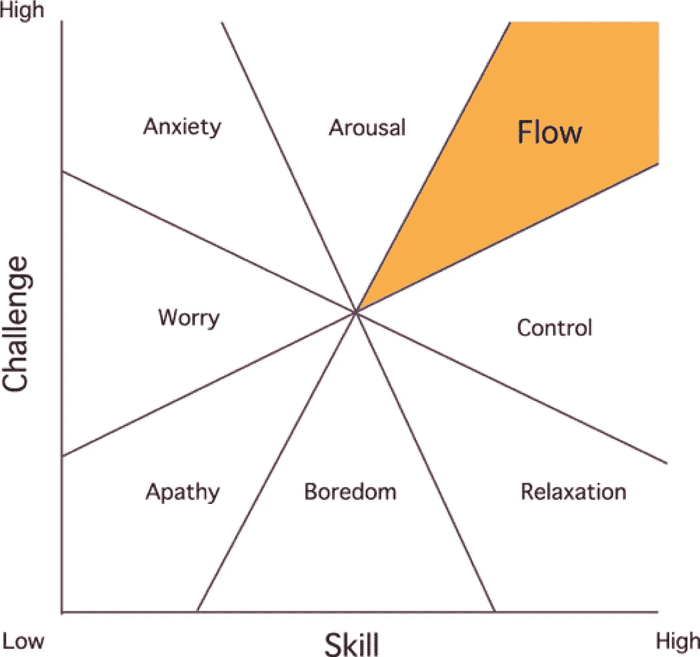

# 令人振奋的创业生活往往是一种幻想

> 原文：<https://medium.com/hackernoon/the-idea-of-an-invigorating-startup-life-can-often-be-an-illusion-1861e176c4ba>

> 也发表在我的科技博客

在 T2 的初创公司 T3 工作可能会很有趣。环境充满了积极的氛围，每一天都像是一个创新的机会。“颠覆性”和“初创公司”这两个词经常一起出现。

几个月前，我决定辞掉工作，在网站开发研习班做一段时间的导师，然后休假去看我的家人。他们住在不同的城市，我几乎一年没见到他们了。感觉在我开始考虑下一步该做什么之前，和他们共度一段美好时光是件好事。

我一直在被称为印度硅谷的本加卢鲁与初创公司合作，虽然在其中工作可能令人兴奋，但也可能令人筋疲力尽。当我刚从大学毕业时，我真的非常渴望得到一个好角色，并证明我有多在乎他们正在开发的这个精彩的应用程序。

通常在我们职业生涯的开始，我们是天真和无知的，所以我们不能深思熟虑地评估我们的职业前景。如果你正在考虑在一家新的或已经在这样一个地方工作的企业中找一份工作，你真的应该做一些自省——主要是在自我成长方面。基本上是想找到答案

> 作为一个人和一名专业人士，我能成长吗？

在创业世界的背景下，这个问题可以通过问自己一系列子问题来回答—

# 你是否发现自己在计划去那里的这段时间里能够不断提高自己的技能或探索新事物？

在面试中，初创公司的创始人会谈论他们正在做的开创性的事情，并且经常会夸大其词，你会倾向于相信他们。如果你加入的话，你会被告知你将获得难以置信的**学习机会**。这是我最喜欢听到的话，而且我通常不会去谈判薪水，因为我认为薪水已经很高了。

> 当我最终更新我的 LinkedIn 个人资料时，它会看起来太棒了！

但这种想法过于简单了。我花了一段时间才意识到，总会有学习的开始。如果该公司从事由前端和后端组成的产品开发，你所学的知识只够应付并让某些东西工作。

你工作的主要部分将是实现新特性和修复错误——一旦你学会了如何破解代码，这就变得很简单了。但在初始阶段之后，你可能没有学习更多东西的可行性——你将在很长一段时间内被限制在一个特定的角色中，只有在形势需要时才能学到一些东西。

过一段时间后，你的学习曲线可能会有一个间歇。

例如，就我而言，我一直想探索机器学习。或者学 Photoshop。因为我的工作不需要这些技能，所以我别无选择，只能尝试在下班后挤出时间来做这些事情。

……这就引出了下一个问题—

# 你有足够的时间去做你真正想做的事情吗？

在初创公司，你被鼓励与同事一起长时间工作(你经常需要这样)。早上 9 点到下午 6 点的工作几乎是闻所未闻的。他们中的大多数会告诉你，没有任何固定的工作时间，但通常你会看到人们工作到很晚，几乎每隔一天就熬夜到午夜。

你可以尝试时间管理技巧，减少休息时间，尝试在办公室里学习。但这是你能做的最好的了。总是有更多的工作。

在我的例子中，我想如果我早点回家，我可以花几个小时做开源项目或者在 Coursera 上看一些视频。也许可以做那个我一直想完成的半成品应用程序。但是我不能，因为我经常要在办公室呆到很晚。

尝试做太多事情也会消耗你的生产力——如果你不想精疲力尽，你需要休息足够的时间。努力工作是重要的，但是如果你一直处于压力之下，那么你就会失去效率。**忙碌**并不一定等同于**富有成效**。

Hitting that sweet spot

毕竟，我们是人，我们不是机器，这些机器被设计成接受咖啡和生产力博客作为输入，然后就变成埃隆·马斯克，一直超级有生产力，超级有动力。

You don’t wanna come home everyday looking like this

# 那么你在工作之外还有生活吗？

称之为工作与生活的平衡，追求你的兴趣、激情、爱好等等。他们都一样。

很多创业公司不会给周六放假。没有周六休息意味着你不能参加技术会议，或者如果你想的话，在研讨会上做导师。祝你在试图在周日完成课程工作或追求你的爱好，在洗衣服、陪伴家人和做其他事情之间周旋时好运——因为在你意识到之前，一天已经过去了。

在面试中，或者当你谈论休假的时候，你会经常听到这句话

> “我们有很多工作要做，我们都在尽可能地保持敏捷，非常努力地工作。”

或者这个—

> “再过几个月，一旦我们完成部署，事情就会变得简单一些，我们可以轻松应对。”

保持竞争优势、提高出货速度、吸引用户并开始盈利的压力总是存在的。所以这不全是他们的错——当你过度紧张时，再多的工作也是不够的。说服你的老板去度假似乎是一件不可能的事。

那些提供无限假期政策的创业公司呢？我从未经历过这种情况，但统计数据显示，在这些初创企业中，员工留给自己的时间甚至更少。

放弃你的兴趣和爱好是一个糟糕的[想法](https://hackernoon.com/tagged/idea)，因为这些正是造就你的东西。它们不是无用的，它们会影响你如何处理问题，如何处理工作中的危机，以及你与同事的互动。所有这些都表明了别人对你作为专业人士的看法。

# 那么，到目前为止旅途如何？

绝对是我很高兴经历过的事情。感觉就像我们在这艘小快艇上航行，试图超越那些巨大的、缓慢移动的船只。这种热情常常令人陶醉—

这种不可预测性也意味着事情有时会变得非常疯狂，尤其是当生产中出现问题并且是演示日的时候

**欣快感与熵成反比。那是没人告诉你的事。**

所以，你是否应该在创业公司工作的答案比简单的是或不是要复杂一些

*   找一个你学习速度快的地方，一个工作不会让你不知所措的地方。很重要的一点是，你不仅要谈判薪水，还要谈判工作时间——你每个工作日投入的固定时间，不能超过这个时间，或者周六休息，或者远程工作。
*   拥有个人兼职项目总是一个好主意，所以确保你每天能抽出一些时间来做这些事情。
*   许多早期创业公司根本不会在工作时间上妥协。在像印度这样的亚洲国家尤其如此。此外，如果你只有不到几年的工作经验，那么你的工资可能会很低。

对我来说，是后者，所以我是这样做的—

我决定休假。

如果你已经工作了几年，攒了一些钱，可以考虑在几个月到半年的任何时候暂停工作，做你一直想做的事情。你会知道什么时候该吃药。

一开始可能会感到不安，但过一会儿就开始觉得神清气爽了。你可以去度你梦寐以求的一周长假。养成良好的习惯。遇到有趣的人。学会演奏一种乐器，因为[那可以帮助你更好地编写软件](/javascript-scene/are-programmer-brains-different-2068a52648a7#.63whpk9a4)。或者去一次你一直想去却从未去过的公路旅行。

与此同时，不断地

## 找出你自己的问题，并修复那些存在于你体内的缺陷。在你自己身上实现新的特性——这样当你进入状态时，你的下一个版本将会超级棒，值得期待。

> 喜欢你读的书吗？你应该 [**订阅**](https://forum.booleanhunter.com/) 。我不会浪费你的时间。

> [黑客中午](http://bit.ly/Hackernoon)是黑客如何开始他们的下午。我们是 [@AMI](http://bit.ly/atAMIatAMI) 家庭的一员。我们现在[接受投稿](http://bit.ly/hackernoonsubmission)并乐意[讨论广告&赞助](mailto:partners@amipublications.com)机会。
> 
> 如果你喜欢这个故事，我们推荐你阅读我们的[最新科技故事](http://bit.ly/hackernoonlatestt)和[趋势科技故事](https://hackernoon.com/trending)。直到下一次，不要把世界的现实想当然！

