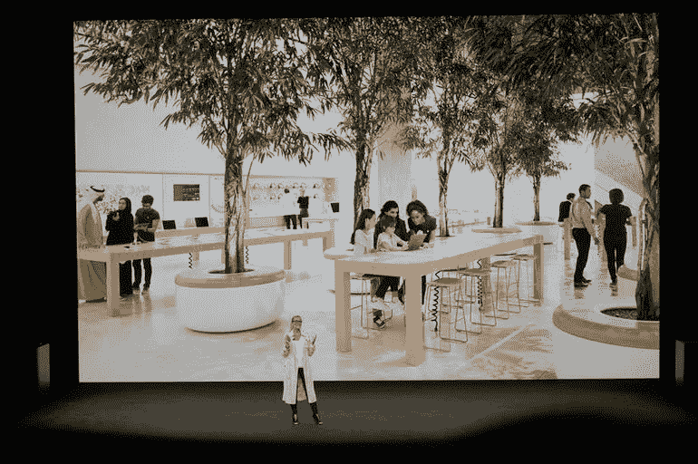
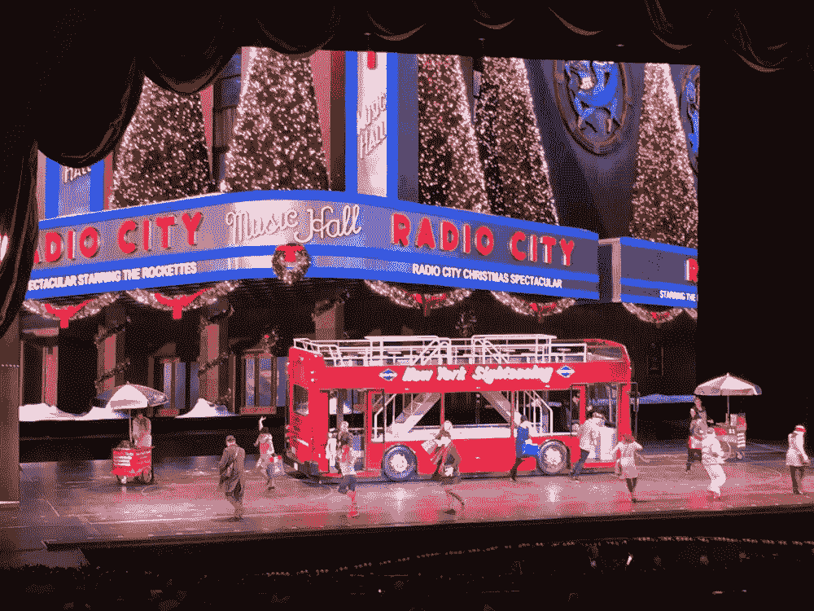

# 未来的沉浸式广告体验已经存在多年了

> 原文：<https://medium.com/hackernoon/the-immersive-advertising-experience-of-the-future-has-existed-for-years-7f47dce5e3ac>

Let’s unpack this.

过去几周，我们见证了三项不同但相关的技术发展，它们将对日常消费者产生影响。首先是苹果“城镇广场”的宣布——这是苹果主题演讲中迄今为止最突出的时刻，除了 Face ID 演示对 Craig Federighi 来说失败的时刻。按照苹果的设想，有一天我们会在苹果城广场的 Scandi 风格的庭院中漫步、连接、购物、与我们的社区互动——我想，还会给我们的手机充电。这一策略由星巴克首创，最近被迪士尼采用，迪士尼将其商店转变为“体验”，Refinery29 events，Urban Outfitters 的 Space 98 bar，Goop 的[会议](https://theoutline.com/post/1745/gwyneth-paltrows-goop-conference-made-me-sick)，以及 Barnes & Noble，后者正在测试备有葡萄酒的概念店。

A future in which a diversity of people and eucalyptus congregate in a corporate square to connect over laptops.

第二个值得注意的发展是[广受鄙视的](http://nymag.com/daily/intelligencer/2017/09/precisely-why-is-bodega-the-startup-such-a-terrible-idea.html)Bodega 的推出，这是一家旨在取代街角商店的初创公司，取而代之的是一台智能自动售货机，出售卫生棉条、苏打水和洗发水。这个有两位谷歌校友支持的概念似乎代表了科技的一切错误，从专有品牌开始。

拼图的第三块是令人眼花缭乱的 IKEA ARKit 应用程序，它可以让你将 KARLSTAD 卡斯塔沙发放在地铁站台或街道中间，看看它看起来怎么样。宜家已经提供了一个简洁的布局工具，但 AR 的使用是如此实用，对用户来说是如此有形和令人愉快，这似乎回答了对技术不感兴趣的消费者 AR 实际上可以用来做什么。

所有这些新闻都是在人们对数字广告现状感到绝望的背景下发生的。收入大幅下降。谷歌 Chrome 是现在让用户可以轻松屏蔽或静音弹出窗口和自动播放视频的应用之一。据 Lithium Technologies 总裁兼首席执行官 Rob Tarkoff 称，解决方案是为消费者创造一种更具互动性的广告体验。“他们希望这是一次对话，他们希望接触，”他告诉石英。

人们已经投入了很多心思来想象一种沉浸式广告体验——尤其是一种增强现实体验——但我在这里告诉你，这种体验已经存在了几十年。

每年，游客们都涌向无线电城去欣赏[火箭人](https://hackernoon.com/tagged/rockettes)的圣诞盛况。2005 年，我和我丈夫(当时的男朋友)去过那里，他坚持说这是纽约的一种成人仪式。我隐约知道洛克特合唱队，但对接下来的事情完全没有准备。在节目的开始时刻，我们被指示戴上 3D 眼镜，随着圣诞老人的雪橇从北极飞到纽约，然后俯冲到曼哈顿的屋顶上。在那里，我们飞驰上第五大道，经过一个大通广告牌，然后经过一个可口可乐的标志，绕过时代广场，在那里，赞助商在 3D 中点亮了我们的眼睛。当圣诞老人的雪橇驶进无线电城时，我已经通过这次财富 500 强公司的扩展之旅获得了 1/20 的 MBA 学位，这些公司对圣诞盛会有着既得利益。

The Radio City Christmas Spectacular, starring Radio City, a New York Sightseeing(TM) bus, and some dancers.

火箭女郎很有才华，胡桃夹子和你想象的一样好，但在两个小时的后期，当舞者将活的动物带到舞台上并形成一个耶稣诞生时，表演发生了左转。仅仅在 80 分钟前，我的视网膜上已经印上了可口可乐的印记，这种宗教倾向是不和谐的、令人困惑的、滑稽的。但是演出继续进行，非常严肃。制片人决定，你可以保留你的广告，也可以保留你的宗教信仰。也许这最好地概括了公司今天面临的挑战:一个让事情变得有意义的指令，展示对某种文化价值观的接受，以及支付账单。

最后，我们把同样印有大通银行字样的海报带回家，称之为“净积极”。

话又说回来，我不是一个孩子，也没有带着一个孩子在我们座位和舞台之间的地方，用闪闪发光的特写镜头来体验这些数字广告。对于一个孩子来说，广告更加阴险，不容易被理解，不容易被看穿。

可以肯定的是，AR 已经是消费者喜爱的工具了。Snapchat 滤镜、Pokemon GO 和 IKEA ARKit 应用证明了我们对互动体验的渴望。但是，用户对自动播放视频的敏感性，以及他们从网络浏览器的弹出窗口中“X”出来的肌肉记忆表明，公司必须非常小心地构建这些体验。他们需要问，这对谁有意思？

对于像 Rockettes 这样的企业，我最大的疑问是，如果我付钱买票，为什么我不能有一个没有广告的体验？

The original augmented advertising experience.

*詹妮特·曼利是内容为* [*助长了*](https://fueled.com/projects/?utm_source=Hacker%20noon&utm_medium=referral&utm_campaign=partnership&utm_content=article&utm_term=AR%20advertising) *的负责人。她的文章出现在《纽约客》、《ELLE》、《Buzzfeed》和 CNN 上。*