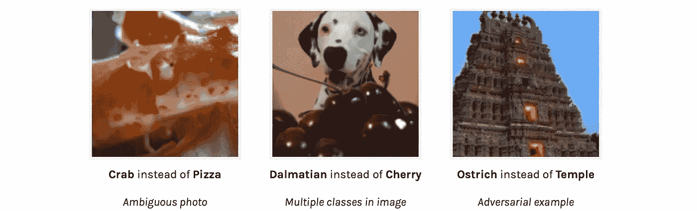
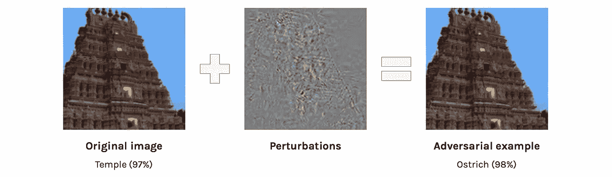
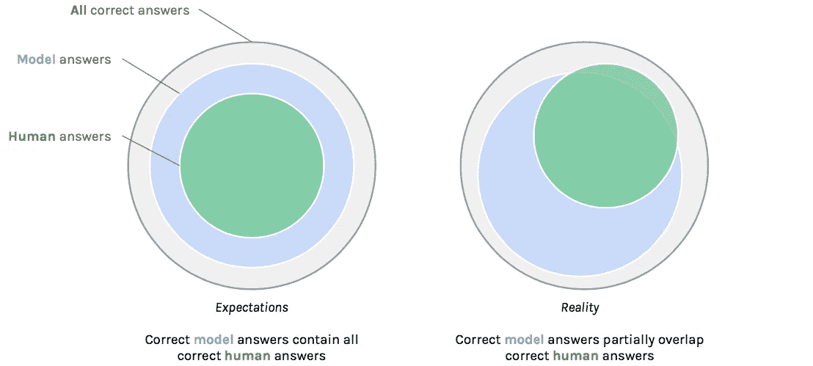
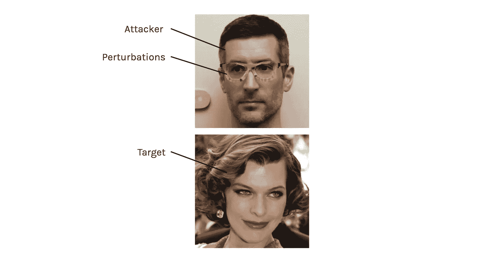
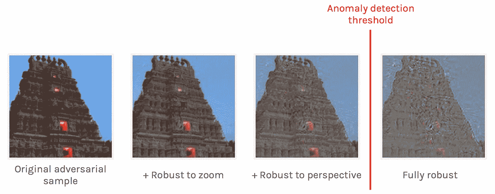

# 对立的例子及其含义-深度学习比特#3

> 原文：<https://medium.com/hackernoon/the-implications-of-adversarial-examples-deep-learning-bits-3-4086108287c7>

*特色*:对抗的例子，深度学习的未来，安全和攻击

在“*深度学习比特*系列中，我们将**而非**看到如何像我们在[***a . I . Odyssey***](/@juliendespois/talk-to-you-computer-with-you-eyes-and-deep-learning-a-i-odyssey-part-2-7d3405ab8be1)*系列 ***中所做的那样，利用深度学习解决复杂问题。*** 我们更愿意看看与深度学习相关的不同**技术**或**概念**。*

# *介绍*

*在本文中，我们将讨论 ***对立示例*** 和讨论它们对深度学习和安全的影响*。*不可与*对抗训练、* 混淆，后者是训练神经网络的框架，如 [*生成对抗网络*](https://arxiv.org/abs/1406.2661) *中所用。**

## *什么是对立的例子？*

*对立的例子是 ***手工输入*** 导致神经网络以**高置信度**预测**错误类别**。*

*通常，当图像 ***** 属于*质量差*(裁切不良、模糊不清等)时，会出现神经网络错误。)或包含*多个类别*(背景中的汽车等。).这是**而不是**对立的例子，看起来像普通的图像。*

******** *在这篇文章中，我们将关注图像，因为它们提供了有趣的视觉支持，但请记住，这也可以应用于其他输入，如声音。**

**

*Three different types of errors, along with predicted class*

*虽然前两个错误可以理解，但第三个图像**肯定**看起来像一个寺庙，我们可以认为任何经过适当训练的神经网络**都应该** **能够做出正确的预测**。*

****那这里到底怎么回事？****

*对抗性例子的特殊性在于它们不出现在自然数据中，**它们是** **精心制作的**。针对神经网络的*对抗性攻击*是一个过程，在这个过程中，有人稍微修改一张图像，使其**欺骗网络**。目标是**最小化对原始图像的扰动**，同时获得目标类的**高置信度**。*

**

*Creation of an adversarial example to target the **Ostrich** class*

## *这是怎么做到的？*

*对抗性例子的[代](https://arxiv.org/abs/1412.6572)是一个巨大的主题，新技术正在被发现，以创建**更快**、 [**更鲁棒**](https://blog.openai.com/adversarial-example-research/) 扰动和**最小**图像失真。*

*我们不会纠缠于*这些是如何产生的，而是关注它们的**含义。**但一个通用的原理和简单的方法是，取原始图像，通过神经网络运行，使用 [*反向传播算法*](http://neuralnetworksanddeeplearning.com/chap2.html) 找出[图像的**像素**应该如何修改](http://karpathy.github.io/2015/03/30/breaking-convnets/)以达到**目标**类。**

## *这真的是件大事吗？*

*当我们看到对立的例子时，我们通常会想到的第一件事是它们是不可接受的。由于人类可以不费吹灰之力地对它们进行正确分类，我们直觉地认为任何好的模型都可以做到这一点。这揭示了我们对神经网络的内在**期望**:我们想要**人类**或**超人**的性能。*

**

*“If a model fails to classify this as a Temple, then it’s **necessarily** **bad**” — Or is it?*

> *让我们退后一分钟，想想这意味着什么。*

*在一项给定的任务中，例如识别无人驾驶车辆中的路标，我们不会用计算机来代替人类，除非它至少和人类一样好。*

*我们经常忘记的是，拥有一个比人类更好的模型并不意味着对失败案例有任何要求。最后，如果人类有 **96%** 的准确率，有 **98%** 的神经网络，那么机器认为*容易*的例子真的重要吗？*

*这个问题的答案是**是**…AAA 和**否**。*

*尽管看到*最先进的*模型在看起来微不足道的例子上失败**感到沮丧和反直觉**，但这并不代表**根本问题。**我们关心的是模型有多强大，多可靠。我们必须承认，我们的大脑和深度学习的工作方式不同，因此不会产生相同的结果。*

**

*“Do we care whether the exemples the machine missed are never missed by a human?”*

*然而，*重要的是，对抗性攻击代表了对基于人工智能的系统的安全威胁。**

## **我们如何恶意利用对立的例子？**

**如果有人得到了底层模型，许多类型的深度学习驱动的系统可能会严重遭受敌对攻击。这里有一些例子。**

*   **上传绕过安全过滤器的图像**
*   **创建不会被谷歌的“我不是机器人”系统标记的机器人**

**那是给虚拟世界的。然而，对现实生活中的****物体**实施这样的攻击明显**更难**，因为拍摄物体照片时会涉及到所有的变换，但[仍有可能](https://blog.openai.com/robust-adversarial-inputs/)。****

****Robust Adversarial Example in the wild by [OpenAI](https://blog.openai.com/robust-adversarial-inputs/) — The red bar indicates the most probable class for the image. Here the cat is classified as a desktop computer****

****考虑到这一点，你可以想象:****

*   ****戴上[特制眼镜](https://www.cs.cmu.edu/~sbhagava/papers/face-rec-ccs16.pdf)窃取他人身份****
*   ****通过[改变交通标志](https://arxiv.org/pdf/1707.08945.pdf)误导自动驾驶汽车****
*   ****伪装武器以避免视频检测****
*   ****绕过音频或指纹识别****

********

****Impersonating Mila Jovovich with custom glasses****

## ****对此我们能做些什么？****

****我们可以做一些事情来缓解这个问题。首先我们可以考虑保持模型的私密性。然而，这个**方案**有两大缺陷。****

******首先**，理想情况下，安全系统应该遵循 [Kerckhoffs-Shannon 原则](https://en.wikipedia.org/wiki/Kerckhoffs%27s_principle) : *“我们应该在假设敌人会立即完全熟悉系统的情况下设计系统”。*这意味着我们**不应该依赖**模特的隐私，因为总有一天会被**泄露*** 。****

******然后**，一些关于[通用](https://arxiv.org/abs/1707.05572v1) / **独立于模型的**对抗性攻击的论文已经发表，无论使用哪种模型都可能对特定的任务起作用。****

*********** *注:这就是所有数据库都加密的原因。仔细想想，如果你认为你的数据库永远不会被黑客攻击，那就没有“必要”加密它。*****

****从好的一面来看，像帕塞瓦尔网络或防御蒸馏这样的技术正在被开发，以使神经网络更能抵御恶意攻击。我们还可以使用 *正常*图像和*对抗性* *示例*来训练模型，以帮助网络忽略扰动。****

********

****Extrapolation of OpenAI’s remark on transformations and perturbations magnitude****

****此外，OpenAI 的一个团队注意到，当你想让对抗性攻击对许多变换(*旋转*、*透视*等)具有鲁棒性时，找到**小扰动**变得越来越难**。).*我们可以想象*某个模型可以达到这样一个点，在这个点上**没有扰动**，对所有的变换**和**都有弹性，不可检测。我们*可以*然后将敌对的例子标记为**异常**，因此对于这个任务来说**安全**免受敌对攻击，但是这可能很难实现(例如需要**多个摄像机**等等)。).******

# ******结论******

****总之，对立的例子是深度学习研究的一个非常有趣的领域，每天都有**进展**来实现安全的深度学习系统。最重要的是，研究团队同时扮演**警察**和**强盗**，试图**建立/破坏**神经网络分类器。****

****截至今天，对抗性攻击开始对基于深度学习的系统构成威胁。然而，很少有系统盲目地依赖神经网络来进行重要的验证，而对抗性攻击**不够通用/强大**，除了研究团队之外，无法大规模应用。****

******在未来的几年里**，越来越多针对神经网络的攻击将成为可能，随着**对攻击者越来越有趣的奖励**希望到那时，我们将已经开发出强大的防御技术，使**免受此类攻击**。****

******感谢**阅读这篇帖子！欢迎*分享* it 和*关注*我如果你喜欢 AI 相关的东西！****