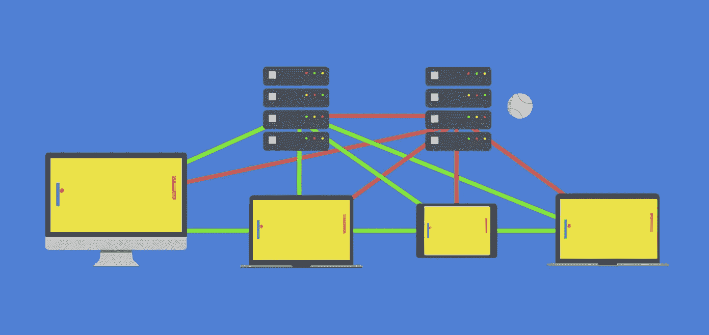

# 重新思考数据库和解析关闭的含义

> 原文：<https://medium.com/hackernoon/the-implications-of-rethinkdb-and-parse-shutdowns-c076460058f7>

坦率地说，像 RethinkDB 这样不可思议的公司的关闭确实动摇了开发者对开源的信任。更不用说 Parse 等公司的倒闭了。为什么其他开源 VC 支持的数据库，比如 GUN，不会成为这个问题的牺牲品呢？

在这一集的 Changelog 播客中，我探索了更多关于开源许可和 RethinkDB 的事后分析的想法，这一集是[https://changelog.com/podcast/236](https://changelog.com/podcast/236)。

我们正在做的事情之一是确保我们的代码总是被授权为 MIT 或 ZLIB 或 Apache 2。这是对开发者的一个承诺(也是一个合法的承诺),开源的理想和价值将永远存在，首先也是最重要的。事实上，许可证是由你，一个社区投票决定的，看这里——【https://github.com/amark/gun/issues/17】T2。

那么，起作用的宏观经济呢？

到 2020 年，将有 15 亿人上网，这意味着任何扩展问题的复杂性都将增加一倍以上。这是一个巨大的机会，它与你的系统的可伸缩性成正比——这意味着随着时间的推移，去中心化的工具会比它们的中心化的替代品更胜一筹。因此，第二重要的事情(在我们承诺公开许可之后)是在一个经历机会大爆炸的市场中——不要为垂死的方式构建工具。

第三，与销售支持许可证或 DBaaS 或“开放核心”瘫痪软件的尝试不同，我们正在采取与开发商/公司合作的方式，为政府和企业构建行业转型产品和解决方案。我们相信，如果我们能够让其他人能够为大型组织的需求创造答案，那么我们双方都可以通过创造收入共享的合作伙伴关系和品牌来互惠互利。这已经在几家公司中实现了，我们正在向一个政府推广(但我还不能透露是谁/什么/如何实现，但希望在接下来的半年内)。

我们相信这是可行的，它将为其他开源供应商采用可行的真正商业模式铺平道路，而没有许多人已经采取的任何不幸的替代策略(开放核心瘫痪软件、不太可能的支持许可证、苦苦挣扎的 DBaaS 等)。).这创造了最佳的“三赢”环境，初创公司可以免费搭便车，而政府和企业则为急需的技术解决方案付费，以应对即将到来的转型，同时增加我们合作伙伴的收入和我们值得信赖的品牌。

我说的是什么转型？再次，5B 新人类，物联网和每一辆自动驾驶汽车或卷饼送货无人机的出现，以及在全球范围内对整个系统进行机器学习的需求。关于这类事情的更多信息，请查看这篇关于使用 gun 的分布式机器学习的[文章。](http://myrighttocode.org/blog/artificial%20intelligence/particle%20swarm/genetic%20algorithm/collective%20knowledge/machine%20learning/gun-db-artificial-knowledge-sharing)

这种转变不会成功，除非它可以建立在真正开放的技术之上，这就是为什么许可证是重要的。互联网的开放性证明了这一点，在 2010 年前后，当世界其他地区的经济在房地产危机中崩溃时，科技行业以令人难以置信的速度增长。为什么科技在其他一切都不成功的地方成功了？答案很简单:在开放思想和分散架构的力量下——万维网，无数遵守开放标准的公司之间美丽的自由合作。未来是光明的，我们在这里与你们一起建设它，为了长期的游戏。

提示:对于想要开始自己的开源项目的开发人员，总有 Patreon 途径——vue js 每月收入 9K+!尝试没有坏处，但只要走出去，努力工作，解决有趣的问题，利用网络中的机会。

> [黑客中午](http://bit.ly/Hackernoon)是黑客如何开始他们的下午。我们是 [@AMI](http://bit.ly/atAMIatAMI) 家庭的一员。我们现在[接受投稿](http://bit.ly/hackernoonsubmission)并乐意[讨论广告&赞助](mailto:partners@amipublications.com)机会。
> 
> 如果你喜欢这个故事，我们推荐你阅读我们的[最新科技故事](http://bit.ly/hackernoonlatestt)和[趋势科技故事](https://hackernoon.com/trending)。直到下一次，不要把世界的现实想当然！

