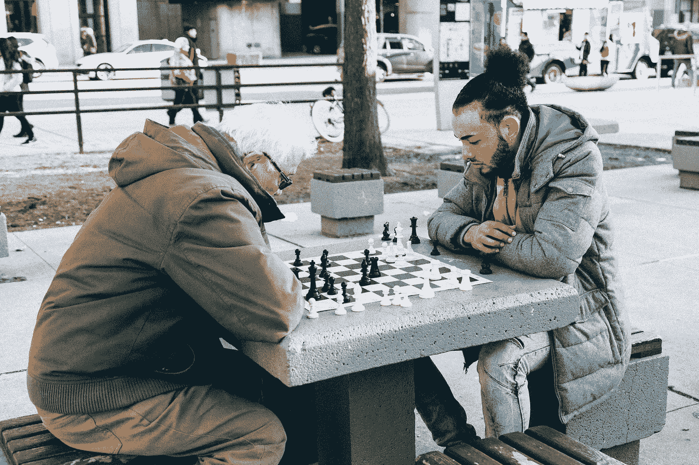

# 有一个导师的重要性

> 原文：<https://medium.com/hackernoon/the-importance-of-having-a-mentor-c122196b59e0>

## 当一次指导接近尾声时，珍惜它曾经的一切，然后继续下一次。

今天我在健身房锻炼。几个月前，我开始做交叉训练，试图加快速度，最大限度地提高效率，创造一个更全面的锻炼计划。

新的日常习惯是从早上 4:45 起床，到早上 5:00 去健身房开始锻炼。由于我天生不是一个早起的人，保持一致可能是一场斗争。

尽管如此，我还是尽可能地起床去追它。因为 CrossFit 是一项全面的锻炼，所以有很多[举重](http://www.crossfit151.com/common-crossfit-movements/)，其中一些相当复杂。

以[抓举](https://youtu.be/rhF0cbRjxRo?t=38s)为例。当执行到完美的时候，托举看起来非常流畅。本质上，杠铃从地板上抬起，迅速飘到你的头上，你举着杠铃一秒钟——所有这一切都来自身体的一次强有力的猛拉。

现在，回到今天。我今天早上在 CrossFit，在屏幕上，我看到我们在做力量抢夺。在过去的几个月里，我已经做了无数次了，但是每次我看起来都像一个第一次举的五年级学生，而不是一个奥运选手。

(不要误解我的意思，我的目标不是让自己看起来像一个奥运会运动员。我们的目标是保持良好的状态，让托举锻炼肌肉。)

今天的开始没有什么不同。我跳过横杆，以一种不协调的方式扔出了一个可怜的重量。幸运的是，今天是我开始去后最不拥挤的一天，那里只有我们三个人。

教官坐在那里，看了我一次，走近我。

他说，“两件事。第一，把你的手握宽至少两英寸。这样的话，酒吧要少走几步才能让你明白。第二，双脚分开与肩同宽。然后，拉起杠铃的冲力会产生轻微的跳跃运动。当这种情况发生时，将你的脚转移到下蹲位置，站起来，将杠铃举过头顶。”

我带着他的建议回到酒吧，找好位置，然后比以前更轻松地把酒吧举过头顶。这个小小的调整让我从初级举重变成了阿诺德·施瓦辛格的夺权。(略有夸张)

毫不夸张地说，导师可以对你的生活产生积极影响。今天早上发生的事情让我有了一些认识。

# 有人已经为你犯了错误

当我花了 4 个多月的时间试图自己完善我的托举时[可怜的](https://youtu.be/c_2nDFJIsdM)，有人已经知道他们在做什么。我的收获很小，而且我的状态几乎没有因为尝试自己做每件事而改善。

然后出现了一个知道他们在做什么的人，他们在一瞬间修复了我的形状。我心想，“如果这很容易纠正，我还能把它应用到我生活的其他方面呢？”

我每天都在做的其他事情有哪些是导师可以立刻教给我的？这让我回想起我刚开始职业生涯的时候，我有一些很棒的导师，他们教会了我很多。这些导师最终偶然帮助了我，但谁能说我将来会这么幸运呢？

对我来说已经变得非常清楚的事实是，如果我要变得更好，我需要寻找我知道会帮助我变得更好的导师。

# 拓展你的视野

[我过去曾暗示过这一点](https://hackernoon.com/micro-habits-changed-my-life-47f572bfc153)，但我是一个真正的信徒，当你感到舒适时，你就开始死亡。如果你不努力让自己变得更好，那么你就会慢慢变得更差。

大多数人认为一旦他们完成学业，他们就完成了学习，但是他们错得不能再错了。做一个永远的学习者是必要的。

变得更好的最有效的方法是通过导师。当一次指导接近尾声时，珍惜它曾经的一切，然后继续下一次。

永远不要停止学习，永远不要停止接受指导，永远不要停止前进。

*另一方面，如果你有能力——向那些可能从中受益的人提供指导。我无法告诉你，如果我的生活中没有这么多优秀的导师，我会在哪里，我们永远都不会满足于他们。有一天，我希望尽我所能回报任何人，我希望你们中有足够特权的人也会选择这样做。*