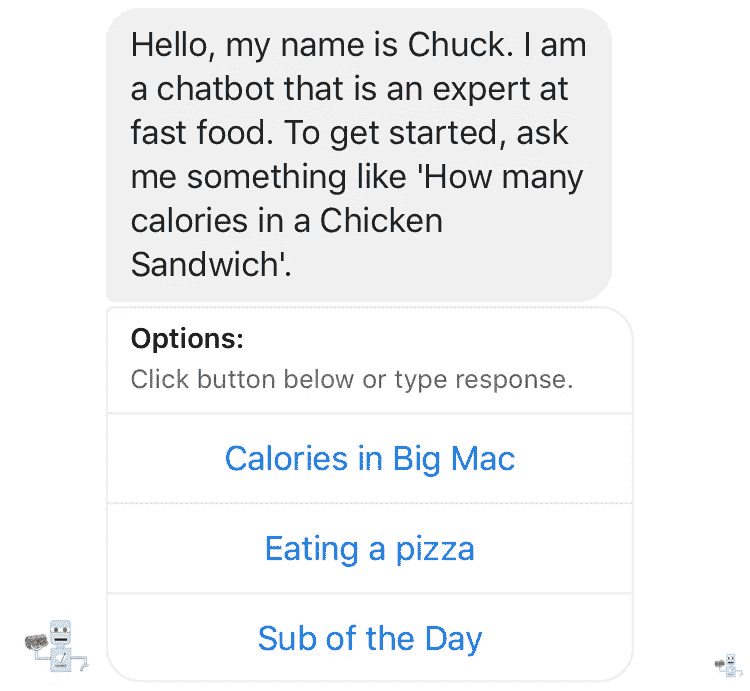
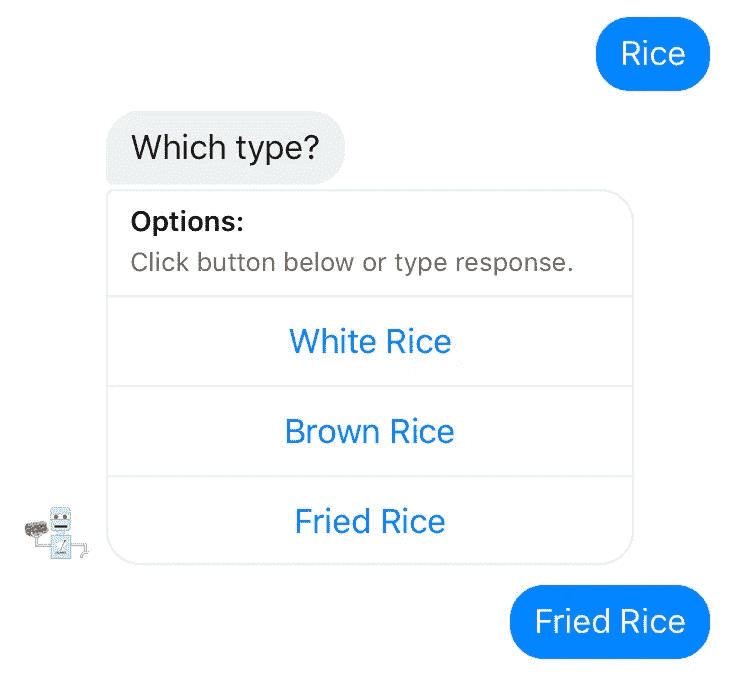
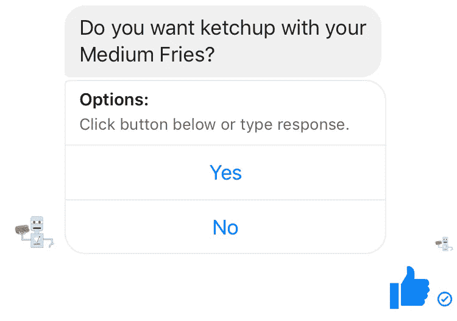
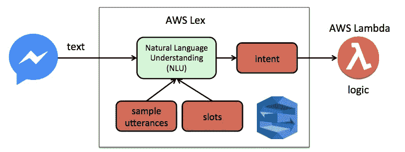

# 创建聊天机器人时建模用户需求的重要性

> 原文：<https://medium.com/hackernoon/the-importance-of-modeling-user-needs-when-creating-chatbots-67e8af992087>

Image courtesy of [rawpixel](https://pixabay.com/en/users/rawpixel-4283981/) on Pixabay

2017 年聊天机器人的采用量大幅上升。像脸书和微信这样的平台将人们的注意力从传统的社交媒体应用上转移开来。这些消息客户端中的每一个都在全球拥有[十亿用户](https://techcrunch.com/2017/09/14/facebook-messenger-1-3-billion/)。继续这些收益需要满足用户需求，并对这种媒体的局限性做出反应。这篇文章强调了一些你新年计划的想法。

# 倾听用户的声音

[大约 45%的最终用户喜欢聊天机器人](http://www.businessinsider.com/chatbot-market-stats-trends-size-ecosystem-research-2017-10)作为客户服务查询的主要沟通方式。这些用户的需求和以前一样，他们只是改变了沟通工具。在大多数情况下，已经在网络和手机上收集和呈现的信息就是内容。你的挑战是打开它。你的常见问题中已经提供了哪些内容？您现有客户的常见要求是什么？这是一个很好的入门资料。

Get started through an introduction, and highlight features.

当从头开始一项新的业务或产品时，传统的用户访谈是收集这些信息的绝佳场所。不要成为索引卡、便利贴和笔记本等工具的牺牲品。关注用户，以及他们想要实现的目标。尽可能亲自采访，以获取背景信息并验证早期概念。

Image courtesy of [Engin Akyurt](https://pixabay.com/en/coffee-pen-notebook-work-book-2306471/) on Pixabay

# 利用快速周期开发

即使你的机器人受到严格监督，利用机器学习部署模型也很重要。频繁地将代码和数据发布到自然语言和事件处理中有助于学习。

从部署一个最小的产品开始，然后根据正在使用的特性进行迭代。重要的是要花时间去了解你的客户在消息客户端使用什么样的语言风格，包括术语和缩略语。

# 简化用户界面

对于基于文本的聊天机器人，在对话框中提供快捷方式至关重要。在较小的键盘上，打字错误是常见的。自然语言反应和自然语言理解一样重要。

在 Messenger 和 Slack 这样的平台上，尽可能使用按钮。例如，如果您试图收集有关订单的信息，请尝试以下方法。

Enable possible choices with one touch.

这减少了打字错误带来的挫折感，并减少了您和您的客户的交易时间。

# 保持对话的趣味性

聊天机器人对用户来说是非常个人化的体验，所以扔掉一些为浏览器编写的风格指南中的生硬语言。利用信息中的自然风格，包括感叹词和大写字母，以获得特殊效果。

Can your bot respond to a “Thumbs-up” response?

表情符号和图像很好，但需要与你现有的品牌方针相适应。此外，确保您准备好在对话中回应这些引用。如果你的机器人不能处理竖起大拇指或笑脸，不要一开始就给用户发送这些来鼓励它。

Image courtesy of [jill111](https://pixabay.com/en/users/jill111-334088/) on Pixabay

# 更多细节和学习

如果你想了解更多关于底层技术的信息，可以在 T2 的 Facebook Messenger 上查看我最新的聊天机器人。它使用 AWS Lex 进行 NLU 处理，并在 AWS Lambda 中使用响应逻辑。

这里是 GitHub 上的代码库。

 [## 特伦彼得森/卡乐里计数器

### 基于 Lex 的聊天机器人，根据不同的快餐店计算卡路里。这是一个…

github.com](https://github.com/terrenjpeterson/caloriecounter)