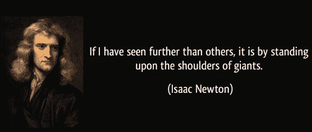

# 开源创新的重要性

> 原文：<https://medium.com/hackernoon/the-importance-of-open-sourcing-innovation-4dd42b6c1443>

## 为什么开源对社会有益

现在我已经结束了在钦查皮的第一周实习，我已经学到了很多。我已经领略了软件工程师在职业生涯中可能会遇到的许多技能和平台。我终于有机会使用吉拉和其他 Atlassian 产品，我使用 Slack 更频繁了，我也越来越了解 Git 和 Github 工作流程。

但是，除了学习该职位的非开发方面，我还学习了更多的数据库技术以及如何增强过时的实践。我学到的一件有趣的事情是 Cinchapi 的核心产品之一 [ConcourseDB](https://github.com/cinchapi/concourse) 背后的技术。Concourse 极具创新性，因为它具有粒度即时锁定、自调优、缓冲存储和其他很酷的特性。尽管如此，我认为 ConcourseDB 最重要特征是*它是* [*开源的*](https://hackernoon.com/tagged/open-source) 。Concourse 的开源本质提醒了我开源技术进步的重要性，无论它们是否在计算领域。

开源创新很重要，首先，因为它为进一步创新打开了大门。这就是一个人在另一个人达到一项技术进步时，所能做到的“站在巨人的肩膀上”。正是无数人在数千个领域中释放出的知识和创新让我们走到了今天，我们不应该仅仅为了获利而停止分享这些想法。回顾一下像艾萨克·牛顿爵士、理查德·费曼、尼古拉·特斯拉和其他许多伟人，他们在各自领域的贡献加速了社会的技术发展。

开源创新也很重要，因为它让生活变得更容易。没有开放式创新，我们真的无法以同样的方式体验生活。开放式创新让社会以统一的方式前进，而不是由一小群个人和公司引领前进。

开放式创新还会在个人和组织之间引发竞争压力。这种竞争利用了前面提到的理念，即一个领域的技术突破会带来更多的后续创新，这反过来又会带来更多的进步。简而言之，开源新技术开启了一个循环，让这个行业比保密时发展得更快。

因此，最终我为开源 ConcourseDB 的 Cinchapi 团队感到骄傲，因为我确信它的技术进步将推动计算机行业，并有希望推动整个社会。但是 Cinchapi 并不是唯一一个这样做的人:脸书开源 [buck](https://github.com/facebook/buck) ，OpenAI 和其他[都在发布人工智能研究的新进展](https://openai.com/research/#publications)，谷歌有点像[不久前开源的 VR](https://vr.google.com/cardboard/)。正是像这样的开放式创新让这个行业发展得如此之快。我希望能多看看久而久之！

感谢您的阅读！

[Twitter](https://twitter.com/aunyks) ， [Github](https://github.com/aunyks) ， [Snapchat](https://snapchat.com/add/aunyks) ， [Instagram](https://instagram.com/aunyks)

> [黑客中午](http://bit.ly/Hackernoon)是黑客如何开始他们的下午。我们是阿妹家庭的一员。我们现在[接受投稿](http://bit.ly/hackernoonsubmission)并乐意[讨论广告&赞助](mailto:partners@amipublications.com)的机会。
> 
> 如果你喜欢这个故事，我们推荐你阅读我们的[最新科技故事](http://bit.ly/hackernoonlatestt)和[趋势科技故事](https://hackernoon.com/trending)。直到下一次，不要把世界的现实想当然！

