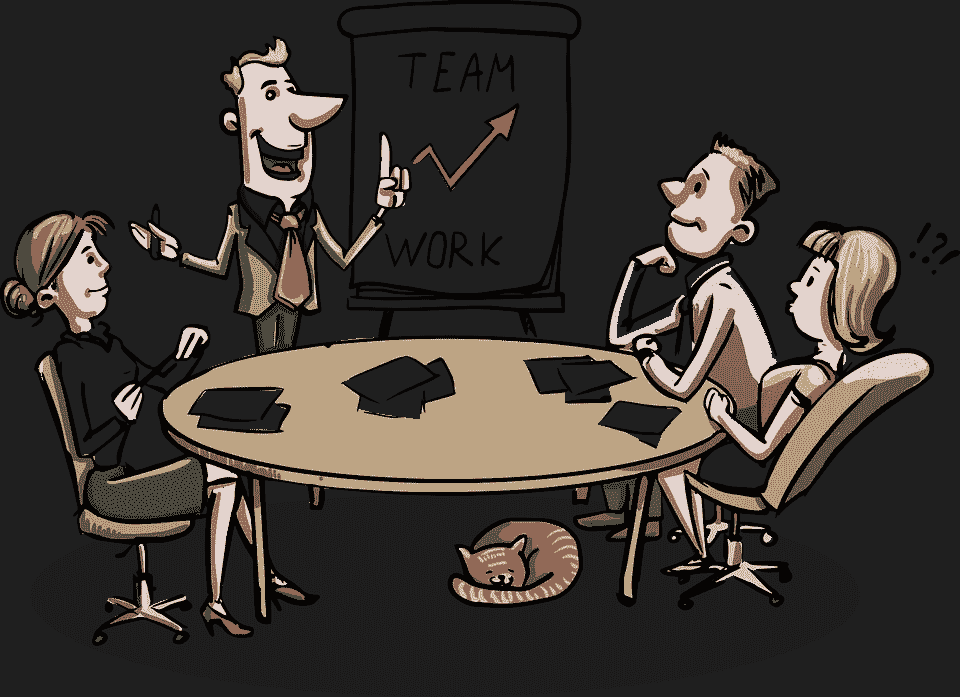

# 团队文化的重要性

> 原文：<https://medium.com/hackernoon/the-importance-of-team-culture-af6fffead7b5>

在大多数项目中，工作量是如此之大，以至于一个人无法单独处理。因此，我们组成*团队*来处理工作量。团队不仅仅是一群人。这是一个 T2 组织 T3。团队成员是这个组织的组成部分，通常影响团队运作的好坏，但是团队被外部观察者视为一个整体是很重要的。团队的关键要素是沟通、愿景和信任。这些元素形成了团队的*文化*，并像胶水一样将成员凝聚在一起。

在软件开发中，我们与代码打交道。我们写代码，我们重构代码，最后，我们交付代码。*注意:代码是开发人员所做的智力工作的产物，而不是实际的工作(更多内容将在以后的文章中介绍)*。代码*属于团队*，因此团队*拥有*该代码*并对其*负责。对我们团队写的代码负责，是每个专业开发人员都应该做的事情。除了这一职业义务之外，这也是取得伟大成果的先决条件。在每一个成功的背后，都有一个高度积极和投入的团队，他们对自己所做的事情负责，不是因为他们必须做，而是因为他们想要做。

# 传播&康威定律

如今，我们处理微服务，其中每个团队(通常)负责其服务的整个堆栈(后端、前端，甚至开发操作相关的东西)。团队内部以及团队之间的沟通对于团队的成功至关重要，因为[康威定律](https://en.wikipedia.org/wiki/Conway%27s_law)适用。因此，在团队中分担责任是至关重要的, *a)* 提高了团队绩效， *b)* 提高了沟通效率，以及 *c)* 降低了改变团队构成的成本。通过将某一特定领域的职责交给团队中的一两个成员，如果这些成员离开团队，团队会受到影响(参见[总线因子](https://en.wikipedia.org/wiki/Bus_factor))。此外，其他成员不会觉得他们*拥有这个区域的*代码，因为他们不维护它，而且他们很难对这个代码负责，他们可能会避免维护它。这样，团队最终将被分割成没有清晰结构的子团队，然后将会功能失调，因为沟通将会受到限制，并且团队最初的共同目标将会转化为每个子团队的可能冲突的目标。请注意，这与按照技术或功能领域划分定义明确的子团队完全不同。在这种情况下，子团队被视为一个团队。当团队中的一些特定成员只处理代码的特定区域时，问题就开始了，其他成员也可以处理这些区域，我们将在下一节中看到。关于个人成员拥有代码而不是团队拥有代码的问题的一个很好的帖子是[这个](https://medium.freecodecamp.org/why-code-ownership-sucks-and-you-should-never-work-somewhere-that-practices-it-b8fc1c694074)。

# 团队文化

拥有坚实的团队文化和坚实的基础至关重要。团队文化定义了团队。团队文化是新成员加入团队时注意到的一切。沟通结构、流程、代码的设计和编写方式、团队的任务和愿景等。，是团队文化的元素。在这篇文章中，我们将关注关于代码和过程的文化。

首先，团队成员必须相信他们选择的过程会帮助团队和他们自己成长并表现得更好。关于代码，他们需要对他们拥有的标准有一个共同的理解。所有成员都应该确定结果(代码)应该是什么样子，即使经验不足的成员可能需要一些帮助来实现它。这对减少冲突是很重要的，因为所有的成员都知道该做什么。最终的测试是让团队之外的人不能通过查看代码来判断是谁写的代码。代码应该看起来像是由团队编写的，而不是由具有不同编码标准或更糟的代码格式的个人编写的。一致性很重要！一旦他们就此达成一致，他们就需要决定确保这一点的方法(流程)。代码审查和结对编程是确保代码质量的最有效的过程。

代码评审是异步工作的。开发人员创建一个拉请求，并要求一个或多个团队成员对其进行审查。评审人员检查代码是否遵循团队的编码标准，是否工作正常，并提交一些需要处理的注释，以使拉请求获得批准。我发现一个对代码审查有用的技术在[这篇文章](https://hackernoon.com/test-driven-code-review-3f05f6cee400)中有描述。

另一方面，结对编程是同步的。两个或更多的开发人员一起编写代码，因此反馈循环几乎为零，因为面对面的讨论取代了代码评审意见。在我迄今为止处理过的所有过程中，我发现结对编程在许多方面都是最有效的，尤其是对新团队成员而言。除了即时反馈循环，它还帮助新成员熟悉其他成员和流程，并建立团队合作。我发现对我自己来说，与某人配对并学习代码应该如何编写以及我们应该在代码中遵循什么模式比阅读维基页面更有效。结对编程期间的讨论有助于建立团队文化。

另一个帮助新成员成为并感受到团队一员的过程是让他们做一些有助于他们学习的有成效的事情。与其花前几周时间阅读维基和浏览代码，不如做些实际工作。由于她可能无法生成符合团队质量标准的代码，并且对代码库不够熟悉，无法对其进行更改，因此他们最好开始编写测试。测试非常有用，因为它们有一个有限的范围，所以即使新成员没有经验，她也能跟上，而且它们是开发人员熟悉代码的好方法。此外，让别人为你写测试可能不符合 TDD，但是有助于识别更多的极限情况，因为测试的作者是在规范上测试，完全没有实现上的偏见。所以，是双赢！

显然，为了让代码审查和结对编程工作，团队的所有成员都应该处理几乎所有的代码。团队精神、良好的沟通和协作是所有这些过程的先决条件。

# 陷阱！

在应用这些过程时，团队应该避免一个陷阱。如果从一开始就把质量水平定得很高，经验不足的成员可能会感到不知所措或不太重要。在这种情况下，团队会得到完全相反的结果，因为它被分成有经验的和没有经验的成员，并且有前面提到的问题。为了克服这个问题，质量水平应该设定在团队能够处理的平均水平附近，并随着时间的推移而提高。通过这样做，团队的水平提高了，成员对质量标准也满意了。这种增加的速度需要仔细规划。在这方面，更有经验的成员和技术负责人可以提供更多帮助。他们可以通过指导他人、对新技术提出建议和推动更高的质量来成为过程的加速器。例如，如果一个团队没有 TDD 的经验，那么开始实践它就不容易。团队应该从实践测试开始，然后继续重构代码，最终达到预先编写测试并在每个 TDD 周期中重构代码的地步。在进入下一步之前，成员应该对当前步骤感到满意。关于技术领导(和有经验的成员)如何帮助团队实现目标和成员得到提高的精彩演讲是“ [*为什么技术领导很重要*](https://youtu.be/_6BKK1SPAVI)*。*

*质量的增量改进并不意味着我们应该损害可交付产品的质量或产生巨大的技术债务，而是拥有更好的质量和长期表现更好的团队。这可能比听起来更困难，因为可能会有最后期限将团队推向相反的方向，但正如每个良好的实践一样，长期结果几乎总是更好。一般来说，考虑 TDD 或测试，有人可能会认为编写测试会减慢开发过程，但是我们知道这不是真的！*

> *"整体大于部分之和。"*
> 
> *亚里士多德*

# *进一步阅读*

1.  *[康威定律](https://en.wikipedia.org/wiki/Conway%27s_law)*
2.  *[公交因素](https://en.wikipedia.org/wiki/Bus_factor)*
3.  *[测试驱动的代码评审](https://hackernoon.com/test-driven-code-review-3f05f6cee400)*
4.  *[为什么代码所有权很糟糕，你不应该在实践它的地方工作](https://medium.freecodecamp.org/why-code-ownership-sucks-and-you-should-never-work-somewhere-that-practices-it-b8fc1c694074)*
5.  *[《为什么技术领导力很重要》](https://youtu.be/_6BKK1SPAVI)作者帕特里克·夸*