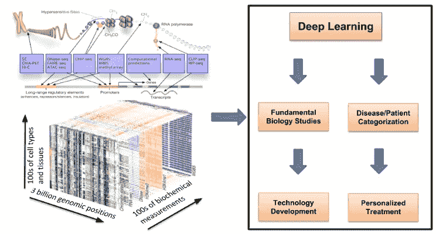
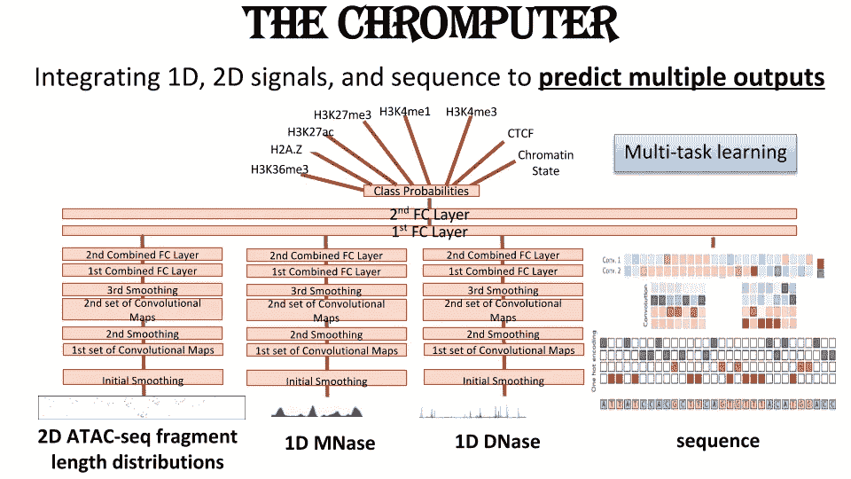
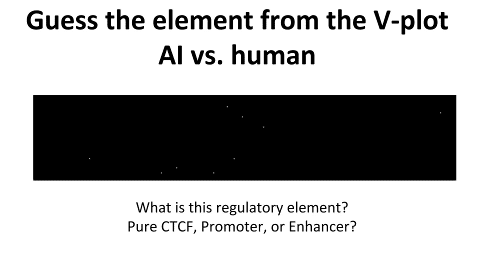
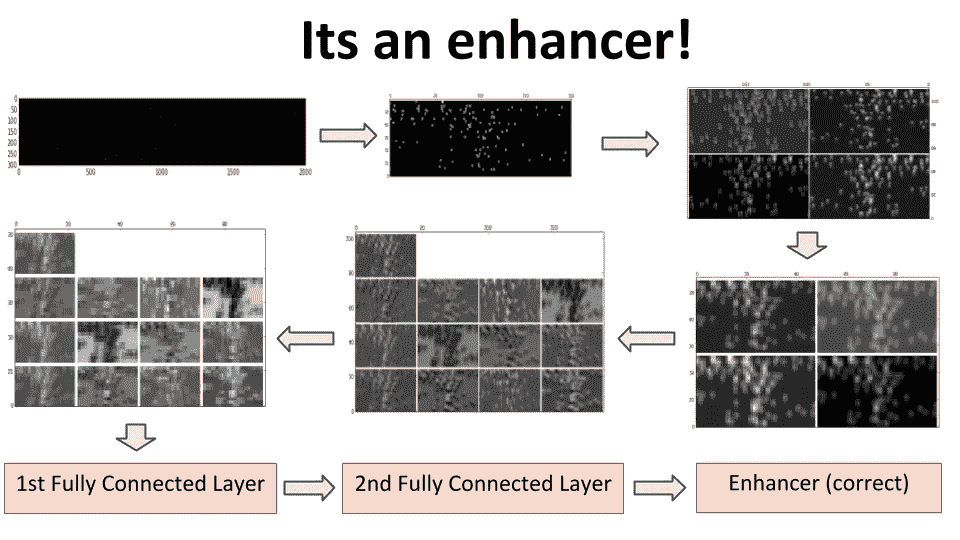
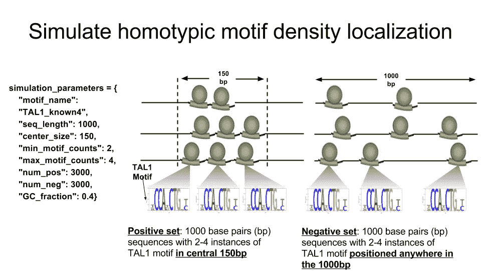
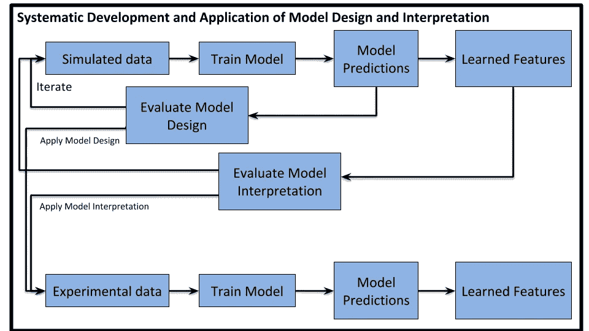
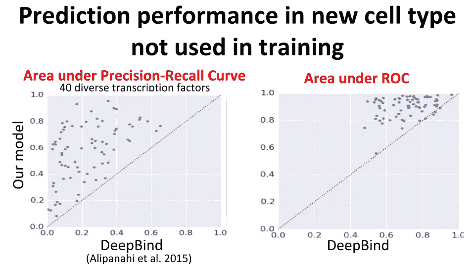
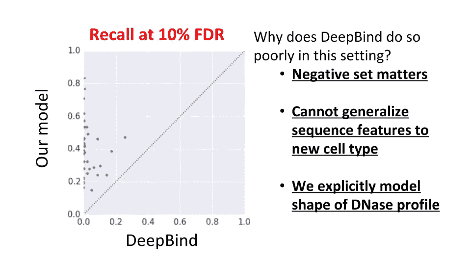
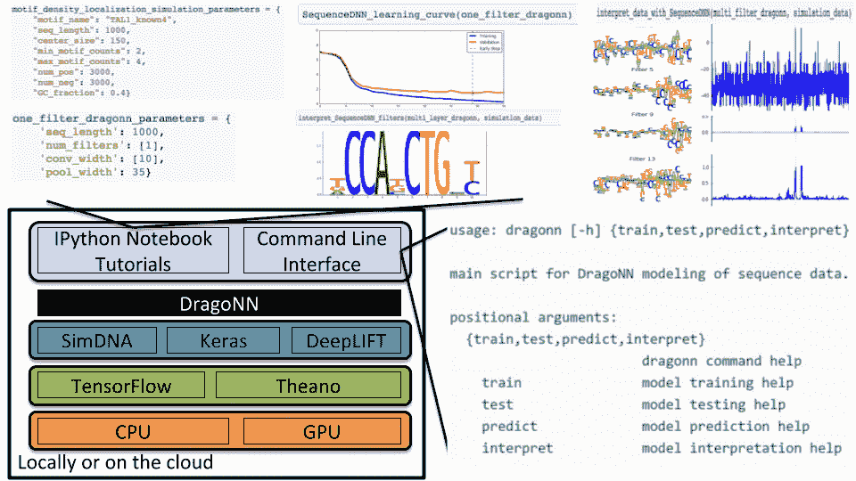
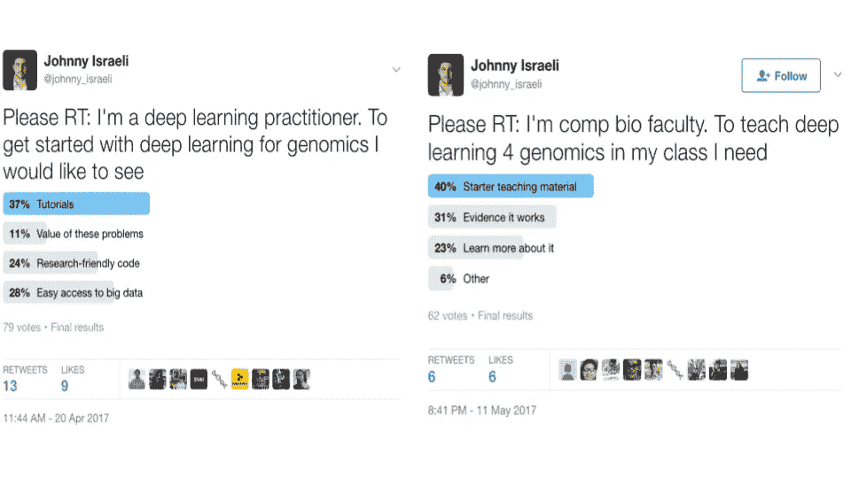

# 深度学习和基因组学的惊人融合

> 原文：<https://medium.com/hackernoon/the-incredible-convergence-of-deep-learning-and-genomics-2f86838ecb7d>

***阅读时间:*** *6 分钟。* [*最初发布于 LinkedIn。*](https://www.linkedin.com/pulse/incredible-convergence-deep-learning-genomics-johnny-israeli/)

2014 年，我们中很少有人在深度学习和基因组学的交叉领域工作。三年后，基因组学正处于范式转变之中——基因组学的深度学习即将到来。我们是怎么到这里的？

**概要:**

*   基因组学的第一个卷积神经网络模型于 2015 年发表
*   从那以后，数十篇针对基因组学的深度学习论文和评论已经发表，包括[合作撰写的深度评论](https://www.linkedin.com/pulse/opportunities-obstacles-deep-learning-biology-medicine-johnny-israeli/)。
*   斯坦福大学的 150 名学生在基因组学课上进行了长达四分之一的深度学习。
*   100 人参加了在美国、以色列、中国和新加坡举办的[“如何训练你的 DragoNN”研讨会](https://docs.google.com/presentation/d/14_Rz9ihNHcxAzOA0Owir28Qktbad_U9wplKoNLasFu4/edit?usp=sharing)。
*   500 完成 Nvidia 的 [online DragoNN 课程](https://nvidia.qwiklab.com/focuses/3046)。
*   基因组学社区正在迅速接受深度学习——我们可以通过实验验证模型来加速这一过程。
*   深度学习社区开始接受基因组学——我们可以通过开源研究软件和轻松访问大数据来加速这一进程。
*   未来有真正的挑战，但基因组学的深度学习即将到来，并将为深度学习和基因组学社区创造前所未有的机会。

# 早期研究与计算机神经网络

在 2014 年末，我们开发了我们第一个用于基因组学的工作深度学习模型——“Chromputer”。Chromputer 使用类似于 AlexNet 的 CNN 从 2D DNA 可及性数据(ATAC 序列)中预测组蛋白修饰和染色质状态。到 2015 年初，我们扩展了 Chromputer，还集成了核小体定位数据(MNase-seq)和 DNA 序列:基因组学的多任务、多模态深度学习模型。

这是一个神奇的时代。人类表观基因组是复杂的——它整合了基因组、环境、疾病和其他生物信号。但是 Chromputer 的成功让我相信，也许深度学习有能力解码这种复杂性。

> 这是因为人类表观基因组信息丰富，但却不为人所知，深度学习可以成为一种变革力量——一种可以解放和团结生物医学学科科学家和工程师的力量。

然而，让我们自己的同事相信这个东西真的有用是非常困难的。

在路上，我们玩得很开心。说服人们是一场艰苦的战斗，但我们利用了 Chromputer 最不直观的方面——ATAC-塞奇 2D 数据——来展示该模型的效用。

我们将通过“人工智能与人类”的练习来实现这一点。在这种稀疏的输入数据中，600，000 个像素中约有 100 个像素“开启”，因此几乎不可能猜测这种类似图像的信号意味着什么。但是看看 Chromputer 将这些数据转换成映射到增强子的表示，增强子是一种 DNA 控制元件，可以影响 100 万个碱基对以外的基因表达。

相当令人印象深刻。根据第四层的表示，我可以猜测这不是 CTCF，一种负责基因组三维结构的蛋白质，因为它通常被定位的核小体所包围，这些核小体由图像下半部分的圆形簇指示。图像上半部分的宽信号表明 DNA 开放，这将该元件缩小到增强子或启动子，即启动基因转录的控制元件。

Chromputer 与现成的机器学习相比如何？染色质状态任务是一个八路分类，其中多数类占数据的 42%——这是基线。数据副本之间的标签一致性是 88% —这是上限。图像特征上的随机森林占 61%。色计算机获得 86.2%。

> **计算机缩小了随机森林模型与上限之间 93%的精度差距。**

# 系统的理解和第一篇论文

我第一次尝试解决超出计算机模型范围的问题失败了。我们意识到我们缺乏系统的理解，所以我们回到了基础。我们模拟了一系列我们期望在监管 DNA 序列中看到的模式，然后训练深度学习模型来解决这些模拟。神经网络能检测 DNA 序列基序吗？本地化他们？把它们结合起来？用间距约束来排列它们？

我们中的一些人，包括我自己，最初怀疑这种方法的有效性。但是到了 2015 年夏天，当我们解决 Chromputer 范围之外的问题时，我们发现在模拟中起作用的东西在现实生活中也起作用(见下面我们的模型和 DeepBind 之间的比较)。模拟被证明是模型设计和解释的系统开发和应用的关键。

不久之后，第一个监管 DNA 序列的 CNN 模型 [DeepBind](https://www.nature.com/articles/nbt.3300) 和 [DeepSEA](https://www.nature.com/articles/nmeth.3547) 于 2015 年夏天发表。在 DREAM5 蛋白质-DNA 基序识别挑战中，DeepBind 击败了挑战中评估的所有 26 种算法。DeepBind 成为这项任务的最新技术，此后一系列论文扩展了这些模型。

到了 2016 年初，系统化的理解有了回报。我们可以很快从想法到原型，这些原型通常工作得很好。

更重要的是，我们知道在大多数情况下为什么模型有效或者无效。大多数问题超出了我们模拟的范围，但是从这些模拟中得到的基本理解似乎是概括的。模拟是一种有效的教学工具——我们可以在几天内训练新学生。

# DragoNN 项目旨在使基因组学的深度学习民主化

2016 年春天，很明显我们需要扩展领域。在两个月的时间里，我们编写了 DragoNN primer for deep learning for genomics，发布了带有软件包和教程的 DragoNN 软件以通过模拟开始，并在斯坦福大学举办了第一次[“如何训练你的 DragoNN”研讨会](https://drive.google.com/file/d/0B4Yo77Kh_QeeaXZKQUtZWjNrWkE/view)，约有 200 名参与者。到 2016 年底，DragoNN 工作坊到达[冷泉港实验室](https://drive.google.com/file/d/0B4Yo77Kh_QeeakJDaXJGdFItTGc/view)、[加州大学旧金山分校](https://docs.google.com/presentation/d/1TES4poMDqZL9MralTPNwoVVmc-uztoIYuT1W4ZDSDpw/edit?usp=sharing)、[哈佛/麻省理工学院布罗德研究所](https://docs.google.com/presentation/d/1o_T35FxH-fst4tCpE5IV-_24JhlaVvugqMxCu-t7WpE/edit?usp=sharing)和[以色列本古里安大学](https://docs.google.com/presentation/d/1RdPuMI5FEcoGzVusYWFP6Es-4TAhcDUwzqNhLAAEIAw/edit?usp=sharing)。与此同时，斯坦福大学的 70 多名学生首次参加了基因组学深度学习课程。

大约就在这个时候，英伟达发现了我们为基因组学训练简化深度学习的努力。我们与英伟达深度学习研究所(DLI)合作，在 2017 年 5 月的 GPU 技术大会上推出了第一个面向工业的 DragoNN workshop。不久之后，英伟达 DLI 推出了一个在线 DragoNN 课程。从那以后，DLI 在爱荷华大学、北京大学、新加坡大学和华盛顿 DC 大学开办了 DragoNN 研习班；500 人完成了在线课程。

根据 twitter 的民意调查，我们认为缺乏教学工具正在减缓增长是正确的。深度学习实践者和计算生物学教师都表示，教学材料是开始深度学习基因组学的最迫切需要。教育部分正在稳定——让我们仔细看看下一组减缓增长的因素。

# 接下来是什么？

不同的因素阻碍了深度学习和基因组学社区在深度学习和基因组学的交叉领域开展工作。对于深度学习社区来说，缺乏面向基因组学研究的必要软件基础设施和对大数据的轻松访问。对于基因组学社区来说，缺乏足够的证据表明基因组学的深度学习实际上是有效的。

> 为什么？难道一大堆顶级期刊论文没有显示基因组学的深度学习是可行的吗？不完全是。

缺失的证据到底是什么？我们能拿出证据吗？我们能期待这个领域的研究需要可靠的开源软件吗？

所有这些，以及更多，将在下一篇文章中讨论。一如既往，欢迎评论/问题/反馈。

Johnny Israeli 是斯坦福大学的 SIGF Bio-X 研究员，也是 Nvidia 的顾问。自 2014 年以来，约翰尼一直在推动基因组学的深度学习成为主流，并创建了 DragoNN，以民主化基因组学训练的深度学习。DragoNN 工作坊已经在美国、以色列、中国和新加坡的主要会议和机构中展出。对于深度学习和基因组学的见解，请在 LinkedIn 的[*【www.linkedin.com/in/jisraeli/】*](https://www.linkedin.com/in/jisraeli/)*和 Twitter 的*[*【twitter.com/johnny_israeli】*](https://twitter.com/johnny_israeli)*上关注他。*