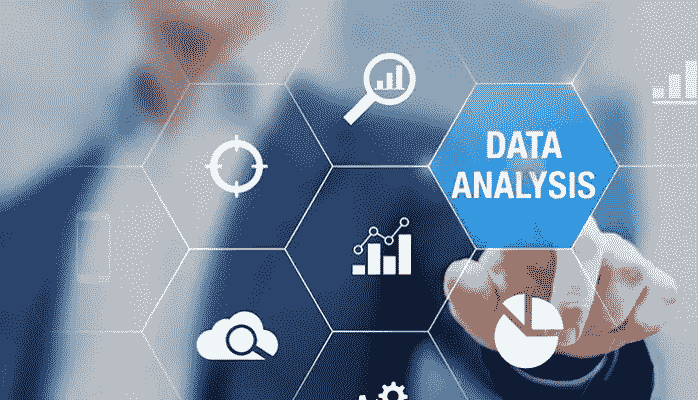

# 工业物联网和基于绩效或结果的经济

> 原文：<https://medium.com/hackernoon/the-industrial-internet-of-things-and-the-performance-based-or-outcome-economy-751e049b2c7a>

当我们想到物联网或互联产品时，我们往往会想到我们高度互联的小工具世界，无论是智能手机、冰箱还是牙刷，对于技术爱好者来说，它们似乎都具有非必要的酷产品功能。当审视传感器、支持互联网的产品和云计算的世界时，很难真正理解基础层面正在发生的巨大变化，即商业价值的定义以及它将如何影响我们所有人。

从我们记事起，产品就被买卖。所有权随着销售而转移，服务随着保修期而结束；我们可以将此视为交易模型。随着业务的发展，我们在这个简单的模型中加入了更先进的增值概念。这包括 EDI 类型的库存系统，以确保我们尽可能有效地管理客户群的需求。与其他服务、咨询或其他信息类型的合作一样，我们使用“值得信赖和可靠的合作伙伴”这样的词。这表明双方的关系已经超越了简单的买卖，更多的是理解对方的需求，主动管理对方的活动。

有了工业物联网，从成为一个好的合作伙伴或供应商到将商业价值与基于可衡量的绩效结果联系起来，有了更大的延伸。西奥多·莱维特在他的引言中抓住了这个概念，“人们不想要四分之一英寸的钻头。他们想要一个四分之一英寸的洞！”正如约瑟夫·巴尔凯在他的新书《结果经济:工业物联网如何改变每一项业务》中所写的那样，公司不仅通过销售产品和服务来创造价值，还通过提供完整的解决方案来为客户带来可量化的业务成果。

值得注意的是，物联网的价值并非来自互联设备，而是来自从互联设备数据中提取、挖掘、组织和影响行动的能力。橡胶将为所有设计昂贵技术解决方案的公司上路，这些解决方案不会产生具体结果，但对那些产生具体结果的公司来说，新的十亿美元实体将诞生。组织将能够从统计上论证他们的价值，而不是像“我保证！”或者“100%满意或者退钱”。

新的商业模式将基于一种持续的基于关系结果的做生意方法而出现。我们已经看到订阅和会员制经济正在成为一种主导模式，成为像网飞这样的公司经常性收入的圣杯。SaaS(软件即服务)正在演变成像 SeaS(传感器即服务)这样的东西。对于斗志昂扬的独立企业主来说，考虑这种不断变化的格局并接受它可能会给他们的行业带来巨大的收益和巨大的破坏。

位于[数据科学](https://hackernoon.com/tagged/data-science)、物联网、物联网、商业模式和价值创造交汇点的商业化领导者

# *原载于 2016 年 8 月 12 日*[*https://www.linkedin.com*](https://www.linkedin.com/pulse/industrial-internet-things-performance-based-outcome-economy-dan)*。*