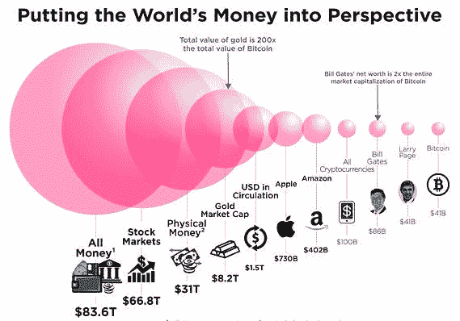

# 互联网与自身

> 原文：<https://medium.com/hackernoon/the-internet-vs-itself-a31e18a6713c>

我和 ETHLend 的写作经常让我沉浸在未知的技术中。我经常在做这个星球上从未有人做过的事情，例如将[以太网连接到 uPort](https://hackernoon.com/ethlend-uport-a-match-made-in-heaven-e00cc6c45fc6) 。这让我对分散开发人员的日常生活有了一个独特的视角。同时，我在一家非常大的以客户为中心的科技公司工作。这两种观点的结合让我思考了以下问题:集中式用户体验的第一市场优势对于分散式技术来说是否太强大而无法克服？

# Web3.0

以太坊经常被吹捧为“web3.0”。的确，分散技术试图完成的是宏伟而庞大的任务。使用以太坊和其他去中心化的软件感觉就像在网络早期使用互联网一样，这也是事实。那时候，你经常不得不做一些看似神秘的咒语，却不知道它们实际上在做什么。显然，大多数加密货币都有类似的感觉，比如 iota 钱包显示无余额( [1](https://www.reddit.com/r/Iota/comments/72w6ih/iota_wallet_showing_zero_balance/) 、 [2](https://www.reddit.com/r/Iota/comments/7360ue/iota_flaw_wallet_zero_balance/) 、 [3](https://www.reddit.com/r/Iota/comments/71xucf/my_iota_balance_is_showing_0_in_the_wallet/) 、 [4](https://www.reddit.com/r/Iota/comments/6sim7o/psa_if_your_wallet_displays_a_0_balance_suddenly/) 、 [5](https://forum.iota.org/t/solved-wallet-balance-zero-history-gone/4234) 、 [6](https://github.com/iotaledger/wallet/issues) )和 [DAO hack](https://en.wikipedia.org/wiki/The_DAO_(organization)) )。这很容易与早期的网络进行比较，然而，我认为这种比较有点太容易了。

集中式 web 上的用户体验远远领先于最初的地方，这使得它远远领先于分散式 web。我没有看到普通用户离开他们舒适的奔驰，回到分散用户体验的马车上。更重要的是，我相信这个类比将永远有效。

这并不是说福音派和技术官僚不会像早期互联网那样完全接受这项技术。这是因为我们大多数人都明白用户界面背后发生的事情，并且比普通用户更愿意原谅技术错误或无能。我担心的不是这项技术不会被采用，而是采用率永远不会超过人口的一定比例。

# 互联网与自身

如上所述，很容易将互联网的技术增长视为分散的技术可以效仿的例子。这种观点的问题在于，互联网不必与自己竞争。互联网与印刷竞争，我认为，直到用户体验感觉轻松，它打了一场硬仗，就像分散的技术正在打的一样。问题在于，目前互联网用户体验的状况远远领先于分散的同行，并将继续超过分散的同行。

# UX 重要吗？

有人可能会认为用户体验不是一切。分散技术试图满足的需求不一定是由用户体验驱动的(虽然，我认为技术的动机应该总是由用户体验驱动，但这是不同时代的不同讨论)。然而，为了实现大规模采用，必须实现优越的，或者至少是同等的，分散的用户体验。

设身处地为外行人着想。他们不了解分散技术*试图*实现什么，他们只知道它和集中版本一样有效或无效，因此当它无效时，他们会回到集中替代方案。以[钢铁](https://steemit.com/)为例。他们向 T4 付费让人们使用这个平台，但是 UX 远远落后于红迪，这没关系。人们仍然继续留在红迪网上，甚至在尝试过之后，也会回到红迪网上。

# 工程师也是用户

这就引出了我的最后一点。工程师也是用户。构建好的、干净的、可维护的软件，比如 reddit，是一项非常困难的工作。软件开发人员不需要让他们困难的工作变得更加困难。这正是他们选择分散工具所要做的。围绕现代 web 的基础设施的当前状态使得软件开发成为一种愉快的体验。分散的工具包就不一样了。我希望这在[的未来](https://hackernoon.com/tagged/future)有所改变，但是我担心就像用户体验一样，现代网络的工具也遥遥领先，并将继续超过它的分散对手，这永远不会发生。

这在很大程度上归因于技术的[帕累托定律](https://en.wikipedia.org/wiki/Pareto_distribution)。分散式网络必须与集中式网络竞争。集中式网络是一个拥有数十亿美元资本的互联网，允许它雇佣数亿软件工程师来处理基础设施中哪怕是最微小的细节。而分散的替代方案最多有 10 万人分散在全球各地，工作报酬更低，而且往往是免费的。不要误会我的意思，我赞扬他们的努力，考虑到我周末都在写关于这项技术的文章，我也算他们中的一员。

# 加密货币

然而，随着加密货币的出现，越来越多的资金*被投入到分散的替代方案中，这就是为什么现在甚至有可能反对集中化。这其实是我投资加密货币的主要动机。我投资不是因为我对购买兰博感兴趣，而是因为我知道引领这项技术的唯一方式是向它投入资金，看看它会把我们带到哪里。然而，这笔资金是否能盖过中央集权的同行还有待观察。*

*我们都看过这些小小的信息图表，展示了加密货币实际上是如何与苹果和亚马逊等公司相抗衡的。诚然，这个已经过时了，但是，即使比特币价格出现前所未有的飙升，所有的加密货币仍然无法与亚马逊的市值相提并论。*

# 结论

这就是为什么我不会马上辞掉我的日常工作，全职加入分散化的军队。作为一名工程师，我坚信分散技术是一种比集中技术更稳健的设计，但是秘密已经泄露了。用户现在已经太习惯拥有他们的数据了。不要误解我的意思，实现集中式软件所涉及的工程技术绝对是卓越的，并且已经花了几十年的时间来完善。我相信去中心化技术总有一天会实现。但当那一天到来时，用户体验的门槛将会因集中化技术而更高。

*原载于 2017 年 12 月 9 日*[*【sjkelleyjrblog.wordpress.com】*](https://sjkelleyjrblog.wordpress.com/2017/12/09/the-internet-vs-itself/)*。*