# 我照片中看不见的大象

> 原文：<https://medium.com/hackernoon/the-invisible-elephant-in-my-photos-2ac49f41378a>

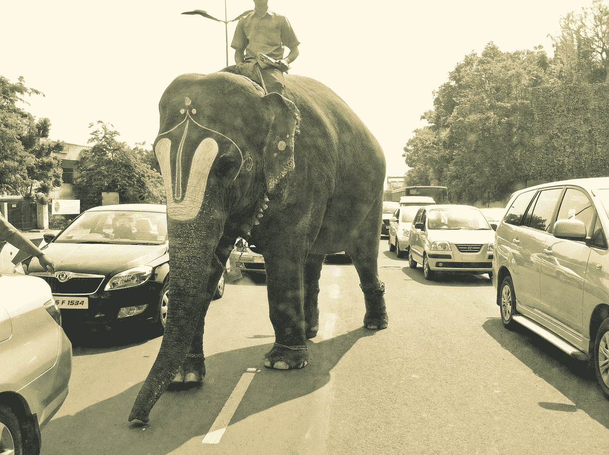

Just another way to travel in India

昨天晚上，我 14 岁的儿子用我的苹果电脑搜寻一张大象跟在我们车后面走在路上的照片。我的苹果电脑的“照片”应用程序有近 17，000 张照片。毫不奇怪，她没有找到大象。她不太高兴，并要求知道为什么我没有标记图像。

试图想出一条捷径来追踪失踪的野兽，我回忆起照片是在去她学校的路上被点击的，但不是确切的日期。快速浏览缩略图不足以发现那只大象。

最后，我不得不费力地翻阅五年来拍摄的数千张照片。花了将近半个小时才找到厚皮动物。

这是一个很好的镜头，考虑到这是一个 10 岁的孩子在光线下，从一辆行驶的汽车上拍摄的瞬间快照。当然，如果她没有砍掉看象人的头，情况会好得多！

不管怎样，这件事让我反思了‘照片搜索’。

我知道“照片搜索”远远落后于“文字搜索”毕竟，设备识别图像内容的能力仍在发展中，谷歌照片目前处于领先地位。

此时，我有一个面对手掌的瞬间。

我完全忘记了我已经把我的整个图片库上传到了 Google 相册上，当时他们提供了无限制的备份，只是稍微降低了分辨率。谷歌甚至保存了照片的 EXIF 信息。我应该在谷歌照片中搜索大象，而不是在照片上。

没关系。我很好奇谷歌照片在“照片搜索”方面有多好。所以我打开 iPhone 上的应用程序，快速搜索大象。该应用程序从我的谷歌照片库中提供了 11 张照片，它认为这些照片是大象。这包括我儿子一直在找的照片。

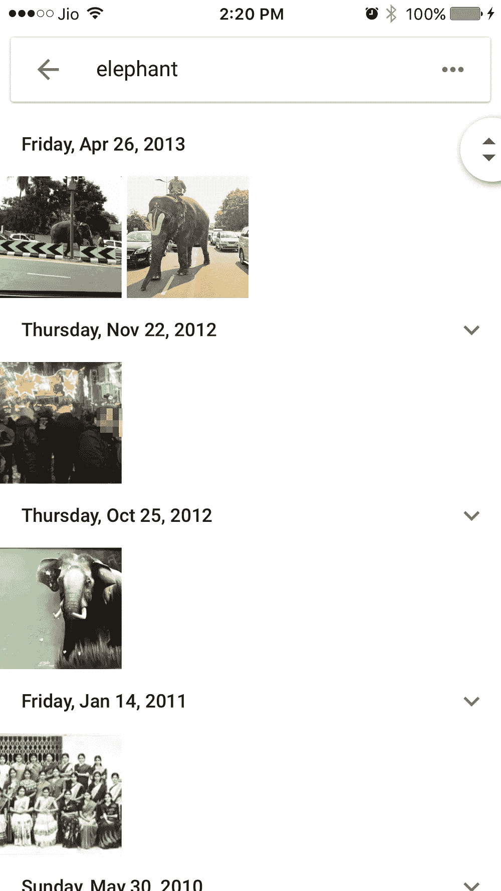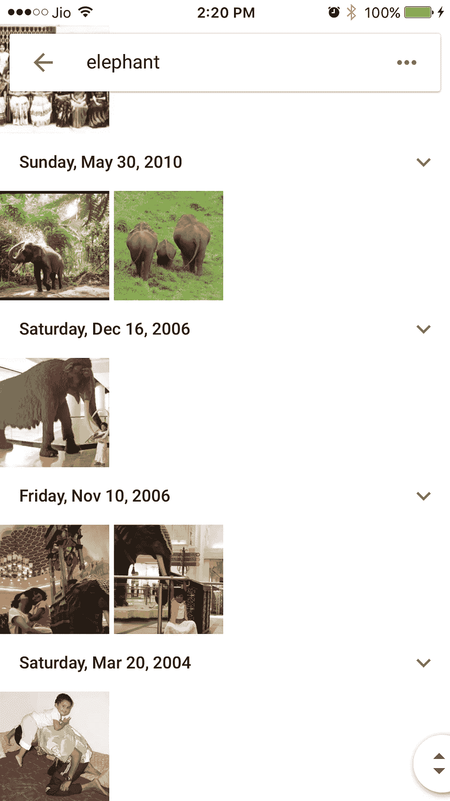

Google Photos is good, but still a work in progress

令人印象深刻的是，谷歌照片使用了“图像识别”来定位这些大象图片中的大部分。这是同一只大象的另一张照片，半藏着，从马路对面拍摄。正如你从照片信息中看到的，没有标签或其他任何东西显示这是一只大象。

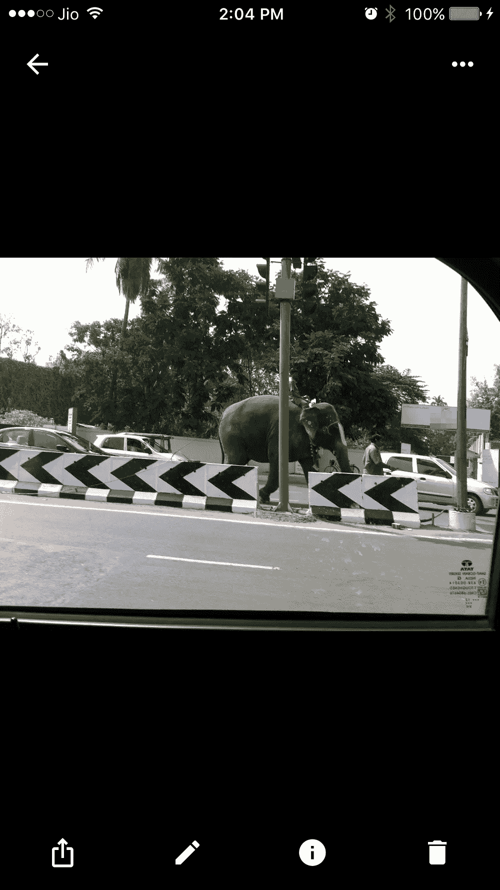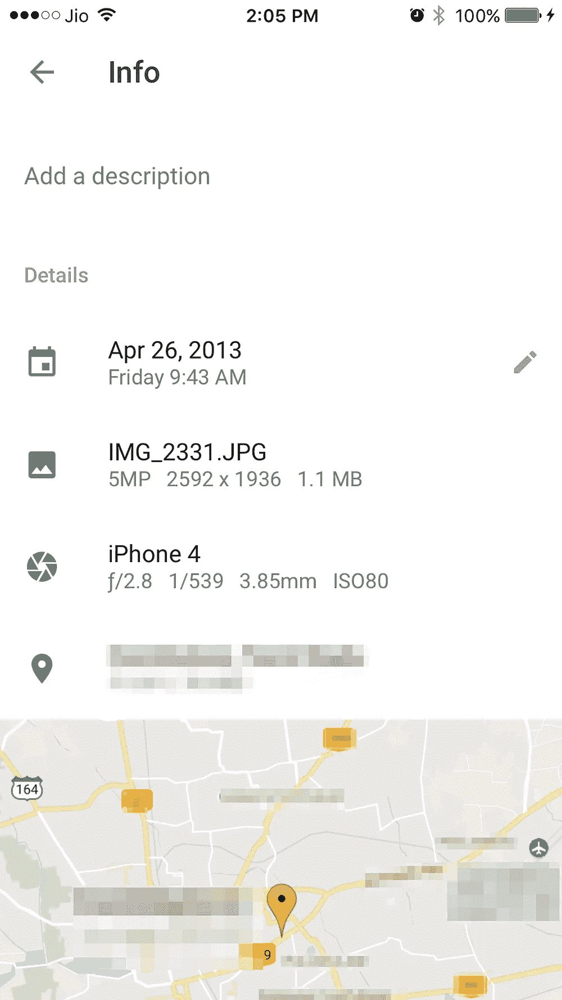

Google Photos ability to recognise what’s in an image without depending on tags is pathbreaking

该应用程序还可以从后面识别大象，以及那些用大象相关术语标记/命名的大象。

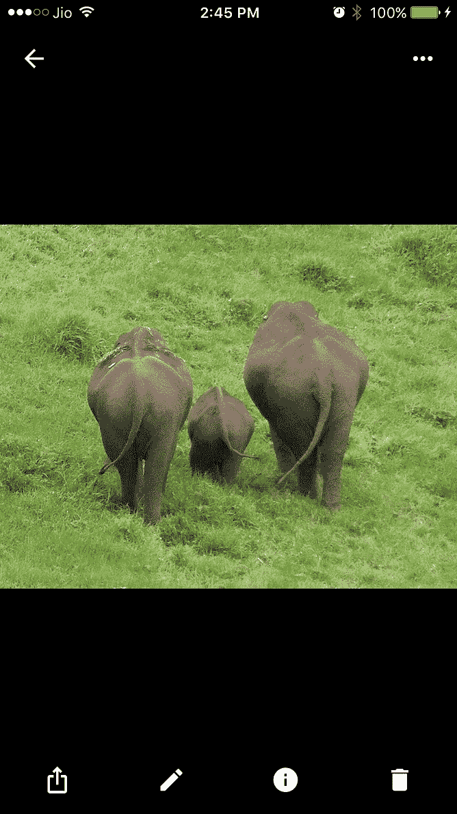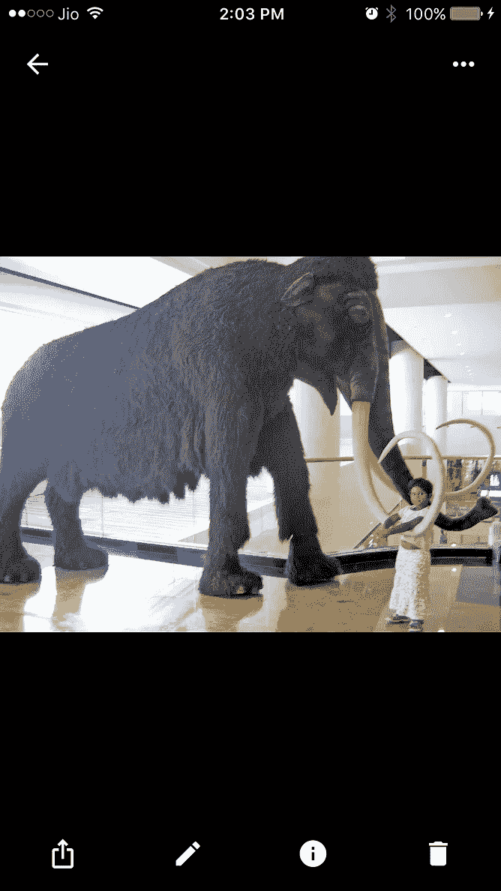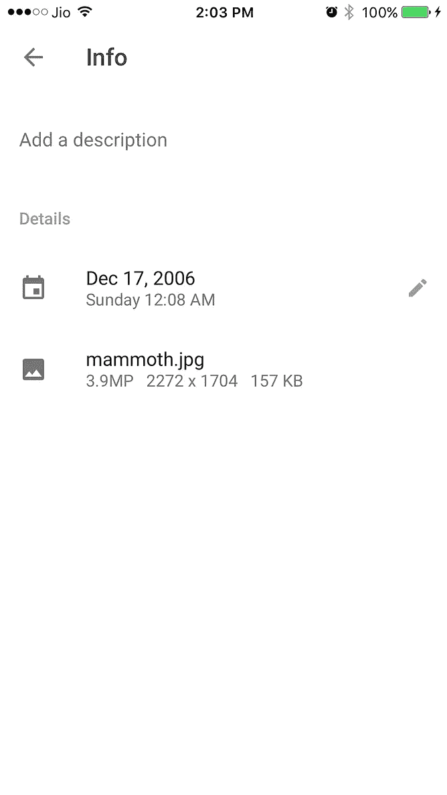

谷歌照片确实拍摄了一些其他照片，原因我只能猜测一下。这张图片中的黑色区域是否类似于大象的形状，桌腿是大象的鼻子还是它的腿？你能看见它吗？试图进入一个机器的大脑确实很奇怪。

Google Photo thinks there’s an elephant in this picture

我要说 Google Photos 绝对是遥遥领先于苹果的照片。下次我想找一张难以捉摸的动物或物体的照片时，我会直接去谷歌照片，而不是在照片上浪费时间。

为什么现在不试试呢？

我会在我的在线图书馆里一次一个地查找“狗”、“骆驼”和“玫瑰”。

和大象一样，在我的三次搜索中，我得到了一些随机图片和我要找的东西。一点都不差！

Google Photos searched and found a dog, a camel and a rose in my online Google library

显然，苹果的照片要赶上谷歌照片还有很长的路要走。

通过面部识别和位置标记，照片确实有一定程度的可搜索性。但是他们都不适合我的大象形象。大象不符合人的标准，它们的脸也不在我手机的“人”列表中。至于拍摄地点，这张照片是在我家附近拍摄的，所以“地点搜索”在“照片”中找到了我将近一半的照片。

在这种情况下，要么坚持使用谷歌照片。或者在 iPhone 上手动标记。不幸的是，iOS 没有内置手动标记功能。你必须使用第三方应用程序，我对此没有耐心。

我们需要的是类似于我的 Mac 的照片应用程序上的手动标记功能。基本上，我在 Mac 上点击一张照片，进入它的信息(命令 I)，然后在关键词部分添加“大象”。见下文。

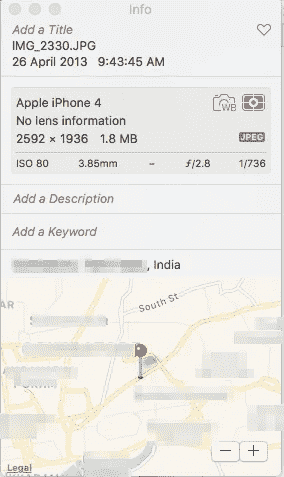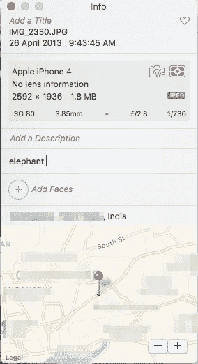

Manual photo tagging is possible on Mac OS, but not on iOS

下一次，我想要这张照片，我要做的就是搜索“大象”如你所见，我的 Mac 在我的图片中找到了它(IMG_2330)。

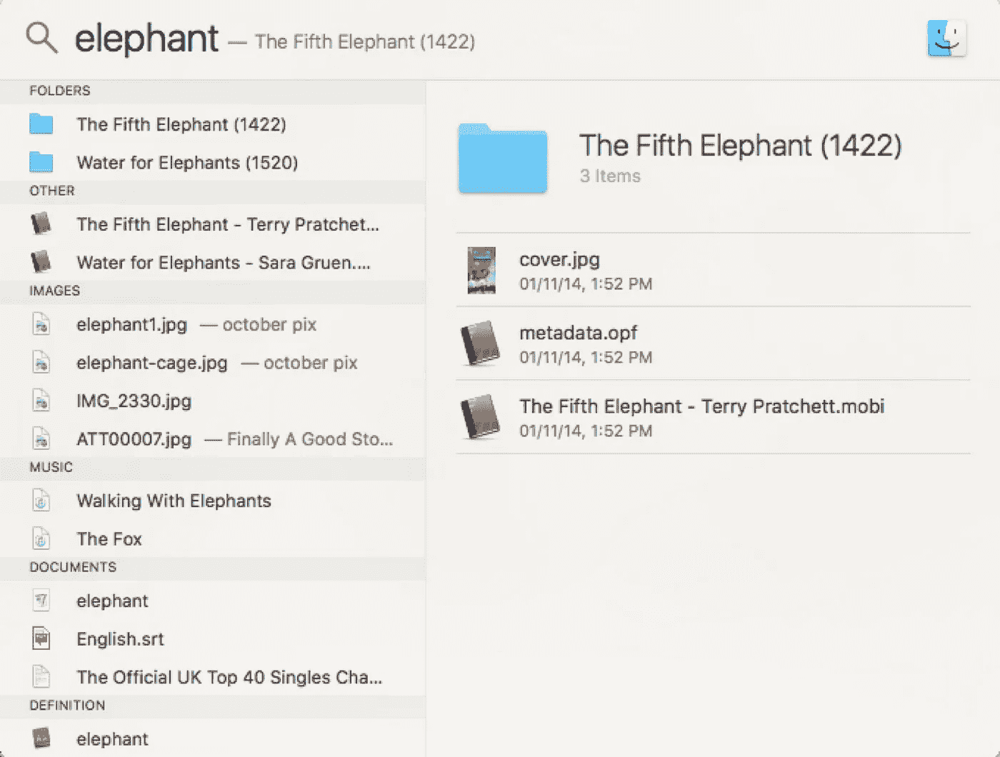

Putting a keyword in Photos on my Mac makes it findable by Spotlight

不幸的是，iPhone 上的照片应用程序似乎没有基于我的 Mac 上创建的关键字进行搜索的能力。这令人惊讶，因为苹果通常对这些细节非常用心。我把照片发到我的手机上，用一个叫 Photogene 的应用程序确认了它有关键词。但是在照片中搜索大象，照片库中没有这种动物。

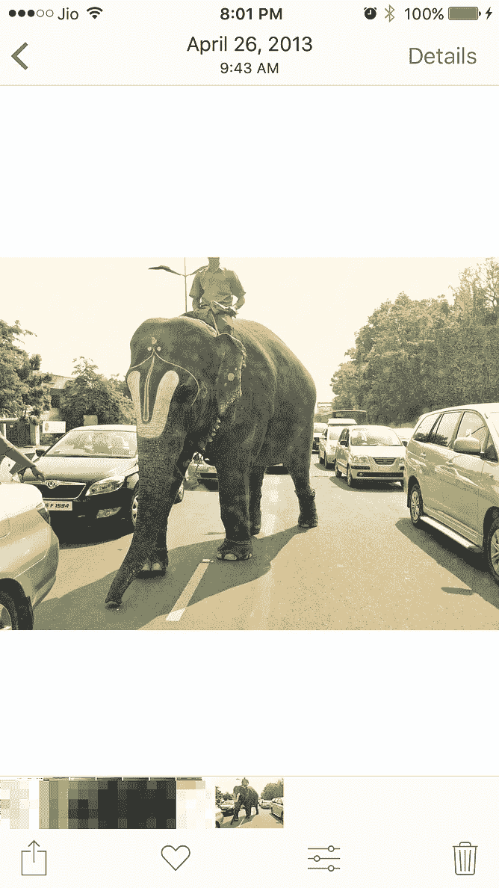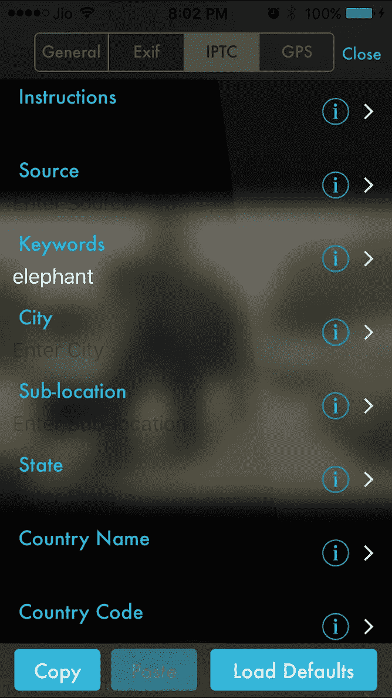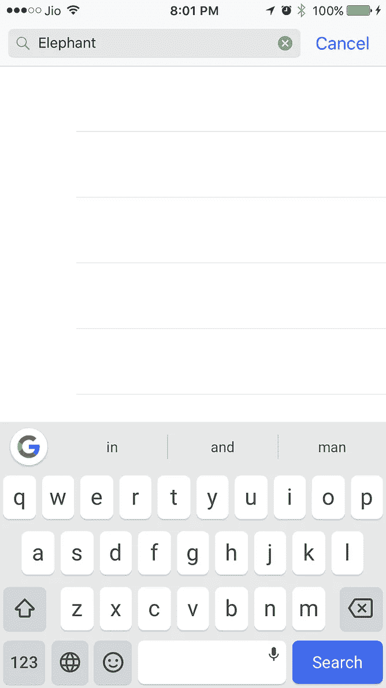

Photos on iOS can’t see keywords made on Mac OS

苹果为什么不在 iOS 中内置手动标记功能？

我能想到两个原因。首先，更多的人会知道谷歌照片有多先进。其次，苹果知道人们不喜欢人工标记的劳动。换句话说，它不是用户友好的。所以苹果把这个留给了可以在 App Store 找到的第三方应用。

“照片”有一个手动标记的变通方法。只需创建一个相册，并在其中分组照片。但在这种情况下，这是行不通的。这是一张随机拍摄的照片，并不像《动物园之旅》或类似的专辑那样可以贴标签。此外，过一段时间后，照片中这种相册的数量会变得难以处理。

尽管如此，我觉得手动标记应该内置到 iOS 中，直到苹果提高照片的图像识别能力。让我解释一下。

想象一下，一个图书馆有成千上万没有标签的书，而且每年还有成千上万的书被扔进去。你越是拖延给书贴标签，给书贴标签的任务就越难完成。很快，要在这一片混乱中找到一本书将变得不可能。

这正是照片中发生的事情。苹果越是推迟标记，就越难浏览我迅速增加的未标记图片，找到一些我依稀记得拍摄的难以捉摸的图片。这很遗憾，因为照片是我们时代的记忆。

仔细想想，也许苹果是对的。人工标注属于恐龙时代。不如把他们的资源集中在图像识别上。

但这可能需要一段时间。所以我建议你把你的图片库上传到 Google 相册。

除了你的高分辨率，你没什么可失去的。

> [黑客中午](http://bit.ly/Hackernoon)是黑客如何开始他们的下午。我们是 [@AMI](http://bit.ly/atAMIatAMI) 家庭的一员。我们现在[接受投稿](http://bit.ly/hackernoonsubmission)，并乐意[讨论广告&赞助](mailto:partners@amipublications.com)机会。
> 
> 如果你喜欢这个故事，我们推荐你阅读我们的[最新科技故事](http://bit.ly/hackernoonlatestt)和[趋势科技故事](https://hackernoon.com/trending)。直到下一次，不要把世界的现实想当然！

