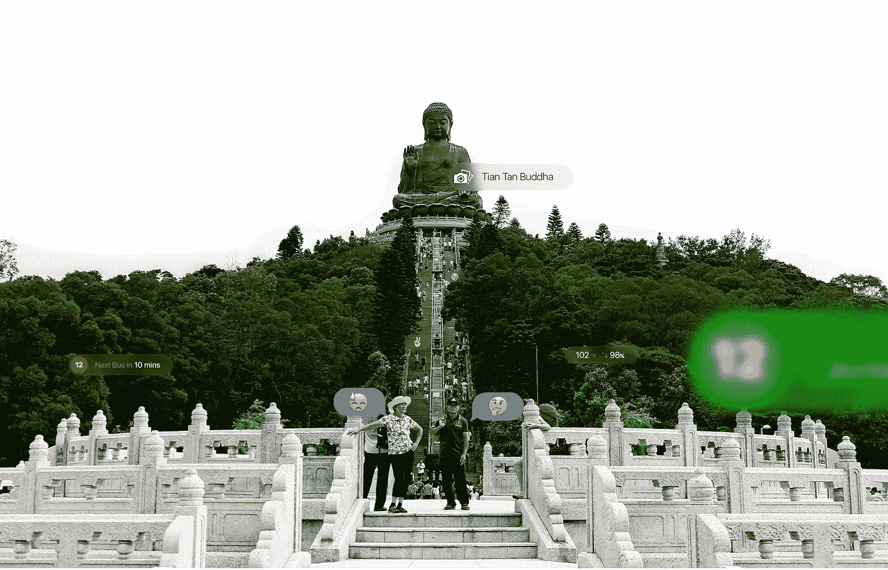
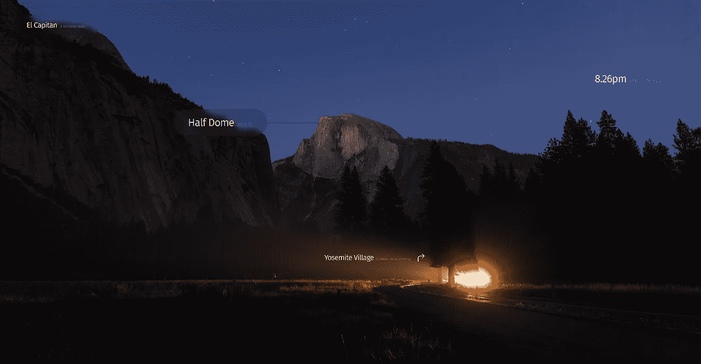
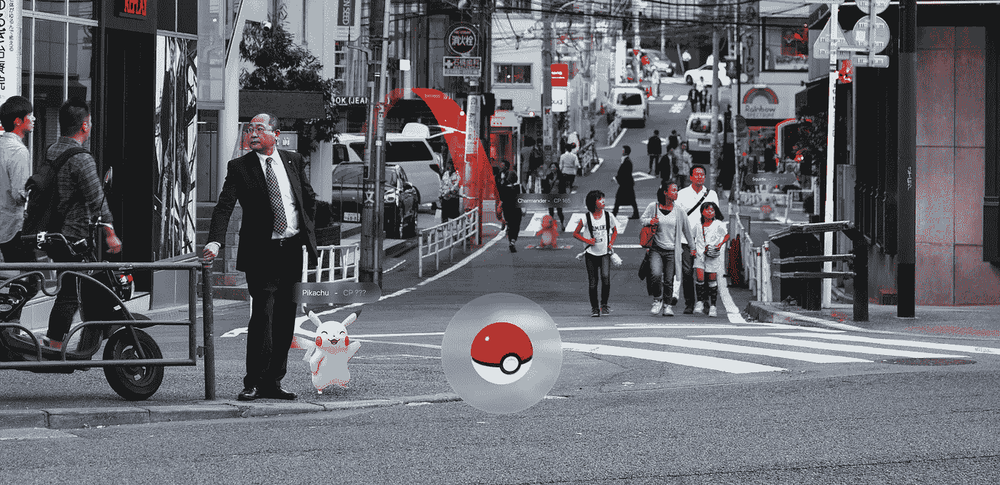
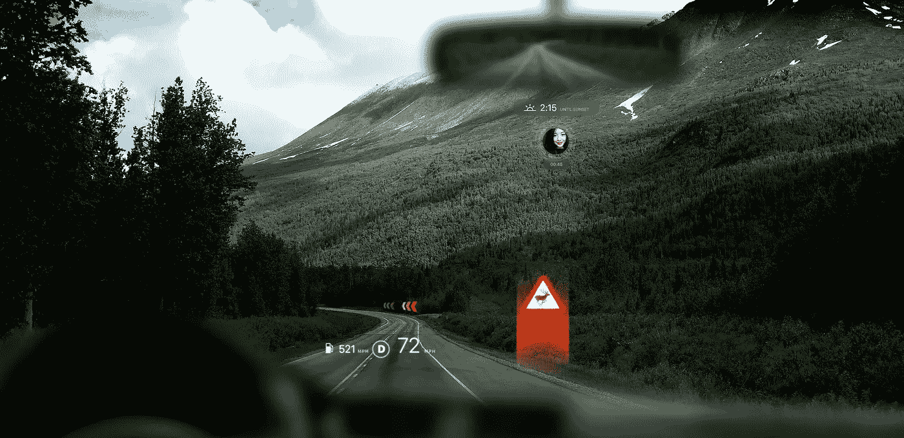
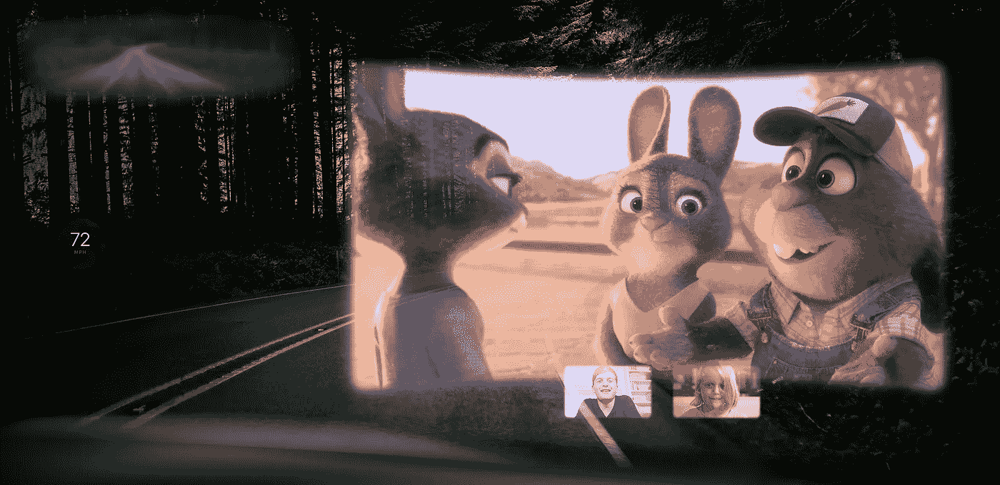
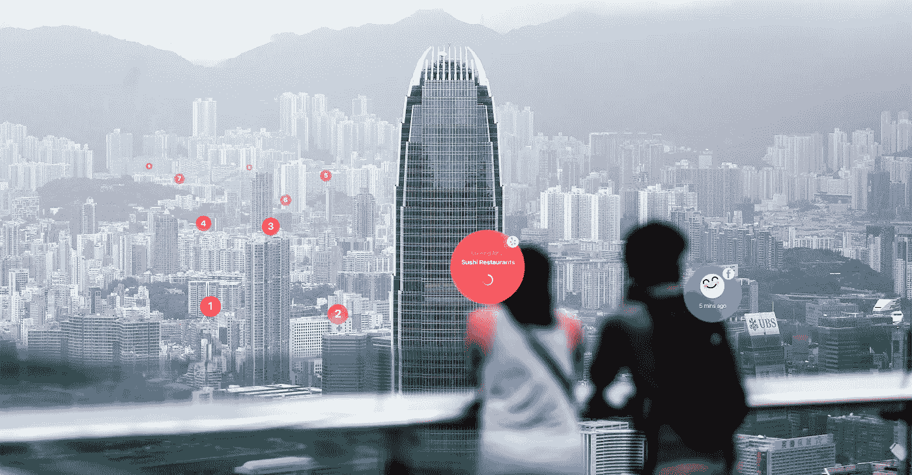

# 这🌏是你的画布

> 原文：<https://medium.com/hackernoon/the-is-your-canvas-1e44ea6556a0>

## 混合现实将如何改变你对公共和私人空间的看法

我们生活在信息的包围之中，我们每天都在私人和公共场所消费这些信息。从我们穿的衣服的品牌到街道上的标志，烤箱上的说明，交通信号灯等等，信息流无处不在地冲击着我们。眼睛所能看到的任何地方都可能看到广告或有意传达的信息。MDI 估计，一个普通美国人每天大约会消费 4000 到 5000 个广告，但这还没有算上我们有目的地看到和寻找的所有其他视觉线索和标志(例如方向、浴室标志、出口标志等)。).

在如此丰富的信息中，我们已经学会了浏览它们，我们几乎已经对它们的影响麻木了。就像用户倾向于忽略网上的横幅一样，如果我们知道我们要去哪里，我们会忽略街道标志；如果我们不开车，我们会忽略交通灯。所有这些信息在视觉上把我们的环境搞得乱七八糟，因为它们针对的是所有人，而实际上它们只与其中一些人相关。随着虚拟现实、增强现实和混合现实的到来和普及，一些事情有望发生变化。

**冒着描述一个反乌托邦未来的风险，我相信随着这些新设备的到来，传统通信平台将首先感受到燃烧，它们将很快影响我们所知的私人和公共空间的设计。**

# **如何—** 混合现实中的信息深度

为了破坏日常通信平台，进而破坏我们的生活空间，混合现实和增强现实设备需要遵循一系列原则和感知规则，以便用户可以立即理解他们的工作方式，并看到其价值。就像任何其他新设备一样，黄金法则将是熟悉加上渐进增强。找到一个钩子，慢慢地它会成为一种习惯。为了实现这一点，我相信混合现实设备将在我们现实的三个不同层面上运行。

## **1。锚定你的观点**

你最私人的空间，除了用户决定的(可能是通知/提醒)，不会被任何东西占据。

## **2。锚定到对象以显示上下文信息。**

对象将根据用户和他们的意图触发他们自己的界面。例如，如果你是开车的人或坐在乘客座位上，汽车的内部将会不同。

## **3。锚定到物理空间以显示额外的信息。**

MR 和 AR 可能会丰富街道标志、地标和任何其他物理表示。

# **从语境到意图** —心态的转变

由于使用者是平台本身，物理空间将不再需要围绕静态平台设计，通常用于 UX 研究的上下文线索将变得无关紧要。背景(人口统计信息、一天中的时间、位置等)将不再是定义 UX 的唯一信息来源。

一个给定的空间对不同的人可能有不同的意义。在设计空间时，不同类型的使用被优先考虑，这被转化为它的设计。以一个机场为例，它的主要目标是让人们通过一系列计划好的步骤(从检查到登机)，它的空间设计和标志也相应地被表达出来。

然而，给定空间的目标并不总是那么清晰，其使用类型也不清楚。如果你在街道中间，什么与你相关？你周围的每个人都有相同的地理背景，但是根据他们的目的，他们的注意力会集中在不同的方面。你是在找地铁站还是在等着过人行横道？不同的目的会寻求不同的信号。

随着 MR 设备的引入和主流采用，当前的范例可能经历结构性变化。一旦个人成为平台，物理空间将不再需要显示大量不同用途的信息。相反，用户将根据他们当前的意图来塑造他们的空间，与他们的地理环境无关。如果你想找一家餐馆或者想抓一只口袋妖怪，走在街上会是一种不同的体验。

私人空间的设计也是基于环境的假设。例如，公寓是根据最常见的居住模式(睡眠、休息、休闲、用餐)组织的。例如，大多数起居室都是围绕娱乐而布置的——上个世纪是收音机，最近是电视机。

由于空间和功能有限，汽车可能是情境设计物理布局的最佳示例(mi4 汽车与地图的交互)。传统上，一辆车有三个主要角色，司机、乘客和货物。驾驶员需要集中注意力并拥有完全的控制权，乘客与驾驶员分享一些控制权(作为驾驶体验的补充),如地图、音乐、暖气和空调，后座的乘客没有任何控制权，只是有时有自己的独立娱乐设备。

汽车的仪表板和内部体验是由其物理限制决定的。现在，让我们想象一下 AR/MR 设备如何帮助减轻驾驶汽车的认知负荷。如果我们可以根据您的意图定义控制和指示器，汽车会是什么样子？我敢打赌，它会更简洁，更集中，因为它不需要一直显示每一个控件。此外，语音激活的用户界面将减轻一次性呈现每个选项的认知负担。

通过查看用户意图，每个空间都可以成为用户在给定时间需要的东西，而不需要解释或信息层级。意图最终是对用户需求最准确的描述，物理世界应该是用户满足这些需求的画布(而不是他们的手机)。

Drivers will be able to define their experience according to their needs. AI doesn’t need to look fancy, it just needs to work. **Photo:** [Alejandro Gonzalez](https://unsplash.com/@alejo10gonzalez)

Passengers on the other side could totally opt out of the driving experience and focus on entertainment. **Photo:** [Nathan Anderson](https://unsplash.com/@nathananderson)

# **为什么**会发生这种情况？

## 1.**经济原因**

互联网使真正的定向营销成为可能，并创造了更好的方法，以更个性化和基于行为的信息来锁定相关用户。它创造了数字空间，引入了新的财务模式(CPC ),帮助广告商从预算中获得最大的投资回报。

不管是好是坏，广告将会在磁共振设备上扮演重要角色，就像多年来它在互联网上扮演的角色一样。随着 MR 的到来和普及，数字空间将最终打破物理限制，在我们的世界中找到一席之地。媒体公司将抓住机会，最终能够在正确的地方与正确的用户交谈。

## 2.**拥有生态系统的最后一步。**

大型科技公司正试图在客户最常见的生活场景中吸引他们。也就是说，苹果已经推出了 Carplay、Homekit，并从 2007 年开始推出 Apple TV。[另一边的 Google](https://hackernoon.com/tagged/google) 有安卓电视，安卓汽车，NEST。为了在用户的生活中无处不在，科技巨头们努力创造尽可能多的必要设备，以接触到用户，无论他在哪里(在家、在交通工具上、在路上、在锻炼)。磁共振设备的灵活性和便携性将使所有这些设备过时，使这些公司更容易无处不在。

## 3.**拥有多个物理平台的负担**

在大多数情况下，用户偶尔会更新家里的许多设备。一台新电视、更快的手机和更强大的电脑只是例子。市场营销告诉客户，每一次新的迭代都是创新的重大突破，但现实表明，他们的演变更接近销售周期，而不是真正的创新。虽然**计划淘汰**不会消失，但磁共振设备可以统一我们日常使用的许多设备，从而简化我们所在的设备生态系统。

# **对社会的连带影响**

如果我们接受交流平台变得过时的想法，那会如何影响我们呢？早在 1964 年，马歇尔·麦克卢汉就提出，不仅媒体传播的内容会影响社会，传播内容的媒介及其特征也会影响社会。互联网是这个理论的一个很好的例子。媒体的存在及其特征(在大量可负担得起的设备中随时随地传输和消费信息，允许消费和创造)，对于定义当前社会来说，远比通过它传输的信息更重要。

考虑到这一点，如果我们能够将媒体从其物理固定平台上分离出来，将公共和私人空间从承载这些设备(电视、电脑、广告牌等)的负担中解放出来。)，那会对我们的社会产生什么影响？“重建我们的生活空间”将如何影响我们社会及其成员的定义？

## **个人共享空间和隐私**

考虑到与他人分享时体验会更好，MR/AR 的采用也将重新定义如何在一个群体中体验社交活动。群体中的物理共享空间不会完全共享，因为每个人都可以根据自己的个性、意图和需求来定义空间。这个数字实体中有多少是用户共享的，哪些是严格保密的，这取决于每个人。

随着我们将我们的数字档案扩展到我们的物理现实，这些隐私级别将定义其他用户对我们的了解，以及第三方可以用来更好地向我们发送信息的内容。如果你发现自己在市中心寻找泰国菜，并且作为你个人资料的一部分，你表明你对坚果过敏，那么显示在你视野中的结果应该由你的需求来定义。

## **一个没有杂乱的世界**

这一未来场景最令人兴奋的前景之一是从城市布局中去除持久标注的想法。一个没有广告牌的城市会是什么样子？如果我们可以重新定义城市，而没有指标、营销口号、交通信号和任何其他不必要的信息，那么什么可以被定义为我们城市的重要组成部分？

广告在 20 世纪 20 年代初首次引入时代广场地区。从那以后，时代广场几乎成了世界各地游客来纽约的朝圣地。曾经被认为是广告的东西如今已经成为这座城市文化和身份的一部分。当 MR/AR 设备成为主流时，我们会认为时代广场是对过去时光的怀旧吗？

当人们能够独立地重新创造同样令人印象深刻或不需要物理设置的视觉体验时，将会发生什么？

特别是在看私人空间时…

[**如果没有电视，你的客厅会是什么样子？**](http://s2.favim.com/orig/28/friends-joey-tv-Favim.com-236664.gif)

# 参考

[世界上最神秘的初创公司 Magic Leap 的不为人知的故事。](https://www.wired.com/2016/04/magic-leap-vr/)

在眼睛能看到的任何地方，都可能看到广告。

[减少认知负荷的设计原则](http://jonyablonski.com/2015/design-principles-for-reducing-cognitive-load/)

[媒介就是信息。马歇尔·麦克卢汉](http://web.mit.edu/allanmc/www/mcluhan.mediummessage.pdf)

[此空间可用。](http://thisspaceavailablefilm.com/)

[松田隼敬一的超现实作品](http://hyper-reality.co/)

[天才机器人的视力](https://vimeo.com/46304267)

> [黑客中午](http://bit.ly/Hackernoon)是黑客如何开始他们的下午。我们是 T21 家庭的一员。我们现在[接受投稿](http://bit.ly/hackernoonsubmission)并乐意[讨论广告&赞助](mailto:partners@amipublications.com)机会。
> 
> 如果你喜欢这个故事，我们推荐你阅读我们的[最新科技故事](http://bit.ly/hackernoonlatestt)和[趋势科技故事](https://hackernoon.com/trending)。直到下一次，不要把世界的现实想当然！

