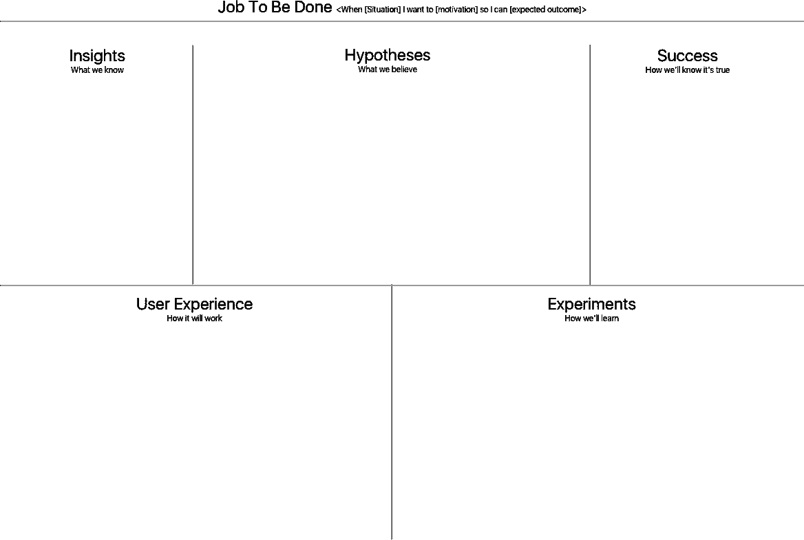
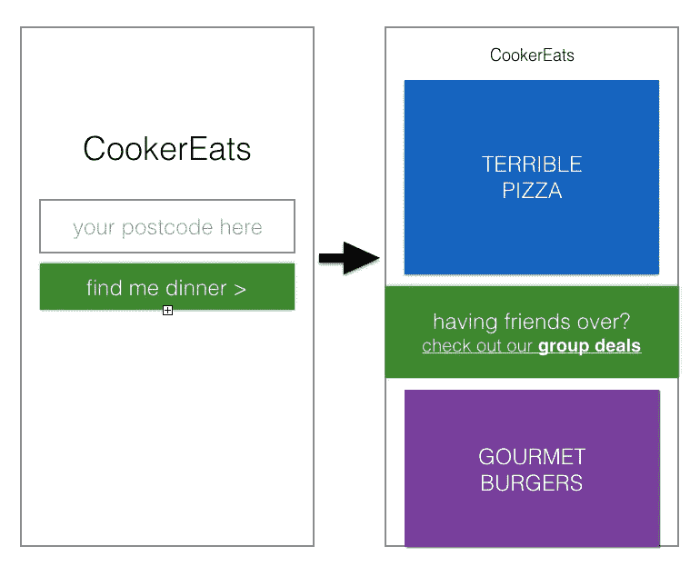
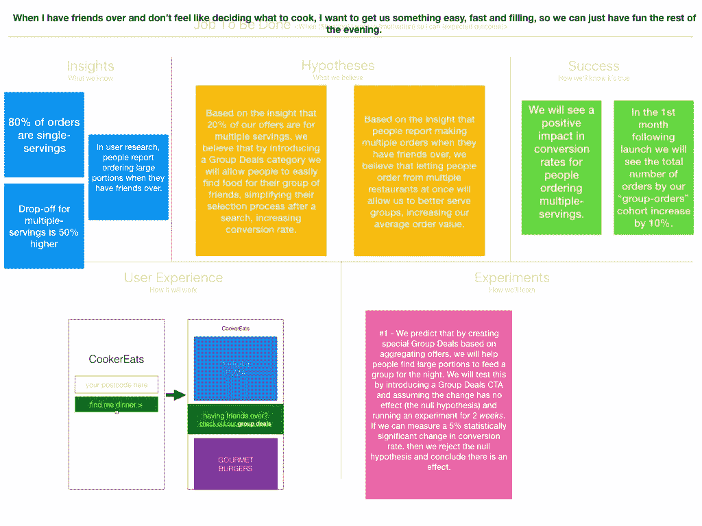

# 工作画布——围绕要完成的工作

> 原文：<https://medium.com/hackernoon/the-job-canvas-rallying-around-the-job-to-be-done-3e1e76af5137>

从客户动机到执行，最大化[学习](https://hackernoon.com/tagged/learning)的工具。一个简单的画布，用于可视化您的团队围绕要完成的工作发现、执行和集成的工作。

## 进步的呼唤

作业画布从要完成的作业开始。它假设您已经与客户交谈，从手头的数据中收集见解，并探索您试图解决的问题的各个方面，然后以待完成工作的形式进行总结。我通常会选择艾伦·克莱门特的提议，选择 <situation><motivation><expected outcome="">作为我[工作故事](https://jtbd.info/5-tips-for-writing-a-job-story-7c9092911fc9)的基石。这种简短的格式可以包含已知的轨迹(包括情况)、痛点(包括动机)，并正确地关注结果(相对于产出)。</expected></motivation></situation>

## 那么工作画布是做什么的呢？

你将雇佣工作画布来帮助你的团队概述你正在使用的关键步骤和措施，创建一个解决方案，它本身可以用于你已经确定的工作。这些定义了您在**我们正在构建的**的背景下所了解的状态—应该有其他竞争对手，甚至在我们的产品类别之外，竞争解决相同的 JTBD，因此这特别适用于您如何考虑解决它。

The Job Canvas template

所以从左上角开始，你会发现:

**见解**

我们对问题了解多少，我们有定量或定性的数据吗，我们和用户谈过吗，我们收到过投诉或客户支持噩梦吗，我们做过的采访，我们做过的调查吗？

**假设**

支撑潜在解决方案的假设是什么？如果顾客在早上通勤时想找些大块的东西来糊弄她的胃，那可能是蛋白质棒、一袋花生、一杯奶昔、一片水果，甚至是一本杂志或一个游戏，让他们在到达办公室之前不去想食物。我们可以假设我们的解决方案的某些功能可以完成工作。

**成功**

如果我们实现了我们定义的影响，会发生什么？这通常应该是可量化的。激活率上升了。NPS 启动了。失败的搜索已停止。顾客买得越多，投诉就越少。预先确定你的总体评估标准，只有当问题/工作也是这样时才改变它。

**用户体验**

这有助于你清楚地了解“今天”你的信念是什么，以及你将如何解决这份工作。它可能是一个粗略的模拟，也可能是一个高保真的原型，这取决于你在产品开发生命周期的哪个阶段。它应该随着你的发现而改变，但是它描述了你所设想的最终游戏的类型，所以你的团队对他们迭代的内容有一个共同的理解。

**实验**

最后，我设计了工作板，通过实验来取得进步。任何为人们开发产品的人都知道产品开发不是线性的。我们边走边学。Melissa Perri 将这一过程称为产品形，但有多种实验驱动的产品开发方法。请记住，这并不一定要包括一个受控的(AB..n)测试，尽管这是这项工作的自然候选人。在这一部分，你将描述你正在做什么来证明/反驳你的假设。在[假设工具包](http://experimentationhub.com/hypothesis-kit.html)中使用这样的描述非常有用，可以给你可能需要的一致性。

## **解决问题空间**

产品经理非常清楚将[红皇后效应](https://en.wikipedia.org/wiki/Red_Queen_hypothesis)应用于技术的后果。当你创造和学习自己的时候，你周围的环境在变化和加速，让你尝到苦乐参半的滋味，总是有比你已经做的更多的工作要做。

因此，求职公告板不是你和你的团队在一个下午创造出来的一件美丽的艺术品，然后可以装在玻璃里欣赏。它是一个活的有机体，你可以把它打印出来，钉在墙上或白板上，随着你对工作的了解越来越多，获得更多的洞察力，重新定义你的成功标准。

# **一个工作实例**

***你是按需送餐*** [***启动***](https://hackernoon.com/tagged/startup) ***带点牵引力。你已经和你的顾客谈过了，他们告诉你，他们独处时一切都很好，但是当他们有朋友过来时，他们需要更容易地订购更多的食物——这项工作的竞争对手可能只是出去吃汉堡或打电话给达美乐。***

## **JTBD**

当我有朋友来的时候，我不想决定做什么和怎么做，我想做些简单又能填饱肚子的东西，这样我们就可以在晚上剩下的时间里继续玩反人类的纸牌了。

## **见解**

*“我们 80%的订单是单份的”，“当人们订购同一产品的多份时，我们的漏斗下降率高出 50%”，“在用户研究中，人们报告说当他们有朋友过来时会下多份订单”*

## **假设**

1.  *基于我们 20%的报价是多份的认识，我们相信通过引入团购类别，我们将允许人们轻松地为他们的朋友群找到食物，简化他们搜索后的选择过程。*
2.  *根据人们在朋友聚会时多次点餐的报告，我们相信让人们同时从多家餐厅点餐将使我们能够更好地为团队服务，提高这些订单的转化率。*

## 成功

*我们将看到人们订购多份食物的转化率会有积极的影响。*

*在发布后的第一个月，我们将看到“团体订单”团队的订单总数增加了 10%。*

**用户体验**

## **实验**

1.  *我们预计，通过基于聚合报价创建特殊的团体交易，我们将帮助人们找到大量食物，供一个团体过夜。我们将通过引入集团交易 CTA 并假设变化没有影响(零假设)并运行 2 周的实验来测试这一点。
    如果我们可以测量到搜索转化率有 5%的统计显著变化，那么我们拒绝零假设，并得出有影响的结论。*

# 完成您的订单

An example early stage Job Canvas

工作画布永远不会结束。当你的团队专注于解决围绕着一项关键工作的问题时，当客户放弃你的产品而转向竞争对手时，还有工作要做。工作画布得到更新，新的见解被收集，你的成功标准得到发展，新的实验开始了。你的用户体验原型从低分辨率到高分辨率，你的团队随着画布的发展而成长。

试一试吧，当你尝试过并提出问题和建议时，给我一声欢呼——工作画布永远不会结束！

*工作画布是我在《产品行动手册》中描述的行动之一，这是我一直在整理的一套产品策略。在*[*github*](https://github.com/colivetree/product-playbook/blob/master/job_canvas.md)*上查看一下，免费下载模板，给其他剧看看，给剧本投稿，给我你的反馈。*

另外，在推特上向 https://twitter.com/colivetree 问好。