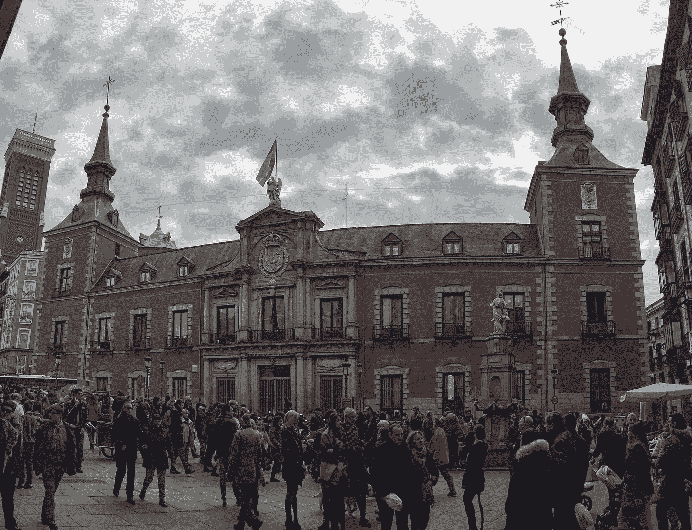

# 旅程

> 原文：<https://medium.com/hackernoon/the-journey-703c2bb1388c>

Wandering around Spain in December of 2015

我承认，我对这个话题很痴迷。这已经成为许多人的一个主题，记得享受旅程，这个过程也称为生活。这是一句很好的谚语。但是还有更多的吗？

**设定目标是一件伟大的事情**，但是如果你有远大的梦想，你现在所在的地方和你想去的地方之间的距离*是很大的。在这两点之间是[旅程](https://hackernoon.com/tagged/journey)。*

## 伟大的目标往往会带来充实的旅程

在这段旅程中，你将会花大部分的时间去旅行。学会享受这个过程是有意义的。不仅仅是亮点，还有艰难的时刻和考验。

我一生都在运动。回想起来，我记得很多美好的时光和亮点。夹杂在这些亮点中的是我最珍惜的一些时刻，那些艰辛和挣扎。《时代》经受了严峻的考验。我被推到边缘，几乎破产的时候——但我没有。我旅途中最艰难的部分是我最珍惜的。

在无情的痛苦和灾难中，你发现了自己永远不会知道的事情。所有的干扰都被移除，你被暴露在外，面对最原始的自己。一个选择…放弃或前进。抓紧，或者放手。没有人能替你挑选。你必须挖掘下去，找到意志力、信念、力量和任何你需要突破和“成功”的东西

到达目的地是生活的甜点，但真正的满足感可以在旅程中找到。

我正在努力写更多的东西，我记得为什么我把它推迟了这么久。脑子好乱。我需要练习清理东西，这样我就可以一次专注于完成一件事。平衡是有价值的。有一个价值就是混乱。我想掌握这一切。所以留下评论和想法，让这个过程更有趣。我从 [*开始平衡*](/@myignition/balance-617a4c4a9ff1#.sw1z5zosh) *。*