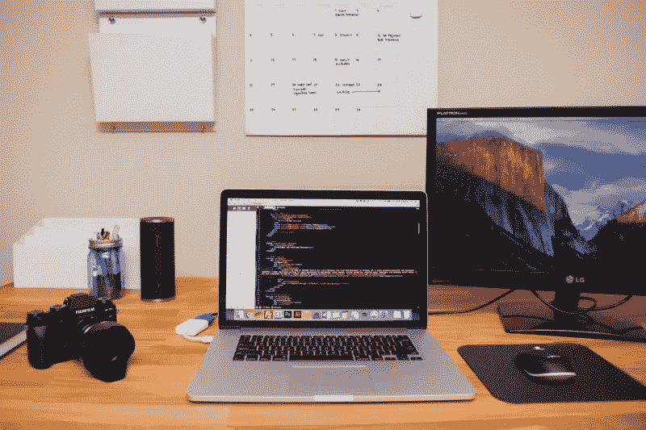

# 迄今为止的旅程

> 原文：<https://medium.com/hackernoon/the-journey-so-far-b0051fbd5622>

from [Melinda](/@melindagolden)’s post

我错过了我的#100DaysOfCode，所以我决定写一下#200DaysOfCode(我不知道这算不算一件事，但请允许我)，并使用这个**媒介**(双关语)来分享我迄今为止的旅程中的一两件事。

自从我开始[学习](https://hackernoon.com/tagged/learning)/写代码，我呆在室内的时间不知不觉地增加了，虽然有些人可能会说*时不时地应该找时间出去，放松一下，享受一下..我想在过去的 200 天里，我呆在室内(当我没有课或一些真正重要的事情的时候)已经得到了回报。*

如果你一直关注我的帖子，你会看到一两篇文章，其中我讲述了我学习 [JavaScript](https://hackernoon.com/junior-developer-stories-d804e855537b) 和我的[音乐播放器](https://timibadass.github.io/musicplayer/)的经历。在 [JavaScript](https://hackernoon.com/tagged/javascript) 之前，我花时间学习如何使用 HTML、CSS 和 Bootstrap(一点点)。出于一些未知的原因，我拒绝完成我的 SASS 培训，除此之外，由于学习 JavaScript 的兴奋(也许我需要一点说服力)，我放弃了这个培训..我尝试学习的每一件事都不会放弃，直到我确信我能有效地运用它们。

【JAVASCRIPT 之后，下一步是什么？

from [here](https://www.google.com.ng/search?tbm=isch&sa=1&q=on+a+journey+front+end+developer+in+HD&oq=on+a+journey+front+end+developer+in+HD&gs_l=psy-ab.3...636378.639726.0.640650.6.6.0.0.0.0.353.617.2-1j1.2.0....0...1.1.64.psy-ab..4.0.0.eXh9E-csY4g#imgrc=Ntpa8FmnhSaxqM:)

我一直在通过 Wes Bos 的“学习节点”教程视频学习使用 JavaScript 后端和 Nodejs(再次感谢 [ollaollu](/@ollaollu) )，这很难，但我知道这不是不可能的，所以我决定再进一步，直到我能够自信地使用 Node。几天前，我的一位导师？)?问

> 你不想在一个项目中试试你的 Nodejs 技能吗？

我发现自己怀疑自己是否有能力成功实施两三周以来所学的内容。这让我感觉很糟糕(*等等*)，但不足以让我放弃 Nodejs( *永不说永不*..并导致了那个决定。我相信在接下来的几个星期里，我会写(*又是*)我用 Nodejs 创造的很酷的东西。]).

我仍然和用 HTML 写了第一个标记后一样兴奋，我相信这是一个好迹象..我不否认没有一天我想放弃，或者怀疑我的能力成为那些吹嘘使用特定工具的人之一，因为我认为我不够聪明..但是每一次，我(和那些我谈论它的人)告诉我自己，我有能力克服我的恐惧和挑战，这对我很有帮助。我听说这是一个*的东西*，即使对那些不是初学者的人来说也是，所以我还不如早点习惯它。

期待我选择的这条路的下一个 200 天。