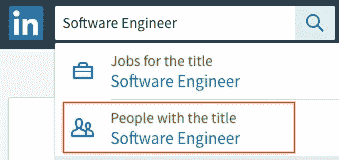
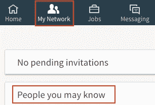
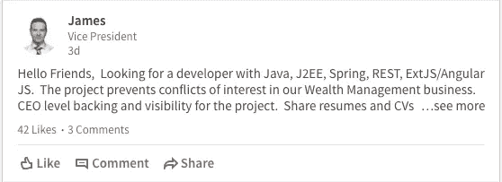
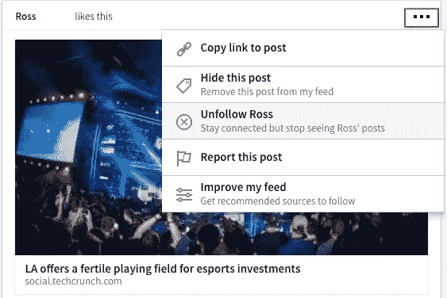
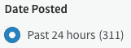
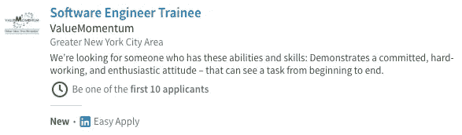

# 初级软件工程师求职策略指南

> 原文：<https://medium.com/hackernoon/the-junior-engineers-job-search-strategy-guide-69c98e396483>

[*露丝·奈贝克*](https://www.linkedin.com/in/ruthnaebeck/) *是这篇文章的合著者。这是她的* [*个人网站*](http://www.ruthnaebeck.com) *。*

你正在[找工作](https://hackernoon.com/tagged/job-hunt)找初级软件工程职位。你可能刚刚从计算机科学本科项目毕业，刚刚完成一个编程训练营，或者刚刚完成一个你想向未来雇主炫耀的伟大项目。只要你的项目组合是完美的，你的背景并不重要。现在你如何找到一份初级软件工程师的工作？总的来说，我发现最有效的方法是“猎枪”方法:在尽可能短的时间内发出尽可能多的连接请求、消息和应用程序。当我改变这一策略时，我从每 2-3 天一次电话屏幕变成了每天 2-4 次电话屏幕，技术挑战和现场工作紧随其后。

因为这是一种散弹枪式的方法，所以不要因为被拒而生气。事实上，这都是过程的一部分。但是一定要用拒绝来帮助你找工作。如果你没有收到任何电话屏幕，那就检查一下你的简历，问问自己是否申请了合适的工作。如果你在手机屏幕上失败了，你该如何更好地准备呢？对于现场，做同样的事情。记住，这是一个学习的过程！

因为在找工作的过程中有太多的事情要做，所以我想变得超级高效，用最少的时间建立网络和完成工作申请，尽可能多地登陆手机屏幕。这个策略就是这么做的，甚至包括了每一步的大概时间，为你的搜索提供了一个很好的衡量标准。在你的申请过程中保持一致，好事就会随之而来！

# **求职策略总结**

**联网(每天重复):**

1.  商务化人际关系网

*   发送 10 到 20 个连接请求(5 到 15 分钟)
*   当人们连接时发送消息(5-10 分钟)

2.校友资源(谷歌集团、Slack、脸书等)(5-10 分钟)

**求职申请(每天重复):**

1.  浏览 LinkedIn 主页选项卡寻找工作(5-10 分钟)
2.  Gary 的工作指南(编程类)(5-10 分钟)
3.  LinkedIn 简单应用(5-10 分钟)

**面试(每天准备):**

1.  电话屏幕(45-60 分钟)
2.  技术/现场访谈(45-60 分钟)

# **联网**

远远超过所有策略中的最高比例，人际关系网最终导致我接受了邀请，而且很有可能对你也是一样。做这件事的最好方法是什么？

**LinkedIn——每天请求 10 到 20 个连接:**

当你开始这个过程时，你可能只有很少的软件工程师。如果是这种情况，在 LinkedIn 上搜索“有头衔的人”软件工程师，按你的所在地过滤，与人联系。

如果你在一定数量的连接请求后不想支付 LinkedIn Premium，你将被锁定一天。没关系，第二天再来做同样的搜索，或者切换到搜索前端开发人员、后端开发人员或软件开发人员。

当你获得了大量的软件工程师联系，列在“我的网络”标签中“你可能认识的人”下面的人将大部分是软件工程师。使用此选项卡将大大加快连接请求的速度。就我个人而言，我每天发送连接请求的时间不超过 15 分钟。

**LinkedIn——当人们联系时发送消息:**

很好，现在你每天都在尝试与 10 到 20 个人联系，其中相当一部分人会接受你的联系请求。你用这些联系做什么？一旦他们连接回来，你就可以给他们发消息(不需要 LinkedIn premium！).我发现简洁明了最有效:

*你好$ {姓名}，*

*我是最近{同校？${SHARED_SCHOOL}:软件工程}毕业生，在${CITY}寻找(软件工程)职位。在${COMPANY}工作感觉如何？你对想从事软件工程的人有什么建议吗？*

*谢谢，
$ {候选人姓名}*

在第一句话中使用一个共同的联系来建立他们为什么应该关心，越具体越好。学校、城市、爱好都可以作为共享的连接。如果你除了他们是软件工程师之外没有其他关系，那就利用这一点。

为什么我在发送消息之前要等待连接恢复？如果有人与我联系，这意味着他们在 LinkedIn 上很活跃，可能愿意[建立关系网](https://hackernoon.com/tagged/network)。他们很有可能会回复我的第一条信息。就我个人而言，我收到了大约 15%的回复率。这似乎是一个很低的百分比，但是请记住，你所需要的只是一个能让你得到工作机会的关系，这对你来说并不是一件很浪费时间的事情。

一旦你开始了谈话，看看它会把你引向何方。作为一名软件工程师，我很成功地通过询问一般建议开始了对话。永远把球放在他们的场地上，尽可能快地回复信息！如果可能的话，每周安排 1 到 2 次面对面的会议(咖啡聊天)。如果这个人太忙，安排一个电话、Google Hangout 或 Skype 通话。

如果你联系到一个招聘人员，对话会有所不同。以下是给招聘人员的一条信息示例:

*${RECRUITER_NAME}，

我是一名软件工程师，正在${CITY}寻找永久职位。我精通${LANGUAGES_FRAMEWORKS_ETC}。

下面是我引以为豪的一个项目的链接:*

*$ { GITHUB _ OR _ DEPLOYED _ LINK }*

*$ {项目名称}是$ {项目描述}。我和我的三个同事一起度过了一段美好的时光，并在这个过程中学到了很多。等等。

附上我的简历请查收。

谢谢，
$ {候选人姓名}*

**校友资源(谷歌集团、Slack、脸书等):**

如果你的学校有校友资源，注册，保持活跃，联系其他校友建立关系网。如果可能的话，在你找工作的时候，试着每天和 1 到 3 个不同的人联系。试着在求职中与他人联系，结对练习算法和技术面试问题，分享求职策略。

# **工作申请**

尽可能快地发布尽可能多的工作申请！在大多数日子里，我申请了 25 份或更多的工作，每份申请只需要几秒钟。我找工作的时候一封求职信都没发！你的时间在找工作上是宝贵的，像为每份工作申请修改简历或写求职信这样的事情对一个初级工程师来说并不重要，而且占用了你可以完成更多申请的时间。明智地使用你的时间！

**LinkedIn——每天浏览主页上的职位发布:**

记得做所有的网络和获得所有的联系吗？一个很大的副作用是，现在你的 LinkedIn 主页将会有你所有关系的大量反馈。这是什么意思？每隔几天，你就会从人脉上看到招聘信息:

与已经有关系的人接触，获得手机屏幕的几率非常高(尤其是如果他们是你学校的校友)。我建议每天花 5 到 10 分钟阅读你的主页。

默认情况下，LinkedIn 首先列出受欢迎的帖子，因此如果你在你的提要顶部看到许多旧帖子，请通过单击“排序方式”下拉菜单并选择“最近”来更改帖子顺序:

此外，主页上有许多垃圾邮件。要取消关注撰写或喜欢与您的求职无关的帖子的人，请单击帖子右上角的三个点，然后选择取消关注:

**加里指南——每日求职:**

每天查看[加里的指南](http://www.garysguide.com/jobs?category=programming)申请你所在地区的“编程”工作。如果一家公司真的让你感兴趣，你可能值得花时间去这家公司的网页上申请。我在使用 Gary 的指南时获得了很高的命中率，所以我强烈建议将它添加到你的策略中！

**LinkedIn Easy Apply——每日求职:**

在 LinkedIn 上申请工作的命中率比以前的策略低得多，但我仍然通过它获得了大部分面试机会。这怎么可能？仅仅从我寄出的申请数量来看！值得注意的是，尽管我目前的职位来自网络，但我从使用 LinkedIn 策略中获得的面试实践是无价的。

那么这个策略是如何运作的呢？导航到 LinkedIn Jobs 选项卡，使用以下搜索字符串(1)和您的位置:

*(“软件”或“前端”或“后端”或“开发人员”或后端或前端)非(高级或资深或实习生)*

搜索后，使用“发布日期”过滤器显示“过去 24 小时”发布的职位。这可以确保你申请的工作是新鲜的。

现在，对于每个页面和每个有 LinkedIn 简单应用指示符的工作:

使用 Cmd +左键单击(Mac)或 Ctrl +左键单击(Windows)在单独的选项卡中打开作业的链接。一旦你完成了一个页面，你的浏览器应该是这样的:

你已经打开了一大堆标签，现在怎么办？转到最后一个选项卡(最右边)并应用！点击简单申请按钮，输入您的电话号码，添加您的简历并提交申请。申请一份简单的申请工作需要 5-10 秒。提交后，使用 Cmd + W (Mac)或 Ctrl + W (Windows)关闭选项卡。当您申请了打开的选项卡中的所有职务后，导航到职务搜索结果的下一页并重复。你将能够像一台真正的求职机器一样通过应用程序进行转换！

想增加被联系的机会？

*   寻找带有时钟图标和“成为前 10 名申请人之一”字样的工作(参考上图)。
*   在你的 LinkedIn 个人资料上至少有一封推荐信。据一位前招聘人员说:“90%的申请人都没有推荐信。”
*   如果您有 LinkedIn Premium 业务，您将获得 LinkedIn Easy Apply 的一个额外功能:“将申请移动到招聘人员列表的顶部”。

# **面试**

现在你已经有了一个快速的人际关系网和工作申请的策略，你可以把大部分时间用在找工作上，为真正的面试做准备。

**手机屏幕**

如果你做到了这四点，你将有极高的机会通过一个你最有资格申请的职位的电话筛选:

*   微笑并试着放松，这很重要！
*   每天练习回答“告诉我关于你自己”的问题。在镜子前练习，和你的另一半一起练习，和你的朋友一起练习！
*   练习回答“你对这个公司/角色了解多少？”
*   根据面试你的人的角色问一些相关的问题。

**技术/现场面试**

如果你在面试一个初级软件工程师的职位，我发现下面的这些对于准备大多数技术面试来说已经足够了。

*   当你面试的时候，在网上准备一个你最引以为豪的项目的现场演示！你应该对这个项目了如指掌，这样你才能自信地回答问题。
*   我认为这篇[文章](/@kevincennis/how-to-impress-me-in-an-interview-4fc00e96413)涵盖了我在大多数技术/现场采访中看到的技术深度水平。
*   Leetcode 是一个很好的实践，但是它的大部分比我在大多数面试中实际被问到的要难得多。如果你正在准备四大巨头(脸书、谷歌、亚马逊、微软)的面试，理解数据结构/算法是极其重要的，但大多数公司的现场面试根本不测试这种知识水平！
*   这篇[面试蛋糕文章](https://www.interviewcake.com/coding-interview-tips)也为通过科技面试提供了一些很大的帮助。
*   根据面试你的人的角色问一些相关的问题。

一致性是求职的关键。如果你遵循这个指南，根据你发现的适合你的方法改变步骤，从拒绝中学习，每个工作日都执行这个过程，你会在求职中看到结果。这里描述的网络和工作申请步骤只需要你一天中的 30-60 分钟，我发现它们是对我时间的最有效利用。祝你求职顺利！

# **参考文献**

本指南(还有我的求职！)在很大程度上受到了 Haseeb Qureshi 和 Caleb Jay 的帖子的影响:

*   [http://hase ebq . com/how-to-break into-tech 求职面试/](http://haseebq.com/how-to-break-into-tech-job-hunting-and-interviews/)
*   [http://blog . calebjay . com/2016/10/18/how-this-coding-boot camp-grad-found-a-job/](http://blog.calebjay.com/2016/10/18/how-this-coding-bootcamp-grad-found-a-job/)
*   [http://blog . cale bjay . com/2016/11/14/how-to-use-LinkedIn-as-a-coding-boot camp-grad/](http://blog.calebjay.com/2016/11/14/how-to-use-linkedin-as-a-coding-bootcamp-grad/)

> [黑客中午](http://bit.ly/Hackernoon)是黑客如何开始他们的下午。我们是 [@AMI](http://bit.ly/atAMIatAMI) 家庭的一员。我们现在[接受投稿](http://bit.ly/hackernoonsubmission)并乐意[讨论广告&赞助](mailto:partners@amipublications.com)机会。
> 
> 如果你喜欢这个故事，我们推荐你阅读我们的[最新科技故事](http://bit.ly/hackernoonlatestt)和[趋势科技故事](https://hackernoon.com/trending)。直到下一次，不要把世界的现实想当然！

