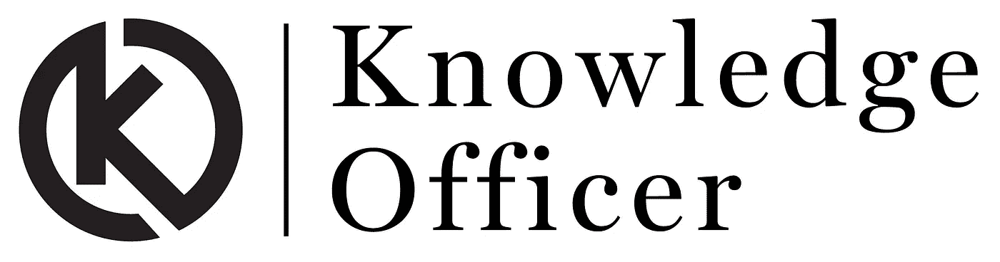

# 知识官现已上线！

> 原文：<https://medium.com/hackernoon/the-knowledge-officer-is-now-live-908422a4175f>

我很高兴地宣布，[知识官](http://knowledgeofficer.com)现已上线并公开进行 beta 测试。

我们将 KO 作为在初创公司工作的人的主要[知识](https://hackernoon.com/tagged/knowledge)来源，无论他们是工程师、创始人、设计师、营销人员、产品经理，还是在[初创公司](https://hackernoon.com/tagged/startup)担任任何职务。

我们希望创业大师们保持知识渊博，而不会浪费大量时间去寻找最好的内容，并将其从噪音中过滤出来。现在，任何人都很容易就最复杂的机器学习算法写博客。虽然这很神奇，但它真的很难(而且越来越难)区分什么值得你花时间，什么不值得，什么是垃圾邮件，什么是正版。知识官的存在是为了把信号和噪音分开！

在过去的几周里，我们一直在不知疲倦地收集关于私人测试版的反馈，我们收到了来自世界各地不同人的大量意见。现在，在我们做了大量的改进后，我们正在为更广泛的观众发布它，以获得越来越多的反馈。

# *免责声明*:

KO 不是关于新闻，我们专注于改变生活的、深刻的和永恒的知识，让你走在潮流的前面！我们区分知识和新闻，我们也区分低质量的知识和来之不易的知识。我们希望你在 KO 上读到的一切能让你更进一步，加深你的知识。

我们关注 3 个主要类别，涵盖了我们认为初创公司需要的广泛知识:

**工程:**

创业公司和世界 500 强公司顶尖工程团队的最佳文章和视频。此类别适合工程师、开发人员和系统管理员。

**创业公司&业务:**

来自高层领导和经验丰富的创始人关于创业和商业的来之不易的教训。这一类适合创始人、成长、销售和营销团队。

**产品&设计:**

精心策划的内容，面向产品经理、产品设计师、用户界面和图形设计师，以及每一个有兴趣了解产品和设计趋势和概念的创业成员

我们从网上的现有知识开始，这些知识是精心编写的，很难找到，因为*我们认为病毒式传播并不总是与质量相关*但我们的愿景不仅仅是聚合这些内容。

在接下来的几周里，你会听到我们更多关于我们成为全球创业公司知识中心的计划，以及我们如何将创业公司联系起来，分享他们的经验，共同面对他们的惊人挑战。

> “我们相信，世界上的每家公司都需要一个知识发现平台，以便更智能、更快速地工作并分享他们的经验”

我们希望您能享受我们的知识探索之旅，我们期待您的反馈来不断改进产品。

如果你喜欢我们的产品，请在[产品搜索](https://www.producthunt.com/posts/knowledge-officer/)上给我们你的爱。

> [黑客中午](http://bit.ly/Hackernoon)是黑客如何开始他们的下午。我们是 [@AMI](http://bit.ly/atAMIatAMI) 家庭的一员。我们现在[接受投稿](http://bit.ly/hackernoonsubmission)并乐意[讨论广告&赞助](mailto:partners@amipublications.com)机会。
> 
> 如果你喜欢这个故事，我们推荐你阅读我们的[最新科技故事](http://bit.ly/hackernoonlatestt)和[趋势科技故事](https://hackernoon.com/trending)。直到下一次，不要把世界的现实想当然！

