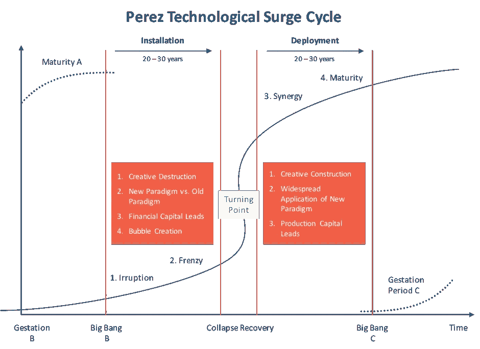
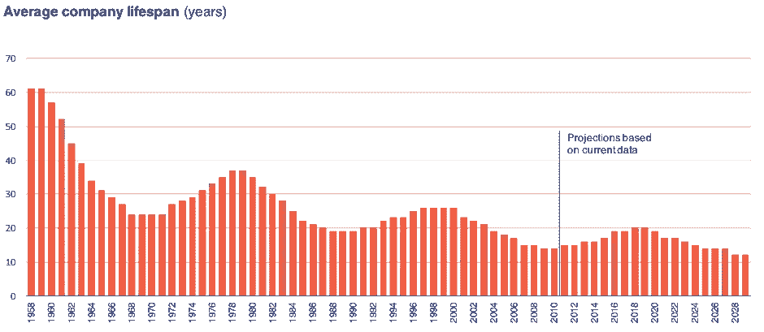
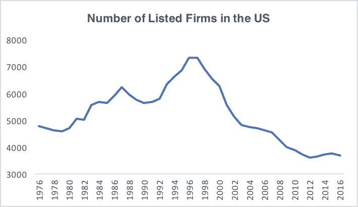
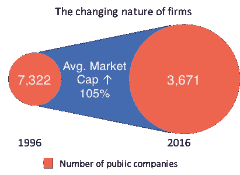
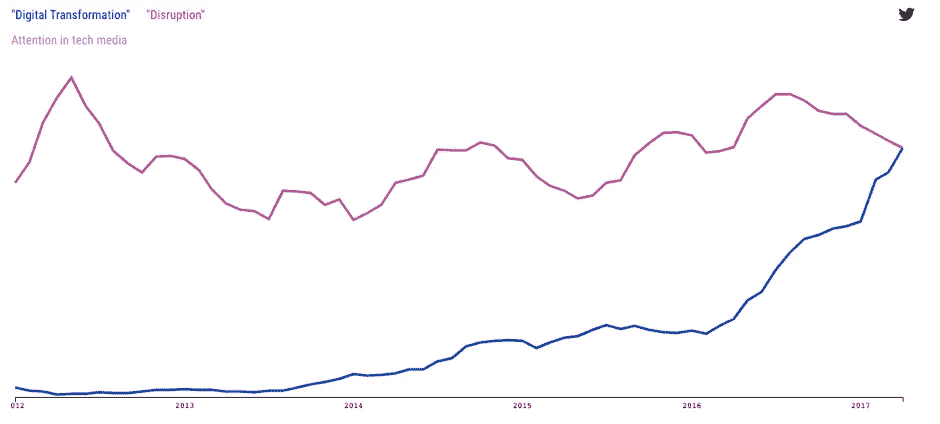
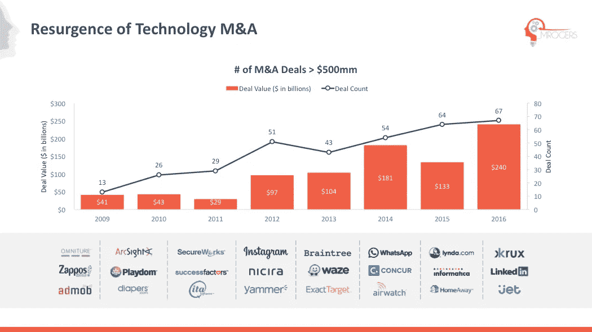
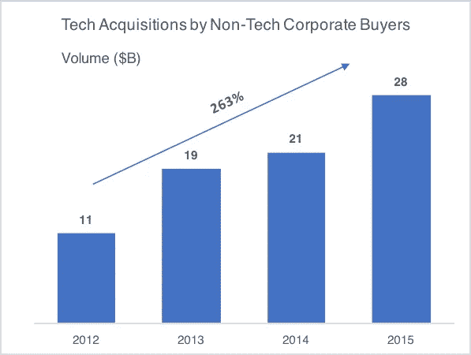

# 巨人之地

> 原文：<https://medium.com/hackernoon/the-land-of-giants-7c90d5ac59b0>

## 寻求永生-第 0 章

这是否是人类历史上最具变革性的时期，这是未来学家和历史学家争论的话题。坦率地说，这不是一个非常有趣的论点；我们现在还活着，所以相信这是事实是很夸张的。我发现最有趣的是企业如何应对这种变化，也许我在这里是孤独的。

随着我们进入一个新的技术经济范式，将会有更大的创造性破坏(“不断从内部彻底改变经济结构、不断摧毁旧结构、不断创造新结构的工业突变”)。按照熊彼特的说法，这是“资本主义的基本事实”。正如 Alfred Chandler 所指出的，企业家精神在增长和发展过程中发挥着关键作用。然而，在放大那些[创新](https://hackernoon.com/tagged/innovations)方面，管理者扮演着同样重要的角色。

“追求不朽”是我尝试运用一些启发法，一些经验法则，来创造可持续成功的企业。这将是一系列探索一系列主题的帖子，最终，试图理解是否有可能在创造性破坏的过程中幸存下来。

总的来说，卡洛塔·佩雷斯确定的四个阶段(闯入、疯狂、协同和成熟)会导致创造性破坏。

福斯特和卡普兰的研究发现，平均而言，标准普尔 500 公司每两周就会被替换一次。1955 年在标准普尔 500 上市的公司中，89%已不复存在，标准普尔 500 公司的平均寿命从 1955 年的 61 年下降到 2015 年的 17 年。公司不仅消失了，还在努力竞争。2000 年至 2009 年间，市值超过 10 亿美元的上市公司中，有一半以上的收入在某一年缩水了 10%或更多。

这些数字描绘了一幅画面，新的竞争对手正在杀死现有的，然后走上百视达或柯达的道路。然而，尽管这有一定的真实性，但它并没有真实地反映正在发生的事情。

在过去的二十年里，美国上市公司的数量下降了 50%，从 1996 年的 7322 家下降到 2016 年的 3671 家。

上市公司的平均年龄上升了 50%，从 12 岁上升到 18 岁。平均市值上涨了 105%以上。“赢家通吃”的情况越来越多。根据贝恩咨询公司的说法，每个市场中只有一两个玩家赚取了(平均)80%的经济利润。迄今为止，影响最大的不是新的反叛者正在扰乱市场，而是现有者的增长。

尽管有颠覆性的宣传，新的挑战者正在努力改变现有者。根据达特茅斯学院塔克商学院的研究，自 20 世纪 60 年代以来，新上市公司的五年存活率下降了 30%。

在过去的二十年里，最大的赢家是那些赶走了竞争并创造了更大进入壁垒的现有企业。用沃伦·巴菲特的话来说，他们已经建立了由牢不可破的护城河保护的经济城堡。

不得不与这些庞然大物竞争是公司保持更长时间私有的一个原因。贝恩公司(Bain & Co .)的数据显示，上市时间的中位数从 1999 年的 4 年上升到 2014 年的 11 年。亚马逊 1997 年上市时价值 3 亿美元，20 年后价值超过 4500 亿美元。这样规模的公司在今天的公开市场上成长为巨头可行吗？

根据安德鲁·罗(Andrew Lo)的适应性市场理论，企业是活的有机体，相互竞争以求生存。组织已经适应了他们的环境。在管理革命和互联网早期，规模和效率为许多公司提供了竞争优势。许多这样的公司存在于高度竞争的高速寡头垄断中。在这种环境下，持续变革的能力是成功企业的核心能力(或许大象终究会跳舞)。

然而，有一种观点认为，相对于未来几十年的预期，过去二十年实际上几乎没有什么变化(毕竟，我们被承诺会飞的汽车，并得到了 140 个角色)。这种相对稳定性让企业得以创建庞大的帝国，也解释了为什么许多真正颠覆性的初创企业是垂直整合的(想想特斯拉(Tesla)或 Monzo)。

正如瑞士瑞信银行的研究所强调的，如今的公司越来越大，也越来越老。尽管这带来了更高的盈利能力和更大的市值，但可以说这也加大了变革的难度。过去的胜利者显示了巨大的适应能力。然而，许多人认为，变化的速度和规模将使其越来越难以跟上步伐。正如克里斯·祖克和詹姆斯·艾伦在《创始人的心态》一书中所言，这是商业固有的悖论。增长创造了复杂性。“复杂性是成长的无声杀手”。

这种集中对于创造性破坏的过程和看得见的手意味着什么？对于创业者和管理者？

**数码——新的黎明**

根据 8VC 的说法，这种新的技术经济范式的分支尚未实现:“经济的绝大部分尚未被信息技术革命所改变——我们还远远没有接近佩雷斯的‘成熟’阶段的疲惫、完全饱和的市场”。

麻省理工学院斯隆商学院将数字颠覆定义为“竞争环境的变化，这是由于新市场进入者或老牌竞争对手使用数字技术，破坏了你的产品/服务组合或走向市场方法的可行性。”

在数字颠覆时代，技术现在有可能带来技术-制度飞跃，克服结构和经济障碍。技术的变化比正式的管理机构要快得多，因此，它可以帮助企业家创办新的企业。问题仍然是，现任者能否利用新技术并进行真正的数字化转型，或者他们在多大程度上受到复杂性、传统思维和路径依赖的限制。

下图显示了媒体对“颠覆”和“数字化转型”的关注度。

我倾向于认为这代表了组织对数字革命/工业 4.0/第二个机器时代的积极回应——随你怎么称呼。无所事事是该组织未来成功的最危险方式。

花旗集团(Citigroup)的研究发现，在过去 20 年里，按市值计算，技术破坏影响了大约 10%的全球上市公司。在未来十年，多达 47%的全球公司可能面临适应某种形式的技术颠覆的压力。

公司有两种主要的应对方式:依靠 M&A 和发展多种策略。

如果排除非科技买家，M&A 近年来的增长更加引人注目。

维穆伦和巴克马的研究发现，收购可以重振一个组织，减少惰性，提高其后期企业的生存能力，并最终促进长期生存。收购可以是组织管理其系统冲击的另一种方式，从长远来看，使它们更具适应性。沃尔玛当然希望它最近一次以 33 亿美元收购 Jet.com 的交易也是如此，此前它在 2000 年剥离了自己的电子商务业务，并在 2011 年以 3 亿美元收购了 Kosmix。

收购数量之多，也突显出企业发展新能力的必要性，因为它们不再有能力利用现有资源。

一系列技术进步的结合对变革的影响产生了复合效应。企业对此的反应是采取分散的方式。一切都需要策略，无论是云策略、移动策略还是数据和分析策略。即使是跨越一系列技术的数字战略也是被误导的。一个公司应该有一个战略，它回答了以下问题:

我们将如何创造价值？

我们将如何传递价值？

我们将如何获取价值？

新的数字技术正在从根本上改变这些问题的答案。

我相信数字化转型有三个相互依赖的要素，我将在下面的帖子(第一章)中逐一探讨。

重塑产品/服务和客户参与度

发展新的业务骨干

降低变革的成本

游戏规则变了。数字技术正在创造全新的价值主张，使公司赖以生存的许多权衡变得无效，并改变了组织的经济状况。

罗伯特·史密斯，Vista Equity Partners 创始人；“我们确实处于第四次工业革命的早期阶段。地球上的每一个行业都在数字化，最终这将导致每一家公司以某种方式、形式或其他方式数字化。”然而，正如伦敦商学院的弗里克维穆伦所言，这种变化不会在所有行业都是一致的。

第一章将探讨“数字颠覆”的影响和数字化转型的三个要素。

数字

1.福斯特和卡普兰，[https://www . inno sight . com/WP-content/uploads/2016/08/creative-destruction-whips-through-corporate-America _ final 2015 . pdf](https://www.innosight.com/wp-content/uploads/2016/08/creative-destruction-whips-through-corporate-america_final2015.pdf)，2015

2.https://research-doc.credit-suisse.com/docView?language=ENG，[瑞士瑞信银行&format = PDF&sourceid = em&document _ id = 1072753661&serial id = h % 2B % 2 fwldu % 2 ftaitax 1 namfysprautfrgdtsf 4 hzivtka % 3D&mkt _ Tok = eyjpijoit 1 rzmk 5 hwtnzv 01d gbcisinqioijonwhqewthu 0 pnxc 9 oytyxy 2 lvazzhtitqa 1 das](https://research-doc.credit-suisse.com/docView?language=ENG&format=PDF&sourceid=em&document_id=1072753661&serialid=h%2B%2FwLdU%2FTIaitAx1rnamfYsPRAuTFRGdTSF4HZIvTkA%3D&mkt_tok=eyJpIjoiT1RZMk5HWTNZV0l3T1dGbCIsInQiOiJONWhqeWtHU0pnXC9oYTYxY2lvazZHTitQa1daSFBEQ3NHU1Q5dmxvWGdmMUFZVTBoRHdETmEycWdIYlkrckNQeUxKaG1ybDExWkdqUmlMYmUyKzVjXC9HcXlSUVZlR0srVThucFA5YlhhNEltMVZzVUR6azhwckszSG5nWjFTYUEwIn0%3D)

3.贝恩公司，[http://www . bain . com/publications/articles/firm-of-the-future . aspx](http://www.bain.com/publications/articles/firm-of-the-future.aspx)，2017

4.花旗集团，[http://uk . business insider . com/Citigroup-report-on-disruptive-innovation-2017-1](http://uk.businessinsider.com/citigroup-report-on-disruptive-innovation-2017-1)，2017

5.2016 年[http://www.kpcb.com/internet-trends](http://www.kpcb.com/internet-trends)KPCB