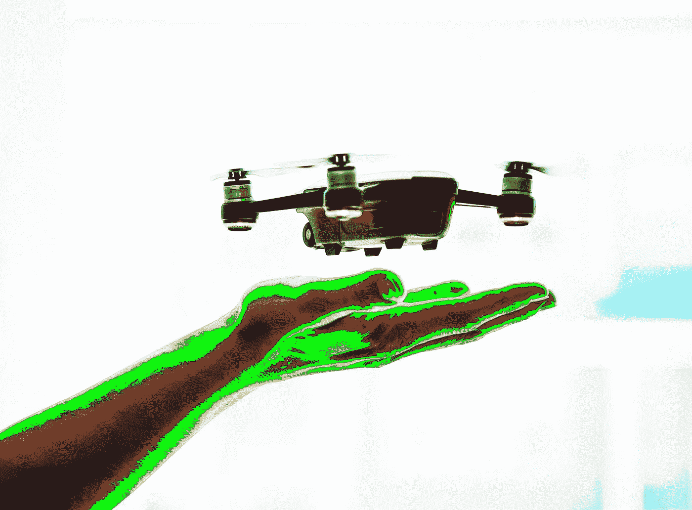

# 城市无人机送货的最后一英里

> 原文：<https://medium.com/hackernoon/the-last-mile-of-city-drone-deliveries-475010b26fb4>

> 由美国航空运输协会前安全主任汤姆·法里尔撰写。[原载](https://www.quora.com/How-can-delivery-drones-be-used-in-big-cities-There-isn%E2%80%99t-any-free-space-to-drop-the-cargo/answer/Tom-Farrier)于 [Quora](http://quora.com?ref=hackernoon) 。

无人机送货提议只是一种战略，旨在解决一个更大的商业挑战，通常被称为“最后一英里”问题。[为什么最后一公里效率这么低？](https://www.supplychaindive.com/news/last-mile-spotlight-inefficient-perfect-delivery/443089/)对此问题提供了一个简短的、与无人机无关的解释。

在一篇相关的文章( [9 最后一英里送货的趋势](https://www.supplychaindive.com/news/last-mile-spotlight-trends-tech-gig-perfect/443091/))中，无人机送货被认为是一个潜在的游戏规则改变者。然而，它承认所有这些可能性目前面临的一个挑战:“机器人需要人类的陪伴，以防它出现问题。”对我来说，这是一个主要的问题，无人机送货的性感宣传往往被掩盖了。

“投送”意味着飞机将不得不降落在某个地方，或者降到足够低的位置，以便在不损坏的情况下投下一个项目。这可能会使它不舒服地靠近可能受伤的人，或者可能损坏或损坏无人驾驶飞机本身的障碍物。这些都是必须解决的安全和商业风险的来源。

使这种活动具有成本效益的经济学要求在一个人的控制下，多架无人机同时在空中飞行。一辆送货卡车一次可以放下几十个包裹；无人机能够与之匹敌的唯一方式是，它们几乎完全是自我引导的(自主的)，除非可能就在送货发生的那一刻。然而，即使一名飞行员可以管理多架飞机，并轮流为每架飞机提供服务，他们仍然必须找到到达目的地的路，然后再回家。现在，无人机没有技术手段来做到这一点，而不会有撞到其他飞机或地面上伸出来的东西的风险。

如果没有昂贵的卫星连接，无人机也不一定能在拥挤的建筑区远距离与飞行员保持电子联系。送货服务的支持者不想为此付费——这将使这项提议比仅仅使用卡车昂贵得多——所以他们对监管者(和立法者)施加巨大压力，告诉其他人不要干涉他们的方式，这样他们就可以以更少的责任赚钱，并能够依赖完全不需要人类操作员的自动飞机。

说他们得到了他们的方式，监管机构被迫允许无人机送货和类似的活动，而牺牲了其他人的利益。一些无人机各种商业用途的倡导者正试图走一条极细的线，我认为这迟早会切断他们。在美国，“先发制人”原则([最高条款和先发制人原则——find law](http://litigation.findlaw.com/legal-system/the-supremacy-clause-and-the-doctrine-of-preemption.html))允许他们说他们是在联邦航空局监管航空运营的授权下运营的。毕竟，人们不能因为在自家房子上方 3 万英尺的地方驾驶客机而起诉任何人。如果一个较低级别的管辖区试图禁止无人机在其城市范围内飞行，正如这篇链接文章所指出的那样，“联邦法院可以要求一个州停止它认为干扰或抵触联邦法律的某些行为。”

现在，假设运营商希望提供一种服务，这种服务有利于那些希望自己的三明治新鲜、热腾腾地送达的社区成员，但会让那些只想睡一觉或不想担心自己的孩子被飞行中的无人机击中的人感到烦恼。我可以预见这种情况会变得很普遍，每一个都可能演变成一场恶性争斗，争夺联邦航空法规的优先权和公民在自己家中的权利。

这种类型的金丝雀已经死了。([辛格诉牛顿市——(宣布当地无人机法律非法的案件)](https://jrupprechtlaw.com/michael-singer-v-city-newton)我认为这是愚蠢的立法加剧司法越权的一个例子。然而，事实是，2012 年，美国国会明确禁止联邦航空局制定“任何关于模型飞机或作为模型飞机开发的飞机的规则或法规。”(p . l . 112–95，第 336 节)这段话后面有一些特殊利益限定词和含糊其辞的词语，但它们在实际操作中基本上没有意义。不端行为有太多的空间，这种空间将意味着想赚钱的人可能不会太担心成为公众的公害，除非国会改变主意。

基于这一糟糕的法律，法院现在认为先占权适用于航空事务，所以联邦权力高于各州；然后他们说，由于国会表示负责航空事务的监管机构——美国联邦航空局——可能不会制定关于模型飞机的规则，他们几乎可以随心所欲，不受注册、地方法规或任何其他问责或安全所需的限制。由于你无法根据操作者的意图区分飞行中的无人机——商业操作者与“业余爱好者”——所有无人机都将开始被公众以同样的方式看待。

离开大战略问题，让我们把焦点缩小一点。你的问题暗指城市交通拥堵。你的观点很有道理。使用无人机只飞到中心取件点——比如说，你当地的邮局——将只是回避“最后一英里”的问题。人们希望他们的披萨送到他们的前门，或者他们冲动购买的东西放在他们的后院，无人机在这些应用中的倡导者知道这一点。不管他们的“未来就是现在”概念如何，总之，至少对我来说，无人机向个人客户送货——特别是在城市地区——可能会像飞行汽车一样实用，飞行汽车也同样被吹捧为几代人以来个人交通的下一件大事。

送货无人机*确实*在利基应用中有意义，在这些应用中，“最后一英里”的问题可能因要覆盖的距离或货物的价值而变得更重要。在世界其他地方，无人机正在进行非常有价值的测试，向偏远地区运送医疗用品或其他急需的紧急物品；很容易看出这种能力在自然灾害之后会有多么有益。

尽管如此，在我看来，从监管和经济的角度来看，成群结队的无人机将阿姆斯特朗的收藏品从易贝带到热切的购买者手中都要困难得多。在交付服务本身的整体计算中，必须考虑它们可能带来的各种风险源，这些风险源不是微不足道的，而是复杂的。因此，如果客户不愿意为高速无人机送货支付*高额*溢价，这种商业模式似乎很可能会失败。

有些公司已经或正在美国各地建造数十个中央仓库/配送点。他们使用卡车或货车将货物运送给他们的客户……如果你愿意的话，是“最后一英里”。由于这些设施中的许多都位于或邻近大都市地区，地面运输可以在下订单后的几个小时内很好地满足消费者“我现在就要”的渴望。

以上所有的观察让我不禁要问，“即使*拥有*一架可以做和卡车一样的事情的无人机，如果这样做的成本更高，或者激怒那些受到无人机行动影响但被告知无能为力的人，它的真正价值是什么？”老实说，“最后一英里”的因素表明，无人机可能永远不会具有成本效益。基于任何一家公司对新的、最好的和最快的承诺，它们有助于做好广告。然而，我个人认为，每当有人被无人机伤害时，任何与无人机使用交织在一起的品牌都会受到品牌伤害，或者它们发出的噪音成为社区愤怒的来源，或者无人机被某人用大网偷走。

抛开华丽的辞藻、大幅增加就业的承诺以及迎合公众对即时满足的需求。在我看来，在大城市使用无人机送货是一个失败的提议。如果这种服务的潜在提供商不能令人满意地解决无人机“最后一英里”问题的所有要素，并被视为造成了超过其声称利益的社区问题，那么他们似乎只会试图建立一种高科技身份，每次出现问题时，这种身份都不可能与无人机的任何其他用户(*或*滥用者)区分开来。有时候最简单的解决方案是最好的。

用丹尼斯·米勒的不朽名言来说，“当然，这只是我的看法。我可能错了。”

> 由美国航空运输协会前安全主任汤姆·法瑞尔撰写。[最初发布于](https://www.quora.com/How-can-delivery-drones-be-used-in-big-cities-There-isn%E2%80%99t-any-free-space-to-drop-the-cargo/answer/Tom-Farrier) [Quora](http://quora.com?ref=hackernoon) 上..
> 
> 更多来自 Quora 的趋势科技答案，请访问 HackerNoon.com/quora 的[。](https://hackernoon.com/quora/home)