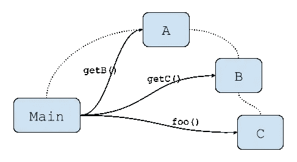

# 微服务时代的德米特里定律

> 原文：<https://medium.com/hackernoon/the-law-of-demeter-in-the-era-of-microservices-3186f4c399a1>

# 问题是

假设我们有三个组件: *A* 、 *B* 和 *C* 。

另一个组件 *Main* 依赖于 *A* ，并且想要调用属于组件 *C* 的方法 foo:

```
a.getB().getC().foo();
```

前面的代码片段相当于:

```
B b = a.getB();
C c = b.getC();
c.foo();
```

这段代码的问题在于，为了调用 foo， *Main* 需要一路通过组件 *A* 和 *B* 到达 *C* 并最终调用那个方法。为了能够调用这个调用，Main 需要知道所有 3 个组件，以及它们的内部结构。



The dotted lines represent the dependencies of the components and the arrows represent the calls

尽管我们的例子过于简单，但我们可以说 *Main* 需要知道调用哪个方法才能从 *A* 获得 *B* ，从 *B* 获得 *C* 并调用 *foo* 。而且中间组件( *B* 和 *C* )需要提供一些 API 来支持这些链式调用。显然，这样的 API 改变了它们的性质。组件 *A* 不应该作为组件 *B* 的提供者，而是应该有一个证明其存在的 API。问题是，我们在这里描述的是违反了德米特的**定律。**

Demeter 法则是一个非常简单的指导方针，它帮助我们编写非紧密耦合的组件。维基页面用以下 3 个简单的句子总结了德米特里定律:

*   每个单元应该只对其他单元有有限的了解:只有与当前单元“密切”相关的单元。
*   每个单位应该只和自己的朋友说话；不要和陌生人说话。
*   只和你最亲近的朋友说话。

在 OOP 中，我们知道对象通过传递消息来相互通信，所以方法调用实际上是从调用者发送到被调用者的消息。比如 *a.getB()* 简单来说就是 *Main* 向 *A“请求”*B 发送消息。在第二个片段中，很明显 *Main* 负责发送所有的消息，而中间组件除了给出它们的内部组件之外，没有任何实际的逻辑。

现在我们来想想 *Main* 需要做什么。它需要调用 foo，但是它只知道组件 *A* 。它不需要*【搜索】*所有其他组件。它甚至不需要知道它们的存在。它所要做的就是*“告诉”*组件 *A* 去寻找并调用方法 *foo* 。 *A* 可能会将此任务委托给 *B* 并且 *B* 会做与 *C* 类似的事情。在这种情况下，组件 A“告诉”B 该做什么。

# 优势

德米特里定律有一些非常有益的含义。每个组件只与它的直接依赖项交互。没有已知的间接依赖关系，这使得独立地改变它们的实现更加容易。想象一下，如果我们改变组件 *A* 的实现来调用某个组件 *X* 而不是组件 *B* 。通过链调用，这样的决定被传播到调用者。为了适应这种变化，Main 必须做出改变。

测试也容易多了。在我们的例子中，我们必须模仿所有的中间组件，这显然是一种设计味道。实际上，当我们编写测试时，通过注意我们必须创建多少无用的模拟，很容易识别代码的味道。

这些是内部实现泄漏和不良封装的副作用，会导致组件紧密耦合。德米特里定律通过使组件更加自治/解耦来帮助系统的设计，在我看来，这是最重要的优势。

# 微服务中的德米特里定律

在微服务领域，组件可以是位于网络不同位置的服务。最重要的区别是组件之间的所有调用现在都是远程调用，因此失败实际上是一种可能的情况。

在我们的例子中，假设每个 *getComponent()* 调用都是远程调用。当 *Main* 对不同的组件/服务进行 3 次远程调用时，它会有多脆弱？当然，即使我们应用 Demeter 定律，为了得到 *foo()* 的结果，3 个消息必须沿着组件传递，但是现在 *Main* 只与需要的 1 个组件通信。正如我们将在以下段落中看到的，通信协议的这一变化在可用性和性能方面有很大的提高。

通常，为了解决组件故障的问题并提高系统的性能和弹性，我们使用事件驱动的架构。在事件驱动的架构中，微服务之间的通信是通过向事件调度器发送事件来实现的，而不是直接向我们想要调用的组件发送消息。被调用方监听这些事件，并在它们可用时处理它们。这些事件被异步发送给调度程序。更多关于事件驱动架构的信息可以在[这篇文章](https://herbertograca.com/2017/10/05/event-driven-architecture/amp/)中找到。

调用 *a.bar()* 在概念上与将带有该调用的事件发送给调度程序相同，其中组件 *A* 已经订阅了这些事件。这一额外的间接层更好地解耦了组件，因为调用者不需要知道如何调用 *A* ，但事实上通信是异步的，这意味着在某些情况下调用者不必等待 *A* 完成其处理。在我们的例子中，如果 *foo()* 实际上是一个发送通知或电子邮件的方法，调用者就不必等待这个任务完成。

即使我们在示例中使用异步通信，当违反 Demeter 定律时，由于 *Main* 发送的事件相互依赖，设计仍然存在一些问题。*主*向组件 *A* 请求 *B* ，以便能够向组件 *B* 请求 *C* 等。这种闲聊是构建最终事件所必需的。 *Main* 不能在 *B* 返回 *C* 之前将调用 foo 的事件发送给 *C* (实际上 *B* 会返回 *C* 的位置)。此外，在中间组件/服务之一不可用的情况下， *Main* 将无法构建最终事件以发送给 *C* ，因此 *Main* 将无法完成其流程，并且根据业务规则，它可能无法完成其任务。在这种情况下，间接组件的不可用性会传播到*主*。

这种设计在性能方面也存在一些问题。 *Main* 本可以立即编写调用 foo 的事件，继续做一些有用的事情，而不是发现其他组件。

所有这些问题都是这样一个事实的暗示，即*主*而不是*“告诉”*它需要什么，它试图通过*“询问”*其他组件来收集信息，从而找到一种完成其大部分任务的方法。有人会说 *Main* 的行为就像它不信任其他组件一样！

显然，如果我们以不违反得墨忒耳定律的方式设计我们的系统，这些问题几乎可以免费解决。 *Main* 将只发送 1 个事件，即使其他组件不可用，也将继续执行其任务。由于 *Main* 仅发送 1 个事件，因此没有额外的步骤来创建该事件，因为之前已经优化了通信协议。显然， *Main* 的可用性不依赖于其他组件的可用性(除了事件调度程序)。 *Main* 仅仅通过*“告诉”*需要做什么就已经完成了它的任务。当其他组件再次可用时，它们将*最终*从调度程序获取事件。

我们应该设计尽可能松散耦合的组件，德米特定律是一个很好的方法。

# 延伸阅读:

[https://martinfowler.com/bliki/TellDontAsk.html](https://martinfowler.com/bliki/TellDontAsk.html)
https://pragprog.com/articles/tell-dont-ask