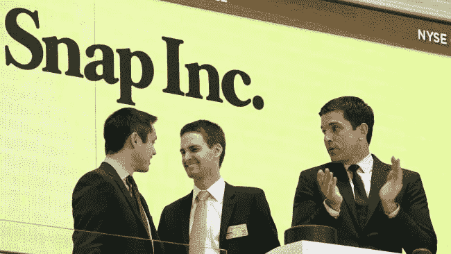

# Snap 上市的教训

> 原文：<https://medium.com/hackernoon/the-lessons-learnt-from-snaps-ipo-9549901a195c>

阿萨夫·吉拉德([齐拉](https://www.zirra.com/) ) &查姆·希夫( [PrivatEquity.biz](https://privatequity.biz/) )

上市四个月后，Snap 的股价暴跌了约 45%，投资者在投资了一家定价过高的公司后开始吸取教训。NYU 大学教授 Scott Galloway 最近将对该公司的投资比作醉酒驾驶，承销商摩根士丹利(Morgan Stanley)改变了对该公司的态度，称他们“对 Snap 今年创新和改进广告产品的能力的看法是错误的”现在看来，Snap 是又一个被过度高估的硅谷独角兽的例子。

在 Snap 和 Blue Aprons 的股票最近暴跌后，Dropbox、Spotify 和优步等上市前公司可能会推迟上市计划，并远离公开市场投资者的审查。然而，当科技公司 IPO 的窗口再次打开时(这是迟早的事)，有必要从 Snap 的 IPO 中吸取教训。以下是其中的几个例子:

1.  **不要忽视增长放缓的初步迹象:** Snap 的 IPO 是基于用户群和收入的大幅增长，以及对公司何时扭亏为盈的明确估计。这很好，但还不足以成功上市。现在很清楚，Snap 必须确保增长是可持续的。事实上，Snap 经历了营收的惊人增长，从 2015 年到 2016 年增长了近 600%，达到 4 亿多美元。此外，用户数量也在两年内翻了一番，从 2015 年初的 8000 万增长到 2016 年底的约 1.6 亿。然而，在 IPO 后的几天里迅速大举投资 Snap 的投资者没有看到——或者不想看到——Snap 的采用和参与数据增长放缓的迹象，而这些数据在 IPO 前已经是众所周知的了。2016 年第四季度新用户的获取水平较低。事实上，假日季节在这方面是最弱的；只有 3.2%的增长率达到 1.58 亿用户，大约是前两个季度增长率的五分之一，低于脸书。第一季度的收益让整个画面更加清晰，证实了缓慢的增长。日活跃用户率仅上升 5%(insta gram Stories 增长 25%)，每用户营收下降 14%。蓝色围裙的投资者最近可能也学到了同样的教训。甚至在亚马逊收购 Whole Foods 之前，就有迹象表明 Blue 围裙正在遭受用户增长停滞、每名客户成本不断增长和客户流失率上升的困扰。正如 Snapchat 的情况一样，低进入壁垒带来了竞争对手复制他们的产品。
2.  耐心点。不要急着上市:脸书花了八年时间申请 IPO，在实现盈利和多年稳定增长后，它已经这样做了三年。Snap，或蓝色围裙，是较年轻的公司，增长迅速，但同时可能还不成熟上市。在 IPO 之日，Snap 仍然缺乏广告衡量和广告服务平台。这让已经拥有这种系统的脸书在开发快照副本后立即获得了优势。
3.  **确保你拥有的是产品而不是功能:** Snapchat 是一款独立应用，每天有 1.66 亿人使用。然而，自 2016 年夏天以来，Snap 发现很难保持其独特性，并借助网络效应实现增长。快照的功能，如消失的照片、动画镜头和故事，很容易被其他高度参与的社交网络复制，如脸书 Instagram、Whatsapp 和 Messenger。Instagram Stories 的日用户数迅速增长至 2.5 亿，每个季度持续增加 5000 万用户。根据摩根士丹利的说法，这可能会减缓 snapchat 的采用，将 2017 年底的日用户数从 1.85 亿降至 1.82 亿。此外，Instagram 不仅在积极争夺 Snap 的用户，还在积极争夺其广告商，为他们免费提供赞助镜头。Snap 自称是一家“相机公司”，最近甚至收购了一批增强现实初创公司，但迄今为止，它的商业模式只专注于销售广告，就像它的竞争对手一样。
4.  给你的员工足够的股票，让他们的利益与公司的利益一致，让他们希望公司成功: Snap 的员工必须等待更长时间，更加努力地工作，才能享受股票期权的果实。此外，他们最常见的奖励，限制性股票单位，遭受更高程度的税收(47%)。Snap 忽视了这些需求，并在推出新平台方面姗姗来迟:员工没有足够的激励去努力工作，以使股票表现良好，就像其他上市的科技公司一样。比如只有 app。截至 2016 年底，Snap 授予员工的股票奖励中有 25%已经归属。相比之下，在脸书首次公开募股时，其 66%的股票奖励已经被授予。此外，Snap 的员工将不得不等待更长时间，等待禁售期结束，才能在 IPO 之后出售股票，而且只能在 8 月 10 日 Q2 发布财报之后。他们中的许多人害怕股价再次下跌，要么是因为收益，要么是因为禁售期到期，这可能导致投资者和员工“抛售”他们的股票。现在，每股 15 美元，比上市首日 24 美元的交易价格低了约 38%，几乎是历史最低水平，许多员工可能会觉得，他们最好把能卖的东西带回家，不要太在意价格的上涨。
5.  **公开市场不一定比私人市场更理性:**在 Snap 的 IPO 事件中，公开市场的表现理性吗？看你问谁了。有些人会说，Snap 的 IPO 是理性市场的经典例子，理性市场会根据公司的财务状况和市场采纳情况来调整其定价。同样是这些人会声称，Snap 的承销商摩根士丹利(Morgan Stanley)在得知 Snap 在开发广告平台和改善业绩方面遇到一些挑战后，将他们公司的目标股价从 28 美元下调至 17 美元。这在私募市场上永远不会发生，在私募市场上，估值有时与结果相差甚远，有时取决于前几轮的估值以及投资者和企业家的声望。蓝色围裙也发生了同样的事情:与上一轮上市前的估值相比，该公司的估值已经下降了 40%。但其他人会认为，是公开市场将 Snap 的估值推高至 240 亿美元，然后是 280 亿美元，然后是 340 亿美元。尽管 Snap 从未盈利，其 S-1 也警告称，用户增长放缓，来自资金雄厚的社交网络的竞争日益激烈。有些人会称之为非理性。摩根士丹利(Morgan Stanley)对 Snap 的预期一直很高，但在本月早些时候修正预测时，这已经不是第一次了。今年 4 月，Business Insider 发表了一篇报道，内容是摩根士丹利不得不纠正其对该公司的股权研究，将 Snap 2025 年调整后的 EBITDA 从 65.7 亿美元下调至 49.2 亿美元，自由现金流从 40.5 亿美元下调至 24.2 亿美元。令人惊讶的是，这一调整并没有改变该股 28 美元的目标价。摩根士丹利并不是唯一一家在 IPO 后几周和几个月发行 Snap 的公司。花旗集团也是 Snap 重整 IPO 的一部分，直到 6 月份还一直给 Snap 评级为买入，根据标准普尔资本智商公司的数据，Snap 的平均评级仍然是“买入”事实上，造成股价大幅上涨的，不仅仅是承销商，还有那些在 IPO 后蜂拥买入新股的机构投资者。他们对年轻时尚的科技公司的渴望，加上 Snapchat 2016 年收入增长背后的炒作，是 Snap 去年 3 月股价上涨的主要原因。我们不会用理性这个词来描述它。