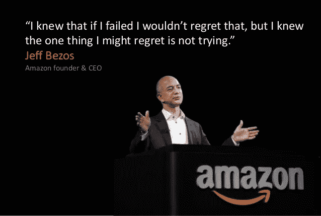
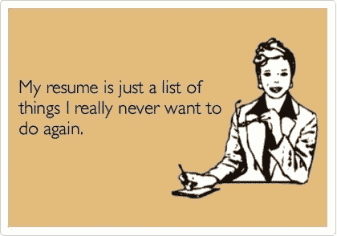
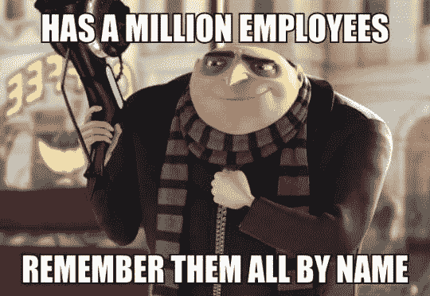
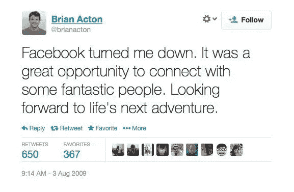
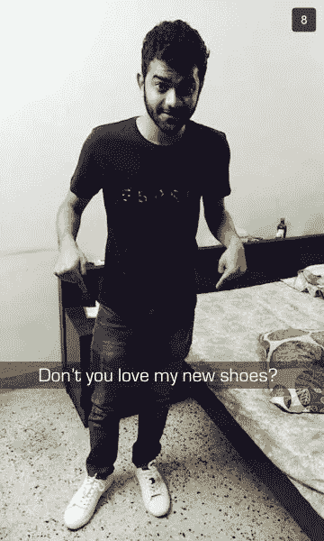

# 加入早期创业公司的改变人生的决定

> 原文：<https://medium.com/hackernoon/the-life-changing-decision-of-joining-an-early-stage-startup-bb276a7d3a77>

## 致我们希望加入的年轻毕业生的公开信

亲爱的我昨天面试的学生，

我知道在我写这篇文章的时候，你已经收到了很多工作邀请。不知道这是让我对自己的选择放心，还是让我相当不安全。我只知道我喜欢你的作品，[设计](https://hackernoon.com/tagged/design)情感、态度和沟通技巧。我很希望你能加入我们，一家早期快速发展但闻所未闻的[创业公司](https://hackernoon.com/tagged/startup)。但我如何说服你放弃其他选择呢？

让我通过分享我在创业过程中所学到的一些东西，直接从内心来尝试一下。给你:

# **1。肥胖企业套餐的诅咒**

我最衷心地祝贺微软公司给你一毕业就提供了一份丰厚的薪水。哇！如果我当时有这样的机会，我可能永远不会开始创业。

> 我真诚的建议是:不要在轻松的公司工作中感到舒适。你注定要给世界留下影响，我真的相信这一点(这就是为什么这封信努力说服你！).

显然你不会那么容易被说服。但你知道吗，我们刚刚筹集了一笔小资金，我们会尽最大努力满足这个报价，并给你股票期权。我需要你相信我们会成功的。当我们这样做的时候，工资待遇将会像沧海一粟。因为财富将在你的股票期权中创造，而不是在工资中。

> 我们相信你，我们也需要你相信我们！

马克·吐温曾经说过:“二十年后，你对你没有做的事情比对你做了的事情更失望。驶离安全的港湾。探索。做梦吧。发现。”

# **2。简历品牌名称游戏**

我明白你的意思，我也很乐意在我的简历上展示脸书、谷歌、亚马逊、Flipkart 这样的品牌名称。但是，嘿，今天有一百万人(或者更多)有这个资格。说实话，真的无所谓。你的工作和个性会比简历上的那些文字更能让你光彩照人。

你知道真正的传奇是谁吗？这些人是这些地方最早的团队成员。关于国内最近的例子，请阅读[这篇](http://www.businesstoday.in/careers/career-tip-joining-a-start-up-early-a-risk/story/191930.html)关于[Ankit nago ri](https://www.linkedin.com/in/ankitnagori)(Flipkart 的首席商务官)的文章，他大胆地迈出了信念的一步，今天对所有人来说都是一种激励。你猜怎么着？他现在的简历上也有 Flipkart 的经历:P

#Truestory

# **3。您选择的城市**

我知道我们没有在全国范围内开展业务，也没有能力让你选择从班加罗尔或海德拉巴开始。但是我们很快就会到达那里，据你所知，你可能就是在全球为我们设立这些办事处的人！承诺激动人心的时刻即将到来！

# **4。工作保障**

在创业的世界里，90%的公司都活不过 2 年(这是我瞎编的，但你明白我的意思)，我完全理解你的担忧，我也没什么好抗争的。我只能再一次请求你相信我们正在做的事情，即使事情没有按照我们计划的方式发展，我们也会支持你。如果我们不能再支付你的薪水，我们将确保尽最大努力帮你找到工作。在这件事上你必须相信我们。外面还是有好人的！

Good Guy Boss from Despicable Me. Remember, the entire office will know much more than just your name here!

# **5。父母压力**

是啊！这正是我遇见你母亲的原因。前几天我在校园里遇见她并非偶然。我经过深思熟虑，决定在你们俩坐着喝着茶的时候，非常随意地走过。我想撞上她。我想和她谈谈她 23 岁的女儿。我希望这封信中的一些观点能解答她心中的任何疑问。希望她不仅会允许自己的女儿，还会鼓励她在一家成长中的初创公司施展自己的技能(即使不是我们的！)在那里她可以给世界留下影响，一次一个用户！

你能替我问她吗:

> 如果 WhatsApp 的联合创始人布莱恩阿克顿(Brian Acton)去脸书工作，他会对世界产生同样的影响吗？

Legend!

# **6。零成员人力资源团队**

谷歌在印度的人力资源团队将比我们今天的整个团队大 100 倍，我相信他们在确保高员工士气方面做得很好。但是我问一下，你家里有 HR 团队照顾你吗？当然不是。我又有什么资格告诉你，你的母亲有多爱你，并采取措施让你开心(她保护性的天性让她和你一起从海德拉巴一路旅行到班加罗尔，就是为了和你在一起，所以你在这些采访中尽力而为)。

> 把我们也当成一个小家庭，永远互相照顾。庆祝建造我们真正相信的东西的喜悦。

Ba-ba-ba, Na-na-na!

既然加尔各答没有 Zara，而我们的一个摇滚明星实习生想让我在去班加罗尔的途中帮他买一双 Zara 运动鞋，我有没有特意去买呢？自己看吧！

This Snap made my day!

我想以这样一句话来结束我的演讲，在生活中很少有这样的时刻，事情的运作方式会发生结构性的转变。我们很幸运生在这样一个将决定人类未来几十年的时代。技术正在改变我们与周围的人和事物互动的方式，以及解决我们需求和问题的方式。我们更幸运的是受到了足够的教育和技能，能够有所作为。我们必须这样做。

一句罗伯特·弗罗斯特的台词:

> “树林里分出两条路，而我——
> 我选择了人迹较少的一条，
> 这让一切都变得不同了。”

抱歉，如果这有点太严重，让你更有压力去做决定！想笑的话，看看这个家伙在工作中做了什么:

无论你最终选择什么，祝你一切顺利。我知道在内心深处，你会创造出让世界羡慕的东西！

你真诚的，

萨克沙姆卡沃尔
T5。参见中的单元

> *PS:如果你碰巧是一种稀有物种，可能与我上面所说的一些想法有关，来打个招呼* [*@SeenIt*](http://www.seenit.in/?utm_medium=blog&utm_source=medium&utm_campaign=joiningastartupfooter)

你可以在你的故事的这里找到原文[！](http://yourstory.com/2016/02/early-stage-startup-employee/)

> [黑客中午](http://bit.ly/Hackernoon)是黑客如何开始他们的下午。我们是阿妹家庭的一员。我们现在[接受投稿](http://bit.ly/hackernoonsubmission)并乐意[讨论广告&赞助](mailto:partners@amipublications.com)机会。
> 
> 如果你喜欢这个故事，我们推荐你阅读我们的[最新科技故事](http://bit.ly/hackernoonlatestt)和[趋势科技故事](https://hackernoon.com/trending)。直到下一次，不要把世界的现实想当然！

