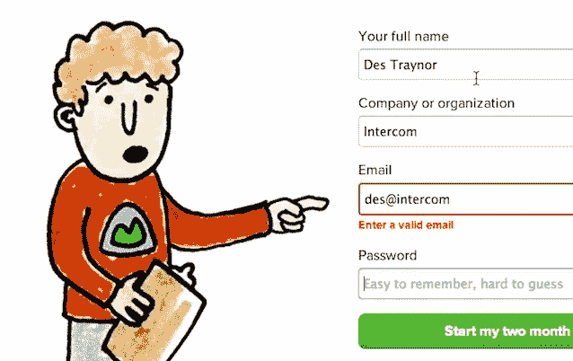
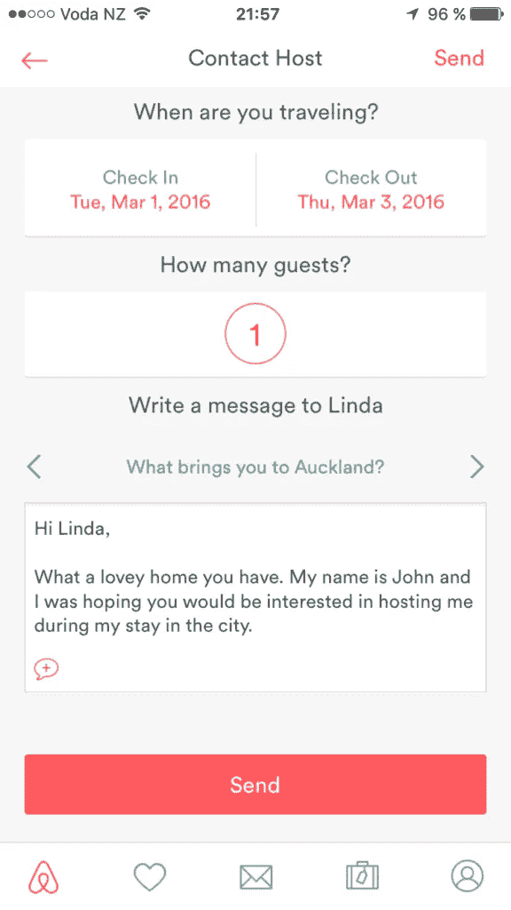
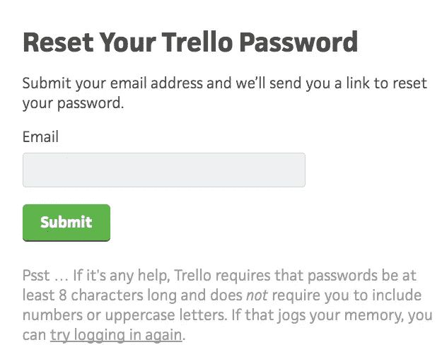
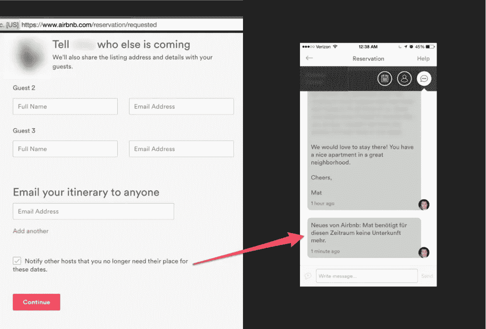
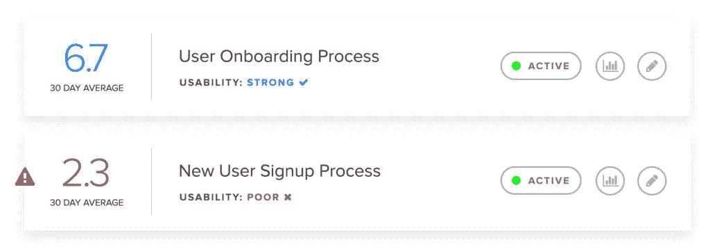

# 小细节以及它们对用户的重要性

> 原文：<https://medium.com/hackernoon/the-little-details-and-why-they-matter-to-your-users-7cfdaff04b12>

## 如果你和我一样，你可能在家里有一个专门放咖啡杯的橱柜…

尽管我家只有两个成年人，但我们的橱柜里至少有 30 个咖啡杯。简直疯了。

有些是礼物，有些是度假时捡到的。不管怎样，它们似乎都有一点点情感价值。所以它们留在橱柜里。

但是事情是这样的…

**我讨厌用所有的，除了一个。**

每天早上，我都用一个普通的黑色光滑杯子喝咖啡。

为什么？因为感觉就是对的。

它装的咖啡量刚好够我在变冷之前喝。这个把手的形状正适合我的手指。当我啜饮一口时，光滑的表面感觉很好。

疯狂的是……**我发誓用它煮的咖啡味道更好。**

在一个满是杯子的橱柜里，杯子的唯一目的是简单地盛放热液体，我一遍又一遍地选择同一个杯子，仅仅是因为所有的小细节以及它们如何增加更好的咖啡饮用体验。

你的产品是杯子，那个橱柜是你所有的竞争对手，他们提供或多或少和你完全一样的服务。

创造积极的用户体验正迅速成为许多人选择继续使用你的产品而不转向你的竞争对手的决定性因素。

但是大多数人都知道这一点，所以他们选择专注于大事来创造更好的体验。

一个快速响应的网站。伟大的视觉设计。一个精心设计的用户界面。

当然，这些都很重要，但是所有其他的杯子**也可以盛放咖啡并为我保温** …

如果你想让你的产品从竞争对手中脱颖而出，现在是时候开始关注产品设计的小细节，并了解它们在为用户创造更好的体验方面有多么强大。

为了说明这一点，这里有几个来自我最喜欢的网站 littebigdetails.com 的很好的例子

# 给你的产品一些个性——让它人性化。

没有什么比与一个行为像机器人的产品互动更糟糕的了。

出于某种原因，似乎每个人的默认设置都是让他们的产品听起来像一台**无脑机器人。**

*“所需密码输入不正确。根据适当的规范重新输入密码……”*不是一个人希望与您的产品交互的方式。

你想用一种对话的语气，用一种随意的方式和他们说话，让他们的体验更人性化。

但是这个概念超越了你用来和用户交流的语言。它也可以应用到视觉设计中。

几年前，当新奇的 404 页成为一件事时，我们看到了这种情况的发生。人们会登陆 404 页面，并以一个有趣的笑话或有趣的图形结束，这将是一个大热门。

为什么？因为它突然提醒人们建造了这个。

但是，这不应该只是保留给人们不应该登陆的页面。

[**Basecamp 很好地运用了这个概念**](http://littlebigdetails.com/post/76328014581/basecamp-when-there-is-a-form-field-error-the) (或者用他们注册页面的一次迭代做到了)。

source: littlebigdetails.com

Basecamp 的注册页面上写着“Basecamp 先生”,当你填写表格时，他脸上挂着友好的微笑。

如果你犯了一个错误，他的表情会从高兴变成悲伤，他会指出你犯了错误的地方。

它非常微妙，当你注意到它时，你会觉得哇，它让填写注册表单变得不那么无聊了。

# 不要妨碍你的用户，但不要小题大做。

重要的是要记住，小细节应该只是…一点点。

有时候，不被注意到是一个小细节的全部目标。用户甚至没有意识到它是如何让他们的体验更好的，这是完美的。

有无数次，我不得不向我的客户解释，一个好的界面在**中是看不见的。不一定要“独一无二”或“看起来不像其他人”。**

一个好的界面不会妨碍用户，让他们更快更容易地访问他们正在寻找的**值**。

Instagram 的原生移动应用程序就是一个很好的例子。

使用 Instagram 的价值在于可以吸收朋友或你关注的任何人发布的所有精彩图片和视频。

这就是为什么覆盖默认音量滑块是完全有意义的，它会覆盖你正在观看的视频。

这将导致人们在调节音量后不得不重新启动视频。

相反， [Instagram 使用了一个最小设计的音量滑块](http://littlebigdetails.com/post/148099318397/instagram-if-you-change-the-volume-while-looking)，它出现在屏幕的最上方，允许用户在调整音量的同时继续观看。

source: littlebigdetails.com

大多数用户很可能完全没有注意到这一点，但是他们认为它给用户带来的体验是巨大的。

# 只要有机会，就为你的用户做繁重的工作。

你知道我讨厌什么吗？在线填写表格。你知道还有谁讨厌这个吗？**所有人。**

除了让你的表单对用户友好之外，没有任何解决方案能让这变得更容易。这只是每个人都要面对的事情之一。

但你知道我更讨厌什么吗？不得不在表单域中多次键入相同的内容。

这就像你打电话给信用卡公司，录音要求你输入你的卡号、出生日期等。当你终于接通一个人的电话时，他们问的第一件事就是你的卡号。

我没时间讨论这个，我是个重要人物！我有一个用来喝水的黑色咖啡杯！！！

AirBnB 得到它。他们的产品是一个完美的例子，说明你需要一遍又一遍地在表单中输入相同的内容。

当你申请入住一家房源时，你往往需要给主人发一条信息。如果你向多个地方申请，你将不得不一遍又一遍地输入信息。

但是 AirBnB 支持你。当像这样联系多个主机时，[会自动复制你的最后一条信息](http://littlebigdetails.com/post/148048718425/airbnb-when-contacting-multiple-hosts-the-last)，并为你更改主机名称！

source: littlebigdetails.com

这是一件如此令人惊讶、激动人心的事情，尤其是当你陷入寻找住处的紧张任务时。

# 安全性很重要，但不要对此过于狂热。

触发警告…你准备好了吗？我很抱歉不得不这么做，但事情就是这样…

*警告:五(5)次不成功的登录尝试将导致您的在线访问被锁定一小时。*

上帝啊，不要！我的焦虑水平直线上升。现在我要重新设置我的密码，但是我用的是什么邮箱？

我就直接说了…去他妈的复杂密码。

我明白了，这是必须的。我绝不是说不要使用它们或要求它们，而是请怜悯我们！

当我们忘记密码时，请给我们一点帮助。以某种方式安慰我们，也许是一杯热茶和一条毯子？

别害怕，是特雷罗来救你了。

Trello 理解这种痛苦，当你输错密码时，[他们会提供提示](http://littlebigdetails.com/post/147945990821/trello-when-you-forget-your-password-you-get-a)，告诉你密码必须包含哪些内容才能生效。

source: littlebigdetails.com

*“哦，对了，这是需要 6 个特殊字符的那个，我现在想起来了…”*

这对于像我这样的人来说是一个巨大的帮助，他们花费了比我想承认的要多得多的时间去记忆密码。

(是的，我知道像 LastPass 这样的东西，并且尝试过，也同样感到沮丧)。

# 将对用户没有价值的重要任务自动化。

有时候有些任务你真的需要你的用户去做，但是他们不想去做，因为对他们来说没有任何好处。

在这些情况下，你希望他们执行一项任务，因为它对你和你的产品有价值，但对他们来说没那么重要。

回到 AirBnB 的例子，假设你已经给 25 个不同的主机发了消息，并最终决定了一个地方。

你订了，很兴奋，然后继续前进…但是你发信息给那些想知道… *“这个家伙到底会不会订我的位置？”*

理想情况下，如果你是一个善良热心的人，你会给每个主持人回信息，让他们知道你已经决定了另一个列表。

但是如果你以前在 Kijiji 卖过东西，你就会知道大多数人并不善良和热心。

[这就是为什么 AirBnB 会为你处理这件事](http://littlebigdetails.com/post/131488713757/airbnb-upon-completing-a-reservation-the-app)。

一旦你决定并预订了住宿的地方，该产品会自动给你联系过的所有主机发送信息，让他们知道你已经预订了另一个主机。

source: littlebigdetails.com

这极大地改善了主机的体验，主机现在可以继续接受其他应用程序。

# 小细节对用户留存有很大影响。

就咖啡杯而言，黑色和光泽让我成为了**的终身用户**。

直到不可避免的那一天，我把它掉在地上(叹息),摔成无数碎片，我会一直使用它，因为这些小细节让**体验如此愉快。**

产品也是这样工作的。大的细节很重要，但是大家都知道这一点。正是这些小细节能让你的产品与众不同，并与用户建立强有力的联系。

**一个大问题仍然存在…你如何知道通过包含这些“小细节”，你的产品的哪些部分可以受益最大**

你需要一种方法来衡量你的产品中所有重要任务的用户满意度。这是一种告诉你应该把注意力集中在哪里，从而对你的用户产生最大的积极影响的方法。

为了帮助解决这个问题，我创建了 [**用户标识**](http://www.userpings.com/) **。**

这是一种跟踪用户微任务可用性的方式，如跟踪入职序列、更改支付细节或重置他们的密码。

你会得到一个指示板，告诉你到底是什么导致了用户的痛苦，以及为什么这对他们来说是个问题。

我们目前**正在接受申请成为我们有限的测试项目**的一部分。如果你有兴趣，[去这里申请测试版](http://www.userpings.com/)。