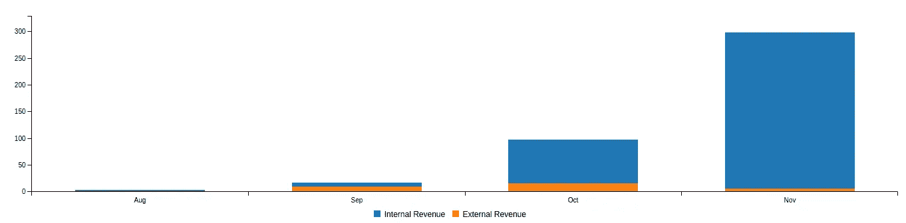
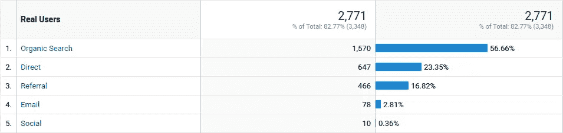
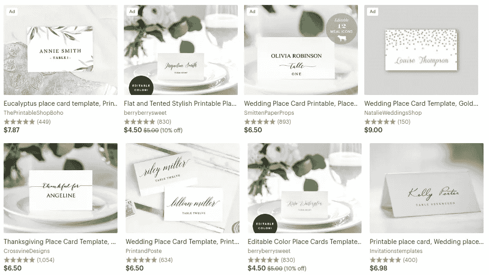
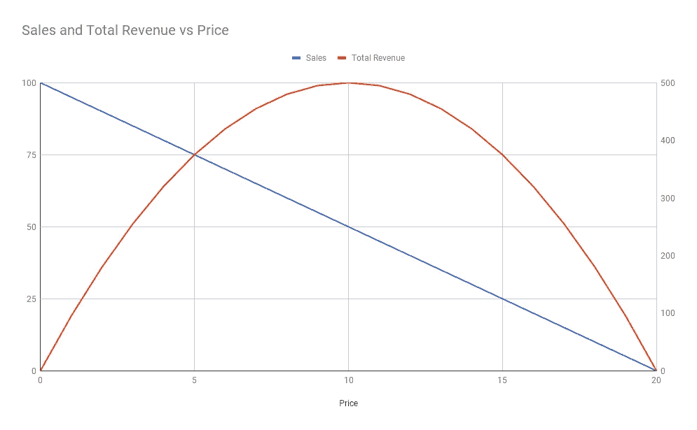

# 通往被动收入的漫长道路第 2 部分:月收入从 100 美元增加到 1000 美元

> 原文：<https://medium.com/hackernoon/the-long-road-to-passive-income-part-2-getting-from-100-to-1000-in-monthly-revenue-6c91a13b6685>

## 我的最新更新和计划是把我的小 SaaS 应用从 100 美元/月提高到 1000 美元/月。

欢迎回来！已经有一会儿了！

如果您还没有阅读本系列的第 1 部分,您可能想继续这样做。另外，如果你是那种没有耐心的人，总结就是我已经有了一个[婚礼名片网站](https://www.placecard.me/)，在过去的十月赚了 100 美元。

在这篇文章中，我将谈论我的计划，从每月 100 美元增长到每月 1000 美元。

*为什么 1000 美元/月？*

老实说，因为目前任何高于 1000 美元的东西似乎都是完全不可能的。

但是，如果我想达到每月 5000 美元——或者无论我需要挣多少钱才能过上舒适的生活——我必须先达到 1000 美元。我发现想到眼前的下一个目标比想到更远的目标要容易得多。

正如我在上一篇文章中引用的:

> "千里之行始于足下。"——老子

像上次一样，虽然接下来的很多内容都是针对我自己的产品和产品路线图的，但我希望任何渴望启动——或者已经启动——一个被动创收项目的人都能从看到我的计划中获得价值(或许还有一些灵感)。看到其他人公开工作是我最喜欢的学习方式之一，所以我尽可能地向前推进。

所以，事不宜迟，他们的荣耀就在这里！我的宏伟计划是每月从 100 美元涨到 1000 美元:

1.  骑行动量
2.  提高价格
3.  将我的免费等级货币化

没什么突破性的，是吧？然而，这就是我所希望的。如果你想知道更多的细节，请继续阅读。

# 从 100 美元/月到 300 美元/月:乘势而上

我原本在这里有一个部分谈论我如何认为我不必做太多，除了骑动力，这将最终使我的收入翻一番，达到 200 美元/月。

这是从未发表的草稿中的一段引文:

> 我真的希望我不要在这里给自己带来厄运，但是我认为我可以很容易地达到每月 200 美元，并且不需要对网站或我的策略做任何重大的改变。

当然，我是一个不可靠、拖延的人，尤其是在写作方面，我实际上并没有把它发表出来，现在已经是 12 月了。

那么上个月发生了什么？让我们看看:

Place Card Me’s first four months of revenue.

如果你看不懂图表，11 月份的收入不到 300 美元(准确地说是 298.55 美元)。除了增加一些季节性的设计，我在网站上没有做太多的改变。我们将把这个小小的出版差异归档在“好问题”下。

无论如何——虽然我对这个图表中的月度增长感到兴奋——我也试图对我目前的方法的上限保持怀疑，这就是为什么我没有达到这个超过 300 美元的里程碑。

这种怀疑的主要原因是，美国的感恩节(在某种程度上也包括圣诞节)奇怪地是一年中最忙的地方卡片搜索时间。而且，由于谷歌仍然是——在几乎压倒性的程度上——我最大的流量来源，我预计假期后会有相当大的下降。我相信我可以通过继续改善网站的搜索引擎优化和口碑流量来收回部分流量，所以我希望维持目前高搜索水平的流量。

New users by channel for Place Card Me, November 7–14, 2017\. That big bar on top is the Googs

我对基于有机搜索的增长持怀疑态度的另一个原因是，回报正在减少。

一旦我的“位置卡”排名第一，并且几乎每个相关术语(令人惊讶的是,“T2”而不是,“T4”远远落后于“T9 ”),我预计搜索将基本持平。在那一点上，我必须找到我的下一个杠杆。

尽管如此，只要我继续提供令人敬畏的产品——我的用户一直说我是——我的相关术语搜索排名就应该继续保持强劲，所以我希望能够维持这个结果。

# 从 300 美元/月到 600 美元/月:提高价格

好吧，假设我已经用尽了我所能获得的有机流量，并且——忽略了我可以寻求其他牵引渠道的事实——我需要想办法从我现有的客户群中获得更多的收入。

我在这里看到的最低努力/最高机会杠杆是继续优化我的价格。就其提供的价值而言，Place Card Me 目前远低于市场价格。同等模板[在 Etsy](https://www.etsy.com/search?q=place%20cards%20template) 上售价为 5-10 美元，丝毫没有我的网站的便利。

A random assortment of Etsy listings for “place cards template”. Note the average prices.

当我第一次推出这个网站时，我最初把我的模板定价在 5 到 10 美元之间，然后大幅降价，试图证明我有能力获得任何销售。现在销售开始稳步增长，我有机会再次提价，看看数字是如何计算出来的。

在 10 月和 11 月，我的平均销售价格从 1 美元涨到了 2 美元，就在本周，我把价格提高到了我预计平均销售价格会涨到 3 美元以上的水平。

现在——我没有数学学位，但我很确定这一点——如果我可以在不减少销售数量的情况下将平均销售价格从 2 美元提高到 4 美元，那么我的月收入应该会从 300 美元增加到 600 美元。如果我能把平均售价提高到 4 美元以上，我就能让 T2 的销售额减少，但收入仍能翻倍。

再说一次，鉴于 5 美元与市场上的其他产品相比仍然是一笔*的好交易——当然，这是我非常偏颇的观点，我认为这应该是容易实现的。*

我计划密切关注价格和转换率之间的关系，并找到最佳价格——希望比现在高一点。

Example revenue maximizing chart assuming a linear relationship between price and number of sales. In this example the revenue-maximizing price would be $10\. Supply and demand math gets a lot easier when your marginal cost is $0!

# 从每月 600 美元到每月 1000 美元以上:免费层货币化

如果您不选择设计，Place Card Me 目前完全免费使用，免费层与付费层具有 100%相同的功能和特性。

对于 Place Card Me 上的每个付费会话，都有超过 15 人免费使用该产品。

提供高质量的免费层从第一天起就是一个有意的策略。

在这些早期的日子里，我知道我想创造一些尽可能棒的东西，任何人都可以免费使用，这样它就更有可能获得牵引力和人气。除了其他原因——人们使用该网站的成功向谷歌发出了一个重要信号，即该产品正在解决他们的问题，并因此使其在搜索中排名靠前，正如你在上文看到的那样——这对我目前的牵引策略至关重要。

尽管如此，当我对网站的质量和排名有信心的时候，我可以开始考虑如何将免费层货币化。

我有一些可能的想法，我想在这里尝试一下。这些包括，没有特定的顺序:

*   **折扣**:向没有购买模板的人提供优惠券/折扣，看看是否能增加追加销售。
*   **贴牌**:在每张只写着“made with placecard.me”或类似内容的免费卡背面加一个水印，然后收一点钱去掉。
*   **数量限制**:限制一次可以制作的免费卡的数量，并收费以消除这一限制。
*   **功能限制**:收费允许定制字体、颜色、布局等。

我还不确定我最终会尝试其中的哪一个——在实现货币化和保持免费层的价值之间取得平衡有点挑战性，所以我想小心翼翼地推出它。

然而，如果我能说服 10%的现有免费用户支付模板费用，这应该足以使收入再翻一番。

# 从每月 1000 美元到每月 5000 美元，甚至更多

好吧，如果我完全诚实的话，我仍然完全不知道如何才能达到每月 5000 美元。

上面的计划看起来令人生畏，尽管我很自信，但我真的不知道我是否能反复达到 300 美元。

To financial independence… and beyond!

也就是说，*如果*上述计划成功，*如果*我能够从上述渠道获得，比如说 1000 美元/月，然后有望改变，*有望*，到那时通往 5000 美元的道路将更加清晰。

我有大量的想法来种植超过 1000 美元的东西，其中一些我认为很不错，大多数可能很糟糕。目前，我只是认为这些是“可能的长期大事”——在我面前的变化推出之前，很大程度上被忽视了。

尽管如此，为了完整起见，以下是其中的一些想法，分为几个高层次的类别:

*   **获得更多流量。**这个阶段 100%专注于让更多的访问者访问网站，包括推出附属计划或与卡片设计者合作以及进行交叉促销。
*   **新(相关)产品。**目前我只提供可打印的座位卡。我应该提供[桌号](https://www.etsy.com/search?q=table%20number%20template)吗？保存日期和邀请？自动将客人分配到餐桌的方法？有很多可能性。
*   **新的收入来源。除了出售模板，我还可以通过其他一些方式赚钱，最有趣的一种是提供购买印刷卡片的方式——可能是把我的用户送到第三方打印机那里，然后从中提成。可能有一些其他的联盟链接/广告模式我可以尝试。**
*   **新市场。“自动将一堆名字印在好看的印刷卡片上”这一核心技术还有一些其他的我可以追踪的用例。具体来说，我考虑过将该网站更名/重新营销为一个会议徽章生成器。显然，你可以通过做这件事每月赚 70，000 美元——所以这似乎是一个有趣的追求途径。**

不管怎样，就像我已经说过的，这些想法都太遥远了，在这个阶段它们大多只是白日梦。谁知道未来会发生什么！

尽管如此，我还是忍不住想——***如果我能成功地将收入翻 8 倍，我肯定能再翻两三倍，不是吗？***

*最初发表于*[*【www.coryzue.com】*](http://www.coryzue.com/writing/road-to-passive-income-part-2/)*。*

如果你想知道这一切是成功的还是失败的，你可以在下面订阅，以便在我每次写新东西时获得更新——包括本系列的第 3 部分，当它准备好的时候。

编辑:第三部已经上映了！你可以在这里 [**找到**](https://hackernoon.com/the-long-road-to-passive-income-part-3-expectations-vs-reality-6967985cc1db) **。如果你愿意，你仍然可以订阅。:)**

如果你对我的计划有任何反馈或想法，我很乐意在评论中听到你的意见！