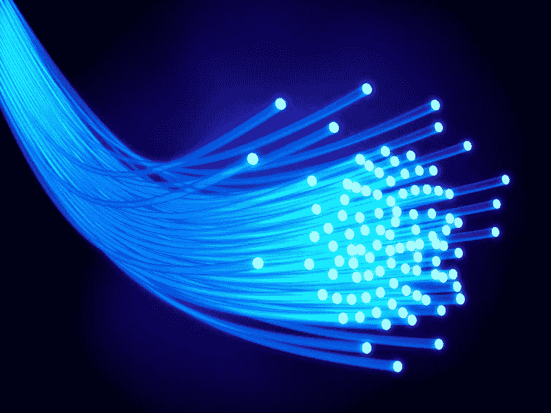

# 网络中立性的丧失会让普通人完蛋

> 原文：<https://medium.com/hackernoon/the-loss-of-net-neutrality-will-screw-the-common-man-a38619f780d>

Don’t assume that just because it’s there, dark fibre will be lit up on your behalf

我很失望地在 11 月 20 日的《华尔街日报》上读到，美国联邦通信委员会新任主席 Ajit Pai 正在撤销网络中立。一天后，他[更详细地概述了他的计划](https://www.wsj.com/articles/fcc-outlines-plan-to-roll-back-internet-rules-1511282167?mod=djemalertTECH)。他的决定似乎与特朗普政府的大多数决定一致:剥夺对普通人的保护，让那些已经非常富有的人受益。

自 2015 年以来，网络中立，即互联网是一个[公共载体](https://en.wikipedia.org/wiki/Common_carrier)，就像电话服务一样，以及所有互联网流量都应该受到同等对待的理念，一直是美国的法律。那些“过度”发送数据的公司(海报男孩=网飞)支持网络中立。网飞可以用视频流量塞满互联网，而不必为保证服务支付额外费用。其他受欢迎的是互联网本土公司，如谷歌和脸书。像威瑞森、康卡斯特和 AT & T 这样的电信运营商反对这项提议，因为他们希望对优质服务收取更多费用。

因此，Pai 和他的盟友们正在向有利于老牌电信提供商的方向倾斜。为什么会有这种特殊的联盟？所有这些令人费解的政策决定的唯一统一原则是“摧毁奥巴马所做的一切”。奥巴马和他的朋友们支持网络中立？那么，我们反对。他喜欢硅谷？让我们戳他们的眼睛。

但所有这一切的附带损害将是我们，使用互联网的普通人。现在，我们支付合理的月租费就可以使用了。在一个特权不断升级的世界里，随着优质服务变得更好，我们的普通服务也会变得更差。电信提供商对此没有意见。他们将能够保持价格的螺旋上升，只要多花几便士就能提供下一个更高级别的服务。

在一个完美的资本主义体系中，竞争将是这个螺旋的缰绳，但我们并不生活在这样一个体系中。一个裙带资本主义的新时代正在到来，而且几乎没有足够多的运营商可以非正式地勾结，而不必在烟雾弥漫的房间里开会讨论。是的，有很多[暗光纤](https://en.wikipedia.org/wiki/Dark_fibre)，但是不要以为运营商会将它投入服务以保持最低水平的可用服务。在不太遥远的将来，你将为基本上与现在相同的服务支付更多的费用。

几年来，康卡斯特一直试图定期向我推销升级版的“商务舱”服务。我从来没有上钩，因为网络中立性被认为是当我的“消费者”位在传输过程中混合在一起时，与商业位保持同等地位。

无论如何，我甚至没有得到我的服务应该提供的 8Mbps 和 1.5Mbps 的流量。我已经多次使用 [Speedtest](http://www.speedtest.org/) 来检查我的实际速度。事实上，我刚刚使用了它，它给了我一个 33.18Mbps 的下降和 6.31Mbps 的上升的神奇读数。但愿如此！事实是，你在互联网上的实际速度取决于最慢的连接速度。所以，如果远端的服务器正在滴出比特，那就是你得到它们的速度。或者，如果中间某个地方发生交通堵塞，你的信息会和其他人的信息一起被发送出去。一个简单的跳转到一个专门测量速度的服务器会给你绝对理想的读数。现实生活中的交通往往要慢得多。

但是现在，随着网络中立的终结在望，也许是时候让我考虑一些“增强服务”的宣传了。我会像[红皇后竞赛](https://en.wikipedia.org/wiki/Red_Queen%27s_race)中的爱丽丝梦游仙境:尽可能快地奔跑，只是为了呆在原地。