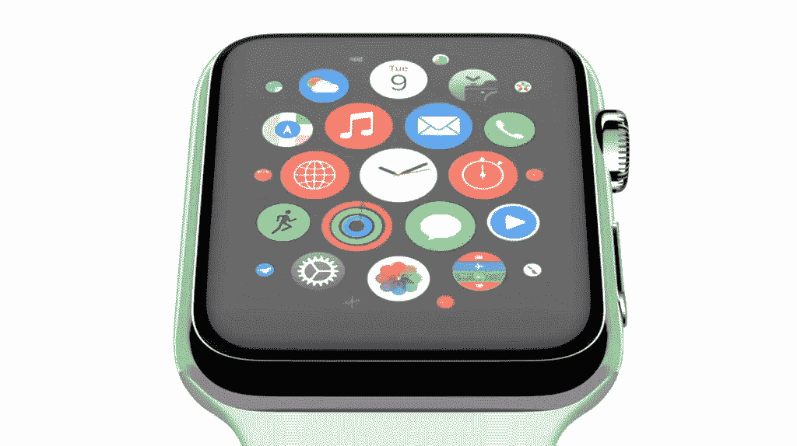
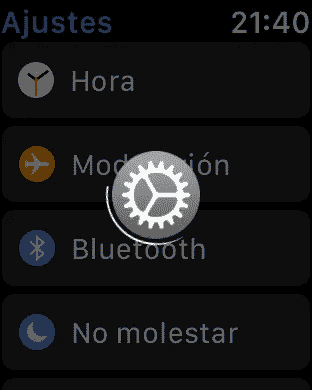

# LTE Apple Watch:新价值和新应用

> 原文：<https://medium.com/hackernoon/the-lte-apple-watch-new-value-and-new-applications-fcbf8cfc77c5>

## LTE Apple Watch 的连接性改进将带来额外的价值，可以推动开发者实现其承诺

[在我之前的文章](https://hackernoon.com/the-lte-apple-watch-virtuous-cycle-for-a-new-ecosystem-a9211c608f54)中，我谈到了如何将[发布的支持 LTE 的 Apple Watch](https://www.theverge.com/circuitbreaker/2017/8/4/16099746/apple-watch-lte-model-series-3?lipi=urn%3Ali%3Apage%3Ad_flagship3_detail_base%3BnBT5ud1oSSuW%2BZpdMX%2BDbw%3D%3D) 转变为一个新的互联设备[生态系统](https://hackernoon.com/tagged/ecosystem)的关键是两个要素之间的互动:

*   一些**用户的新行为**、**克服了将手机留在身边的焦虑**，在某些场合(某些*场合，并非所有甚至大部分时间)只戴手表也感觉很舒服*
*   **开发者为这种纯手表模式创造新的体验**，将它视为一个独立的设备，而不是一个配件，这将使手表本身更加有用，加强这种新的用户行为。

在这篇新帖中，我想看看用户能用一块“开箱即用”的手表做些什么，这将有助于第一点；然后想想开发者还会带来什么，改善第二点，为苹果手表生态系统提供良性循环。

# 现成的新价值

LTE Apple Watch 将包括蜂窝连接，这将使它成为一个永远在线的设备，不需要附近的 iPhone 连接到互联网。苹果可能会在这款设备的 WatchOS 版本中包括额外的应用程序，以利用这种连接性，但即使他们不这样做，他们现有的一些基本功能也会发生显著变化。特别是:

*   **音乐**。目前，Apple Watch 用户可以从他们的手机中选择一些播放列表和专辑，并将其本地下载到手表中，其存储限制为[2GB](https://9to5mac.com/2015/03/10/apple-watch-includes-8-gb-of-storage-allows-2-gb-of-music-storage-and-75-mb-of-photos/)。这是面向跑步者的，因为它允许用户通过蓝牙耳机播放音乐，而无需携带手机。但有了 LTE 连接，这种限制就可以消失，因为**用户可以直接从手腕上访问他们的完整 iTunes 库或 Apple Music 的所有内容。这将使苹果手表成为最近“死亡”的 iPod Shuffle 的最终替代品。**
*   **地图和指南。**手表中的地图应用程序目前通过提供触觉反馈为用户指明方向。该反馈允许用户“感觉”他们在几步中需要转弯是向右还是向左。但要搜索目的地或获得方向，手表应用程序需要 iPhone 提供的连接。LTE 手表将改变这一点，因为即使你把手机落下，也可以四处走动。
*   **通信。**这将是帮助克服将手机留在家里的焦虑的主要功能，因为它将保持用户可联系。今天，Apple Watch 用户可以从他们的手腕上获得短信和来电通知，他们可以通过简单的点击或使用 Siri 听写来回答这些通知。的确，当使用 Wifi 连接时，iMessage 和 FaceTime audio 也可以使用这一功能，即使周围没有电话，但期望 Wifi 不足以让你感觉一直在线。但是，通过 LTE 连接，在四处行走(或跑步)时也是如此。这将有助于用户对离开手机更有信心。Apple Watch 的开箱即用体验将仅限于 iMessage 和 FaceTime 音频，但**我们也可以预计一些运营商将扩展其当前的多设备产品，以包括 Apple Watch 通话和短信**。特别是， [AT & T NumberSync](https://m.att.com/shopmobile/wireless/features/numbersync-Apple.html) 已经利用原生功能为用户提供了在苹果设备上获取常规通话和短信的能力，因此我预计他们将从 LTE Watch 的第一天起就能实现这一功能。
*   Siri。Siri 将支持上述服务的一些交互，如查找要播放的特定歌曲、提供目的地方向或口述文本信息。但现在 **Siri 将不再需要近距离 iPhone 的连接来完成这一切:它将直接通过手表中的 LTE 连接工作**。这将使手表中的交互比现在更快，因此成为在微小屏幕上与服务交互的主要方式。这也是对“[下一个 10 亿联网用户](https://www.wsj.com/articles/the-end-of-typing-the-internets-next-billion-users-will-use-video-and-voice-1502116070?mod=e2fb)”互动预期的一种趋势，这使得它在新生态系统中的中心地位更加重要。

有趣的是，所有这些用途(音乐、通话和文本听写、Siri)都受益于**使用语音与手表互动并获得音频反馈**。这就是为什么 AirPods 也将在 LTE Apple Watch 的成功中发挥重要作用，也是为什么苹果发布它的暗示是在[他们最初如何展示 ai rpods](/p/apple-airpods-and-the-disintegration-of-the-smartphone-cb8e29efc8e3)和[他们如何涵盖今年的 WatchOS 新功能](/p/wwdc-2017-social-comms-2-watchos-4-and-the-smartphone-disintegration-340050269251)。这就是[智能手机的分化趋势](/p/apple-airpods-and-the-disintegration-of-the-smartphone-cb8e29efc8e3):在这个过程中，由单个设备(手机)提供的价值将越来越多地在不同设备(Apple Watch 和 AirPods)之间分割，但这些设备反过来将(在物理上)更接近用户，并更融入他们的生活。

# 新应用

一旦手表的基本价值增加，有了新的连接和可以用它做的新事情，一些用户开始有时会把他们的手机留在身后，开发者将更有动力接触到那些没有手机的用户。

我们将在这些应用中看到什么，会比我们今天在手表中看到的更有趣吗？让我们猜几个:

*   **音乐**。是的，我们已经提到了在旅途中访问完整的苹果音乐库的能力，但是一旦开发者能够做到这一点，**为什么不同时获得 Spotify 呢？播客呢？**现在，在旅途中获取内容已经成为可能，您将不再需要手机中的内容，您可以从手腕上获取。虽然现在有 Shazam 手表应用程序，但它目前使用 iPhone 中的麦克风来进行歌曲识别，如果不从口袋中拿出来，性能相当差。但是通过 LTE 连接和手表麦克风的接入，**你可以听一首歌，只需在手腕上轻点几下就可以捕捉到它并将其添加到你的曲库**。
*   对**通信**的更多选择。有了 LTE 手表，你将摆脱 iMessages 和 FaceTime 音频，但开发人员还将启用 **Facebook Messenger、Telegram 或 Skype** ，为你在旅途中提供更广泛的全球覆盖，无需电话。iMessage 和 Facebook Messenger 足以让它成为美国市场的一个相关通信终端，但要让它走向全球，还需要其他玩家，特别是 WhatsApp。不幸的是，要让 WhatsApp 以独立的方式在 LTE Apple Watch 上工作，[首先他们需要让自己的服务为多设备做好准备。](https://hackernoon.com/i-s-multidevice-the-achilles-heel-for-whatsapp-1ac91c3edf07)这对 WhatsApp 来说可能是一个威胁，因为一些高级用户决定将一些对话转移到一个新工具(如 Telegram)上，方便他们将手机留在家里。
*   **支付**。Apple Watch 已经提供了 Apple Pay，可以用来购物，而不需要 iPhone。但有时它的使用可能会有点令人不安，因为有时你会从手表上得到一个确认，即卡被读取 ok，但随后从支付终端得到一个错误。然后你不得不再次付款，不确定你的信用卡是否会被扣两次钱。手表中的一个简单的银行应用程序可以在手表支付完成时提供通知，或者检查你最近的操作，这将给用户带来足够的无手机安心。最重要的是，如果苹果开放手表中 NFC 芯片的一些访问权限，[正如它宣布将为 iPhone](https://9to5mac.com/2017/06/07/apple-opening-up-some-access-to-the-iphones-nfc-chip-in-ios-11/) 所做的那样，替代支付机制或公共交通工具(如[伦敦的牡蛎卡](https://tfl.gov.uk/fares-and-payments/oyster))可以在你的手腕上使用，而不需要手机。
*   **搭车**。这款手表的优步、Lyft 或 [Gett](https://gett.com) 应用程序可以确保你无论在哪里都能找到车。能够从你的手腕上叫一辆车到你当前的位置，跟踪他们的距离，并在离开时付款，这将带来无需携带手机的自由。
*   **全新体验**。现在你可以用你的苹果手表作为游戏的配套体验，Pokémon GO 就是一个很好的例子。虽然今天你仍然必须随身携带手机才能从手腕上玩游戏，但如果能够离开手机去孵蛋，旋转神奇宝贝，甚至抓住一些口袋怪物，那将是非常有意义的。但展望未来，我可以看到这款手表被用作其他基于现实世界互动的伪 AR 游戏的独立体验。手腕上的 GPS 定位和互联网连接可以在街上带来玩家对玩家的虚拟彩弹体验。想想通过联网的位置感知设备实现的游戏，**这难道不是成为孩子们“第一部智能手机”的理想设备，让他们的父母安心吗？**大概 [Life360](https://www.life360.com/) 也会是首批提供联网手表应用的开发者之一。

随着这类应用——以及许多我甚至无法想象的其他应用——变得可用，手表足以满足用户需求的情况也将增加。而且这种使用会越来越频繁(还是那句话，不是排他性的，是开发者再也无法忽视的东西)。创造更多手表应用的动力也将增长…

**这将是一个循环，围绕一种新的互联设备创造一个丰富的生态系统。**

# 首先需要解决什么问题

但要让这成为现实，解决 Apple Watch 当前的一些问题至关重要。否则，消费者不会有足够的信心留下手机，开发者也不会开发新的应用程序。作为 Apple Watch 第一代用户，我特别关注两个问题。这些问题可能在第二代 Apple Watch 中得到改善，但如果没有，这是第三代中涵盖的基本问题:

*   **性能**。有时，在 Apple Watch 中打开一个应用程序可能需要超过 10 秒钟(！).这不仅发生在第三方应用程序上，甚至发生在基本功能上，如设置本地应用程序。对手腕上的简单交互的期望是，它也应该(几乎)是即时的，否则它会产生疲劳和缺乏信任，让用户远离手表，并把他们带回他们的手机。

Sometimes I get this spinning circle for 15 seconds before being able to use my Apple Watch.

*   **续航**。为了让用户放心地将手机留在身边，电池寿命必须让他们能够确保自己可以使用手表。我相信使用一整天就够了，虽然很多人抱怨每天给手表充电不方便。我不指望电池能持续一周，但对我来说，如果我用它来做除了查看时间以外的事情，Apple Watch 很难持续一整天。因此，随着 LTE 无线电将带来额外的电池使用，以及无电话时额外的应用使用，设备所需的电池容量或效率将大幅增加。

这些问题从第一代设备开始就存在了，并且只会随着蜂窝连接而变得更糟，可能是苹果创造新生态系统的最大敌人，这种新生态系统可以帮助他们建立新的设备更换周期，并[瓦解智能手机](/p/apple-airpods-and-the-disintegration-of-the-smartphone-cb8e29efc8e3)。