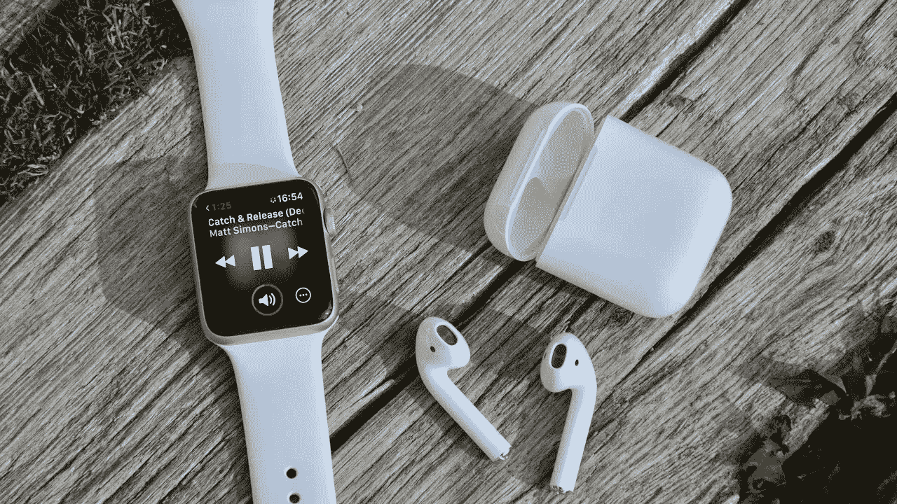
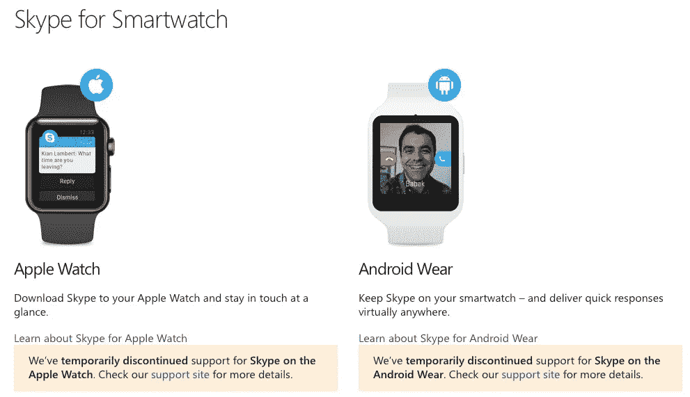
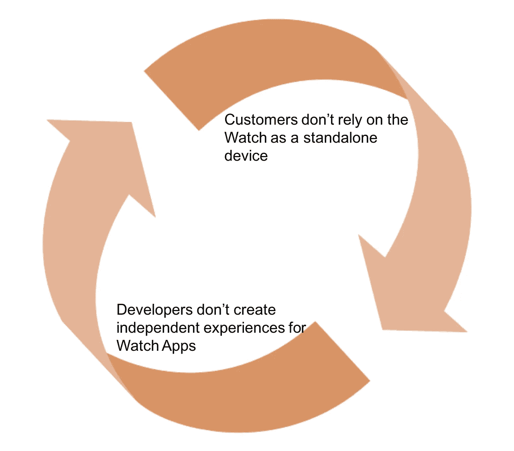

# LTE Apple Watch:新生态系统的良性循环

> 原文：<https://medium.com/hackernoon/the-lte-apple-watch-virtuous-cycle-for-a-new-ecosystem-a9211c608f54>

## 增加连接，打破对 iPhone 的依赖，可以创造一个新的生态系统，但良性循环取决于开发人员的加入

在今年的 WWDC 期间，[苹果](https://hackernoon.com/tagged/apple)围绕 WatchOS 4 发布了一些公告，使 Apple Watch 更加独立于 iPhone，[我当时预测，今年我们将看到该设备的蜂窝版本](/@jorge.serna/wwdc-2017-social-comms-2-watchos-4-and-the-smartphone-disintegration-340050269251)的发布。[最近的传言和从 HomePod 固件](https://www.theverge.com/circuitbreaker/2017/8/4/16099746/apple-watch-lte-model-series-3?lipi=urn%3Ali%3Apage%3Ad_flagship3_detail_base%3BnBT5ud1oSSuW%2BZpdMX%2BDbw%3D%3D)中提取的信息似乎证实了这一点，这也进一步推动了苹果进入[“智能手机解体”](/@jorge.serna/apple-airpods-and-the-disintegration-of-the-smartphone-cb8e29efc8e3)。

**为 Apple Watch 添加独立连接功能使其从一个配件类别转变为一个独立的设备，但这一功能足以创造一个新的生态系统吗？**

# 良性循环

手表不仅仅是一个配件，它还能改变顾客的行为，创造新的用途和价值，这在很大程度上取决于一个潜在的良性循环，这个循环需要某种启动:

因为**如果开发者不期望获得一些回报，他们就不会投资为 Apple Watch 开发应用**(注意力经济应用的更多参与)。今天，对于目前非独立的 Apple Watch，很明显他们看不到回报:

*   谷歌和亚马逊在某个时候为苹果手表开发了应用程序，以至于他们决定停止使用应用程序。
*   Skype 在更新他们的智能手机应用程序时，也停止了他们的手表应用程序(尽管他们说这是暂时的):

*   一些应用程序甚至从未试图支持它，WhatsApp 就是一个突出的例子。

LTE 连接将如何改变这种情况？

# 更多的曝光和更多的用户

LTE 选项的一个关键方面是，它将使相关合作伙伴通过他们的渠道推广产品:电信运营商。这将有助于苹果让更多的苹果手表进入更多客户的手腕。

是的，[一些运营商已经在他们的商店里销售苹果手表](https://www.imore.com/three-first-uk-mobile-operator-sell-apple-watch)，但这将不再是一种配件销售(可能利润很低)，而是一种需要额外数据计划的连接设备。对于运营商来说，这是一个经常性的收入和忠诚化的机会，这将有更多的动力将其推向客户。

是的，[在](https://www.theverge.com/2016/3/22/11282890/samsung-gear-s2-review-3g-watch-video)之前已经有了支持蜂窝功能的智能手表，运营商一直在推动，但没有成功，但苹果的品牌吸引力和已经拥有[这一类别中最成功的产品](https://www.engadget.com/2017/05/05/apple-watch-biggest-wearables-provider-q1-2017/)的杠杆作用将是一个很大的不同。

LTE Apple Watch 将需要一个数据计划，该计划不会用于视频或下载大文件，而只是用于少量的数据和音频流，并且将以可控的方式使用。我相信使用苹果 eSIM 将确保对该计划的控制，这将使订阅无法在其他设备上使用。考虑到这一点，Apple Watch 连接的额外成本可能会在现有智能手机或家庭每月计划的基础上增加 3 或 4 欧元/美元(例如，[西班牙的沃达丰提供每月 5€的无限音乐服务](https://www.vodafone.es/c/particulares/es/tienda/movil/vodafone-pass/))。

这种低数据量的方法甚至可能促使苹果公司采用一些新的方法将数据捆绑到设备上，正如一些人所建议的那样:

我不认为会是这样，至少在最初，因为为了推动最初的增长，苹果可能会想利用运营商的渠道。但是在某个时候——对于某些特定的市场——这肯定会发生。

现在**让我们假设 LTE Apple Watch 的价格将在 399/490 美元左右€** (我使用的是最小的 iPhone SE 的参考价格，它提供类似的连接)，相比之下，目前最低价格的手表零售价格为 269/339 美元€。

在这个价格水平上，它可以很容易地与运营商现有的多设备计划相关联，因此**它可以通过每月 20-25 美元€(设备+连接)的分期付款来覆盖，合同期为 2 年**。

运营商的补贴和推动可以推动采用，以便 LTE Apple Watch 的用户群开始对开发者更具吸引力。但这不足以引发良性循环:它还需要用户行为的改变。

# 恶性循环

即使普通的苹果手表相对成功，开发者也没有真正的动力去创造差异化的苹果手表应用，因为:

*   Apple Watch 应用程序是作为 iPhone 应用程序的扩展分发的
*   如果没有一个紧密的 iPhone(它是一个配件)，Apple Watch 几乎毫无用处

因此，大多数 Apple Watch 应用程序的开发都依赖于用户能够拿到他们的手机(很可能就在附近)来获得“完整的体验”。这使他们成为事后诸葛亮，在大多数情况下，开发人员甚至不会费心用特定的应用程序来支持设备，而只是相信他们手腕上显示的常规应用程序通知(这是 WhatsApp 的方法)。

这推动了当前的恶性循环，阻止手表成为一个[生态系统](https://hackernoon.com/tagged/ecosystem):

但有了 LTE 连接，用户行为的一些小变化就可以打破这种循环，将其转化为良性循环。

# 真正的独立使用

一篇[最近的 TechCrunch 文章](https://techcrunch.com/2017/08/05/all-the-major-cases-where-an-lte-enabled-apple-watch-would-be-great/)讽刺说，LTE 连接唯一有用的用例将是跑步。诚然，苹果已经改变了对手表的定位，主要是关于健康，但他们也围绕音乐定位 HomePod，这并不意味着这就是全部。对于苹果来说，这些方法只是第一步，他们的真正目标是将这两款设备变成新的后智能手机生态系统的中心。

我相信，拥有一个联网的 Apple Watch，自然会开始创造除了跑步之外的独立使用的情境。现在，对于大多数人来说，出门不带手机是一个焦虑的来源。你需要带着你的手机“以防万一”,因为:你可能需要联系某人，你可能需要被联系，你可能需要检查一些东西...但是，有了一只涵盖了许多意外情况的手表(我将在下一篇文章中详细介绍这一点)，你会很高兴地把手机留在身后:

*   当你出去在附近做一些快速的差事时
*   当你出去遛狗的时候
*   去学校接孩子的时候
*   当去游泳池或屋顶晒日光浴时
*   当你出去约会时，如果你真的想在场
*   是的，跑步的时候

随着这成为一种常规模式，“手机留在家里的焦虑”，即因无法连接而导致的“错过的恐惧”，将会减少，并为手表创造越来越多的独立使用情况。

# 跟风的开发商

这种独立使用将会增长，它不会是大多数或一天或甚至很大一部分，但它将足够相关的应用程序，准备这种拥有和优势，并推动不断增长的参与。

这将使开发引人注目的手表应用变得更加有趣，这些应用可以在没有手机的情况下工作。那么更多的案例将会由此而来，推动更多的独立使用。如此良性循环将围绕一个新的互联设备创造一个新的生态系统，一个 [**进一步步入智能手机解体的**](/@jorge.serna/apple-airpods-and-the-disintegration-of-the-smartphone-cb8e29efc8e3) **。**

*但是，利用手表连接的新应用会有什么不同呢？为了避免陷入目前的恶性循环，哪些障碍是必须首先克服的？* [*我看了一下我下面的帖子*](https://hackernoon.com/the-lte-apple-watch-new-value-and-new-applications-fcbf8cfc77c5) *，于是继续读下去，并* [*关注我*](/@jorge.serna) *以获得我未来文章的通知。*