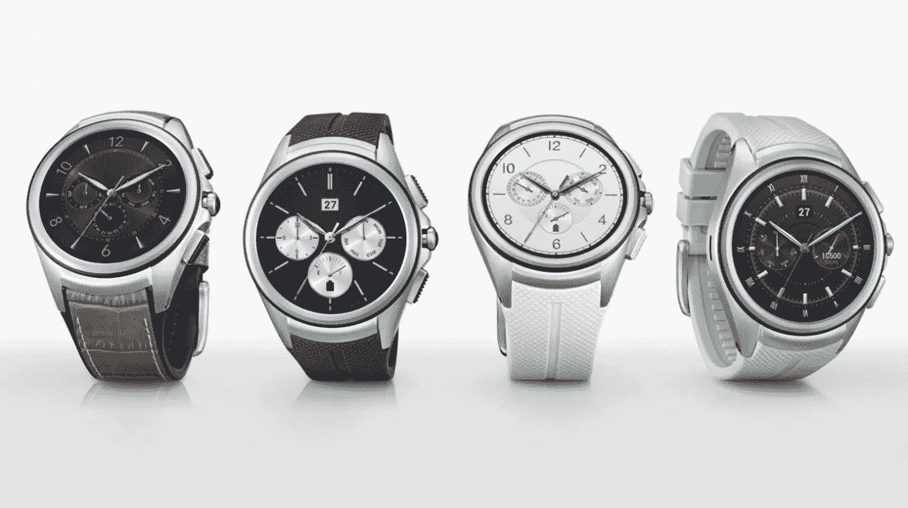

# LTE Apple Watch:之前不是有 Android 吗？

> 原文：<https://medium.com/hackernoon/the-lte-apple-watch-wasnt-android-there-before-21bde5a41bab>

[LG Watch Urbane 2nd Edition LTE](https://www.wareable.com/lg/lg-watch-urbane-2nd-edition-cancelled-dont-know-why-2015)

## 为什么苹果手表会在安卓设备失败的地方取得成功？

在[我之前的](https://hackernoon.com/the-lte-apple-watch-virtuous-cycle-for-a-new-ecosystem-a9211c608f54) [帖子](https://hackernoon.com/the-lte-apple-watch-new-value-and-new-applications-fcbf8cfc77c5)中，我讨论了[苹果](https://hackernoon.com/tagged/apple)围绕[传闻中的 LTE Apple Watch](https://www.theverge.com/circuitbreaker/2017/8/4/16099746/apple-watch-lte-model-series-3?lipi=urn%3Ali%3Apage%3Ad_flagship3_detail_base%3BnBT5ud1oSSuW%2BZpdMX%2BDbw%3D%3D) 创建一个新的[生态系统](https://hackernoon.com/tagged/ecosystem)的机会。在第一篇文章[中，我提到了支持蜂窝功能的智能手表在 Android 生态系统中已经存在，但是](https://hackernoon.com/the-lte-apple-watch-virtuous-cycle-for-a-new-ecosystem-a9211c608f54)[仍然有人提出这个问题](/@mikegre/the-lg-watch-has-had-the-ability-to-do-this-since-it-was-released-about-2-years-ago-928a27aaaccb)。

我认为有必要问一下，为什么比其他公司更晚进入这个市场的苹果公司应该创造一个生态系统，而其他设备却不能。苹果品牌的光环效应足以证明这种差异吗？

# 对生态系统来说什么是重要的

需要强调的一点是，在大多数情况下，领先与战胜市场并不相关。[在 iPhone 推出之前，诺基亚就有了可以上网的手机，有 WiFi、很棒的摄像头和应用支持](https://en.wikipedia.org/wiki/Nokia_N95)。但是诺基亚无法创造这样的生态系统，而苹果做到了。

生态系统的关键来自我在第一篇文章中讨论的内容:

*   设备本身必须带来足够的价值，才能吸引相关用户
*   但这种吸引力必须足够有吸引力，并且能够带来足够的回报，才能让开发者开发出增加设备价值的应用

这两个因素必须相互作用，形成良性循环。

但作为安卓手机配套产品推出的蜂窝智能手表的问题在于，它们没有提供触发良性循环所需的环境。因此，率先上市无助于征服它。

# 安卓可穿戴生态系统的问题

有两个主要问题阻碍了当前的 Android 智能手表推动新的无手机(r)发展:

*   **不清楚*无电话*使用**的开箱即用价值。在讨论 LTE Apple Watch 的开箱即用价值时，我讨论了该设备将允许的几件事情。其中一个关键是音乐支持，公平地说， [Android Wear 确实支持在手表中使用 LTE 接入来访问 Google Play 音乐库](https://support.google.com/androidwear/answer/6102658?hl=en)。对谷歌来说不幸的是，虽然没有关于 Google Play 音乐订户的公开数字，但[行业倾向于同意](https://gizmodo.com/streaming-music-services-from-most-screwed-to-least-sc-1793612699)这是一项[远不如 Apple Music 或 Spotify](https://9to5mac.com/2017/03/13/music-streaming-service-comparison/) 受欢迎的服务，Spotify 不支持从 Android Wear 播放音乐([仅控制你的智能手机](https://support.spotify.com/us/listen_everywhere/on_other_devices/android-wear/))。但 Android 智能手表的主要问题是，Android 中没有 iMessage/FaceTime 音频功能，无法真正将用户从忘带手机的焦虑中解放出来。你可以使用 Telegram 或 Hangouts，但它们不具备启动生态系统所需的主流吸引力。对于能够取代手机的 Android Wear 设备，要求电信运营商也能够支持从你的主手机向该设备发送电话和文本，大多数运营商并不都准备提供这种体验。在 Apple Watch 中，让 [AT & T NumberSync 支持](https://m.att.com/shopmobile/wireless/features/numbersync-Apple.html)，或者从 T-Mobile 获取[数字，可以是对基本 iMessages 和 FaceTime 音频功能的改进，但这不是必须的。在 Android 中，这变成了基础，不幸的是，这不是大多数运营商能够轻松支持的。](https://support.t-mobile.com/community/plans-services/digits)
*   **碎片化。**Android 硬件制造商试图将其产品与其他产品区分开来，这一直是 Android 智能手机的一个问题，智能手表也不例外。在 Android 手表中，每家设备制造商都在功能和外形方面寻求略有不同的方案。 [Android Wear 2.0 已经统一了实现无手机应用的方式](http://www.techradar.com/news/wearables/google-android-wear-what-you-need-to-know-1235025)，但是这种碎片化[使得操作系统很难到达真正的设备](http://www.androidauthority.com/why-is-android-wear-2-0-taking-so-long-784826/)。并且仍然没有开发者可以集中精力的“参考设备”。但是，如果说有什么东西清楚地表明了这个问题的严重性，那就是作为 Android 最受欢迎的手机制造商的三星甚至没有在他们的联网智能手表产品中使用 Android Wear。三星 Galaxy Gear S3 确实支持 LTE，但基于三星的专有操作系统 [Tizen。这进一步削弱了 Android 智能手表的潜在生态系统，这将要求开发者不仅为不同的设备，甚至为不同的系统创建应用程序。与此同时，苹果没有碎片化，这简化了客户的选择，也简化了开发者针对特定设备进行开发的决定。](https://www.tizen.org/)

所以总而言之，联网 Android 手表的情况是，它本身并没有带来足够的价值来留下主手机(这也影响了非 LTE Apple Watch，这就是为什么它之前没有创建一个生态系统)，碎片化问题进一步降低了开发者投资创建独立体验的动力，从而显著改变这种情况。

所有这一切的一个附带说明是[一个独立的 Apple Watch 的价值将通过它与配对的蓝牙耳机](/@jorge.serna/apple-airpods-and-the-disintegration-of-the-smartphone-cb8e29efc8e3)的使用来充分实现。音乐、语音通话和 Siri 的交互方式更有意义，由谷歌助手驱动的安卓设备也会处于同样的情况。在苹果的情况下，他们将能够围绕以前的成功产品建立这种场景:[他们的 AirPods](/@jorge.serna/apple-airpods-and-the-disintegration-of-the-smartphone-cb8e29efc8e3) ，但在 Android 设备的情况下，虽然 Android Wear 智能手表与蓝牙耳机配对是可能的，但这种用例没有得到推广，也没有“自然产品”来做这件事。用户需要想象这种场景，或者找到一些合适的耳机来补充他们的智能手表。在苹果的案例中，AirPods 和 LTE Watch 之间的强化将成为所有营销材料的一部分——它已经是了——这将进一步加强生态系统。

# Android 可穿戴生态系统的解决方案

具有讽刺意味的是，LTE Apple Watch 的成功也可以推动 LTE Android Wear 设备的成功，因为其潜在的成功和对价值的感知将产生用户对替代品的更多需求。与此同时，为 LTE Apple Watch 开发应用程序的开发者可能更愿意尝试将这种体验带到 Android 上，尤其是在工作量相对较小的情况下。

谷歌可以通过在 Android Wear 中提供一个在某种程度上遵循苹果方法的应用模型来帮助实现这一点(这样迁移就不需要完全重新设计解决方案，即使它需要完全重新编码)。而且还是一个参考设备，这样开发者就可以专注于它，新设备也随之而来，从而避免被排除在生态系统之外。

**成功的 LTE Apple Watch，随后谷歌推出的 Pixel Watch 在很大程度上受苹果无手机行为的启发，以及一些类似 AirPods 的联网 buds 与谷歌助手互动，可能有助于巩固联网手表领域的双重生态系统(苹果+谷歌)。**