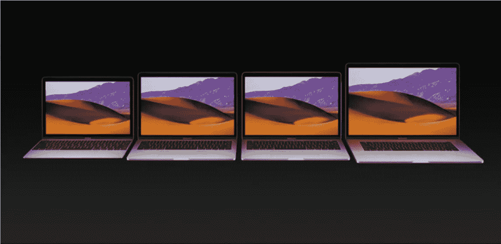
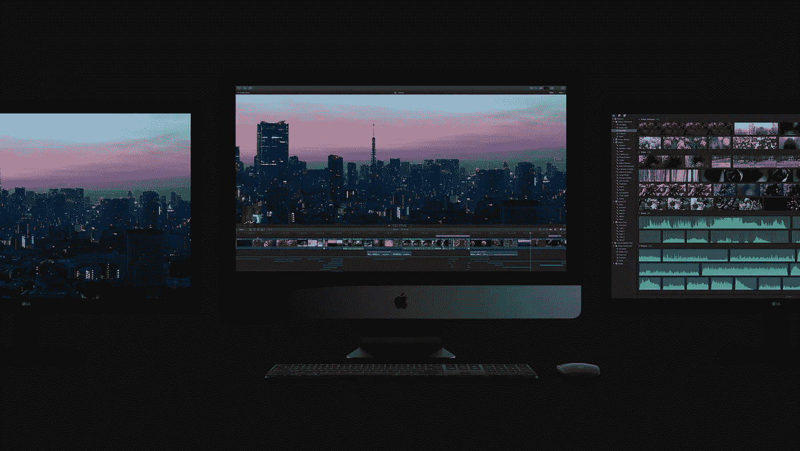

# 苹果电脑回来了

> 原文：<https://medium.com/hackernoon/the-mac-is-back-a983a34bad48>

有一段时间，感觉好像苹果忽视了 Mac。

去年年底，该公司更新了 MacBook Pro，但入门级型号的价格远高于即将推出的型号。它极大地提高了一台合适的计算机的成本。

该公司已有近 10 年没有推出引人注目的高端台式机。最新的 Mac Pro 受到热量问题的困扰，并且已经证明很难升级。

过去几年的大多数重大发布都围绕着 iOS 设备。

苹果电脑不是苹果公司的摇钱树——那可能是 iPhone——但它是核心用户最关心的产品。我说的是图形艺术家、摄像师、软件工程师、机器学习专家、游戏开发者和其他超级用户。

这些超级用户关心规格，但他们也关心拥有一台 Mac 所带来的无形资产。它是关于工作流程、没有干扰、可感知的可靠性，以及几乎所有东西都能正常工作的事实。尖端的设计和更轻的重量很好，只要它们不损害规格和无形资产。

长期以来，电力用户一直被忽视。但是事情开始改变了。

今年早些时候，蒂姆·库克表示公司[将为专业用户做更多关于 Mac 系列的事情。](https://www.macrumors.com/2017/02/28/apple-ceo-tim-cook-pro-creative-area-important/)

本周在 WWDC，我们看到了一些令人振奋的新进展。

价格更低的 MacBook Pro。换句话说，大多数人会买的笔记本电脑。这是数百万学生和其他聪明创意者进入创造世界而不仅仅是消费世界的入门药物。

MacBook Pros 和 iMacs 之间的渐进式性能升级。

隐形，疯狂强大的 iMac Pro 本身是荒谬的，但预示着一个改进的 Mac Pro 塔。手指交叉。

ipad[获得 Mac 功能](https://www.theverge.com/2017/6/5/15742702/ios-11-first-impressions-wwdc-2017)，比如 Dock、拖放和文件浏览器。而不是反过来。

外部 GPU 支持。一个新的文件系统。改进的聚光灯。

苹果电脑万岁。