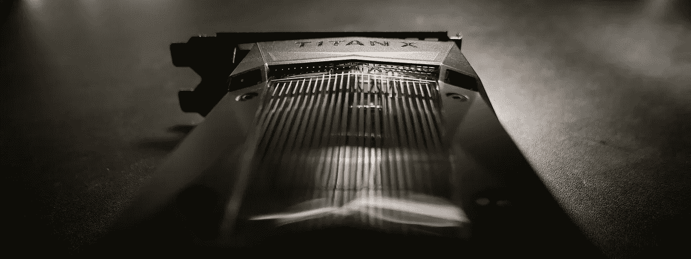
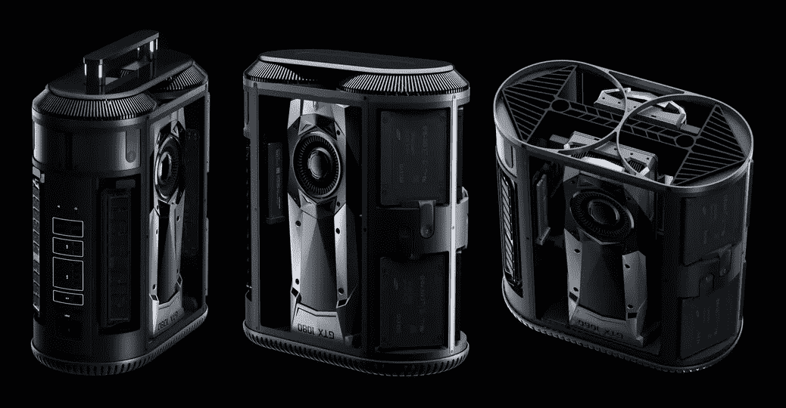
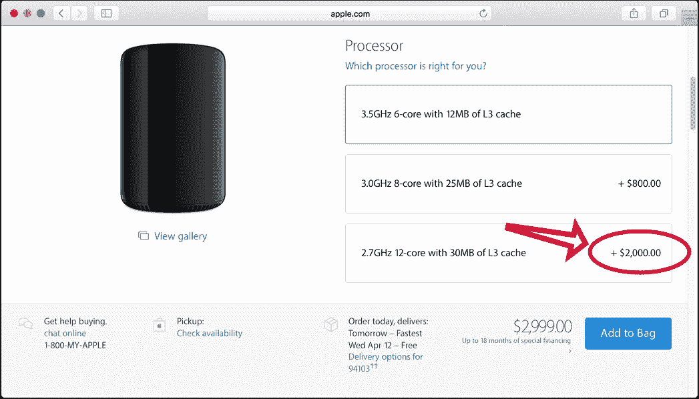
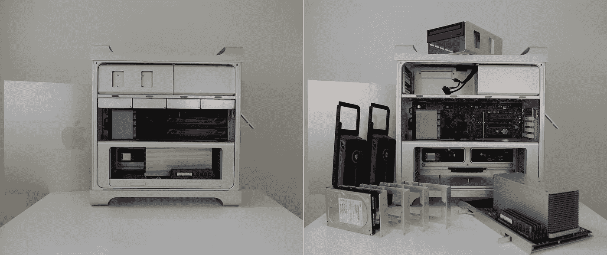
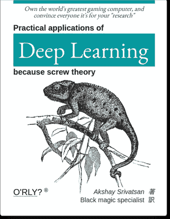
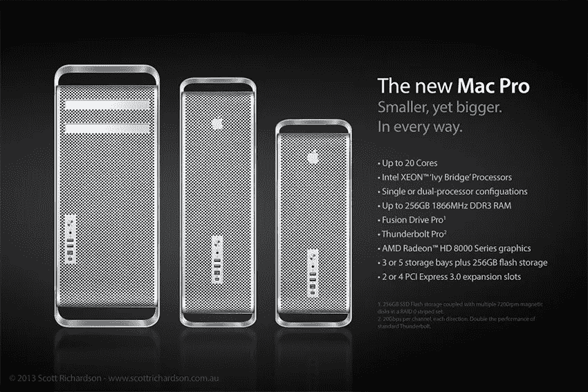
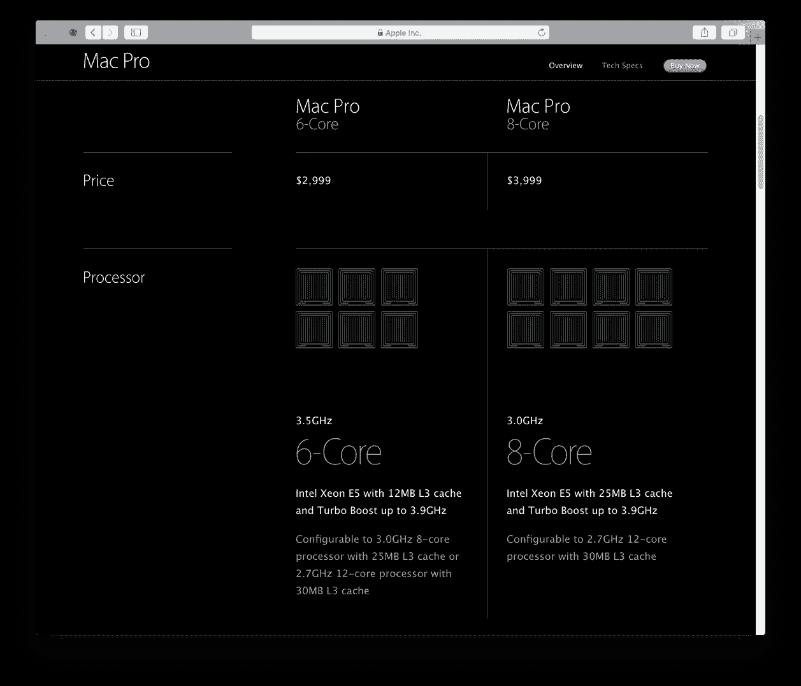
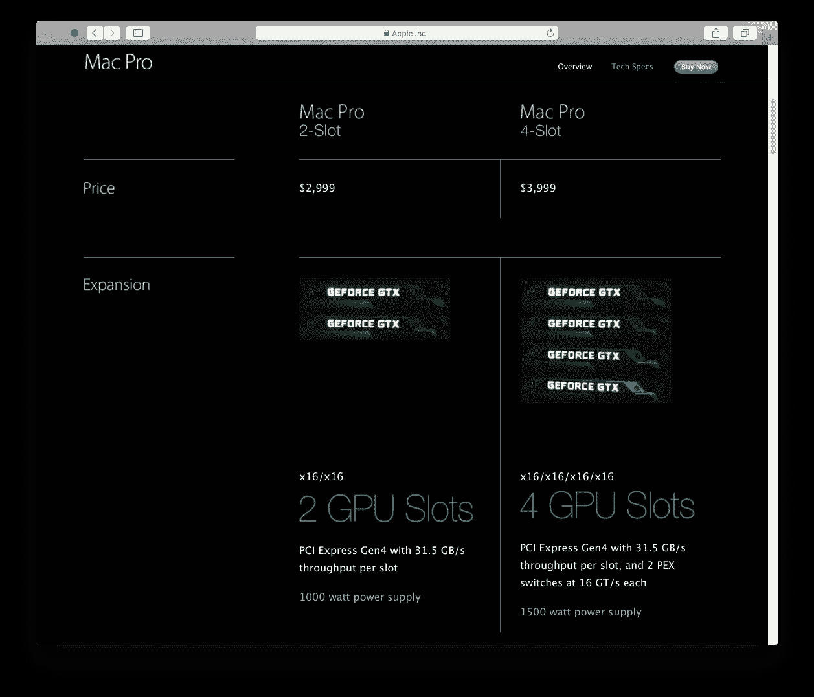
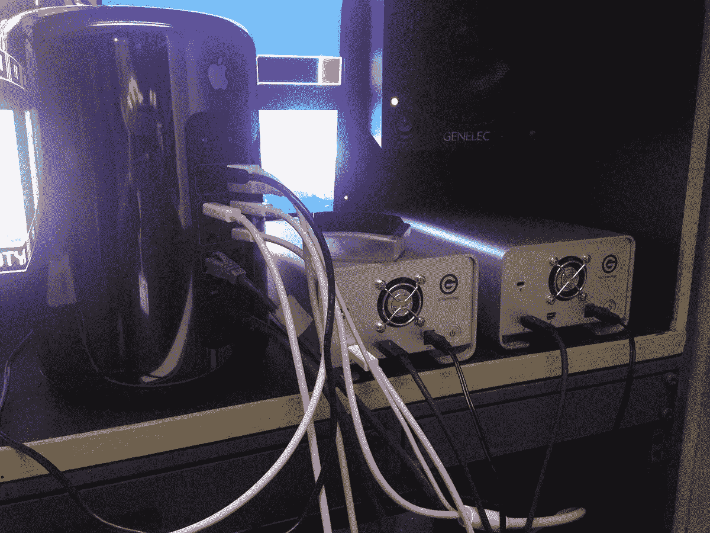
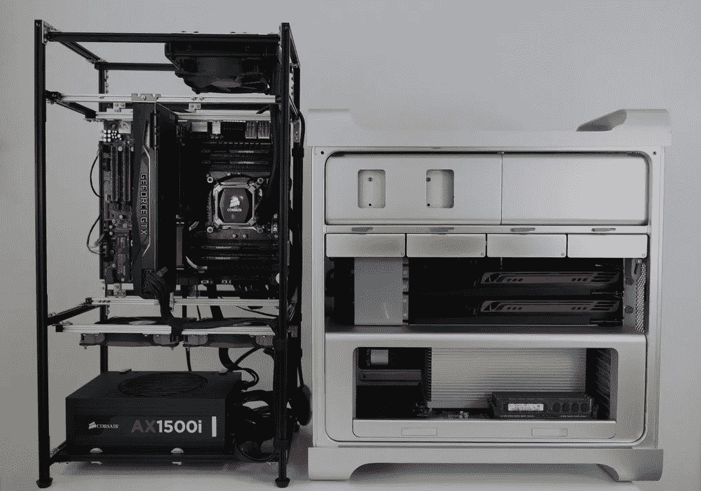

# Mac Pro:扩张的案例

> 原文：<https://medium.com/hackernoon/the-mac-pro-a-case-for-expansion-be5f2962bf47>

## 我在为深度学习构建 GPU 平台时学到的一些东西

NVIDIA [TITAN X Pascal](https://www.nvidia.com/en-us/geforce/products/10series/titan-x-pascal/) — Photo: [Tom Park](https://tompark.com) / [CC BY-SA](https://creativecommons.org/licenses/by-sa/4.0/)

在本月关于 Mac Pro 的[发布会上，苹果公司表示，他们试图在 2013 年的 Mac Pro 中放一个*泰坦 X* ，但它太热了，导致 CPU 节流。至少这是我的解释。](http://www.techmeme.com/170404/p5#a170404p5)

苹果倾向于在他们的桌面上使用性能不佳的 GPU，所以很高兴听到他们正在寻求在下一代 Mac Pro 中改善这一点。他们已经得到大量[反馈](http://www.shacknews.com/article/93547/oculus-palmer-luckey-will-consider-mac-support-if-apple-ever-releases-a-good-computer)“专业”用户想要更强大的 GPU，如英伟达的 *GTX 1080* 或 *1080 Ti* 。

[2017 Mac Pro concept](http://pascaleggert.de/macpro.html) by Pascal Eggert — [[Source](http://pascaleggert.de/macpro.html)]

几十年前，CPU 增加了 [SIMD](https://en.wikipedia.org/wiki/SIMD) 单元(例如英特尔的 [MMX](https://en.wikipedia.org/wiki/MMX_(instruction_set)) )来处理数字。尽管[技术](http://people.csail.mit.edu/yaronm/PPoPP17_Matveev_Meirovitch.pdf)提高了 CPU 的使用，但不可否认的是，最近这种计算从 CPU 转移到了 GPU。

GPU 变得如此强大，以至于我们越来越多地使用它们，导致 GPU 上通用计算的增加。现在是 GPU 的重要时期，AMD 将再次凭借其 [Vega](http://wccftech.com/amd-rx-vega/) 系列在高端市场展开竞争，NVIDIA [Volta](http://wccftech.com/nvidia-volta-12nm-finfet/) 也将紧随其后。

> “大多数针对(某些类型的高端电影制作任务)编写的软件不知道如何在多个 GPU 之间实现良好的平衡，但可以在单个大型 GPU 之间进行扩展。”
> ~ [**克雷格·费德里吉**](https://techcrunch.com/2017/04/06/transcript-phil-schiller-craig-federighi-and-john-ternus-on-the-state-of-apples-pro-macs/)

诚然[一些](https://www.provideocoalition.com/adobe-premiere-pro-and-multiple-gpus/) [应用](https://www.pugetsystems.com/labs/articles/Adobe-Premiere-Pro-CC-2015-3-Pascal-GPU-Performance-840/)没有充分利用多个 GPU，但真正的问题是，旧的弱 GPU 不会补偿新的强有力的 GPU，我们不应该[在这种背景之外概括](https://twitter.com/panzer/status/849235619788095488)。苹果很有可能在 2019 年出售一款包含两个 GPU 的 Mac Pro 配置。

# 所以你需要一台快速的电脑

几年前，如果你要买一台新的 Mac Pro，升级 CPU 的费用(3500 美元)可能与整机本身的费用(3000 美元)一样多。

[[Source](http://www.macworld.com/article/2082515/mac-pro-late-2013-review-apples-new-mac-pro-really-is-for-pros.html#pricingandconfigurations)]

本月早些时候，苹果更新了 Mac Pro 的配置和定价，以今天的标准来看，价格更加合理。从 6 核到 12 核的 CPU 升级现在只需要 [$2000](https://www.apple.com/shop/buy-mac/mac-pro?product=MD878LL/A&step=config) :

[[Source](https://www.apple.com/shop/buy-mac/mac-pro?product=MD878LL/A&step=config)]

这个价格与英特尔 6 核( [$580](http://ark.intel.com/products/75780/Intel-Xeon-Processor-E5-1650-v2-12M-Cache-3_50-GHz) )和 12 核( [$2600](http://ark.intel.com/products/75283/Intel-Xeon-Processor-E5-2697-v2-30M-Cache-2_70-GHz) )处理器之间的标价差异相当，所以苹果只是简单地传递了英特尔的建议价格。

请注意，6 核单元的时钟速度比 12 核单元快 30%，因此您将升级到较慢的内核。依赖单核性能的应用在更昂贵的 CPU 上实际上会运行得更慢。

现在考虑一下，700 美元会给你买一台英伟达 GTX 1080 Ti。上个月，这是公众可获得的最强大的 GPU。**与添加 6 个 CPU 内核的成本大致相同，您可以拥有 3 个世界上最强大的消费级 GPU。**

很遗憾，你无法将这三个怪物都插入下一代 Mac Pro。假设，也就是说，苹果将它设计成与奶酪刨丝塔类似的扩展限制，这是他们有史以来最可扩展的 Mac Pro。

# 两个中档 GPU。还是单个高端的。

苹果在 2013 垃圾桶 Mac Pro 之前支持双 GPU。在 2012 年，奶酪刨丝器 Mac Pro 有一个股票配置，配备了两个 AMD 镭龙 HD 5770 GPUs。

A dual-GPU, modular Mac Pro (mid-2012) — Photo: [Tom Park](https://tompark.com) / [CC BY-SA](https://creativecommons.org/licenses/by-sa/4.0/)

与随后的 2013 年 Mac Pro 中的 GPU 一样，这些被认为是中端，而不是高端。它们的额定功率低于 110 瓦[TDP](https://en.wikipedia.org/wiki/Thermal_design_power)，因此它们比工作站级塔式机中的高端 GPU(目前通常为 250 瓦 TDP)耗电更少，产生的热量更少。

有人可能会说，“但你可以用更强大的卡来取代那些卡。”虽然这是可能的，但盒子的设计不允许这样做。

它有一个像样的电源， [980 瓦](https://discussions.apple.com/thread/7859581)。然而，它仅向每个视频卡提供 150 瓦，或总共 300 瓦。为了支持一对 250 瓦的 GPU，如 *GTX 1080 Ti* ，你必须以某种方式提供至少 200 瓦的功率，可能需要从驱动器托架端口或剩余的两个扩展槽连接额外的电源电缆。

回到 2009 年至 2012 年，当这款 Mac Pro 型号被制造出来时，高端 GPU 的功率往往是 180 至 210 瓦，但即便如此，你仍会至少短缺 60 瓦。事实上，苹果提供了一个替代的 Mac Pro 配置，配有一个高端 AMD 镭龙 HD 5870，额定功率为 [228](https://www.techpowerup.com/gpudb/2189/radeon-hd-5870-mac-edition) - [瓦](http://www.videocardbenchmark.net/gpu.php?gpu=Radeon+HD+5870) TDP。没有额外的自定义布线，您无法插入另一个。奶酪刨丝器外壳根本不是为一对高端 GPU 设计的。

另一方面，这款 Mac Pro 有一个可更换的 CPU 模块，允许将系统从单 CPU 升级到双 CPU。这很酷——在大多数其他计算机中，您必须更换主板才能升级到双 CPU。但是现在你会想要这种 GPU 的可升级性。

好吧，让我们假设苹果的下一款 Mac Pro 是模块化和可扩展的，就像奶酪刨丝塔一样，并配备了最新的技术:PCIe 4.0，Oculink-2，雷电 3，USB-C 3.1，M.2 NVMe 固态硬盘，以及 LGA-2066 或可能的 LGA-3647 插槽，用于具有 44 条 PCIe 连接通道的高端 CPU。

这听起来很有前景，但它将支持多少个高端 GPU 呢？也许两个，如果你摆弄它？

# Pfft，你到底需要多少个 GPU？

这个问题让我想起了去年那些说 Macbook Pro 不需要超过 16 GB 内存的人。

“Own the world’s greatest gaming computer and convince everyone it’s for your research” — [http://imgur.com/wiLsGqA](http://imgur.com/wiLsGqA)

一台计算机中的三个 GPU 可能看起来很荒谬。在购买 Mac Pro 的 Mac 客户中，有个位数百分比的人需要两个以上的 GPU。

关于苹果只支持两个 GPU，从来没有争议。但是如果出现了一个，人们可能会声称没有人合法地需要两个以上的 GPU。那么一个人就错了。

## 两周，两周，两周

如果你试图让一个人工智能程序识别一张照片中的 1000 种对象，你会发现，即使有多个 GPU，训练一个神经网络也需要几周或几个月的时间。

> 我们可以在 2 周左右的时间里，在 8 个 NVIDIA Tesla K40s 的台式机上，将一个模型从零开始训练到最佳性能。
> ~ [乔恩·施伦斯，谷歌研究](https://research.googleblog.com/2016/03/train-your-own-image-classifier-with.html)

避免这种延迟的常见建议是使用一种叫做“[迁移学习](https://www.tensorflow.org/tutorials/image_retraining)”的技术来改编一个已经训练过的。但取决于你想做什么，你不能总是使用别人预先训练的神经网络——在某些时候，你会陷入一个每次迭代可能需要数周的过程中。如果那时你只使用一个 GPU，增加几个会大大减少周转时间。

## 突然合成的

由“监督训练”创建的神经网络的一个常见问题是，它们需要大量的训练数据，否则输入中的微小变化就会欺骗它们。也就是说，假设你训练一个神经网络来识别猫，但你的训练数据由所有猫都直立坐着的照片组成。它可能认不出倒挂的猫。如果您通过添加原始文件的旋转和调整大小的副本来扩充训练集，您的程序将更好地处理这些差异。

一个值得注意的例子是，百度研究在语音识别方面取得了突破，这得益于对初始数据集进行噪声分层。

> 百度收集了大约 7000 个小时的人们谈话的数据，然后通过将这些文件与包含背景噪音的文件融合在一起，合成了大约 10 万个小时的数据。
> ~ [德里克·哈里斯，吉冈](https://gigaom.com/2014/12/18/baidu-claims-deep-learning-breakthrough-with-deep-speech/)

但是他们有 14 倍多的数据，需要更长的时间来处理。几年前百度[用了 8 个 GPU](http://research.baidu.com/deep-speech-accurate-speech-recognition-with-gpu-accelerated-deep-learning/)。最近，他们报告说使用了多达 [40](http://research.baidu.com/bringing-hpc-techniques-deep-learning/) 或 [128](https://www.hpcwire.com/2016/06/20/interview-greg-diamos-senior-researcher-silicon-valley-ai-lab-baidu/) 的 GPU。

## 现在你有两个问题

最近，人工智能中一些最酷的成果基于一种技术，其中两个神经网络相互竞争([生成对抗网络](https://en.wikipedia.org/wiki/Generative_adversarial_networks))，以提高它们创建和识别数据类型的能力。

> 对于更大的模型和数据集，Ian [Goodfellow]需要在多个 GPU 上并行化模型。每个作业都会将多台机器的 CPU 和 GPU 利用率提高到 90%，但即使这样，模型也需要花很多天来训练。
> ~ [OpenAI 博客](https://blog.openai.com/infrastructure-for-deep-learning/)

这意味着你在训练两个神经网络，而不是一个。同样，你需要尽可能多的计算能力。

# 您会为扩展槽支付额外费用吗？

我开始做深度学习工作的时候，用的是亚马逊云上的 GPU spot 实例。在积累了一小笔账单后，我开始寻找外部 GPU 盒，但最终组装了一台 PC。

> AWS 上的 GPU 现在相当慢(一个 GTX 1080 比 AWS GPU 快四倍)，价格在最近几个月大幅飙升。现在，购买自己的 GPU 似乎更加明智。
> ~ [Tim Dettmers](http://timdettmers.com/2017/04/09/which-gpu-for-deep-learning/)

我只买了一个 GPU。但是我知道我可能需要添加更多，所以我确保这台电脑最多可以容纳四个。

我已经很久没有用组件组装电脑了，那时候我并没有注意我能在里面放多少个 GPU。令我惊讶的是，很多电脑都不能全带宽支持两个 GPU，大部分都不能支持两个以上。只有少数昂贵的主板可以同时支持 4 个 GPU 和 PCIe 3.0 连接的 x16 通道。

增加 3 个 GPU 的能力花费了我大约 600 美元。如果用标准组件构建，这大约是基本系统(不含 GPU)成本的三分之一。这个数字代表了支持四 GPU 的主板、1500 瓦大电源和 40 PCI 通道(而不是 28 通道)的 CPU 的较高价格。我确实为可扩展性本身支付了额外的费用。

# 苹果会出售额外的扩展作为一种选择吗？

Mac Pro 被定位为苹果最强大的电脑，但计算能力正以各种形式出现。高速扩展槽提供了在未来以任何形式升级计算能力的能力。我们在这里不仅仅谈论 GPUs 它可能是[FPGA](https://www.nextplatform.com/2017/03/21/can-fpgas-beat-gpus-accelerating-next-generation-deep-learning/)，或者[ASIC](https://www.nextplatform.com/2016/08/23/fpga-based-deep-learning-accelerators-take-asics/)，就像谷歌的 [TPU](https://www.wired.com/2017/04/building-ai-chip-saved-google-building-dozen-new-data-centers/) 。或者[快速存储](http://bgr.com/2017/04/24/intel-optane-ssd-fastest-ssd-drives/)。

电脑制造商一般不销售不同外壳的单一系列台式电脑。例如，您通常不会看到这样的内容:

[2013 Mac Pro concept](https://forums.macrumors.com/threads/new-mac-pro-release-date-rumours-and-leaked-images.1519861/#post-16609557) by Scott Richardson —[[Source](https://forums.macrumors.com/threads/new-mac-pro-release-date-rumours-and-leaked-images.1519861/#post-16609557)]

相反，计算机系列的型号是根据 CPU 速度、存储和/或屏幕大小来定位的。这就是典型的情况:

[https://www.apple.com/mac-pro/specs/](https://www.apple.com/mac-pro/specs/)

但是卖可选的可扩展性不是很有意义吗？它有价值。你可以给它定价。

C’mon you have to admit it’d be pretty cool 😎

我知道你在想什么:“苹果不可能这么做。这不值得，因为没有足够的客户来购买更大的 Mac Pro。”

你可能是对的。

此外，它将拥有 Thunderbolt-3，可能还有速度更快的 Oculink-2，所以如果需要的话，人们可以连接[外部](https://www.razerzone.com/store/razer-core)GPU……你知道，就像这样:

Photo: Peter Wiggins — [[Source](http://www.fcp.co/final-cut-pro/articles/1595-the-mac-pro-and-final-cut-pro-x-one-year-on-what-has-changed)]

无论如何，我很期待看到苹果如何重新思考 Mac Pro。

> 当我们达到三个 GPU 时，我们在技术上属于利基类别…从与华硕的会谈中，尽管一个产品可能面向利基市场，但如果该产品被认为是好的，它可能会在标准市场上卖得很好。
> ~ [Ian Cutress，AnandTech](http://www.anandtech.com/show/6170/four-multigpu-z77-boards-from-280350-plx-pex-8747-featuring-gigabyte-asrock-ecs-and-evga/31) (多 GPU 板综述)

# 问与答(Question and Answer)

问一些尖锐的问题。

## 多个 GPU 有什么大不了的——比特币矿工不是在一个[牛奶箱](https://www.google.com/search?tbm=isch&q=bitcoin+mining+rig+milk+crate)里的一台 PC 上放了 6 或 8 个 GPU 吗？

是的，但加密货币算法可以在没有大量数据传输的 GPU 上运行，因此矿工可以使用 PCI 竖板电缆或 PCI 分离器，并使用一条 PCI 通道连接每个 GPU。这意味着他们不需要 40 线 CPU 和四 x16 插槽主板。

## 比特币挖矿，GPU 被 ASICs 超越。AI 不也是这样吗？

或许，至少 [Nervana](https://venturebeat.com/2016/11/17/intel-will-test-nervanas-lake-crest-silicon-in-first-half-of-2017-knights-crest-also-coming/) 和 [Groq](http://www.techmeme.com/170422/p4#a170422p4) 正在努力。与此同时，GPU 具有多功能性，这使得它们在可预见的未来非常有用。

## ASIC 的功耗要求比 GPU 低，那么多个 ASIC 不就没必要用大电源了吗？

也许吧，但是你可能会在每个扩展卡上安装更多的 ASICs。

## 你提到了 FPGAs 和 ASICs，但是量子处理器呢？

哦，是的，我想也是。

## 为什么每个 GPU 需要 16 个通道？游戏没有显示出运行在 x8 和 x16 上的 GPU 有任何区别。

游戏确实没有明显的区别，但这可能是因为它们在 x8 的 GPU 上运行良好。游戏不会使 x16 PCIe 3.0 连接饱和，但深度学习程序等其他应用程序可以。

## 一个只有 40 个 PCI 通道的 CPU 如何连接到 4 个各使用 16 个通道的 GPU？

对，4×16 = 64，也就是 40 多。主板有两个 PCIe 开关，每个开关可以将来自 CPU 的 16 路信号多路传输到两个插槽的 32 路信号。因此，4 个插槽仅使用来自 CPU 的 32 个通道。

[苹果在 2013 年的 Mac Pro 中为 Thunderbolt 2 控制器使用了](http://www.anandtech.com/show/7603/mac-pro-review-late-2013/8)一种类似的 PCIe 开关。

## 那些 PCI 交换机不是引入了很多延迟吗？

有些人说延迟太差了，最好只使用 8 个通道，但那是一个[神话](https://www.microway.com/hpc-tech-tips/common-pci-express-myths-gpu-computing/)。显然，这种想法的传播是由于游戏测试显示 x8 GPUs 上的帧速率略高于交换式 x16 GPUs。但是游戏不适合这种基准测试，因为它们没有超过 x8 带宽——在无交换机 x16 插槽上可以得到类似的结果。

我还没有看到任何好的测试，但是 NVIDIA [基准测试](https://devblogs.nvidia.com/parallelforall/benchmarking-gpudirect-rdma-on-modern-server-platforms/)显示，PLX (Avago/Broadcom)交换机的延迟或带宽损失非常小。

## 给我们看看你的装备。照片或它没有发生。

这是奶酪刨丝器旁边的:

An open case rig next to a Mac Pro 5,1 — Photo: [Tom Park](https://tompark.com) / [CC BY-SA](https://creativecommons.org/licenses/by-sa/4.0/)

## 什么……真丑。为什么没有案子？

好了，所以我要稍微发泄一下关于主板和机箱设计的问题。酷酷的台式电脑设计完全被 uATX、mITX 和 ATX 板的标准化方式所阻挠。这个领域在非标准主板和背板方面有很大的创新空间。

许多人呼吁苹果公司将下一代 Mac Pro 放在一个大盒子里，但我认为如果这正是苹果公司所做的，那将是一种耻辱。他们在 2013 年的 Mac Pro 上走了极端，但恢复到标准的塔式机箱也不是那么有吸引力。

我想要一个小巧的外形，但主板太大了(扩展 ATX)，它必须放在一个相当大的盒子里，我不喜欢我看到的任何东西。所以我尝试了 MakerBeam rails，而不是用 Carbide Air 540 外壳模仿 [NVIDIA 的 DevBox](https://developer.nvidia.com/devbox) 。它最终比我预想的要高，但在其他方面却很苗条。

单风扇液体冷却器对于 CPU 来说已经完全足够了。GPU 通过 x16 垂直电缆连接，可以在 CPU 上滑动，因为 CPU 顶部没有巨大的散热器。这意味着多个 GPU 之间可以有很大的空隙。

它有两个 140 毫米的风扇，即使在持续的高负荷下，也出奇的安静。发出巨大噪音的是一个 5TB 的硬盘，它在向 convnet 传输图像时不停地敲打。经过几天恼人的日子，我改用固态硬盘。它没有驱动器托架，只有一个 M.2 驱动器，可以在侧轨上安装额外的固态硬盘。

> [黑客中午](http://bit.ly/Hackernoon)是黑客如何开始他们的下午。我们是 [@AMI](http://bit.ly/atAMIatAMI) 家庭的一员。我们现在[接受投稿](http://bit.ly/hackernoonsubmission)并乐意[讨论广告&赞助](mailto:partners@amipublications.com)机会。
> 
> 如果你喜欢这个故事，我们推荐你阅读我们的[最新科技故事](http://bit.ly/hackernoonlatestt)和[趋势科技故事](https://hackernoon.com/trending)。直到下一次，不要把世界的现实想当然！

